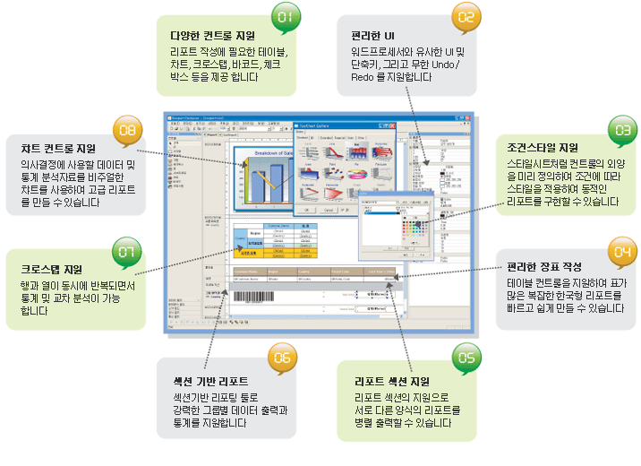
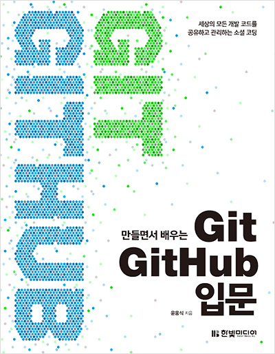
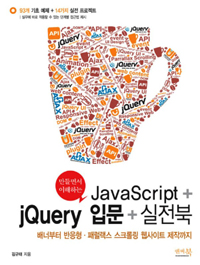

# 오픈소스 프로그래밍(Open Source Programming)

## 1. 강사 소개
 * 이름 : 유병창
 * 소속 : 클립소프트(http://wwww.clipsoft.co.kr) 연구소
 * 개발 경력 :
   * ActiveX 컴포넌트 <퀵 그리드 >개발
   * 리포팅 솔루션 <렉스퍼트> 개발
     * 렉스퍼트 1.0
     * 렉스퍼트 2.0
     * 렉스퍼트 2.5
     * 렉스퍼트 3.0
     * 

 * 자격증 : 없음
 * 개발 분야 : 윈도우 데스크탑 애플리케이션
 * 즐겨 사용하는 언어 : C++, JavaScript
 * 이메일 : ryubc.inhatc@gmail.com
 * 핸드폰 : 010-9605-6696(전화보다는 문자를 부탁드립니다.)
 * SNS : 없음

## 2. 강의 개요
 * 분산형 버전 관리 호스팅 시스템, GitHub(http://www.github.com) 와 Git의 구체적인 사용방법을 학습하여 자신의 프로그램 소스코드 및 문서등 버전관리하는 법을 습득한다.

## 3. 강의 목표
  * 최근 수많은 개발자가 코드를 개발하고 버전을 관리하기 위해 이용하는 GitHub을 소프트웨어나 협업을 할 때 사용되는 다양한 기능들을 알아보고 실습을 해본다. 즉, GitHub과 Git에 대한 기본적인 사용법과 뿐만 아니라 GitHub의 레파지토리에 있는 수많은 다양한 코드를 검색하여 활용하는 법을 알아본다.

## 4. 강의 계획
 주차 | 날짜 | 강의 내용
 ----|---|---
 1 | 9월 1일 | 오리엔테이션 및 안전교육
 2 | 9월 8일 | Git 소개 및 설치
 3 | 9월 15일 | Git 과 GitHub 기본 개념 및 GitHub 사용 준비
 4 | 9월 22일 | 로컬 저장소를 사용하기 위한 Git 기본
 5 | 9월 29일 | 원격 저장소와 GitHub
 6 | 10월 6일 | **추석 공휴일(12월 22일 보강)**
 7 | 10월 13일 | Android Studio 에서의 Git 사용법
 8 | 10월 20일 | **중간 평가**
 9 | 10월 27일 | Eclipse 에서의 Git 사용법
 10 | 11월 3일 | Github의 Wiki, Pulse, Graphs
 11 | 11월 10일 | 툴바 설명 및 대시보드, 프로필, 리포지토리 설정하기
 12 | 11월 17일 | Issue, Pull Request, Wiki, Graphs, Notification 개념이해 및 실습
 13 | 11월 24일 | Pull Request 하기
 14 | 12월 1일 | GitHub을 사용하는 경우의 개발진행 과정
 15 | 12월 8일 | **기말 평가**
 16 | 12월 22일 | GitHub을 이용한 프로젝트 진행  

 * 강의 내용은 수업 진행에 따라 유동적으로 변경될 수 있음.

## 5. 교재
아래 두 교재를 메인으로 사용할 예정임. 매주 강의 자료를 본 GitHub(https://github.com/ryubcinhatc/opensource-lecture) 에 올리기 때문에 책은 별도로 구매할 필요가 없음. 개인적으로 관심이 있고 좀더 깊이 있게 공부할 학생은 구매해도 상관 없음.

 * 만들면서 배우는 Git + GitHub 입문(http://www.aladin.co.kr/shop/wproduct.aspx?ItemId=64274668)
   * 

  * 만들면서 이해하는 JavaScript + jQuery 입문(http://www.aladin.co.kr/shop/wproduct.aspx?ItemId=39533925)
    * 

> 위 교재는 단지 참고 용일 뿐이지 제일 좋은 책이 아님. 개인 취향에 맞는 좋은 책을 찾아 보길 권함.

## 6. 평가
평가 항목 | 배점
----|---
중간 평가 | 40%
기말 평가 | 40%
기타 | 10%
출석 평가 | 10%
 * 학내 교칙에 의해 4회 이상 결석시 무조건 F 학점.
 * 1회 결석 시 -3점 부여.
 * 과제는 평가 항목에서 '기타'에 포함됨.
 * 교재 구매가 필수가 아니기 때문에 중간/기말 평가는 강의 자료 안에서만 출제함.
 * 모두가 잘해서 모두가 A+를 받을 수 있으면 좋겠지만 현실은  안타깝게도 불가능함.

## 7. 설문
  - [x] HTML
  - [x] DOM
  - [x] CSS
  - [ ] C
  - [ ] C++
  - [ ] Java
  - [ ] Python
  - [x] JavaScript
  - [x] JSON
  - [ ] XML
  - [x] AJAX
  - [x] jQuery
  - [ ] NodeJS
  - [ ] Oracle
  - [ ] MySQL  
  - [ ] MongoDB
  - [ ] Design Pattern
  - [ ] Refactoring
  - [x] Git
  - [x] GitHub
  - [ ] TensorFlow

## 8. 희망 사항
 * 개발할 때 GitHub을 활용해 버전 관리를 했으면.
 * JavaScript와 jQuery에 익숙해졌으면.
