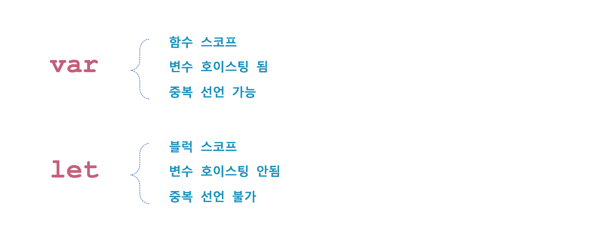
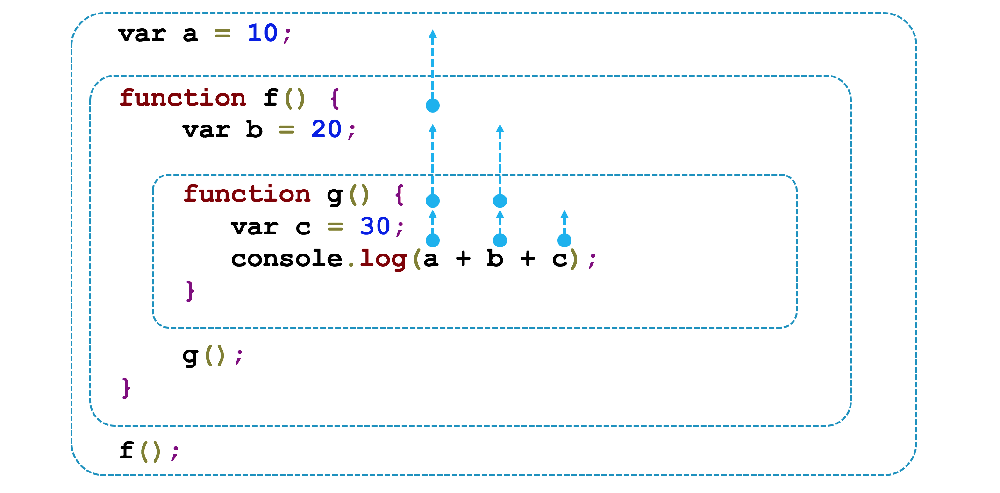

## 스코프

프로그래밍 언어에서 스코프는 [유효 범위](#) 라고도 한다. 여기서 유효 범위란 변수 참조가 가능한 범위를 말한다. 이러한 스코프에는 아래와 같이 크게 두 가지 종류가 있다.

 * 글로벌 스코프(Global scope, 전역 스코프)
 * 로컬 스코프(Local scope, 지역 스코프)

### 1. 블럭스코프
ES6 에서는 변수 선언 키워드로 var 이외에 let, const 라는 키워드가 새롭게 추가됐다. 새롭게 추가된 키워드로 변수 선언을 하면 해당 변수는 블럭 스코프를 갖게 된다.



[javascript](#)
```html
<!DOCTYPE html>
<html>
<head>
    <script type="text/javascript">
        if (true) {
            var language = "javascript";
        }
        console.log(language); // javascript
    </script>
</head>
<body>
</body>
</html>
```

[javascript](#)
```html
<!DOCTYPE html>
<html>
<head>
    <script type="text/javascript">
        if (true) {
            let language = "javascript";
        }
        console.log(language); // Uncaught ReferenceError: language is not defined
    </script>
</head>
<body>
</body>
</html>
```


### 2. 렉시컬 스코프(Lexical scope)
 [javascript](#)
 ```javascript
 <!DOCTYPE html>
 <html>
 <head>
     <script type="text/javascript">
         var language = "javascript";
         function A() {
             var language = "C++";
             B();
         }
         function B() {
             console.log(language);
         }
         A(); // javascript
         B(); // javascript
     </script>
 </head>
 <body>
 </body>
 </html>
 ```

소스코드에 작성된 문맥에 의해 스코프가 결정되는 것을 [렉시컬 스코프(Lexical scope)](#)라고 하며, 런타임에 결정되는 스코프를 [다이나믹 스코프(Dynamic scope)](#)라고 한다. 자바스크립를 비롯한 대부분의 프로그래밍 언어가 렉시컬 스코프를 따르고 있다.


### 3. 스코프 체인(Scope chain)
자바스크립트에서 변수을 참조할 때 현재 스코프에서 선언한 변수만 참조하지 않는다. 현재 스코프의 상위 스코프에 선언한 변수도 참조 할 수 있다. 이런식으로 올라가다 보면 결국 최상위 스코프인 전역 스코프까지 올라간다. 변수를 찾기 위해 꼬리에 꼬리를 물고 전역 스코프까지 올라가는 모습이 마치 체인과 비슷하여 스코프 체인이라고 부른다.




## 일급 객체(First Class Object)

### 일급 객체 함수(First-class function)
  - 변수나 배열의 요소, 객체의 프로퍼티 등에 할당 가능
  - 함수의 인자로 전달 가능
  - 함수의 리턴 값으로 리턴 가능
  - 동적으로 프로퍼티를 생성 및 할당 가능

[javascript](#)
```html
<!DOCTYPE html>
<html>
<head>
    <script type="text/javascript">
		var add = function (a, b) {
		  var c = a + b;
		  return c;
		}

		console.log(add(1, 2)); // 3
    </script>
</head>
<body>
</body>
</html>
```

[javascript](#)
```html
<!DOCTYPE html>
<html>
<head>
    <script type="text/javascript">
    function calculator(func, a, b) {
      if (typeof (func) === 'function') {
        return func(a, b);
      }
      return 0;
    }    
		console.log(calculator(function (a, b) { return a + b }, 10, 10)); // 20
    console.log(calculator(function (a, b) { return a - b }, 10, 10)); // 0
    console.log(calculator(function (a, b) { return a * b }, 10, 10)); // 100
    console.log(calculator(function (a, b) { return a / b }, 10, 10)); // 1
    </script>
</head>
<body>
</body>
</html>
```

[javascript](#)
```html
<!DOCTYPE html>
<html>
<head>
    <script type="text/javascript">
		function calculator(type) {
		    if (type == "+")
		        return function(a, b) { return a + b;};
		    else if (type == "-")
		        return function(a, b) { return a - b;};
		    else if (type == "*")
		        return function(a, b) { return a * b;};
		    else if (type == "/")
		        return function(a, b) { return a / b;};
		}
		var add = calculator("+");
		var sub = calculator("-");
		var mul = calculator("*");
		var div = calculator("/");

		console.log(add(10, 10)); // 20
		console.log(sub(10, 10)); // 0
		console.log(mul(10, 10)); // 100
		console.log(div(10, 10)); // 1

		console.log(calculator("+")(10, 10)); // 20
		console.log(calculator("-")(10, 10)); // 0
		console.log(calculator("*")(10, 10)); // 100
		console.log(calculator("/")(10, 10));// 1
    </script>
</head>
<body>
</body>
</html>
```

[javascript](#)
```javascript
<!DOCTYPE html>
<html>
<head>
    <script type="text/javascript">
		function add (a, b) {
		    return a + b;
		}

		add.description = "this is a add() function."
		add.double = function(a) { return a * 2; };

		console.log(add(10, 10)); // 20
		console.log(add.description); // this is a add() function.
    </script>
</head>
<body>
</body>
</html>
```

### 고차 함수
자바스크립트에서 고차 함수란 다른 함수를 인자로 받거나 함수를 리턴하는 함수를 말한다. 인자로 넘기는 함수를 콜백(Callback) 함수로 부르기도 한다. 특히, 자바스크립트에서 이벤트 처리를 위해 함수를 인자로 받는 형태가 매우 많다. 이러한 고차 함수를 잘 사용하면 중복된 코드를 줄일 수도 있다.

[javascript](#)
```html
<!DOCTYPE html>
<html>
<head>
    <script type="text/javascript">
        var sum = 0;
        [1, 2, 3, 4].forEach(function(i) {
          sum += i;
        });
        console.log(sum);
    </script>
</head>
<body>
</body>
</html>
```
