## Git

### 1. Fork

다른 사람의 원격 저장소를 내 계정으로 복사하는 방법으로 포크(Fork)란 것이 있다.만약, 포크를 하지 않으면 내 것이 아닌 저장소, 즉 쓰기 권한이 없는 원격 저장소를 사용하는 것으로 자유롭게 파일을 생성하거나 수정하여 원격 저장소에 반영하는 것이 불가능하다. 따라서 다른 사람의 계정에서 내 계정으로 원격 저장소를 복사해 사용하는 데 그것을 Github 에서 포크라고 부른다고 생각하면 편한다. 일단 포크한 프로젝트는 내 마음대로 수정할 수 있다.

[jQuery(https://github.com/jquery/jquery)](https://github.com/jquery/jquery)
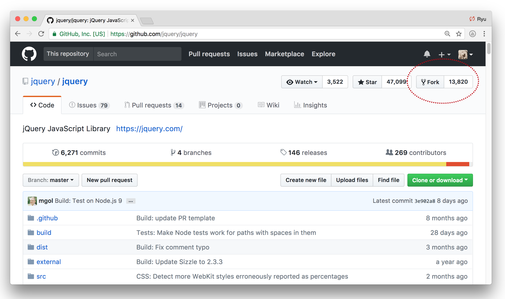

### 2. Pull-Request
원본 프로젝트에 수정한 내역을 가져(pull)가라고 요청(request)하는 것을 [Pull Request](#) 라고 한다. 원본 프로젝트 관리자는 우리가 보낸 Pull Request 확인해 보고 충돌 등의 문제가 없으면 원본 프로젝트에 병합할 수 도 있고 때에 따라서는 거절할 수 도 있다.

[jQuery(https://github.com/jquery/jquery)](https://github.com/jquery/jquery)
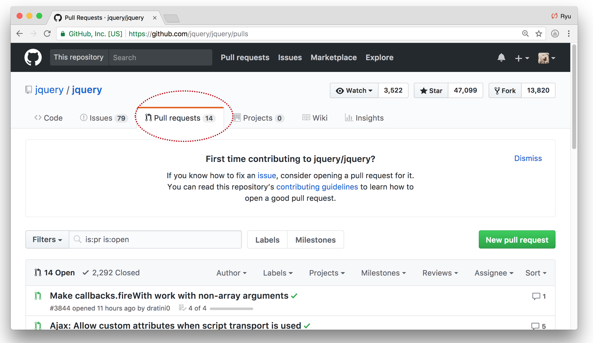

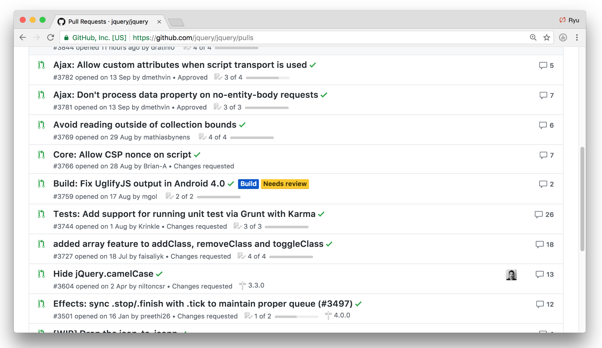

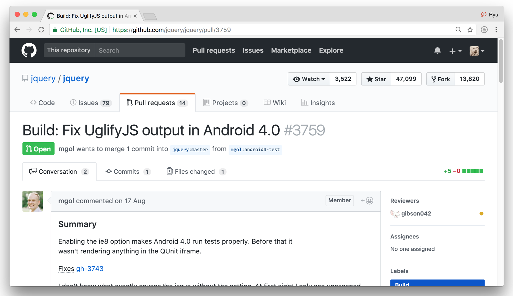


### 3. 정리
  


## Git 정보 변경
```bash
$ git config --global user.name "ryubcinhatc"
$ git config --global user.email "ryubc.inhatc@gmail.com"
```

```bash
$ git config --list
```

## 실습 순서
번호 | 실습 내용
--- | ---
1 | [원격 저장소 포크](#)
2 | [원격 저장소 클론](#)
3 | [프로그램 수정](#)
4 | [커밋](#)
5 | [푸쉬](#)
6 | [원격 저장소에 Pull Request](#)
7 | [코드 검토](#)
8 | [병합](#)


### 1. 원격 저장소 포크
[Step 1.](#)
 -  https://github.com 사이트에 자신 계정으로 로그인 한다.

[Step 2.](#)  
 - https://github.com/ryubcinhatc/fork 사이트로 이동해서 포크 버튼을 클릭한다.

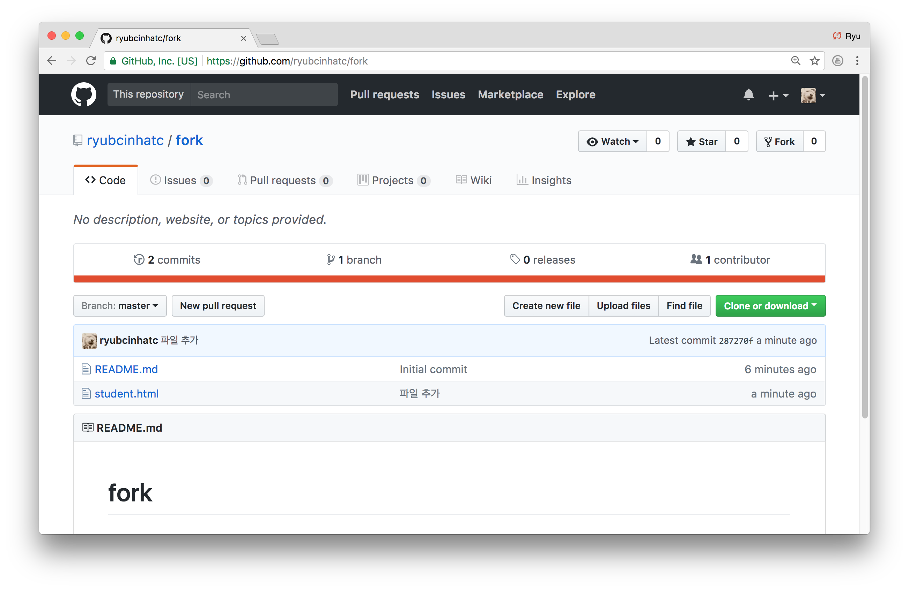

[Step 3.](#)  
 - 자신 github 계정에 fork 란 이름의 프로젝트가 생성됐는지 확인한다.

### 2. 원격 저장소 클론
[Step 1.](#)
 - C:/git-workspace/학번/ 폴더를 만든다.
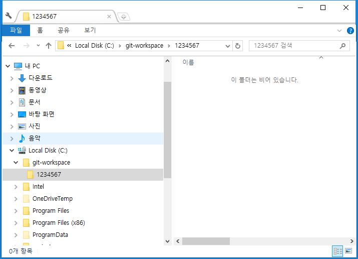

[Step 2.](#)
 - Git bash Shell 창을 띄운 뒤 git clone 명령으로 원격 저장소를 복제한다.

```bash
$ git clone https://github.com/<id>/fork
```

### 3. 프로그램 수정
- student.html 파일에서 자신의 학번으로 된 함수 getXXXXXXXXX()을 찾는다.
- 각 함수는 크기가 3인 배열을 리턴한다. 첫번째 원소는 학번, 두번째 원소는 이름, 세번째 원소는 희망 점수(1~100)이다.

```html
<!DOCTYPE html>
<html>
<head>
    <script type="text/javascript">
        var students = [];
        students.push(function get000000000() {
            return ["000000000", "유병창", "50"];
        });
        students.push(function get201144045() {
            return ["", "", ""];
        });
        students.push(function get201344003() {
            return ["", "", ""];
        });
        students.push(function get201344006() {
            return ["", "", ""];
        });
        students.push(function get201344025() {
            return ["", "", ""];
        });
        students.push(function get201344026() {
            return ["", "", ""];
        });
        students.push(function get201444001() {
            return ["", "", ""];
        });
        students.push(function get201444002() {
            return ["", "", ""];
        });
        students.push(function get201444004() {
            return ["", "", ""];
        });
        students.push(function get201444007() {
            return ["", "", ""];
        });
        students.push(function get201444008() {
            return ["", "", ""];
        });
        students.push(function get201444010() {
            return ["", "", ""];
        });
        students.push(function get201444011() {
            return ["", "", ""];
        });
        students.push(function get201444013() {
            return ["", "", ""];
        });
        students.push(function get201444014() {
            return ["", "", ""];
        });
        students.push(function get201444015() {
            return ["", "", ""];
        });
        students.push(function get201444019() {
            return ["", "", ""];
        });
        students.push(function get201444022() {
            return ["", "", ""];
        });
        students.push(function get201444025() {
            return ["", "", ""];
        });
        students.push(function get201444035() {
            return ["", "", ""];
        });
        students.push(function get201544015() {
            return ["", "", ""];
        });
        students.push(function get201544019() {
            return ["", "", ""];
        });
        students.push(function get201544023() {
            return ["", "", ""];
        });
        students.push(function get201544036() {
            return ["", "", ""];
        });
        students.push(function get201644005() {
            return ["", "", ""];
        });
        students.push(function get201644009() {
            return ["", "", ""];
        });
        students.push(function get201644011() {
            return ["", "", ""];
        });
        students.push(function get201644017() {
            return ["", "", ""];
        });
        students.push(function get201644025() {
            return ["", "", ""];
        });
        students.push(function get201644027() {
            return ["", "", ""];
        });
        students.push(function get201644028() {
            return ["", "", ""];
        });
        students.push(function get201644029() {
            return ["", "", ""];
        });
        students.push(function get201244007() {
            return ["", "", ""];
        });
        students.push(function get201344100() {
            return ["", "", ""];
        });
        students.push(function get201544038() {
            return ["", "", ""];
        });
        students.push(function get201344015() {
            return ["", "", ""];
        });
        students.push(function get201344041() {
            return ["", "", ""];
        });
        students.push(function get201344049() {
            return ["", "", ""];
        });
        students.push(function get201344053() {
            return ["", "", ""];
        });
        students.push(function get201344059() {
            return ["", "", ""];
        });
        students.push(function get201344066() {
            return ["", "", ""];
        });
        students.push(function get201344067() {
            return ["", "", ""];
        });
        students.push(function get201344068() {
            return ["", "", ""];
        });
        students.push(function get201344103() {
            return ["", "", ""];
        });
        students.push(function get201444024() {
            return ["", "", ""];
        });
        students.push(function get201444042() {
            return ["", "", ""];
        });
        students.push(function get201444045() {
            return ["", "", ""];
        });
        students.push(function get201444050() {
            return ["", "", ""];
        });
        students.push(function get201444068() {
            return ["", "", ""];
        });
        students.push(function get201444070() {
            return ["", "", ""];
        });
        students.push(function get201444089() {
            return ["", "", ""];
        });
        students.push(function get201544060() {
            return ["", "", ""];
        });
        students.push(function get201644010() {
            return ["", "", ""];
        });
        students.push(function get201644016() {
            return ["", "", ""];
        });
        students.push(function get201644019() {
            return ["", "", ""];
        });
        students.push(function get201644044() {
            return ["", "", ""];
        });
        students.push(function get201644045() {
            return ["", "", ""];
        });
        students.push(function get201644054() {
            return ["", "", ""];
        });
        students.push(function get201644057() {
            return ["", "", ""];
        });
        students.push(function get201644061() {
            return ["", "", ""];
        });
        students.push(function get201644063() {
            return ["", "", ""];
        });
        students.push(function get201644066() {
            return ["", "", ""];
        });
        students.push(function get201644068() {
            return ["", "", ""];
        });
        students.push(function get201644071() {
            return ["", "", ""];
        });
        students.push(function get201644101() {
            return ["", "", ""];
        });
        students.push(function get201144021() {
            return ["", "", ""];
        });
        students.push(function get201344076() {
            return ["", "", ""];
        });
        students.push(function get201344078() {
            return ["", "", ""];
        });
        students.push(function get201344083() {
            return ["", "", ""];
        });
        students.push(function get201344091() {
            return ["", "", ""];
        });
        students.push(function get201444081() {
            return ["", "", ""];
        });
        students.push(function get201444082() {
            return ["", "", ""];
        });
        students.push(function get201444084() {
            return ["", "", ""];
        });
        students.push(function get201444100() {
            return ["", "", ""];
        });
        students.push(function get201544082() {
            return ["", "", ""];
        });
        students.push(function get201644074() {
            return ["", "", ""];
        });
        students.push(function get201644077() {
            return ["", "", ""];
        });
        students.push(function get201644078() {
            return ["", "", ""];
        });
        students.push(function get201644085() {
            return ["", "", ""];
        });
        students.push(function get201644088() {
            return ["", "", ""];
        });
        students.push(function get201644094() {
            return ["", "", ""];
        });
        students.push(function get201644096() {
            return ["", "", ""];
        });
        students.push(function get201344029() {
            return ["", "", ""];
        });
        students.push(function get201544030() {
            return ["", "", ""];
        });

        students.forEach(function(student_function) {
            var record = student_function();
            console.log(`학번 : ${record[0]}, 이름 : ${record[1]}, 점수 : ${record[2]}`);

        });
    </script>
</head>
<body>
</body>
</html>
```


### 4. 커밋
```bash
$ git add .
$ git commit -m "함수 수정 완료"
```

### 5. 푸쉬
```bash
$ git push origin master
```

### 6. 원격 저장소에 Pull Request
[Step 1.](#)
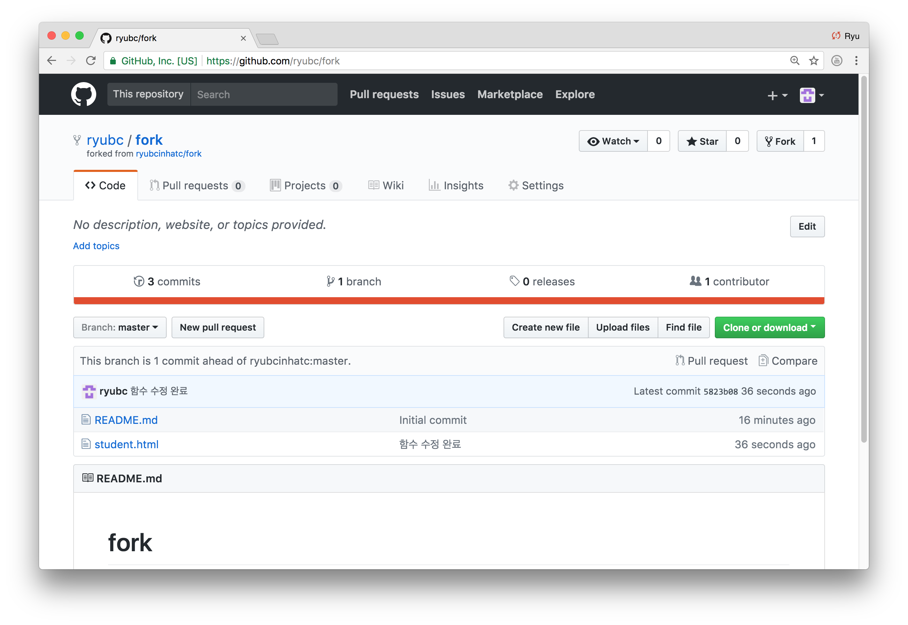

[Step 2.](#)
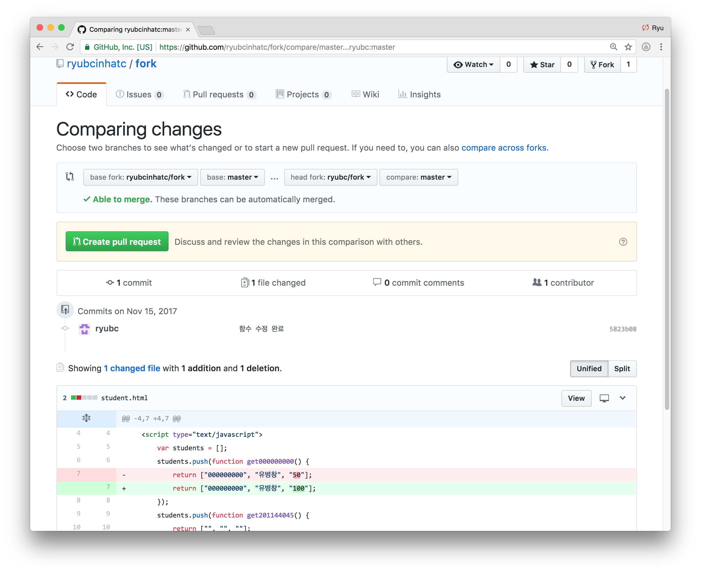

[Step 3.](#)
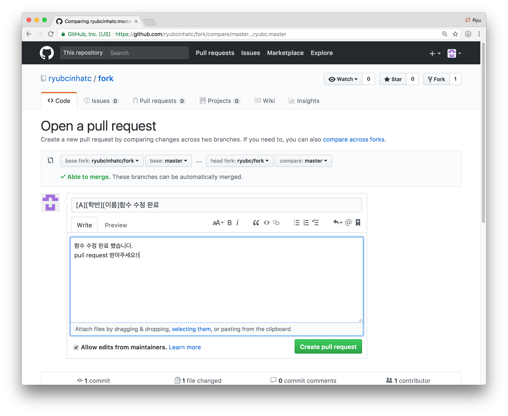

[Step 4.](#)
 -  제목은 '[반][학번][이름]*****' 형식으로 해주세요.
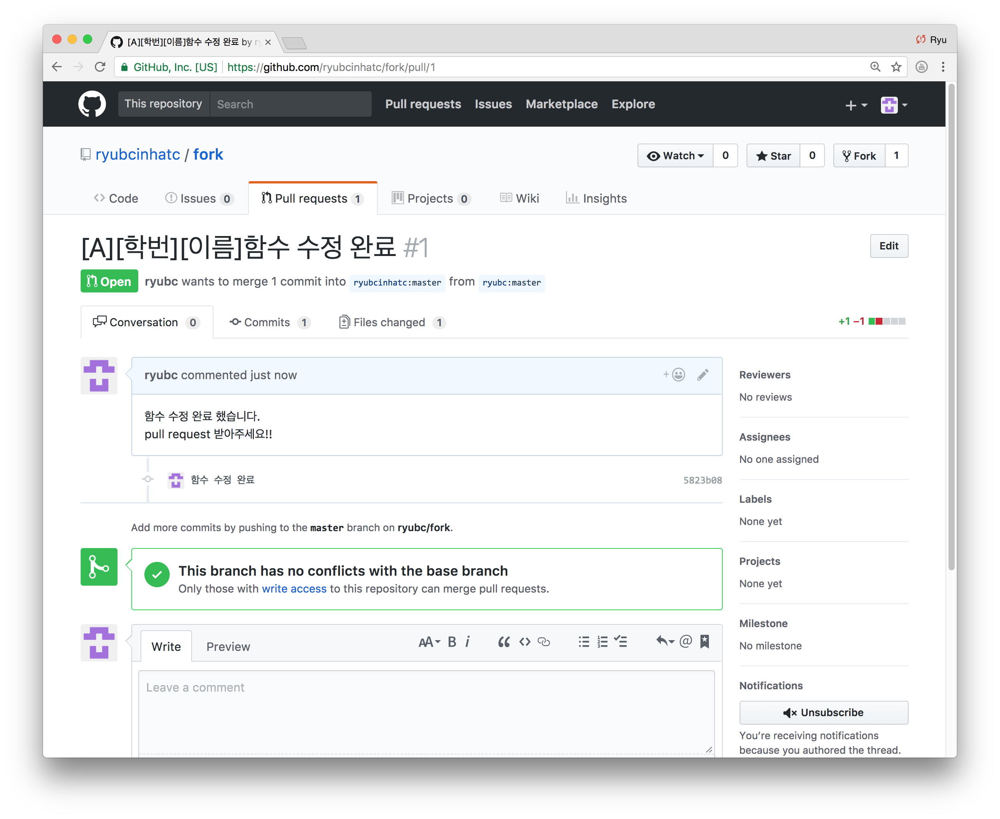

[Step 5.](#)
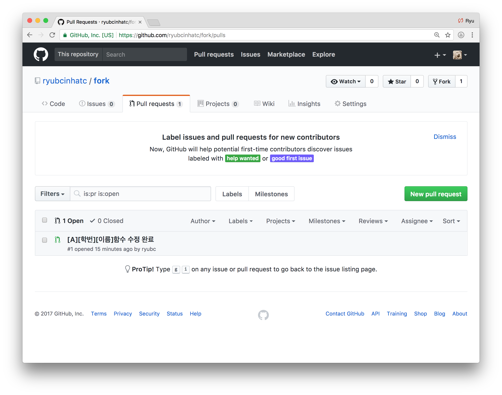

### 7. 코드 검토

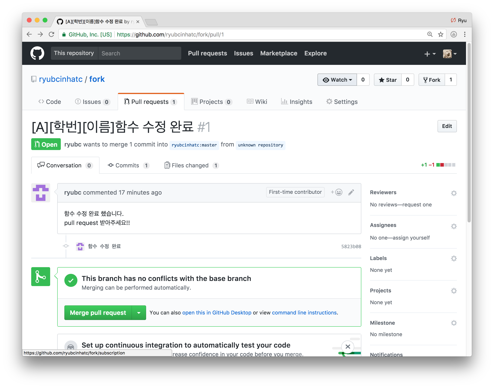

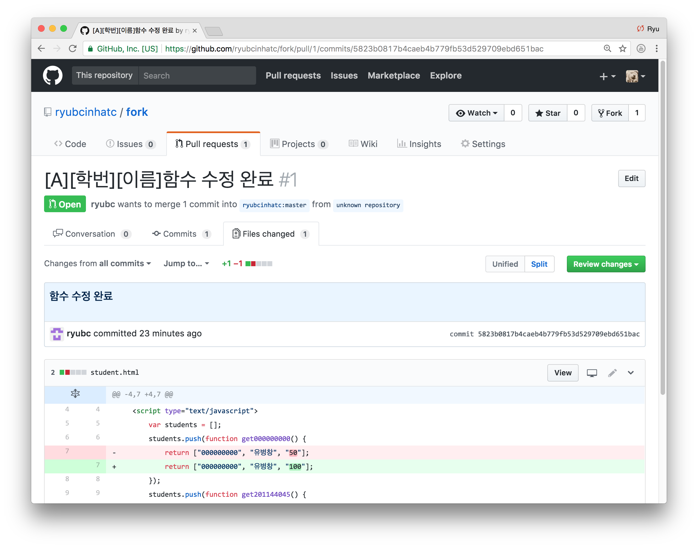

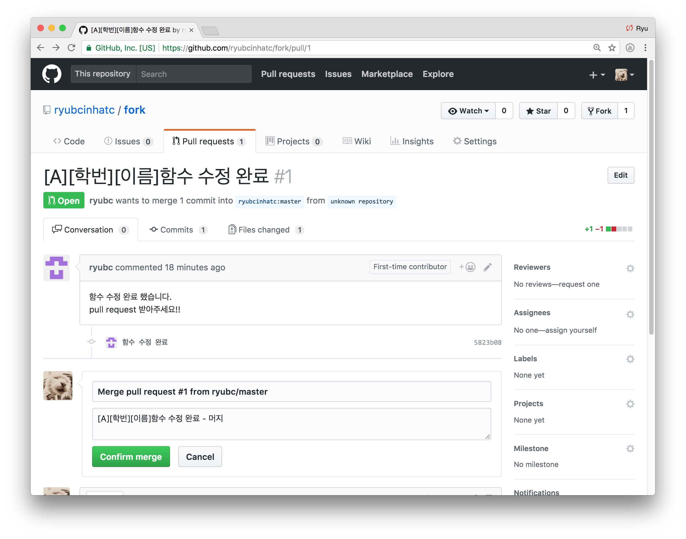

### 8. 병합

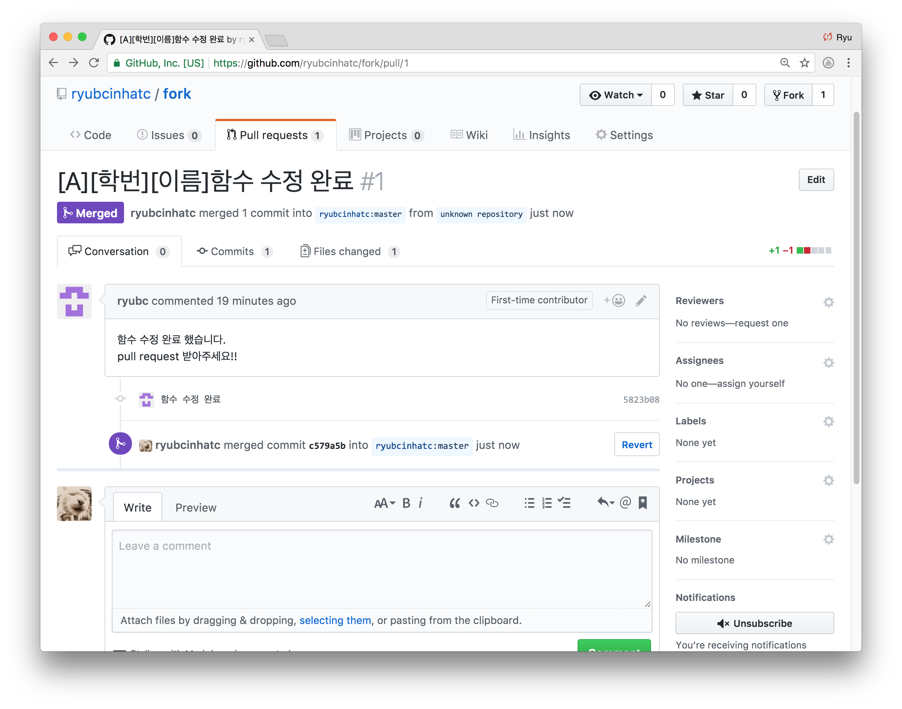

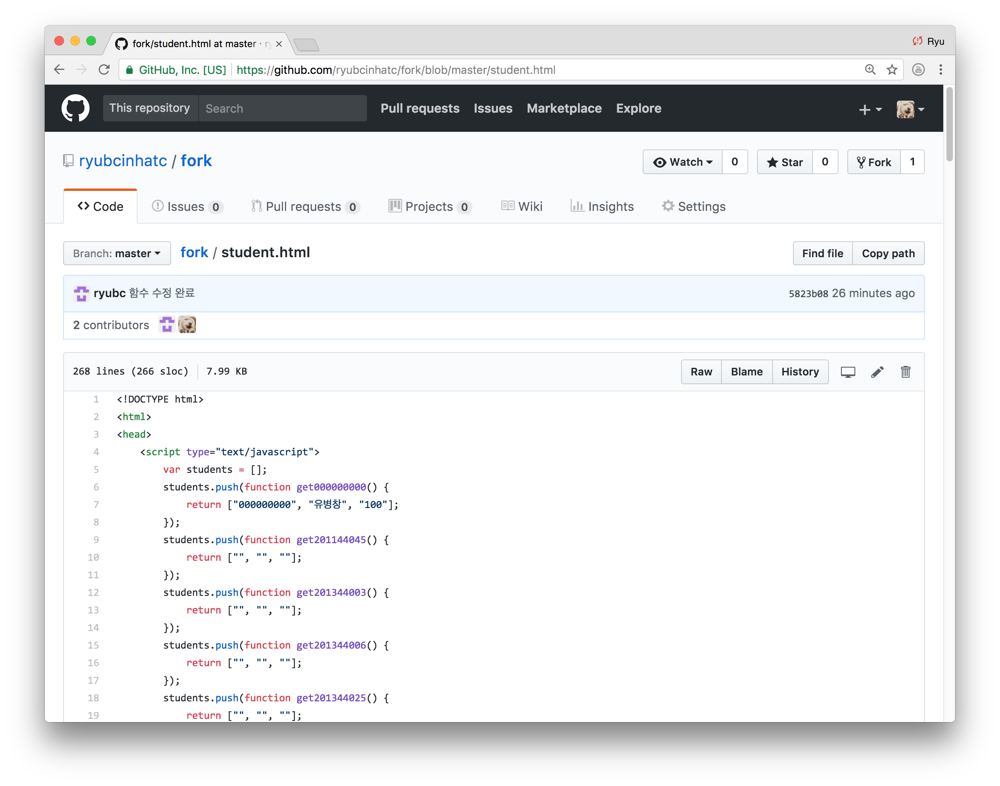

## 마무리

원본 프로젝트의 업데이트된 내역을 내 로컬 저장소에 반영할려면 어떻게 해야할까?

```bash
$ git remote add upstream https://github.com/ryubcinhatc/fork
$ git remote -v
$ git fetch upstream
$ git merge upstream/master
$ git push origin master
```

  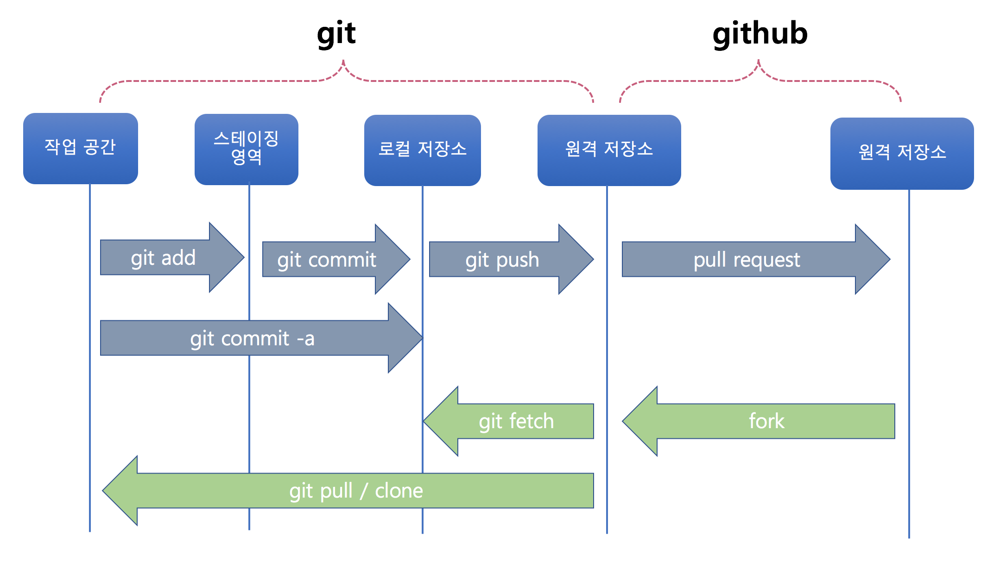
