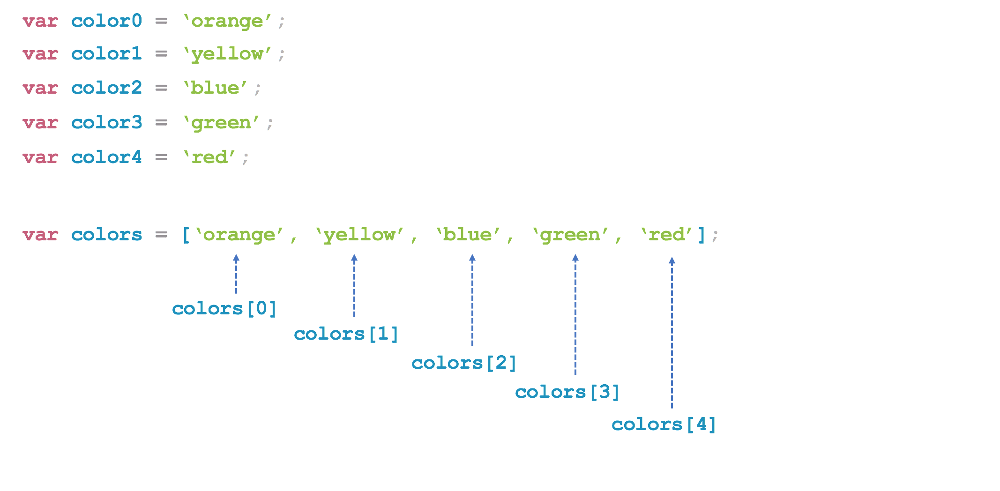
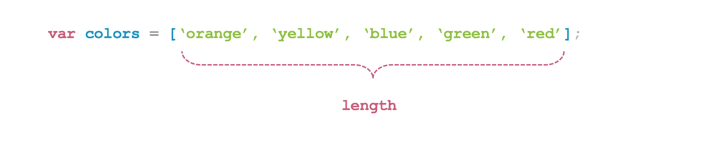
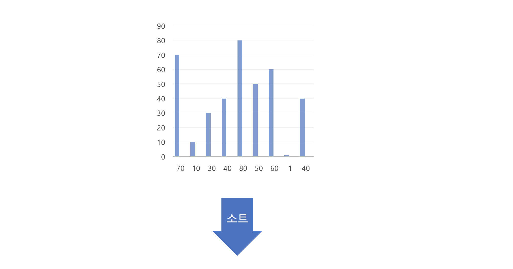
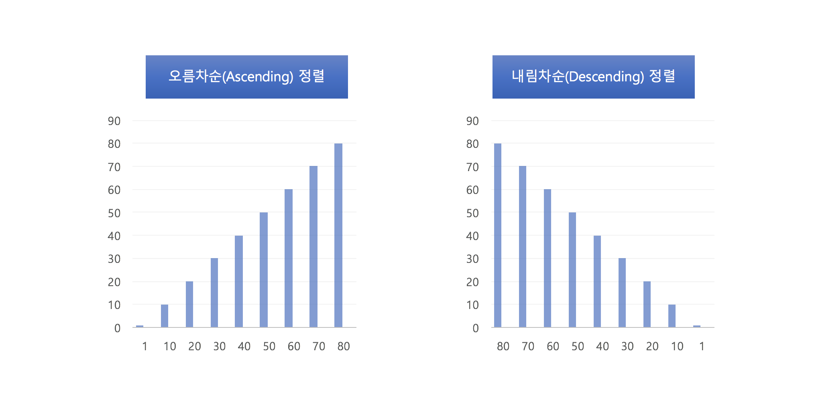
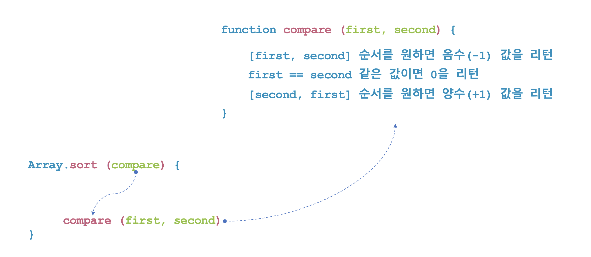
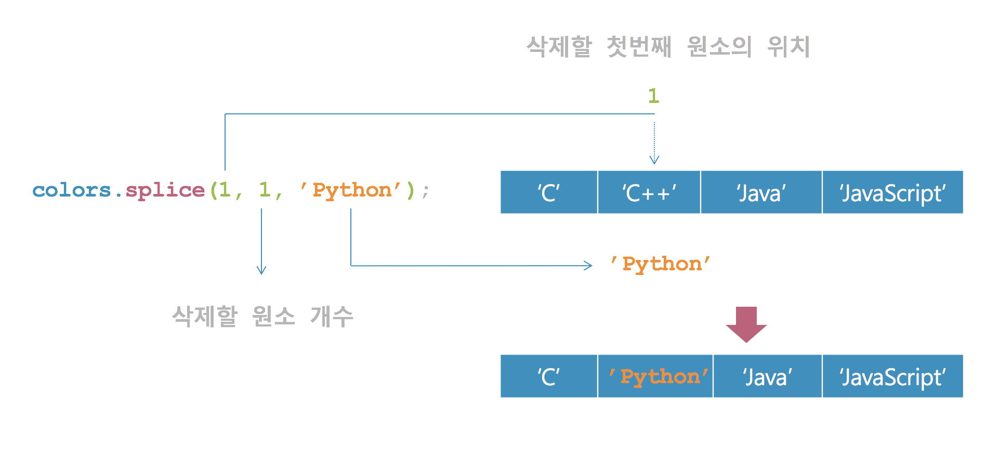

# 자바스크립트(JavaScript)
## 배열
배열은 자바스크립트 객체의 한 형태이다. 배열은 관련있는 데이터를 모아서 하나로 관리하기 위해 사용하는 데이터 타입이다. 변수가 하나의 데이터를 저장하기 위한 것이라면 배열은 여러 개의 데이터를 하나의 변수에 저장하기 위한 것이다.




* [배열을 모르는 자](#)
```javascript
function max(a,b,c,d,e){
    var max =0;
    max = (max>a) ? max :a;
    max = (max>b) ? max :b;
    max = (max>c) ? max :c;
    max = (max>d) ? max :d;
    max = (max>e) ? max :e;
    return max;
}

function min(a,b,c,d,e){
    var min =100;
    min = (min<a) ? min :a;
    min = (min<b) ? min :b;
    min = (min<c) ? min :c;
    min = (min<d) ? min :d;
    min = (min<e) ? min :e;
    return min;
}
```

* [배열을 아는 자](#)
```javascript
function max(val) {
    var max = 0;
    for(var i=0; i<val.length; i++)
        max = (max >= val[i]) ? max : val[i];
    return max;
}
function min(val) {
    var min = 100;
    for(var i=0; i<val.length; i++)
        min = (min >= val[i]) ? val[i] : min;
    return min;
}
```


## 배열 생성
자바스크립트에서 배열은 두 가지 방법이 있다. 첫번째로 배열 리터럴인 대괄호([])을 사용하는 것이고, 두번째로 Array 객체를 생성하는 방법이다.

* [javascript](#)
```html
<!DOCTYPE html>
<html>
<head>
    <script type="text/javascript">
       var colors = ['orange', 'yellow', 'blue', 'green', 'red'];
       console.log(colors[0]); // orange
       console.log(colors[1]); // yellow
       console.log(colors[2]); // blue
       console.log(colors[3]); // green
       console.log(colors[4]); // red
    </script>
</head>
<body>
</body>
</html>
```

* [javascript](#)
```html
<!DOCTYPE html>
<html>
<head>
    <script type="text/javascript">
       var colors = new Array('orange', 'yellow', 'blue', 'green', 'red');
       console.log(colors[0]); // orange
       console.log(colors[1]); // yellow
       console.log(colors[2]); // blue
       console.log(colors[3]); // green
       console.log(colors[4]); // red
    </script>
</head>
<body>
</body>
</html>
```
## 배열 요소 생성
배열은 동적으로 원소를 추가할 수 있다. 자바스크립트 배열은 값을 순차적으로 넣을 필요가 없다. 임의 위치에 값을 동적으로 추가할 수 있다.

* [javascript](#)
```html
<!DOCTYPE html>
<html>
<head>
    <script type="text/javascript">
       var a = [];
       console.log(a[0]); // undefined

       a[0] = 100;
       a[2] = 'blue';
       a[4] = false;

       console.log(a[0]); // 100
       console.log(a[1]); // undefined
       console.log(a[2]); // blue
       console.log(a[3]); // undefined
       console.log(a[4]); // false
    </script>
</head>
<body>
</body>
</html>
```

## 배열의 length 속성
자바스크립트 배열의 크기는 length 속성으로 알 수 있다.



배열의 length 속성은 배열에 실제 존재하는 원소 개수와 일치하지 않을 수 있다. 아래 예제에서 살펴보면 알 수 있듯이 length 속성은 배열 내에 가장 큰 인덱스에 1을 더한 값이다. 때문에 배열의 가장 큰 인덱스가 변하면 length 속성의 값 또한 자동으로 바뀐다.


* [javascript](#)
```html
<!DOCTYPE html>
<html>
<head>
    <script type="text/javascript">
      var colors = ['orange', 'yellow', 'blue', 'green', 'red'];
      console.log(colors.length); // 5
      console.log(['black', 'white'].length); // 2
    </script>
</head>
<body>
</body>
</html>
```


* [javascript](#)
```html
<!DOCTYPE html>
<html>
<head>
    <script type="text/javascript">
       var a = [];
       console.log(a.length); // 0

       a[0] = 0;
       a[1] = 1;
       a[2] = 2;

       console.log(a.length); // 3

       a[100] = 100;

       console.log(a.length); // 101
    </script>
</head>
<body>
</body>
</html>
```

배열의 length 속성은 코드를 통해 명시적으로 값을 변경할 수 있다.

* [javascript](#)
```html
<!DOCTYPE html>
<html>
<head>
    <script type="text/javascript">
       var a = [0, 1, 2];
       console.log(a.length); // 3

       a.length = 5;
       console.log(a.length); // 5

       a.length = 2;
       console.log(a[0]); // 0
       console.log(a[1]); // 1
       console.log(a[2]); // undefined
    </script>
</head>
<body>
</body>
</html>
```

## 배열의 순회
배열에 원소를 추가하고 나면 가장 많이 하는 작업이 배열의 원소를 하나씩 탐색하는 작업일 것이다. 배열의 length 속성으로 배열의 크기를 알 수 있기 때문에 for 구문 / for in 구문으로 배열의 원소를 차례대로 접근할 수 있다.
* [javascript](#)
```html
<!DOCTYPE html>
<html>
<head>
    <script type="text/javascript">
       var colors = ['orange', 'yellow', 'blue', 'green', 'red'];
       for (var i = 0; i < colors.length; ++i) {
         console.log(colors[i]);
       }
    </script>
</head>
<body>
</body>
</html>
```

* [javascript](#)
```html
<!DOCTYPE html>
<html>
<head>
    <script type="text/javascript">
    var colors = ['orange', 'yellow', 'blue', 'green', 'red'];
    for (var i in colors) {
      console.log(colors[i]);
    }
    </script>
</head>
<body>
</body>
</html>
```

* [javascript](#)
```html
<!DOCTYPE html>
<html>
<head>
    <script type="text/javascript">
    var colors = ['orange', 'yellow', 'blue', 'green', 'red'];
    colors[10] = 'black';
    colors[20] = 'white';

    // orange
    // yellow
    // blue
    // green
    // red
    // undefined
    // undefined
    // undefined
    // undefined
    // undefined
    // black
    // undefined
    // undefined
    // undefined
    // undefined
    // undefined
    // undefined
    // undefined
    // undefined
    // undefined
    // white
    for (var i = 0; i < colors.length; ++i) {
      console.log(colors[i]);
    }


    // orange
    // yellow
    // blue
    // green
    // red
    // black
    // white
    for (var i in colors) {
      console.log(colors[i]);
    }
    </script>
</head>
<body>
</body>
</html>
```


* [javascript](#)
```html
<!DOCTYPE html>
<html>
<head>
    <script type="text/javascript">
       function sum(a) {
         var result = 0;
         // TODO : 여기에 여러분이 직접 코딩을 해주세요.
         return result;
       }

       exepect(sum([1, 2, 3, 4, 5, 6, 7, 8, 9, 10]), 55);
       exepect(sum([10, 10, 10, 10, 10]), 50);
       exepect(sum([0, 0, 0, 0, 100]), 100);
       exepect(sum(['A', 'B', 'C', 200, 300]), 500);

       function exepect(l, r) {
         if (l === r)
          console.log('pass');
         else
          console.log('fail');
       }
    </script>
</head>
<body>
</body>
</html>
```


## 배열의 변경 메서드
자바스크립트는 배열에서 사용 가능한 다양한 표준 메서드를 제공한다. 배열 메서드는 length 속성을 기반으로 작동한다.

메서드 | 설명
---|---
pop() | 배열에서 마지막 요소를 뽑아내고, 그 요소를 반환한다.
push() | 배열의 끝에 하나 이상의 요소를 추가하고, 변경된 배열의 길이를 반환한다.
reverse() | 배열의 요소 순서를 뒤바꾼다. 첫 번째 요소가 마지막이 되고, 마지막 요소가 첫번째가 된다.
shift() | 배열에서 첫 번째 요소를 삭제하고, 그 요소를 반환한다.
sort() | 배열의 요소를 정렬한다. 정렬된 배열을 반환한다.
splice() | 배열에 요소를 추가/삭제 한다.
unshift() | 배열의 앞에 하나 이상의 요소를 추가하고, 새로운 길이를 반환한다.


### 1. pop()/push()/unshift()/shift() 메서드

* [javascript](#)
```html
<!DOCTYPE html>
<html>
<head>
    <script type="text/javascript">
      var a = [1, 2, 3];
      var b = a.unshift(0);
      console.log(a); //[0, 1, 2, 3]
      console.log(b); // 4

      var a = [1, 2, 3];
      var b = a.shift();
      console.log(a); // [2, 3]
      console.log(b); // 1

      var a = [1, 2, 3];
      var b = a.pop();
      console.log(a); // [1, 2]
      console.log(b); // 3

      var a = [1, 2, 3];
      var b = a.push(4);
      console.log(a); // [1, 2, 3, 4]
      console.log(b); // 4
    </script>
</head>
<body>
</body>
</html>
```


* [javascript](#)
```html
<!DOCTYPE html>
<html>
<head>
    <script type="text/javascript">
      // 인자로 받은 배열(a)에서 숫자만 찾아 복제하는 함수.
      function clone_only_number(a) {
        var result = [];
        // TODO : 여기에 여러분이 직접 코딩을 해주세요.
        return result;
      }

      exepect(clone_only_number([1, 2, 3, 4, 5]), [1, 2, 3, 4, 5]);
      exepect(clone_only_number(['1', '2', 3, 4, 5]), [3, 4, 5]);
      exepect(clone_only_number(['one', 'two', 'three']), []);
      exepect(clone_only_number([1, 2, 'javascript', true, 100]), [1, 2, 100]);

      function exepect(l, r) {
        if (l.length !== r.length)
         console.log('fail');
        else {
          for (var i = 0; i < l.length; ++i) {
            if (l[i] !== r[i]) {
                console.log('fail');
                return;
            }
          }
          console.log('pass');
        }
      }
    </script>
</head>
<body>
</body>
</html>
```

### 2. reverse() 메서드

* [javascript](#)
```html
<!DOCTYPE html>
<html>
<head>
    <script type="text/javascript">
      var a = ['one', 'two', 'three'];
      console.log(a); //['one', 'two', 'three']
      a.reverse();
      console.log(a); //['three', 'two', 'one']
    </script>
</head>
<body>
</body>
</html>
```

* [javascript](#)
```html
<!DOCTYPE html>
<html>
<head>
    <script type="text/javascript">
      // 인자로 받은 배열(a)이 회문(palindrom, 팰린드롬)이 되면 true, 아니면 false을 반환.
      function is_palindrom(a) {
        var result = false;
        // TODO : 여기에 여러분이 직접 코딩을 해주세요.
        return result;
      }

      exepect(is_palindrom([1, 2, 3, 4, 5]), false);
      exepect(is_palindrom(['g', 'o', 'o', 'g']), true);
      exepect(is_palindrom(['g', 'o', 'o', 'o', 'g']), true);
      exepect(is_palindrom([1, 2, 3, 3, 2, 1]), true);
      exepect(is_palindrom(['a']), true);
      exepect(is_palindrom(['a', 'a']), true);
      exepect(is_palindrom(['a', 'A', 'a']), true);
      exepect(is_palindrom(['this', 'is', 'this']), true);
      exepect(is_palindrom(['this', 'is', 'that']), false);
      exepect(is_palindrom([]), true);

      function exepect(l, r) {
        return l === r;
      }
    </script>
</head>
<body>
</body>
</html>
```

### 3. sort() 메서드




* [javascript](#)
```html
<!DOCTYPE html>
<html>
<head>
    <script type="text/javascript">
      var array = [9, 2, 5, 6, 4, 3, 7, 10, 1, 8];

      function swap(array, i , j) {
          var temp = array[i];
          array[i] = array[j];
          array[j] = temp;
      }
      // 버블 소트
      function bubbleSort(array) {
          for (var i = 0; i < array.length; i++) {
              for (var j = 1; j < array.length; j++) {
                  // 순서를 바꾸기 위해 원소를 비교 한다.
                  if (array[j - 1] > array[j]) {
                      swap(array, j - 1, j);
                  }
              }
          }
          return array;
      }

      // 삽입 소트
      function insertionSort(array) {
          for (var i = 1; i < array.length; ++i) {
              var temp = array[i];
              // 순서를 바꾸기 위해 원소를 비교 한다.
              for (var j = i - 1; j >= 0 && array[j] > temp; j--) {
                  array[j + 1] = array[j];
              }
              array[j + 1] = temp;
          }
          return array;
      }   

      console.log(bubbleSort(array.slice())); // [ 1, 2, 3, 4, 5, 6, 7, 8, 9, 10]
      console.log(insertionSort(array.slice())); // [ 1, 2, 3, 4, 5, 6, 7, 8, 9, 10]
    </script>
</head>
<body>
</body>
</html>
```


* [javascript](#)
```html
<!DOCTYPE html>
<html>
<head>
    <script type="text/javascript">
      var array = [9, 2, 5, 6, 4, 3, 7, 10, 1, 8];

      function swap(array, i , j) {
          var temp = array[i];
          array[i] = array[j];
          array[j] = temp;
      }


      function bubbleSort(array, compareFunc) {
          for (var i = 0; i < array.length; i++) {
              for (var j = 1; j < array.length; j++) {
                  var compareResult = 0;
                  if (typeof (compareFunc) === 'function')
                      compareResult = compareFunc(array[j - 1], array[j]);
                  else
                      compareResult = array[j - 1] > array[j];

                  if (compareResult > 0) {
                      swap(array, j - 1, j);
                  }
              }
          }
          return array;
      }

      console.log(bubbleSort(array.slice())); // [ 1, 2, 3, 4, 5, 6, 7, 8, 9, 10 ]
      console.log(bubbleSort(array.slice(), function(a, b) { return a - b})); // [ 1, 2, 3, 4, 5, 6, 7, 8, 9, 10 ]
      console.log(bubbleSort(array.slice(), function(a, b) { return b - a})); // [ 10, 9, 8, 7, 6, 5, 4, 3, 2, 1 ]
    </script>
</head>
<body>
</body>
</html>
```


* [javascript](#)



```html
<!DOCTYPE html>
<html>
<head>
    <script type="text/javascript">
      // 기본 소트함수 호출(문자열 오름차순)
      var a = [1, 2, 3, 300, 200, 100];
      console.log(a); //[1, 2, 3, 300, 200, 100]
      a.sort();
      console.log(a); //[1, 100, 2, 200, 3, 300]
    </script>
</head>
<body>
</body>
</html>
```

* [javascript](#)
```html
<!DOCTYPE html>
<html>
<head>
    <script type="text/javascript">
      // 익명의 비교 함수(Compare Function)를 인자로 넘겨 소트 함수 호출(오름차순)
      // 비교 함수는 비교 결과에 따라 음수, 0, 양수를 리턴해야 함.
      var a = [5, 4, 3, 2, 1];
      console.log(a); //[5, 4, 3, 2, 1]
      a.sort(function(a, b) {
        return a - b;
      });
      console.log(a); //[1, 2, 3, 4, 5]

      // 비교 함수(Compare Function)를 인자로 넘겨 소트 함수 호출(오름차순)
      // 비교 함수는 비교 결과에 따라 음수, 0, 양수를 리턴해야 함.
      var a = [5, 4, 3, 2, 1];
      console.log(a); //[5, 4, 3, 2, 1]
      var ascending = function(a, b) {
        if (a > b)
          return 1;
        else if (a < b)
          return -1;
        return 0;
      }
      a.sort(ascending);
      console.log(a); //[1, 2, 3, 4, 5]
    </script>
</head>
<body>
</body>
</html>
```

* [javascript](#)
```html
<!DOCTYPE html>
<html>
<head>
    <script type="text/javascript">
     // 익명의 비교 함수(Compare Function)를 인자로 넘겨 소트 함수 호출(내림차순)
     // 비교 함수는 비교 결과에 따라 음수, 0, 양수를 리턴해야 함.
      var a = [1, 2, 3, 4, 5];
      console.log(a); //[1, 2, 3, 4, 5]
      a.sort(function(a, b) {
        return b - a;
      });
      console.log(a); //[5, 4, 3, 2, 1]

      // 비교 함수(Compare Function)를 인자로 넘겨 소트 함수 호출(내림차순)
      // 비교 함수는 비교 결과에 따라 음수, 0, 양수를 리턴해야 함.
      var a = [1, 2, 3, 4, 5];
      console.log(a); //[1, 2, 3, 4, 5]
      var descending = function(a, b) {
        if (a > b)
          return -1;
        else if (a < b)
          return 1;
        return 0;
      }
      a.sort(descending);
      console.log(a); //[5, 4, 3, 2, 1]
    </script>
</head>
<body>
</body>
</html>
```


* [javascript](#)
```html
<!DOCTYPE html>
<html>
<head>
    <script type="text/javascript">
      // 배열에 숫자와 문자가 썩여 있는 경우 아래와 같은 규칙으로 소트를 한다.
      // 1. 문자가 숫자보다 앞에 나와야 한다.
      // 2. 문자는 오름 차순으로 정렬한다.
      // 3. 숫자는 내림 차순으로 정렬한다.
      var custom_compare = function(a, b) {
        // TODO : 여기에 여러분이 직접 코딩을 해주세요.
      }

      var a = [2, 'C', 1, 'B', 3, 'A'];
      var b = [2, 1, 3, 'A', 'C', 'B'];
      var c = [2, 1, 3, '3', '1', '2'];
      var d = [1, 1, 2, 2, '2', '1', '2', '1'];

      a.sort(custom_compare);
      b.sort(custom_compare);
      c.sort(custom_compare);
      d.sort(custom_compare);
      console.log(a);
      console.log(b);
      console.log(c);
      console.log(d);
      exepect(a, ['A', 'B', 'C', 3, 2, 1]);
      exepect(b, ['A', 'B', 'C', 3, 2, 1]);
      exepect(c, ['1', '2', '3', 3, 2, 1]);
      exepect(d, ['1', '1', '2', '2', 2, 2, 1, 1]);

      function exepect(l, r) {
        if (l.length !== r.length)
         console.log('fail');
        else {
          for (var i = 0; i < l.length; ++i) {
            if (l[i] !== r[i]) {
                console.log('fail');
                return;
            }
          }
          console.log('pass');
        }
      }
    </script>
</head>
<body>
</body>
</html>
```

### 4. splice() 메서드

* [javascript](#)
```html
<!DOCTYPE html>
<html>
<head>
    <script type="text/javascript">
      var numbers = [1, 2, 3, 4, 5];

      console.log(numbers);
      numbers.splice(0, 3);
      console.log(numbers);
    </script>
</head>
<body>
</body>
</html>
```


* [javascript](#)
```html
<!DOCTYPE html>
<html>
<head>
    <script type="text/javascript">
      var colors = ['red','green', 'blue'];
      console.log(colors);
      colors.splice(2, 0, 'yellow');
      console.log(colors);
    </script>
</head>
<body>
</body>
</html>
```


* [javascript](#)
```html
<!DOCTYPE html>
<html>
<head>
    <script type="text/javascript">
      var languages = ['C', 'C++', 'Java', 'JavaScript'];
      console.log(languages); //  ["C", "C++", "Java", "JavaScript"]
      languages.splice(1, 1, 'Python');
      console.log(languages); // ["C", "Python", "Java", "JavaScript"]
      languages.splice(2, 1, 'C#', 'Swift', 'Go');
      console.log(languages); // ["C", "Python", "C#", "Swift", "Go", "JavaScript"]
    </script>
</head>
<body>
</body>
</html>
```




* [javascript](#)
```html
<!DOCTYPE html>
<html>
<head>
    <script type="text/javascript">
    // 인자로 받은 배열(a)의 값을 치환하여 리턴하는 함수.
    // b 배열은 치환 목록으로 아래처럼 구성된다.
    // [매칭문자열1, 치환문자열1, 매칭문자열2, 치환문자열2]
    //
    // 참고로, Array.splice() 함수를 사용하지 않아도 됨.
    function replace_array(a, b) {
      var result = [];
      // TODO : 여기에 여러분이 직접 코딩을 해주세요.
      return result;
    }

    // javascript -> A, python -> B 로 변경됨
    exepect(replace_array(['javascript', 'python'], ['javascript', 'A', 'python', 'B']), ['A', 'B']);

    // lee -> L, kim -> K 로 변경  
    exepect(replace_array(['lee', 'kim', 'lee', 'kim', 'park'], ['lee', 'L', 'kim', 'K']), ['L', 'K', 'L', 'K', 'park']);

    // A -> 1 로 변경  
    exepect(replace_array(['A', 'A', 'A', 'A', 'A'], ['A', '1']), ['1', '1', '1', '1', '1']);

    // C -> 1 로 변경  
    exepect(replace_array(['A', 'B'], ['C', '1']), ['A', 'B']);


    function exepect(l, r) {
      if (l.length !== r.length)
       console.log('fail');
      else {
        for (var i = 0; i < l.length; ++i) {
          if (l[i] !== r[i]) {
              console.log('fail');
              return;
          }
        }
        console.log('pass');
      }
    }
    </script>
</head>
<body>
</body>
</html>
```
