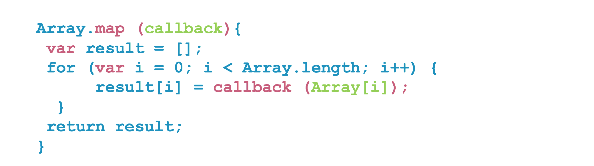
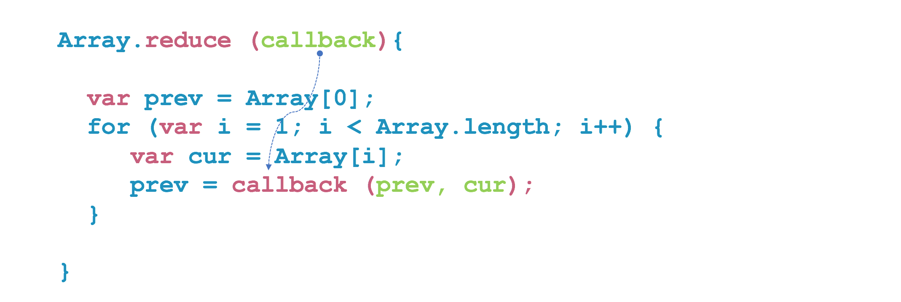
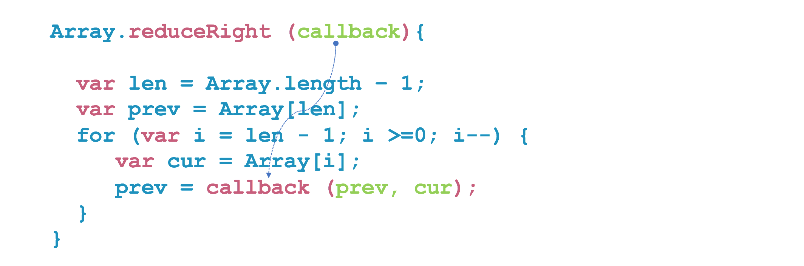

# 자바스크립트(JavaScript)
## 배열의 접근 메서드

메서드 | 설명
---|---
concat() | 배열과 인자로 주어진 배열을 결합해 새로운 배열을 만들어 반환한다.
includes() | 배열에 특정 요소가 포함됐는지 알아내어 블린값을 반환한다.
indexOf() | 배열에서 지정한 값과 같은 요소의 첫 인덱스를 반환한다. 없으면 -1을 반환한다.
join() | 배열의 모든 요소를 문자열로 변환하여 반환한다.
lastIndexOf() | 배열에서 지정 값과 같은 요소의 마지막 인덱스를 반환한다. 없으면 -1을 반환한다.
slice() | 배열의 일부를 추출한 새로운 배열을 반환한다.

### concat() 함수
- 배열과 인자로 주어진 배열을 결합해 새로운 배열을 만들어 반환한다.
* [javascript](#)
```html
<!DOCTYPE html>
<html>
<head>
    <script type="text/javascript">
      var alpha = ['a', 'b', 'c'];
      var numbers = [1, 2, 3];
      var alpha_number = alpha.concat(numbers);

      console.log(alpha_number); // ['a', 'b', 'c', 1, 2, 3]
    </script>
</head>
<body>
</body>
</html>
```

* [javascript](#)
```html
<!DOCTYPE html>
<html>
<head>
    <script type="text/javascript">
      var num1 = [1, 2, 3];
      var num2 = [4, 5, 6];
      var num4 = [7, 8, 9];
      var nums = num1.concat(num2, num3);

      console.log(nums); // [1, 2, 3, 4, 5, 6, 7, 8, 9]
    </script>
</head>
<body>
</body>
</html>
```

* [javascript](#)
```html
<!DOCTYPE html>
<html>
<head>
    <script type="text/javascript">
      var alpha = ['a', 'b', 'c'];
      var alpha_number = alpha.concat(1, [2, 3]);

      console.log(alpha_number); // ['a', 'b', 'c', 1, 2, 3]
    </script>
</head>
<body>
</body>
</html>
```

### includes() 함수
- 배열에 특정 요소가 포함됐는지 알아내어 블린값을 반환한다.
- Array.prototype.includes(searchElement, fromIndex)
* [javascript](#)
```html
<!DOCTYPE html>
<html>
<head>
    <script type="text/javascript">
      var a = [1, 2, 3];
      console.log(a.includes(2)); // true
      console.log(a.includes(4)); // false
    </script>
</head>
<body>
</body>
</html>
```

### indexOf() 함수
- 배열에서 지정한 값과 같은 요소의 첫 인덱스를 반환한다. 없으면 -1을 반환한다.
- Array.prototype.indexOf(searchElement, fromIndex)
* [javascript](#)
```html
<!DOCTYPE html>
<html>
<head>
    <script type="text/javascript">
      var a = [2, 9, 9];
      console.log(a.indexOf(2));     // 0
      console.log(a.indexOf(7));     // -1
      console.log(a.indexOf(9, 2));  // 2
      console.log(a.indexOf(2, -1)); // -1
      console.log(a.indexOf(2, -3)); // 0
    </script>
</head>
<body>
</body>
</html>
```


* [javascript](#)
```html
<!DOCTYPE html>
<html>
<head>
    <script type="text/javascript">
      // 인자로 받은 배열(a)에서 숫자만 찾아 복제하는 함수.
      function find_all_index(a, b) {
        var result = [];
        // TODO : 여기에 여러분이 직접 코딩을 해주세요.
        return result;
      }

      exepect(find_all_index(['a', 'a', 'b', 'c', 'a'], 'a'), [0, 1, 4]);
      exepect(find_all_index(['kim', 'lee', 'park', 'park', 'yoo'], 'park'), [2, 3]);
      exepect(find_all_index(['java', 'java', 'java', 'c++'], 'c++'), [3]);
      exepect(find_all_index(['1', '2', '3'], '4'), []);

      function exepect(l, r) {
        if (l.length !== r.length)
         console.log('fail');
        else {
          for (var i = 0; i < l.length; ++i) {
            if (l[i] !== r[i]) {
                console.log('fail');
                return;
            }
          }
          console.log('pass');
        }
      }
    </script>
</head>
<body>
</body>
</html>
```

### join() 함수
- 배열의 모든 요소를 문자열로 변환하여 반환한다.
- Array.prototype.join([separator = ','])
* [javascript](#)
```html
<!DOCTYPE html>
<html>
<head>
    <script type="text/javascript">
      var a = ['open', 'source', 'programming'];
      console.log(a.join()); // 'open,source,programming'
      console.log(a.join(', ')); // 'open, source, programming'
      console.log(a.join(' + '); // 'open + source + programming'
      console.log(a.join('')); // opensourceprogramming
    </script>
</head>
<body>
</body>
</html>
```

### lastIndexOf() 함수
- 배열에서 지정 값과 같은 요소의 마지막 인덱스를 반환한다. 없으면 -1을 반환한다.
- Array.prototype.lastIndexOf(searchElement, fromIndex)
* [javascript](#)
```html
<!DOCTYPE html>
<html>
<head>
    <script type="text/javascript">
      var a = [2, 5, 9, 2];
      console.log(a.lastIndexOf(2)); // 3
      console.log(a.lastIndexOf(7)); // -1
    </script>
</head>
<body>
</body>
</html>
```

### slice() 함수
- 배열의 일부를 추출한 새로운 배열을 반환한다.
- Array.prototype.slice[begin[, end]]
* [javascript](#)
```html
<!DOCTYPE html>
<html>
<head>
    <script type="text/javascript">
      var colors = ['red', 'green', 'blue', 'white', 'black'];

      // 배열 전체
      console.log(colors.slice()); // ['red', 'green', 'blue', 'white', 'black']

      // 마지막 end 는 제외
      console.log(colors.slice(1, 3)); // ['green', 'blue']
      console.log(colors.slice(0, 1)); // ['red']

      // 시작 인덱스에서 배열 마지막 까지  
      console.log(colors.slice(2)); // [ 'blue', 'white', 'black' ]

      // 음수 인덱스는 배열의 끝에서부터의 길이를 나타냄.
      console.log(colors.slice(1, -1)); // [ 'green', 'blue', 'white' ]

    </script>
</head>
<body>
</body>
</html>
```

## 배열의 반복 메서드
메서드 | 설명
---|---
every() | 배열의 모든 요소가 제공된 검사 함수를 만족하면 true을 반환한다.
filter() | 주어진 필터링 함수의 값의 결과가 참인 경우의 배열 요소들만으로 새로운 배열을 생성하여 반환한다.
find() |  주어진 테스트 함수의 요구조건을 만족하는 배열 요소를 반환한다. 그러한 배열 요소가 없으면 undefined를 반환한다.
findIndex() |  주어진 테스트 함수를 만족하는 첫 번째 요소에 대한 인덱스를 반환한다. 없으면 -1을 반환한다.
forEach() | 배열 내의 모든 요소 각각에 대해 콜백 함수를 호출한다.
map() | 배열 내의 모든 요소 각각에 대해 콜백 함수를 호출하고, 그 결과를 배열로 만들어 반환한다.
reduce() | 배열의 각 값에 대해 왼쪽에서 오른쪽으로 함수를 적용하여 단일 값으로 줄인다.
reduceRight() | 배열의 각 값에 대해 오른쪽에서 왼쪽으로 함수를 적용하여 단일 값으로 줄인다.

### every() 함수
- 배열의 모든 요소가 제공된 검사 함수를 만족하면 true을 반환한다.
- Array.prototype.every(callback)
  - callback(currentValue, [index], [array])
* [javascript](#)
```html
<!DOCTYPE html>
<html>
<head>
    <script type="text/javascript">
      var student_A = [10, 20, 30, 40, 10];
      var student_B = [100, 60, 70, 80, 70];
      function is_all_socres_over_50(scores) {
        for (var i = 0; i < scores.length; i++) {
          if (scores[i] < 50)
            return false;
        }
        return true;
      }
      console.log(is_all_socres_over_50(student_A)); // false
      console.log(is_all_socres_over_50(student_B)); // true
    </script>
</head>
<body>
</body>
</html>
```

* [javascript](#)
```html
<!DOCTYPE html>
<html>
<head>
    <script type="text/javascript">
      var student_A = [10, 20, 30, 40, 10];
      var student_B = [100, 60, 70, 80, 70];
      function is_all_socres_over_50(score) {
        return score >= 50;
      }
      console.log(student_A.every(is_all_socres_over_50)); // false
      console.log(student_B.every(is_all_socres_over_50)); // true
    </script>
</head>
<body>
</body>
</html>
```

* [javascript](#)
```html
<!DOCTYPE html>
<html>
<head>
    <script type="text/javascript">
        var student_A = [10, 20, 30, 40, 10];
        var student_B = [100, 60, 70, 80, 70];
        console.log(student_A.every(score => score >= 50)); // false
        console.log(student_B.every(score => score >= 50)); // true
    </script>
</head>
<body>
</body>
</html>
```

### filter() 함수
- 주어진 필터링 함수의 값의 결과가 참인 경우의 배열 요소들만으로 새로운 배열을 생성하여 반환한다.
- Array.prototype.filter(callback)
  - callback(currentValue, [index], [array])

* [javascript](#)
```html
<!DOCTYPE html>
<html>
<head>
    <script type="text/javascript">
      var list = [1, "ryubc.inhatc@gmail.com", 200, "javascript", "opensource", 10];
      function select_string_element(list) {
        var result = [];
        for (var i = 0; i < list.length; ++i) {
          if (typeof list[i] === 'string')
            result.push(list[i]);
        }
        return result;
      }
      console.log(select_string_element(list)); // ["ryubc.inhatc@gmail.com", "javascript", "opensource"]
    </script>
</head>
<body>
</body>
</html>
```

* [javascript](#)
```html
<!DOCTYPE html>
<html>
<head>
    <script type="text/javascript">
      var list = [1, "ryubc.inhatc@gmail.com", 200, "javascript", "opensource", 10];
      function select_string_element(element) {
          return (typeof element === 'string');
      }
      console.log(list.filter(select_string_element)); // ["ryubc.inhatc@gmail.com", "javascript", "opensource"]
    </script>
</head>
<body>
</body>
</html>
```

* [javascript](#)
```html
<!DOCTYPE html>
<html>
<head>
    <script type="text/javascript">
      var list = [1, "ryubc.inhatc@gmail.com", 200, "javascript", "opensource", 10];
      console.log(list.filter(element => typeof element === 'string')); // ["ryubc.inhatc@gmail.com", "javascript", "opensource"]
    </script>
</head>
<body>
</body>
</html>
```

### find() 함수
- 주어진 테스트 함수의 요구조건을 만족하는 배열 요소를 반환한다. 그러한 배열 요소가 없으면 undefined를 반환한다.
- Array.prototype.find(callback)
  - callback(currentValue, [index], [array])

* [javascript](#)
```html
<!DOCTYPE html>
<html>
<head>
    <script type="text/javascript">
      var students = [
          {name: 'kim', no: 2001},
          {name: 'park', no: 2002},
          {name: 'yoo', no: 2003}
      ];

      function find_student_kim(student) {
          return student.name === 'kim';
      }

      console.log(students.find(find_student_kim)); // { name: 'kim', no: 2001 }
    </script>
</head>
<body>
</body>
</html>
```


### findIndex() 함수
- 주어진 테스트 함수를 만족하는 첫 번째 요소에 대한 인덱스를 반환한다. 없으면 -1을 반환한다.
- Array.prototype.findIndex(callback)
  - callback(currentValue, [index], [array])

```html
<!DOCTYPE html>
<html>
<head>
    <script type="text/javascript">
      var students = [
          {name: 'kim', no: 2001},
          {name: 'park', no: 2002},
          {name: 'yoo', no: 2003}
      ];

      function find_student_park(student) {
          return student.name === 'park';
      }

      console.log(students.findIndex(find_student_park)); // 1
    </script>
</head>
<body>
</body>
</html>
```


### forEach() 함수
- 배열 내의 모든 요소 각각에 대해 콜백 함수를 호출한다.
- Array.prototype.forEach(callback)
  - callback(currentValue, [index], [array])

* [javascript](#)
```html
<!DOCTYPE html>
  <html>
  <head>
      <script type="text/javascript">
          var A =[90,80,50,40,10];
          var B = [90,30,100,50,50];
          var C = [20,30,60,50,20];
          var A_sum=0, B_sum=0, C_sum=0;
          var A_max = 0, B_max=0, C_max=0;
          var A_min = A[0], B_min = B[0], C_min = C[0];
          A.forEach(function(value){A_sum+=value;});
          B.forEach(function(value){B_sum+=value;});
          C.forEach(function(value){C_sum+=value;});

          var A_average = A_sum/5;
          var B_average = B_sum/5;
          var C_average = C_sum/5;
          for(var i=0;i < 5;i++){
              if(A_max < A[i])
                  A_max = A[i];
          }
          for(var i=0;i < 5;i++){
              if(B_max < B[i])
                  B_max = B[i];
          }
          for(var i=0;i < 5;i++){
              if(C_max < C[i])
                  C_max = C[i];
          }

          for(var i=0;i < 5;i++){
              if(A_min > A[i])
                  A_min = A[i];
          }
          for(var i=0;i < 5;i++){
              if(B_min > B[i])
                  B_min = B[i];
          }
          for(var i=0;i < 5;i++){
              if(C_min > C[i])
                  C_min = C[i];
          }

          console.log('A 학생의 평균 점수는 ' + A_average + ' , 최고 점수는 ' + A_max + ' , 최하 점수는 ' + A_min + ' 입니다.');
          console.log('B 학생의 평균 점수는 ' + B_average + ' , 최고 점수는 ' + B_max + ' , 최하 점수는 ' + B_min + ' 입니다.');
          console.log('C 학생의 평균 점수는 ' + C_average + ' , 최고 점수는 ' + C_max + ' , 최하 점수는 ' + C_min + ' 입니다.');
      </script>
  </head>
  <body>
  </body>
  </html>
```

### map() 함수
- 배열 내의 모든 요소 각각에 대해 콜백 함수를 호출하고, 그 결과를 배열로 만들어 반환한다.
- Array.prototype.map(callback)
  - callback(currentValue, [index], [array])



* [javascript](#)
```html
<!DOCTYPE html>
<html>
<head>
    <script type="text/javascript">
      var scores = [1, 2, 3, 4, 1];
      function multiply_100(scores) {
        var result = [];
        for (var i = 0; i < scores.length; i++) {
          result.push(scores[i] * 100);
        }
        return result;
      }

      console.log(multiply_100(scores)); // [100, 200, 300, 400, 100];
    </script>
</head>
<body>
</body>
</html>
```

* [javascript](#)
```html
<!DOCTYPE html>
<html>
<head>
    <script type="text/javascript">
      var scores = [1, 2, 3, 4, 1];
      function multiply_100(score) {
        return score * 100;
      }

      console.log(scores.map(multiply_100)); // [100, 200, 300, 400, 100];
    </script>
</head>
<body>
</body>
</html>
```

* [javascript](#)
```html
<!DOCTYPE html>
<html>
<head>
    <script type="text/javascript">
      var scores = [1, 2, 3, 4, 1];
      console.log(scores.map(score => score * 100)); // [100, 200, 300, 400, 100];
    </script>
</head>
<body>
</body>
</html>
```

### reduce() 함수
- 배열의 각 값에 대해 왼쪽에서 오른쪽으로 함수를 적용하여 단일 값으로 줄인다.
- Array.prototype.reduce(callback)
  - callback(currentValue, [index], [array])



* [javascript](#)
```html
<!DOCTYPE html>
<html>
<head>
    <script type="text/javascript">
      var scores = [10, 20, 30, 40, 10];
      function sum(scores) {
        var result = 0;
        for (var i = 0; i < scores.length; i++) {
          result += scores[i];
        }
        return result;
      }
      console.log(sum(scores)); // 110
    </script>
</head>
<body>
</body>
</html>
```

* [javascript](#)
```html
<!DOCTYPE html>
<html>
<head>
    <script type="text/javascript">
      var scores = [10, 20, 30, 40, 10];
      function sum(accumulator, score) {
        return accumulator + score;
      }
      console.log(scores.reduce(sum)); // 110
    </script>
</head>
<body>
</body>
</html>
```

* [javascript](#)
```html
<!DOCTYPE html>
<html>
<head>
    <script type="text/javascript">
      var scores = [10, 20, 30, 40, 10];
      console.log(scores.reduce((accumulator, score) => accumulator + score)); // 110
    </script>
</head>
<body>
</body>
</html>
```


* [javascript](#)
```html
<!DOCTYPE html>
<html>
<head>
    <script type="text/javascript">
        var scores = [10, 20, 30, 40, 10];
        function sum(accumulator, score) {
            console.log(`accumulator : ${accumulator}, score : ${score}`);
            return accumulator + score;
        }
        scores.reduce(sum);
    </script>
</head>
<body>
</body>
</html>
* [javascript](#)
```

```text
accumulator : 10, score : 20
accumulator : 30, score : 30
accumulator : 60, score : 40
accumulator : 100, score : 10
```

* [javascript](#)
```html
<!DOCTYPE html>
<html>
<head>
    <script type="text/javascript">
    function longest_country_name(country_name) {
          return country_name.reduce(function(longest_name, country) {
              return longest_name.length > longest_name.length ? longest_name : country;
        }, "");
    }
    console.log(longest_country_name(["Australia", "Germany", "United States of America"])); //  United States of America
    </script>
</head>
<body>
</body>
</html>
```

### reduceRight() 함수
- 배열의 각 값에 대해 오른쪽에서 왼쪽으로 함수를 적용하여 단일 값으로 줄인다.
- Array.prototype.reduceRight(callback)
  - callback(currentValue, [index], [array])



* [javascript](#)
```html
<!DOCTYPE html>
<html>
<head>
    <script type="text/javascript">
      var subject = ['j', 'a', 'v', 'a', 's', 'c', 'r', 'i', 'p', 't'];
      console.log(subject.reduce(function(prev, cur) {
        return prev + cur;
      })); // javascript

      console.log(subject.reduceRight(function(prev, cur) {
        return prev + cur;
      })); // tpircsavaj      
    </script>
</head>
<body>
</body>
</html>
```
