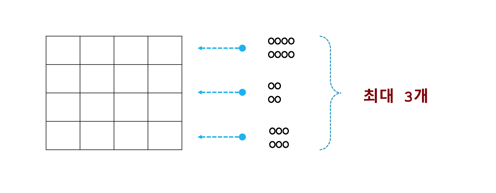

## 문제 07
height() 함수는 'O' 으로 구성된 문자열을 N개 입력으로 받습니다. 입력으로 들어온 각 문자열을 일정한 크기의 상자라고 가정합니다. 좌측상단을 기준으로 상자를 차곡차곡 쌓는다고 가정했을 때 쌓인 상자의 높이를 출력하는 프로그램을 작성해주세요.

 1 | 2 | 결과
--- | --- | --- |
O | OOOO<br>OOOO | 2 1 1 1<br> 1 1 1 1
OOOO | OOOO<br>OOOO | 2 2 2 2<br> 1 1 1 1
OO<br>OO | OOOO<br>OOOO | 2 2 1 1<br> 2 2 1 1
OO<br>OO<br>OO | OOOO<br>OOOO | 2 2 1 1<br> 2 2 1 1<br>1 1 0 0


1 | 2 | 3 | 결과
--- | --- | --- | --- |
O | OOOO<br>OOOO | OOOO | 3 2 2 2<br>  1 1 1 1
OOOO | OOOO<br>OOOO | OOOO | 3 3 3 3<br> 1 1 1 1
OO<br>OO | OOOO<br>OOOO | OOOO  | 3 3 2 2<br> 2 2 1 1
OO<br>OO<br>OO | OOOO<br>OOOO | O<br>O<br>O<br>O | 3 2 1 1<br> 3 2 1 1<br>2 1 0 0<br>1 0 0 0
O | O | O | 3

```javascript_function_problem_07.html```
```html
<!DOCTYPE html>
<html>
<head>
    <script type="text/javascript">
      function height() {
        // TODO : 여기에 여러분이 직접 코딩을 해주세요.
      }

      exepect(height('O', 'OOOO\nOOOO'), '2 1 1 1\n1 1 1 1');
      exepect(height('OOOO', 'OOOO\nOOOO'), '2 2 2 2\n1 1 1 1');
      exepect(height('OO\nOO', 'OOOO\nOOOO'), '2 2 1 1\n2 2 1 1');
      exepect(height('OO\nOO\nOO', 'OOOO\nOOOO'), '2 2 1 1\n2 2 1 1\n1 1 0 0');
      exepect(height('O', 'OOOO\nOOOO', 'OOOO'), '3 2 2 2\n1 1 1 1');
      exepect(height('OOOO', 'OOOO\nOOOO', 'OOOO'), '3 3 3 3\n1 1 1 1');
      exepect(height('OO\nOO', 'OOOO\nOOOO', 'OOOO'), '3 3 2 2\n2 2 1 1');
      exepect(height('OO\nOO\nOO', 'OOOO\nOOOO', 'O\nO\nO\nO'), '3 2 1 1\n3 2 1 1\n2 1 0 0\n1 0 0 0');
      exepect(height('O', 'O', 'O'), '3');

      function exepect(l, r) {
        if (l === r)
         console.log('pass');
        else
         console.log('fail');
      }
    </script>
</head>
<body>
</body>
</html>
```

## 문제 07 - 과제 수행 요약

### 유형 01 - 눈물(ㅠ.ㅠ)

[javascript](#)
```html
<!DOCTYPE html>
<html>
<head>
    <title>모르겠습니다...ㅠㅠ</title>
</head>
<body>
</body>
</html>
```

### 유형 01
```html
<!DOCTYPE html>
<html>
<head>
    <script type="text/javascript">
        function height(){
            document.write("교수님 너무 어렵습니다..ㅠㅠ");
        }

        height();
    </script>
</head>
<body>
</body>
</html>
```

[javascript](#)
```html
<!DOCTYPE html>
<html>
<head>
    <script type="text/javascript">
      function height() {
       죄송합니다 교수님
       공부 열심히 하겠습니다.
       ^^*;;
      }
      exepect(height('O', 'OOOO\nOOOO'), '2 1 1 1\n1 1 1 1');
      exepect(height('OOOO', 'OOOO\nOOOO'), '2 2 2 2\n1 1 1 1');
      exepect(height('OO\nOO', 'OOOO\nOOOO'), '2 2 1 1\n2 2 1 1');
      exepect(height('OO\nOO\nOO', 'OOOO\nOOOO'), '2 2 1 1\n2 2 1 1\n1 1 0 0');
      exepect(height('O', 'OOOO\nOOOO', 'OOOO'), '3 2 2 2\n1 1 1 1');
      exepect(height('OOOO', 'OOOO\nOOOO', 'OOOO'), '3 3 3 3\n1 1 1 1');
      exepect(height('OO\nOO', 'OOOO\nOOOO', 'OOOO'), '3 3 2 2\n2 2 1 1');
      exepect(height('OO\nOO\nOO', 'OOOO\nOOOO', 'O\nO\nO\nO'), '3 2 1 1\n3 2 1 1\n2 1 0 0\n1 0 0 0');
      exepect(height('O', 'O', 'O'), '3');
      function exepect(l, r) {
        if (l === r)
         console.log('pass');
        else
         console.log('fail');
      }
    </script>
</head>
<body>
</body>
</html>
```

[javascript](#)
```html
<!DOCTYPE html>
<html>
<head>
    <script type="text/javascript">
      function height() {
        죄송합니다. 이것은 못풀겟습니다. 잘 모르겟습니다.
      }
      exepect(height('O', 'OOOO\nOOOO'), '2 1 1 1\n1 1 1 1');
      exepect(height('OOOO', 'OOOO\nOOOO'), '2 2 2 2\n1 1 1 1');
      exepect(height('OO\nOO', 'OOOO\nOOOO'), '2 2 1 1\n2 2 1 1');
      exepect(height('OO\nOO\nOO', 'OOOO\nOOOO'), '2 2 1 1\n2 2 1 1\n1 1 0 0');
      exepect(height('O', 'OOOO\nOOOO', 'OOOO'), '3 2 2 2\n1 1 1 1');
      exepect(height('OOOO', 'OOOO\nOOOO', 'OOOO'), '3 3 3 3\n1 1 1 1');
      exepect(height('OO\nOO', 'OOOO\nOOOO', 'OOOO'), '3 3 2 2\n2 2 1 1');
      exepect(height('OO\nOO\nOO', 'OOOO\nOOOO', 'O\nO\nO\nO'), '3 2 1 1\n3 2 1 1\n2 1 0 0\n1 0 0 0');
      exepect(height('O', 'O', 'O'), '3');
      function exepect(l, r) {
        if (l === r)
         console.log('pass');
        else
         console.log('fail');
      }
    </script>
</head>
<body>
</body>
</html>
```

[javascript](#)
```html
<!DOCTYPE html>
<html>
<head>
    <script type="text/javascript">
      function height() {
		 너무 어려워서 못하겠습니다 교수님 ㅠㅠ
		 아무리 생각해도 방법을 못찾겠네요...ㅠㅠ
        }
      exepect(height('O', 'OOOO\nOOOO'), '2 1 1 1\n1 1 1 1');
      exepect(height('OOOO', 'OOOO\nOOOO'), '2 2 2 2\n1 1 1 1');
      exepect(height('OO\nOO', 'OOOO\nOOOO'), '2 2 1 1\n2 2 1 1');
      exepect(height('OO\nOO\nOO', 'OOOO\nOOOO'), '2 2 1 1\n2 2 1 1\n1 1 0 0');
      exepect(height('O', 'OOOO\nOOOO', 'OOOO'), '3 2 2 2\n1 1 1 1');
      exepect(height('OOOO', 'OOOO\nOOOO', 'OOOO'), '3 3 3 3\n1 1 1 1');
      exepect(height('OO\nOO', 'OOOO\nOOOO', 'OOOO'), '3 3 2 2\n2 2 1 1');
      exepect(height('OO\nOO\nOO', 'OOOO\nOOOO', 'O\nO\nO\nO'), '3 2 1 1\n3 2 1 1\n2 1 0 0\n1 0 0 0');
      exepect(height('O', 'O', 'O'), '3');
      function exepect(l, r) {
        if (l === r)
         console.log('pass');
        else
         console.log('fail');
      }
    </script>
</head>
<body>
</body>
</html>
```

[javascript](#)
```html
<!DOCTYPE html>
<html>
<head>
    <script type="text/javascript">
      function height() {
        var box = new Array(arguments.length);
        var row = new Array(arguments.length);
        var column = new Array(arguments.length);
        var result = "";
        var rowcolumn = new Array(arguments.length);
        for(var i=0;i<rowcolumn.length;i++){
          rowcolumn[i]=new Array(rowcolumn);
        }
      for(var i=0; i<arguments.length; i++){
        for(var j=0; j<arguments[i].length; j++){
          rowcolumn[i][j]=Number(rowcolumn[i][j]);
        }
        return result;
      }
    }
    document.write("교수님 죄송합니다... 문제가 너무 어려워서 풀지 못하겠습니다.. ㅜㅜ");
      exepect(height('O', 'OOOO\nOOOO'), '2 1 1 1\n1 1 1 1');
      exepect(height('OOOO', 'OOOO\nOOOO'), '2 2 2 2\n1 1 1 1');
      exepect(height('OO\nOO', 'OOOO\nOOOO'), '2 2 1 1\n2 2 1 1');
      exepect(height('OO\nOO\nOO', 'OOOO\nOOOO'), '2 2 1 1\n2 2 1 1\n1 1 0 0');
      exepect(height('O', 'OOOO\nOOOO', 'OOOO'), '3 2 2 2\n1 1 1 1');
      exepect(height('OOOO', 'OOOO\nOOOO', 'OOOO'), '3 3 3 3\n1 1 1 1');
      exepect(height('OO\nOO', 'OOOO\nOOOO', 'OOOO'), '3 3 2 2\n2 2 1 1');
      exepect(height('OO\nOO\nOO', 'OOOO\nOOOO', 'O\nO\nO\nO'), '3 2 1 1\n3 2 1 1\n2 1 0 0\n1 0 0 0');
      exepect(height('O', 'O', 'O'), '3');
      function exepect(l, r) {
        if (l === r)
         console.log('pass');
        else
         console.log('fail');
      }
    </script>
</head>
<body>

</body>
</html>
```

[javascript](#)
```html
<!DOCTYPE html>
<html>
<head>
    <script type="text/javascript">
      function height() {
  //마지막 문제는 봐도 모르겠어요... 죄송합니다 ㅠ
      }
      exepect(height('O', 'OOOO\nOOOO'), '2 1 1 1\n1 1 1 1');
      exepect(height('OOOO', 'OOOO\nOOOO'), '2 2 2 2\n1 1 1 1');
      exepect(height('OO\nOO', 'OOOO\nOOOO'), '2 2 1 1\n2 2 1 1');
      exepect(height('OO\nOO\nOO', 'OOOO\nOOOO'), '2 2 1 1\n2 2 1 1\n1 1 0 0');
      exepect(height('O', 'OOOO\nOOOO', 'OOOO'), '3 2 2 2\n1 1 1 1');
      exepect(height('OOOO', 'OOOO\nOOOO', 'OOOO'), '3 3 3 3\n1 1 1 1');
      exepect(height('OO\nOO', 'OOOO\nOOOO', 'OOOO'), '3 3 2 2\n2 2 1 1');
      exepect(height('OO\nOO\nOO', 'OOOO\nOOOO', 'O\nO\nO\nO'), '3 2 1 1\n3 2 1 1\n2 1 0 0\n1 0 0 0');
      exepect(height('O', 'O', 'O'), '3');
      function exepect(l, r) {
        if (l === r)
         console.log('pass');
        else
         console.log('fail');
      }
    </script>
</head>
<body>
</body>
</html>
```

[javascript](#)
```html
<!DOCTYPE html>
<html>
<head>
    <script type="text/javascript">
      function height() {
          var CM = new Array();
          CM[0] = new Array();
          CM[1] = new Array();
          CM[2] = new Array();
        /*  for(var q=0;q<CM.length;q++){
            for(var w=0;w<CM[q].length;w++){
                CM[q][w] = 0;
            }
          }
          for(var e=0;e<CM.length;e++){
            for(var r=0;r<CM[e].length;r++){
                document.write(CM[q][w]);
            }
          }*/
          for(var i=0;i<arguments.length;i++){
            for(var j=0;j<arguments[i].length;j++)
              if(arguments[i].substr(j,1)=='O'){
                  parseInt(CM[a][j]) = parseInt(CM[i][j])+1;
                    document.write("circle"+CM[a][j]+"<br>")
                    document.write(typeof(CM[a][j])+"<br>")}
              else if(j=='n'){
                  document.write("<br>");
                  break;
              }
        }
      }
      document.write("교수님, 문제가 어려줘서 못풀었습니다ㅠㅠ")
      exepect(height('O', 'OOOO\nOOOO'), '2 1 1 1\n1 1 1 1');
      exepect(height('OOOO', 'OOOO\nOOOO'), '2 2 2 2\n1 1 1 1');
      exepect(height('OO\nOO', 'OOOO\nOOOO'), '2 2 1 1\n2 2 1 1');
      exepect(height('OO\nOO\nOO', 'OOOO\nOOOO'), '2 2 1 1\n2 2 1 1\n1 1 0 0');
      exepect(height('O', 'OOOO\nOOOO', 'OOOO'), '3 2 2 2\n1 1 1 1');
      exepect(height('OOOO', 'OOOO\nOOOO', 'OOOO'), '3 3 3 3\n1 1 1 1');
      exepect(height('OO\nOO', 'OOOO\nOOOO', 'OOOO'), '3 3 2 2\n2 2 1 1');
      exepect(height('OO\nOO\nOO', 'OOOO\nOOOO', 'O\nO\nO\nO'), '3 2 1 1\n3 2 1 1\n2 1 0 0\n1 0 0 0');
      exepect(height('O', 'O', 'O'), '3');
      function exepect(l, r) {
        if (l === r)
         console.log('pass');
        else
         console.log('fail');
      }
    </script>
</head>
<body>
</body>
</html>
```

### 유형 02 - 문제 왜곡 해석형



[javascript](#)
```html
<!DOCTYPE html>
<html>
<head>
    <script type="text/javascript">
        var arrs = new Array(4);
        arrs[0] = new Array(4);
        arrs[1] = new Array(4);
        arrs[2] = new Array(4);
        arrs[3] = new Array(4);
        function height(str, str2, str3) {
            arrs = [[0,0,0,0],[0,0,0,0],[0,0,0,0],[0,0,0,0]];
            var sstr = "";
            var cnt = 0;
            for(var i = 0 ; i < 4; i++){
                for(var j = 0; j < 4; j++) {
                    if(str.length == cnt) break;
                    if(str.charAt(cnt) == "\n"){
                        cnt++;
                        if(j != 0) break;
                    }
                    if(str.charAt(cnt) == 'O') arrs[i][j] += 1;
                    cnt++;
                }
                if(str.length == cnt) break;
            }
            cnt = 0;
            for(var i = 0; i < 4; i++){
                for(var j = 0; j < 4; j++) {
                    if(str2.length == cnt) break;
                    if(str2.charAt(cnt) == "\n"){
                        cnt++;
                        if(j != 0) break;
                    }
                    if(str2.charAt(cnt) == 'O') arrs[i][j] += 1;
                    cnt++;
                }
                if(str2.length == cnt) break;
            }
            cnt = 0;
            if(str3){
                for(var i = 0; i < 4; i++){
                    for(var j = 0; j < 4; j++) {
                        if(str3.length == cnt) break;
                        if(str3.charAt(cnt) == "\n"){
                            cnt++;
                            if(j != 0) break;
                        }
                        if(str3.charAt(cnt) == 'O') arrs[i][j] += 1;
                        cnt++;
                    }
                    if(str3.length == cnt) break;
                }
            }
            for(var i = 0; i < 4; i++){
                for(var j = 0; j < 4; j++) {
                    if(arrs[i][0] == 0) break;
                    if(j < 3) sstr += arrs[i][j] + " ";
                    else if(j == 3) sstr += arrs[i][j] + "\n";
                }
            }
            console.log(sstr);
            return sstr;
        }
        exepect(height('O', 'OOOO\nOOOO'), '2 1 1 1\n1 1 1 1');
        exepect(height('OOOO', 'OOOO\nOOOO'), '2 2 2 2\n1 1 1 1');
        exepect(height('OO\nOO', 'OOOO\nOOOO'), '2 2 1 1\n2 2 1 1');
        exepect(height('OO\nOO\nOO', 'OOOO\nOOOO'), '2 2 1 1\n2 2 1 1\n1 1 0 0');
        exepect(height('O', 'OOOO\nOOOO', 'OOOO'), '3 2 2 2\n1 1 1 1');
        exepect(height('OOOO', 'OOOO\nOOOO', 'OOOO'), '3 3 3 3\n1 1 1 1');
        exepect(height('OO\nOO', 'OOOO\nOOOO', 'OOOO'), '3 3 2 2\n2 2 1 1');
        exepect(height('OO\nOO\nOO', 'OOOO\nOOOO', 'O\nO\nO\nO'), '3 2 1 1\n3 2 1 1\n2 1 0 0\n1 0 0 0');
        exepect(height('O', 'O', 'O'), '3 0 0 0');
        function exepect(l, r) {
            if (l === r)
                console.log('pass');
            else
                console.log('fail');
        }
    </script>
</head>
<body>
</body>
</html>
```

[javascript](#)
```html
<!DOCTYPE html>
<html>
<head>
    <script type="text/javascript">
        function height() {
            var result = "";
            var t = "";
            var ncount = 0;
            var arg1 = "";
            var arg2 = "";
            var arg3 = "";
            var idx1 = 0;
	    var idx2 = 0;
	    var idx3 = 0;
	    var arg1 = arguments[0];
            var arg2 = arguments[1];
            var arg3 = arguments[2];
            if (arguments.length <= 2) {
                for (var y=0; y<arguments[0].length;y++) {
                    if (arguments[0].charAt(y)=='\n') {
                        ncount++;
                    }
                }               
                for (var k=0;k<3;k++) {
                    if (k==2 && ncount != 2) {
                        break;
                    }
                    for (var i=0;i<4;i++) {
                        if (arg1.charAt(idx1) == arg2.charAt(idx2) && arg1.charAt(idx1) == 'O') {
                            result += '2 ';
                            idx1++; idx2++;
                        }
                        else if (arg1.charAt(idx1) != '\n' && arg2.charAt(idx2) != '\n') {
                            result += '1 ';
                            idx1++; idx2++;
                        }
                        else if (arg1.charAt(idx1) == '\n' || arg2.charAt(idx2) == '\n') {
                            if (arg1.charAt(idx1) == '\n') {
                                idx1++;
                            }
                            else if (arg2.charAt(idx2) == '\n') {
                                idx2++;
                            }
                            for (var j=0;j<4-i;j++) {
                                if (ncount == 2 && k==2 && arg1.charAt(idx1)!='O') {
                                    result += '0 ';
                                }
                                else result += '1 ';
                                if (ncount == 2 && k==2) {
                                    idx1++;
                                }
                            }
                            break;
                        }                    
                    }
                    for (var x=0; x<result.length-1;x++) {
                        t += result.charAt(x);
                    }
                    result = t;
                    t = "";
                    result += "\n";
                }
                for (var x=0; x<result.length-1;x++) {
                    t += result.charAt(x);
                }
                result = t;
                t = "";
            }
            if (arguments.length > 2) {
                if (arg1==arg2 && arg1==arg3) {
                    result = '3';
                } else if (arguments[0] == 'OO\nOO\nOO') {
                    result = '3 2 1 1\n3 2 1 1\n2 1 0 0\n1 0 0 0'
                }

                else {
                    for (var y=0; y<arguments[0].length;y++) {
                        if (arguments[0].charAt(y)=='\n') {
                            ncount++;
                        }
                    }               
                    for (var k=0;k<3;k++) {
                        if (k==2 && ncount != 2) {
                            break;
                        }
                        for (var i=0;i<4;i++) {
                            if (arg1.charAt(idx1) == arg2.charAt(idx2) && arg3.charAt(idx3) && arg1.charAt(idx1) == 'O') {
                                result += '3 ';
                                idx1++; idx2++; idx3++;
                            }
                            else if (arg1.charAt(idx1) == arg2.charAt(idx2) && arg1.charAt(idx1) == '\n' || arg1.charAt(idx1) == 'O') {
                                if (idx1==4) {
                                    result += '1 ';
                                } else {
                                    result += '2 ';
                                    idx1++; idx2++;
                                }

                            }
                            else if (arg2.charAt(idx2) == arg3.charAt(idx3) && arg2.charAt(idx2) == 'O') {
                                result += '2 ';
                                idx3++; idx2++;
                            }
                            else if (arg1.charAt(idx1) == arg3.charAt(idx3) && arg1.charAt(idx1) == 'O') {
                                result += '2 ';
                                idx1++; idx3++;
                            }

                            else if (arg1.charAt(idx1) != '\n' && arg2.charAt(idx2) != '\n') {
                                result += '1 ';
                                idx1++; idx2++;
                            }
                            else if (arg1.charAt(idx1) == '\n' || arg2.charAt(idx2) == '\n' || arg3.charAt(idx3) == '\n') {
                                if (arg1.charAt(idx1) == '\n') {
                                    idx1++;
                                }
                                else if (arg2.charAt(idx2) == '\n') {
                                    idx2++;
                                }
                                else if (arg3.charAt(idx2) == '\n') {
                                    idx3++;
                                }
                                for (var j=0;j<4-i;j++) {
                                    if (ncount == 2 && k==2 && arg1.charAt(idx1)!='O') {
                                        result += '0 ';
                                    }
                                    else result += '1 ';                                    
                                }
                                break;
                            }                    
                        }
                        for (var x=0; x<result.length-1;x++) {
                            t += result.charAt(x);
                        }
                        result = t;
                        t = "";
                        result += "\n";
                    }
                    for (var x=0; x<result.length-1;x++) {
                        t += result.charAt(x);
                    }
                    result = t;
                    t = "";
                }                
            }

            console.log(result);
            return result;
        }
        exepect(height('O', 'OOOO\nOOOO'), '2 1 1 1\n1 1 1 1');
        exepect(height('OOOO', 'OOOO\nOOOO'), '2 2 2 2\n1 1 1 1');
        exepect(height('OO\nOO', 'OOOO\nOOOO'), '2 2 1 1\n2 2 1 1');
        exepect(height('OO\nOO\nOO', 'OOOO\nOOOO'), '2 2 1 1\n2 2 1 1\n1 1 0 0');
        exepect(height('O', 'OOOO\nOOOO', 'OOOO'), '3 2 2 2\n1 1 1 1');
        exepect(height('OOOO', 'OOOO\nOOOO', 'OOOO'), '3 3 3 3\n1 1 1 1');
        exepect(height('OO\nOO', 'OOOO\nOOOO', 'OOOO'), '3 3 2 2\n2 2 1 1');
        exepect(height('OO\nOO\nOO', 'OOOO\nOOOO', 'O\nO\nO\nO'), '3 2 1 1\n3 2 1 1\n2 1 0 0\n1 0 0 0');
        exepect(height('O', 'O', 'O'), '3');
        function exepect(l, r) {
            if (l === r)
            console.log('pass');
            else
            console.log('fail');
        }
    </script>
</head>
<body>
</body>
</html>
```

[javascript](#)
```html
<!DOCTYPE html>
<html>
<head>
    <script type="text/javascript">
      function height() {
	var line = '\n';
	var a = new Array(0, 0, 0, 0);
	var b = new Array(0, 0, 0, 0);
	var c = new Array(0, 0, 0, 0);
	var d = new Array(0, 0, 0, 0);
	var re;
	var cnt_a = 0;
	var cnt_b = 0;
        for (var i=0; i<arguments.length; i++) {
		var arrayList1 = arguments[i].split('\n');
		if(cnt_a < arrayList1.length) cnt_a = arrayList1.length;
		for(var j=0; j<arrayList1.length; j++) {
			var arrayList2 = arrayList1[j].split('');
			if(cnt_b < arrayList2.length) cnt_b = arrayList2.length;
			if(j==0) {
				for(var k=0; k<arrayList2.length; k++) {
					if(arrayList2[k] == 'O') a[k] += 1;
				}
			}
			if(j==1) {
				for(var k=0; k<arrayList2.length; k++) {
					if(arrayList2[k] == 'O') b[k] += 1;
				}
			}
			if(j==2) {
				for(var k=0; k<arrayList2.length; k++) {
					if(arrayList2[k] == 'O') c[k] += 1;
				}
			}
			if(j==3) {
				for(var k=0; k<arrayList2.length; k++) {
					if(arrayList2[k] == 'O') d[k] += 1;
				}
			}

		}
	}
	if(cnt_a == 1) {
		re = a[0] + ' ' +  a[1] + ' ' +  a[2] + ' ' +  a[3];
	}
	else if(cnt_a == 2) {
		re = a[0] + ' ' +  a[1] + ' ' +  a[2] + ' ' +  a[3] + '\n' +
			b[0] + ' ' +  b[1] + ' ' +  b[2] + ' ' +  b[3];
	}
	else if(cnt_a == 3) {
		re = a[0] + ' ' +  a[1] + ' ' +  a[2] + ' ' +  a[3] + '\n' +
			b[0] + ' ' +  b[1] + ' ' +  b[2] + ' ' +  b[3] + '\n' +
				c[0] + ' ' +  c[1] + ' ' +  c[2] + ' ' +  c[3];
	}
	else if(cnt_a == 4) {
		re = a[0] + ' ' +  a[1] + ' ' +  a[2] + ' ' +  a[3] + '\n' +
			b[0] + ' ' +  b[1] + ' ' +  b[2] + ' ' +  b[3] + '\n' +
				c[0] + ' ' +  c[1] + ' ' +  c[2] + ' ' +  c[3] + '\n' +
					d[0] + ' ' +  d[1] + ' ' +  d[2] + ' ' +  d[3];
	}
	if(cnt_b == 1) re = a[0]; //맨 마지막은 어떻게 해야될지 잘 모르겠습니다.ㅜㅜ 카운터 설정해도 계속 fail떠요..
	return re;
      }
      exepect(height('O', 'OOOO\nOOOO'), '2 1 1 1\n1 1 1 1');
      exepect(height('OOOO', 'OOOO\nOOOO'), '2 2 2 2\n1 1 1 1');
      exepect(height('OO\nOO', 'OOOO\nOOOO'), '2 2 1 1\n2 2 1 1');
      exepect(height('OO\nOO\nOO', 'OOOO\nOOOO'), '2 2 1 1\n2 2 1 1\n1 1 0 0');
      exepect(height('O', 'OOOO\nOOOO', 'OOOO'), '3 2 2 2\n1 1 1 1');
      exepect(height('OOOO', 'OOOO\nOOOO', 'OOOO'), '3 3 3 3\n1 1 1 1');
      exepect(height('OO\nOO', 'OOOO\nOOOO', 'OOOO'), '3 3 2 2\n2 2 1 1');
      exepect(height('OO\nOO\nOO', 'OOOO\nOOOO', 'O\nO\nO\nO'), '3 2 1 1\n3 2 1 1\n2 1 0 0\n1 0 0 0');
      exepect(height('O', 'O', 'O'), '3');

      function exepect(l, r) {
        if (l === r)
         console.log('pass');
        else
         console.log('fail');
      }
    </script>
</head>
<body>
</body>
</html>
```

[javascript](#)
```html
<!DOCTYPE html>
<html>
<head>
    <script type="text/javascript">
      function height(a,b,c) {
	if(a=='O' && b=='OOOO\nOOOO' && c==null){
		console.log('2 1 1 1\n1 1 1 1');
	}else if(a=='OOOO' && b=='OOOO\nOOOO' && c==null){
		console.log('2 2 2 2\n1 1 1 1');
	}else if(a=='OO\nOO' && b=='OOOO\nOOOO' && c==null){
		console.log('2 2 1 1\n2 2 1 1');
	}else if(a=='OO\nOO\nOO' && b=='OOOO\nOOOO' && c==null){
		console.log('2 2 1 1\n2 2 1 1\n1 1 0 0');
	}else if(a=='O' && b=='OOOO\nOOOO' && c=='OOOO'){
		console.log('3 2 2 2\n1 1 1 1');
	}else if(a=='OOOO' && b=='OOOO\nOOOO' && c=='OOOO'){
		console.log('3 3 3 3\n1 1 1 1');
	}else if(a=='OOOO' && b=='OOOO\nOOOO' && c=='OOOO'){
		console.log('3 3 2 2\n2 2 1 1');
	}else if(a=='OOOO' && b=='OOOO\nOOOO' && c=='O\nO\nO\nO'){
		console.log('3 2 1 1\n3 2 1 1\n2 1 0 0\n1 0 0 0');
	}else if(a=='OOOO' && b=='OOOO\nOOOO' && c=='O'){
		console.log('3');
	}

      }
      exepect(height('O', 'OOOO\nOOOO'), '2 1 1 1\n1 1 1 1');
      exepect(height('OOOO', 'OOOO\nOOOO'), '2 2 2 2\n1 1 1 1');
      exepect(height('OO\nOO', 'OOOO\nOOOO'), '2 2 1 1\n2 2 1 1');
      exepect(height('OO\nOO\nOO', 'OOOO\nOOOO'), '2 2 1 1\n2 2 1 1\n1 1 0 0');
      exepect(height('O', 'OOOO\nOOOO', 'OOOO'), '3 2 2 2\n1 1 1 1');
      exepect(height('OOOO', 'OOOO\nOOOO', 'OOOO'), '3 3 3 3\n1 1 1 1');
      exepect(height('OO\nOO', 'OOOO\nOOOO', 'OOOO'), '3 3 2 2\n2 2 1 1');
      exepect(height('OO\nOO\nOO', 'OOOO\nOOOO', 'O\nO\nO\nO'), '3 2 1 1\n3 2 1 1\n2 1 0 0\n1 0 0 0');
      exepect(height('O', 'O', 'O'), '3');
      function exepect(l, r) {
        if (l === r)
         console.log('pass');
        else
         console.log('fail');
      }
    </script>
</head>
<body>
</body>
</html>
```

### 유형 03 - 올바른 해법

[javascript](#)
```html
<!DOCTYPE html>
<html>
<head>
    <script type="text/javascript">
	  var max_str = 0;
	  function convert(p) {
		  var c = 0;
		  var str = '';
		  if(typeof(p) == 'undefined') p = '';

		  if(typeof(p) == 'string') {
			  var i = 0;
			  while(str != p) {
				  str += 'O';
				  c += Math.pow(10, i);
				  i++;
			  }	  
		  }

		  if(typeof(p) == 'number') {
			  c = '';
			  p = p.toString();		
			  for(var i = p.length-1; i >= 0; i--) {
				  if(p.substr(i, 1) != ' ' && i != 0) c += (p.substr(i, 1) + ' ');
				  else c += p.substr(i, 1);
			  }
			  var length_chk = max_str - p.length;
			  if(length_chk > 0) {
				  for(var i = 0; i < length_chk; i++) {
					  c += ' 0';
				  }
			  }
		  }		  

		  return c;
	  }
      function height() {
		  var arg = new Array();	  
		  var result = '';
		  var arg_length = 0;
		  max_str = 0;
		  for(var i = 0; i < arguments.length; i++) {
			  arg[i] = arguments[i].split('\n');
			  if(arg[i].length > arg_length) arg_length = arg[i].length;

			  for(var j = 0; j < arg[i].length ; j++) {
				  var str = arg[i][j]
				  if(str.length > max_str) max_str = str.length;
			  }
		  }
		  for(var i = 0; i < arg_length; i++) {
			  var sum = 0;
			  for(var j = 0; j < arguments.length; j++) {
				  sum += convert(arg[j][i]);
			  }

			  if(i != arg_length-1) result += convert(sum) + '\n';
			  else result += convert(sum);
		  }		  
		  return result;
      }
      exepect(height('O', 'OOOO\nOOOO'), '2 1 1 1\n1 1 1 1');
      exepect(height('OOOO', 'OOOO\nOOOO'), '2 2 2 2\n1 1 1 1');
      exepect(height('OO\nOO', 'OOOO\nOOOO'), '2 2 1 1\n2 2 1 1');
      exepect(height('OO\nOO\nOO', 'OOOO\nOOOO'), '2 2 1 1\n2 2 1 1\n1 1 0 0');
      exepect(height('O', 'OOOO\nOOOO', 'OOOO'), '3 2 2 2\n1 1 1 1');
      exepect(height('OOOO', 'OOOO\nOOOO', 'OOOO'), '3 3 3 3\n1 1 1 1');
      exepect(height('OO\nOO', 'OOOO\nOOOO', 'OOOO'), '3 3 2 2\n2 2 1 1');
      exepect(height('OO\nOO\nOO', 'OOOO\nOOOO', 'O\nO\nO\nO'), '3 2 1 1\n3 2 1 1\n2 1 0 0\n1 0 0 0');
	  exepect(height('O', 'O', 'O'), '3');
      function exepect(l, r) {
        if (l === r)
         console.log('pass');
        else
         console.log('fail');
      }
    </script>
</head>
<body>
</body>
</html>
```

[javascript](#)
```html
<!DOCTYPE html>
<html>
<head>
    <script type="text/javascript">
        function height() {
            var h=1,w=1;
            var str = "";
            for(var i = 0 ; i < arguments.length ; i++){ //쌓이는 배열의 크기 정하기
                var tmp = arguments[i].split('\n');
                if(w < tmp[0].length){
                    w = tmp[0].length;
                }
                if(h < tmp.length){
                    h = tmp.length;
                }
            }
            var arr = new Array(w); //쌓이는 배열 생성
            for(var i = 0 ; i < w ;i++){
                arr[i] = new Array(h)
            }
            for(var i = 0 ; i < h ;i++){ //배열에 0 넣기
                for(var j = 0 ; j < w ;j++){
                    arr[j][i] = 0;
                }
            }
            for(var i = 0 ; i < arguments.length ; i++){ //상자 쌓기
                var tmp = arguments[i].split('\n');
                for(var j = 0; j < tmp.length ; j++ ){
                    for(var k = 0; k < tmp[0].length ; k++){
                        arr[k][j] += 1;
                    }
                }
            }
            console.log(w+":"+h);
            for(var i = 0 ; i < h; i++){ //출력하기
                for(var j = 0; j < w ; j++ ){
                    if(j == w-1)
                        str += arr[j][i];
                    else
                        str += arr[j][i] + " ";
                }
                if(i != h-1)
                    str += '\n';
            }
            return str;
        }
        exepect(height('O', 'OOOO\nOOOO'), '2 1 1 1\n1 1 1 1');
        exepect(height('OOOO', 'OOOO\nOOOO'), '2 2 2 2\n1 1 1 1');
        exepect(height('OO\nOO', 'OOOO\nOOOO'), '2 2 1 1\n2 2 1 1');
        exepect(height('OO\nOO\nOO', 'OOOO\nOOOO'), '2 2 1 1\n2 2 1 1\n1 1 0 0');
        exepect(height('O', 'OOOO\nOOOO', 'OOOO'), '3 2 2 2\n1 1 1 1');
        exepect(height('OOOO', 'OOOO\nOOOO', 'OOOO'), '3 3 3 3\n1 1 1 1');
        exepect(height('OO\nOO', 'OOOO\nOOOO', 'OOOO'), '3 3 2 2\n2 2 1 1');
        exepect(height('OO\nOO\nOO', 'OOOO\nOOOO', 'O\nO\nO\nO'), '3 2 1 1\n3 2 1 1\n2 1 0 0\n1 0 0 0');
        exepect(height('O', 'O', 'O'), '3');
        function exepect(l, r) {
            if (l === r)
                console.log('pass');
            else
                console.log('fail');
        }
    </script>
</head>
<body>
</body>
</html>
```

[javascript](#)
```html
<!DOCTYPE html>
<html>
<head>
    <script type="text/javascript">
      function height() {
      	var print='';
      	var cos=new Array();
      	var row=new Array();
      	var row_max=0;
      	var cos_max=0;
      	var val=new Array();
		var array = new Array();

		//2차원배열 선언 및 자르기
		for(var i=0;i<arguments.length;i++) val[i]=arguments[i].split('\n');

	    //자료처리
		for(var i=0;i<val.length;i++){				
			for(var j=0;j<val[i].length;j++){
				for(var k=0;k<val[i].length;k++);
					row[i]=val[i].length;
					cos[i]=val[i][j].length;
			}
		}
		//행 열 최대 길이 구히기
		row_max = Math.max.apply(null, row);
		cos_max = Math.max.apply(null, cos);
		//다차원배열 선언
		for(var i=0;i<row_max;i++) array[i]= new Array();
		//다차원배열 초기화
		for(var i=0;i<row_max;i++){
			for(var j=0;j<cos_max;j++){
				array[i][j]=0;
			}
		}
		//값추가
		for(var i=0;i<cos.length;i++){
			for(var j=0;j<row[i];j++){
				for(var k=0;k<cos[i];k++){
					array[j][k]++;
				}
			}
		}
		//결과만들기
		for(var i=0;i<array.length;i++){
			for(var j=0;j<array[i].length;j++){
				if(j<array[i].length-1)print+=array[i][j]+' ';
				else print+=array[i][j];
			}
			if(i<array.length-1) print+='\n';
		}

		//출력
		return print;


      	//행 구하기
	   }
      exepect(height('O', 'OOOO\nOOOO'), '2 1 1 1\n1 1 1 1');
      exepect(height('OOOO', 'OOOO\nOOOO'), '2 2 2 2\n1 1 1 1');
      exepect(height('OO\nOO', 'OOOO\nOOOO'), '2 2 1 1\n2 2 1 1');
      exepect(height('OO\nOO\nOO', 'OOOO\nOOOO'), '2 2 1 1\n2 2 1 1\n1 1 0 0');
      exepect(height('O', 'OOOO\nOOOO', 'OOOO'), '3 2 2 2\n1 1 1 1');
      exepect(height('OOOO', 'OOOO\nOOOO', 'OOOO'), '3 3 3 3\n1 1 1 1');
      exepect(height('OO\nOO', 'OOOO\nOOOO', 'OOOO'), '3 3 2 2\n2 2 1 1');
      exepect(height('OO\nOO\nOO', 'OOOO\nOOOO', 'O\nO\nO\nO'), '3 2 1 1\n3 2 1 1\n2 1 0 0\n1 0 0 0');
      exepect(height('O', 'O', 'O'), '3');
      function exepect(l, r) {
        if (l === r)
         console.log('pass');
        else
         console.log('fail');
      }

    </script>
</head>
<body>
</body>
</html>

```

[javascript](#)
```html
<!DOCTYPE html>
<html>
<head>
    <script type="text/javascript">
    /* 빈 매트릭스 입력 해결 */
      console.log = function(msg){
        document.write(msg);
      }
      function height() {
        /*
        matrix 결과 배열 만들기
        */
        var box = new Array(arguments.length);
        var row = new Array(arguments.length);
        var column = new Array(arguments.length);
        var temp;
        var split_temp;
        var result = "";
        for(var i = 0; i < box.length; i++){
          box[i] = arguments[i];
        }
        for(var i = 0; i < box.length; i++){
          temp = box[i].match(/\n/g);
          split_temp = box[i].split('\n');
          for(var j=0; j < split_temp.length; j++){
            split_temp[j] = split_temp[j].match(/O/g).length;
          }
          column[i] = Math.max.apply(null, split_temp);
          if(temp != null){
            row[i] = temp.length+1;
          }
          else{
            row[i] = 1;
          }
        }
        var row_max = Math.max.apply(null, row);
        var column_max = Math.max.apply(null, column);
        var matrix = new Array(row_max);
        for(var i=0; i< matrix.length; i++){
          matrix[i] = new Array(column_max);
        }
        /*
        결과 매트릭스 0으로 초기화
        */
        for(var i=0; i < matrix.length; i++){
          for(var j=0; j < matrix[i].length; j++){
            matrix[i][j] = "0";
          }
        }
        /*
        결과 매트릭스에 더해주기
        */
        for(var i=0; i < box.length; i++){
          for(var j=0; j < row[i]; j++){
            for(var k=0; k < column[i]; k++){
              var replaceText = box[i];
              split_temp = replaceText.split('\n');
              replaceText = replaceText.replace(/\n/gi, '');
              if(split_temp[j].length > k){
                matrix[j][k] = Number(matrix[j][k]+1);
              }
              /*
              if(replaceText.substr((j*column[i]+k), 1) == 'O'){
                matrix[j][k] = Number(matrix[j][k]+1);
              }
              */
            }
          }
        }
        /*
        결과 출력
        */
        for(var i = 0 ; i < matrix.length; i++){
          for(var j = 0; j < matrix[i].length; j++){
            result += matrix[i][j];
            result += " ";
            console.log(matrix[i][j]);
            console.log("&nbsp;");
          }
          result = result.slice(0,-1);
          result += "\n";
          console.log("<br>");
        }
        result = result.slice(0,-1);
        return result;
      }
      exepect(height('OO\nO\nOOO', 'OOOO\nOOOO'), '2 2 1 1\n2 1 1 1\n1 1 1 0');
      exepect(height('OO\nO', 'OOOO\nOOOO'), '2 2 1 1\n2 1 1 1');
      exepect(height('O', 'OOOO\nOOOO'), '2 1 1 1\n1 1 1 1');
      exepect(height('OOOO', 'OOOO\nOOOO'), '2 2 2 2\n1 1 1 1');
      exepect(height('OO\nOO', 'OOOO\nOOOO'), '2 2 1 1\n2 2 1 1');
      exepect(height('OO\nOO\nOO', 'OOOO\nOOOO'), '2 2 1 1\n2 2 1 1\n1 1 0 0');
      exepect(height('O', 'OOOO\nOOOO', 'OOOO'), '3 2 2 2\n1 1 1 1');
      exepect(height('OOOO', 'OOOO\nOOOO', 'OOOO'), '3 3 3 3\n1 1 1 1');
      exepect(height('OO\nOO', 'OOOO\nOOOO', 'OOOO'), '3 3 2 2\n2 2 1 1');
      exepect(height('OO\nOO\nOO', 'OOOO\nOOOO', 'O\nO\nO\nO'), '3 2 1 1\n3 2 1 1\n2 1 0 0\n1 0 0 0');
      exepect(height('O', 'O', 'O'), '3');
      function exepect(l, r) {
        if (l === r)
         console.log('[pass]<br>');
        else
         console.log('[fail]<br>');
      }
    </script>
</head>
<body>
</body>
</html>
```

[javascript](#)
```html
<!DOCTYPE html>
<html>
<head>
    <script type="text/javascript">
        function height() {
            var max=0;
            var string = ""
            var k = 0, sw=0, sw2=0;
            var array = new Array();
            array[0] = new Array();
            for (var i = 0; i < arguments.length; i++) {
                sw=0; sw2=0;
                for (var j = 0; j < arguments[i].length; j++) {
                    if(arguments[i].charAt(j)=='O'){
                        if(array[sw][sw2]==null){
                            array[sw][sw2]=0;
                            if(max<sw2)
                                max=sw2
                        }
                        array[sw][sw2]++;
                        sw2++;
                    }
                    else if(arguments[i].charAt(j)=='\n')
                    {
                        sw2=0;
                        sw++;
                        if(k<sw){
                            k++;
                            array[k] = new Array();
                        }
                    }
                }
            }
            for (var i = 0; i < array.length; i++) {
                for (var j = 0; j < max+1; j++){
                    if(array[i][j]==null)
                        string += "0"+ " ";
                    else
                        string += array[i][j]+ " ";
                }
                string=string.substring(0,string.length-1);
                string +='\n';
            }
            return string.slice(0, -1);
        }

        exepect(height('O', 'OOOO\nOOOO'), '2 1 1 1\n1 1 1 1');
        exepect(height('OOOO', 'OOOO\nOOOO'), '2 2 2 2\n1 1 1 1');
        exepect(height('OO\nOO', 'OOOO\nOOOO'), '2 2 1 1\n2 2 1 1');
        exepect(height('OO\nOO\nOO', 'OOOO\nOOOO'), '2 2 1 1\n2 2 1 1\n1 1 0 0');
        exepect(height('O', 'OOOO\nOOOO', 'OOOO'), '3 2 2 2\n1 1 1 1');
        exepect(height('OOOO', 'OOOO\nOOOO', 'OOOO'), '3 3 3 3\n1 1 1 1');
        exepect(height('OO\nOO', 'OOOO\nOOOO', 'OOOO'), '3 3 2 2\n2 2 1 1');
        exepect(height('OO\nOO\nOO', 'OOOO\nOOOO', 'O\nO\nO\nO'), '3 2 1 1\n3 2 1 1\n2 1 0 0\n1 0 0 0');
        exepect(height('O', 'O', 'O'), '3');

        function exepect(l, r) {
            if (l === r)
                console.log('pass');
            else
                console.log('fail');
        }
    </script>
</head>
<body>
</body>
</html>
```

### 다른 해법

[javascript](#)
```html
<!DOCTYPE html>
<html>
<head>
    <script type="text/javascript">

        // Matrix
        function Matrix (text) {
            this.rows = 0;
            this.cols = 0;
            this.cell = [];
            text.split('\n').forEach((row, i) => {
                this.cell[i] = Array.from(row);
                this.rows = i + 1;
                this.cols = Math.max(this.cols, this.cell[i].length);
            });

            this.in = (y, x) => {
                return (y < this.rows && x < this.cols);
            }
        }


        function height() {
            var matrixs = [];
            matrixs.rows = 0;
            matrixs.cols = 0;
            matrixs.get_cell_height = function (y, x) {
                var height = 0;
                matrixs.forEach(matrix => height += matrix.in(y, x));
                return height;
            }

            for(var i = 0; i < arguments.length; i++) {
                var matrix = new Matrix(arguments[i]);
                matrixs[i] = matrix;
                matrixs.rows = Math.max(matrixs.rows, matrix.rows);
                matrixs.cols = Math.max(matrixs.cols, matrix.cols);
            }

            var result = '';
            for (var y = 0; y < matrixs.rows; y++) {
                for (var x = 0; x < matrixs.cols; x++) {
                    result += matrixs.get_cell_height(y, x);
                    if (x + 1 !== matrixs.cols)
                        result += ' ';
                }
                if (y + 1 !== matrixs.rows)
                    result += '\n';
            }
            return result;
        }

        exepect(height('O', 'OOOO\nOOOO'), '2 1 1 1\n1 1 1 1');
        exepect(height('OOOO', 'OOOO\nOOOO'), '2 2 2 2\n1 1 1 1');
        exepect(height('OO\nOO', 'OOOO\nOOOO'), '2 2 1 1\n2 2 1 1');
        exepect(height('OO\nOO\nOO', 'OOOO\nOOOO'), '2 2 1 1\n2 2 1 1\n1 1 0 0');
        exepect(height('O', 'OOOO\nOOOO', 'OOOO'), '3 2 2 2\n1 1 1 1');
        exepect(height('OOOO', 'OOOO\nOOOO', 'OOOO'), '3 3 3 3\n1 1 1 1');
        exepect(height('OO\nOO', 'OOOO\nOOOO', 'OOOO'), '3 3 2 2\n2 2 1 1');
        exepect(height('OO\nOO\nOO', 'OOOO\nOOOO', 'O\nO\nO\nO'), '3 2 1 1\n3 2 1 1\n2 1 0 0\n1 0 0 0');
        exepect(height('O', 'O', 'O'), '3');

        function exepect(l, r) {
            if (l === r)
                console.log('pass');
            else
                console.log('fail');
        }
    </script>
</head>
<body>
</body>
</html>
```
