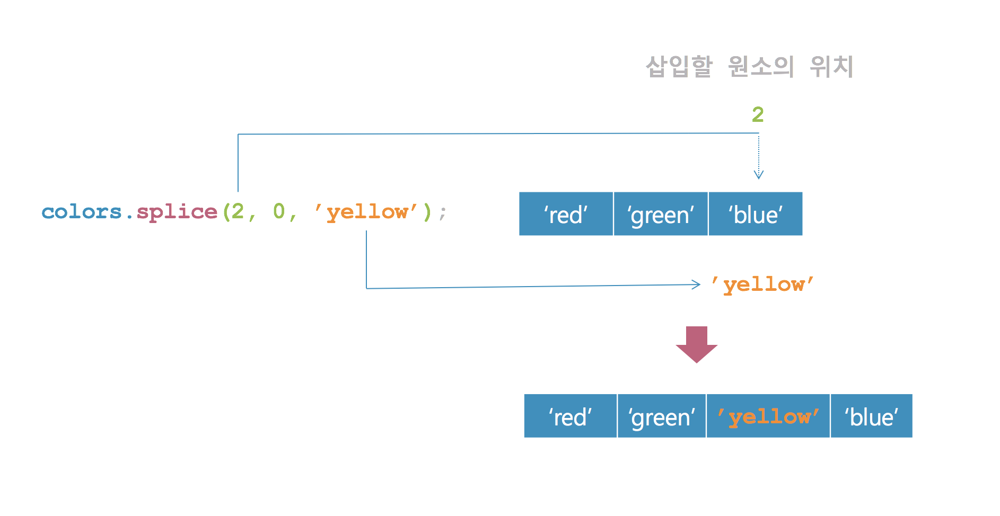

## Git


### 1. Fork

다른 사람의 원격 저장소를 내 계정으로 복사하는 방법으로 포크(Fork)란 것이 있다.만약, 포크를 하지 않으면 내 것이 아닌 저장소, 즉 쓰기 권한이 없는 원격 저장소를 사용하는 것으로 자유롭게 파일을 생성하거나 수정하여 원격 저장소에 반영하는 것이 불가능하다. 따라서 다른 사람의 계정에서 내 계정으로 원격 저장소를 복사해 사용하는 데 그것을 Github 에서 포크라고 부른다고 생각하면 편한다. 일단 포크한 프로젝트는 내 마음대로 수정할 수 있다.


### 2. Pull-Request
원본 프로젝트에 수정한 내역을 가져(pull)가라고 요청(request)하는 것을 [Pull Request](#) 라고 한다. 원본 프로젝트 관리자는 우리가 보낸 Pull Request 확인해 보고 충돌 등의 문제가 없으면 원본 프로젝트에 병합할 수 도 있고 때에 따라서는 거절할 수 도 있다.


## 자바스크립트


### 1. for loop / for in
* [javascript](#)
```html
<!DOCTYPE html>
<html>
<head>
    <script type="text/javascript">
    var colors = ['orange', 'yellow', 'blue', 'green', 'red'];
    colors[10] = 'black';
    colors[20] = 'white';

    // orange
    // yellow
    // blue
    // green
    // red
    // undefined
    // undefined
    // undefined
    // undefined
    // undefined
    // black
    // undefined
    // undefined
    // undefined
    // undefined
    // undefined
    // undefined
    // undefined
    // undefined
    // undefined
    // white
    for (var i = 0; i < colors.length; ++i) {
      console.log(colors[i]);
    }


    // orange
    // yellow
    // blue
    // green
    // red
    // black
    // white
    for (var i in colors) {
      console.log(colors[i]);
    }
    </script>
</head>
<body>
</body>
</html>
```

### 배열의 변경 메서드
자바스크립트는 배열에서 사용 가능한 다양한 표준 메서드를 제공한다. 배열 메서드는 length 속성을 기반으로 작동한다.

메서드 | 설명
---|---
pop() | 배열에서 마지막 요소를 뽑아내고, 그 요소를 반환한다.
push() | 배열의 끝에 하나 이상의 요소를 추가하고, 변경된 배열의 길이를 반환한다.
unshift() | 배열의 앞에 하나 이상의 요소를 추가하고, 새로운 길이를 반환한다.
shift() | 배열에서 첫 번째 요소를 삭제하고, 그 요소를 반환한다.
reverse() | 배열의 요소 순서를 뒤바꾼다. 첫 번째 요소가 마지막이 되고, 마지막 요소가 첫번째가 된다.
sort() | 배열의 요소를 정렬한다. 정렬된 배열을 반환한다.
splice() | 배열에 요소를 추가/삭제 한다.


* [javascript](#)
```html
<!DOCTYPE html>
<html>
<head>
    <script type="text/javascript">
      var a = [1, 2, 3];
      var b = a.unshift(0);
      console.log(a); //[0, 1, 2, 3]
      console.log(b); // 4

      var a = [1, 2, 3];
      var b = a.shift();
      console.log(a); // [2, 3]
      console.log(b); // 1

      var a = [1, 2, 3];
      var b = a.pop();
      console.log(a); // [1, 2]
      console.log(b); // 3

      var a = [1, 2, 3];
      var b = a.push(4);
      console.log(a); // [1, 2, 3, 4]
      console.log(b); // 4
    </script>
</head>
<body>
</body>
</html>
```


* [javascript](#)
```html
<!DOCTYPE html>
<html>
<head>
    <script type="text/javascript">
      // 익명의 비교 함수(Compare Function)를 인자로 넘겨 소트 함수 호출(오름차순)
      // 비교 함수는 비교 결과에 따라 음수, 0, 양수를 리턴해야 함.
      var a = [5, 4, 3, 2, 1];
      console.log(a); //[5, 4, 3, 2, 1]
      a.sort(function(a, b) {
        return a - b;
      });
      console.log(a); //[1, 2, 3, 4, 5]

      // 익명의 비교 함수(Compare Function)를 인자로 넘겨 소트 함수 호출(내림차순)
      // 비교 함수는 비교 결과에 따라 음수, 0, 양수를 리턴해야 함.
       var a = [1, 2, 3, 4, 5];
       console.log(a); //[1, 2, 3, 4, 5]
       a.sort(function(a, b) {
         return b - a;
       });
       console.log(a); //[5, 4, 3, 2, 1]

    </script>
</head>
<body>
</body>
</html>
```


### 4. splice() 메서드

* [javascript](#)
```html
<!DOCTYPE html>
<html>
<head>
    <script type="text/javascript">
      var numbers = [1, 2, 3, 4, 5];

      console.log(numbers);
      numbers.splice(0, 3);
      console.log(numbers);
    </script>
</head>
<body>
</body>
</html>
```


* [javascript](#)
```html
<!DOCTYPE html>
<html>
<head>
    <script type="text/javascript">
      var colors = ['red','green', 'blue'];
      console.log(colors);
      colors.splice(2, 0, 'yellow');
      console.log(colors);
    </script>
</head>
<body>
</body>
</html>
```




* [javascript](#)
```html
<!DOCTYPE html>
<html>
<head>
    <script type="text/javascript">
      var languages = ['C', 'C++', 'Java', 'JavaScript'];
      console.log(languages); //  ["C", "C++", "Java", "JavaScript"]
      languages.splice(1, 1, 'Python');
      console.log(languages); // ["C", "Python", "Java", "JavaScript"]
      languages.splice(2, 1, 'C#', 'Swift', 'Go');
      console.log(languages); // ["C", "Python", "C#", "Swift", "Go", "JavaScript"]
    </script>
</head>
<body>
</body>
</html>
```


