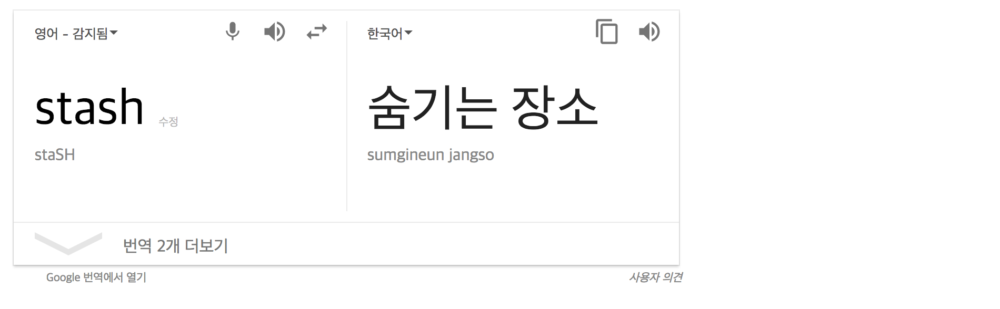
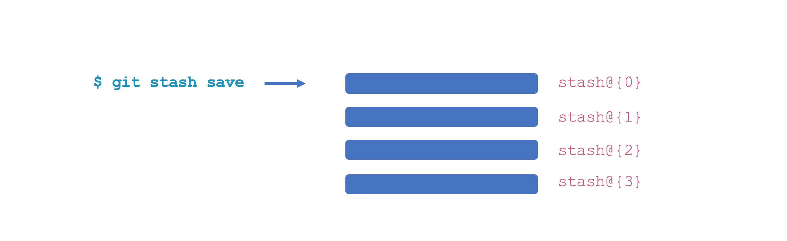
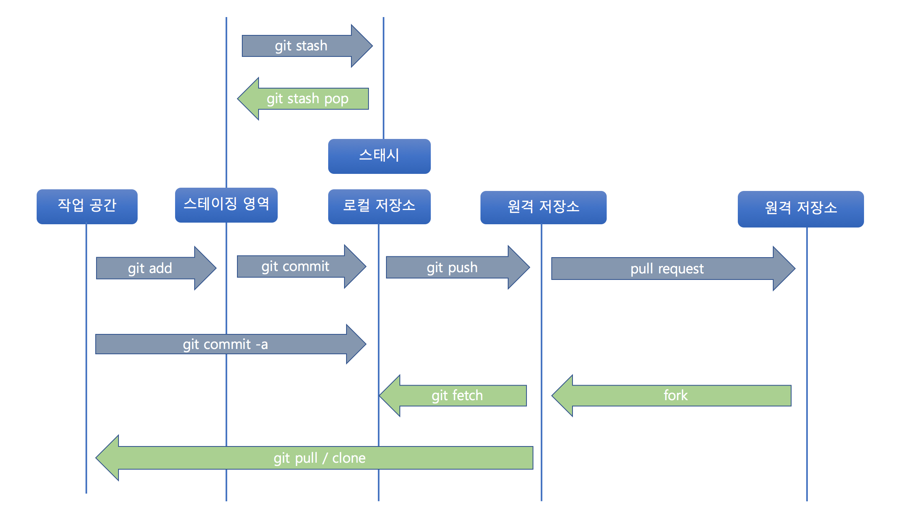

## Git

### Stash



어떤 프로젝트에서 한 부분을 담당하고 있다. 그리고 여기서 뭔가 작업하던 일이 있고 다른 요청이 들어와서 잠시 브래치를 변경해야 할 일이 생겼다고 가정하자. 이런 상황에서 아직 완료하지 않은 일을 커밋한다는 것이 껄끄럽다는 것이 문제다. 커밋하지 않고 나중에 다시 돌아와서 작업을 다시 하고 싶을 것이다. 이럴 때 사용할 수 있는 명령어가 바로 'git stash' 이다.

Stash 명령을 사용하면 워킹 디렉토리에서 수정한 파일들만 저장한다. 마치 끝내지 않은 수정 사항을 스택에 잠시 저장했다가 나중에 다시 적용할 수 있다.


명령 | 설명
---|---
git stash | 현재 작업을 저장함
git stash save <message> |  git stash 와 동일하지만 메시지와 함께 현재 작업을 저장함
git stash list | stash 목록을 보여줌
git stash pop | 저장된 stash을 복원함 - 스택에서 삭제함
git stash apply  | 저장된 stash을 복원함 - 스택에서 삭제하지 않음
git stash drop stash{n} | 저장된 stash 을 삭제함
git stash clear | 전체 stash 을 삭제함


#### 1. git stash
```bash
$ git stash
Saved working directory and index state WIP on fix: 8bf6a37 Merge remote-tracking branch 'origin/master'
HEAD is now at 8bf6a37 Merge remote-tracking branch 'origin/master'
```

#### 2. git stash save
```bash
$ git stash save "add a login.jsp file"
Saved working directory and index state On fix: add a login.jsp file
HEAD is now at 8bf6a37 Merge remote-tracking branch 'origin/master'
```



#### 3. git stash list
```bash
$ git stash list
stash@{0}: On fix: add a login.jsp file
stash@{1}: WIP on fix: 8bf6a37 Merge remote-tracking branch 'origin/master'
stash@{2}: WIP on fix: 8bf6a37 Merge remote-tracking branch 'origin/master'
stash@{3}: WIP on fix: 8bf6a37 Merge remote-tracking branch 'origin/master'
```

#### 4. git stash list
```bash
$ git stash pop
On branch fix
Changes to be committed:
  (use "git reset HEAD <file>..." to unstage)

	new file:   login.jsp

$ git stash list
stash@{0}: On fix: add a login.jsp file
stash@{1}: WIP on fix: 8bf6a37 Merge remote-tracking branch 'origin/master'
stash@{2}: WIP on fix: 8bf6a37 Merge remote-tracking branch 'origin/master'
stash@{3}: WIP on fix: 8bf6a37 Merge remote-tracking branch 'origin/master'
```

#### 5. git stash apply
```bash
$ git stash apply
On branch fix
Changes to be committed:
  (use "git reset HEAD <file>..." to unstage)

	new file:   login.jsp

Dropped refs/stash@{0} (a232bd0f13fc74611d4ade11e4371d9a50a04b5d)

$ git stash list
stash@{0}: WIP on fix: 8bf6a37 Merge remote-tracking branch 'origin/master'
stash@{1}: WIP on fix: 8bf6a37 Merge remote-tracking branch 'origin/master'
stash@{2}: WIP on fix: 8bf6a37 Merge remote-tracking branch 'origin/master'
```

#### 6. git stash drop
```bash
$ git stash drop stash{0}
Dropped stash@{0} (48b8982c17b8a80464550351f1afa54bb65de994)

$ git stash list
stash@{0}: WIP on fix: 8bf6a37 Merge remote-tracking branch 'origin/master'
stash@{1}: WIP on fix: 8bf6a37 Merge remote-tracking branch 'origin/master'

$ git stash drop stash{0}
Dropped stash@{0} (5943a0979a99822dd561861c821fb74728cbf94d)

$ git stash list
stash@{0}: WIP on fix: 8bf6a37 Merge remote-tracking branch 'origin/master'

$ git stash drop stash{0}
Dropped stash@{0} (c76141b1b79c086dad4d2f68d98686f2cb2f6a92)

$ git stash list

```


#### 7. git stash clear
```bash
$ git stash list
stash@{0}: WIP on fix: 8bf6a37 Merge remote-tracking branch 'origin/master'
stash@{1}: WIP on fix: 8bf6a37 Merge remote-tracking branch 'origin/master'

$ git stash clear

$ git stash list

```


## 실습 순서
번호 | 실습 내용
--- | ---
1 | [원격 저장소 클론](#)
2 | [브랜치 생성](#)
3 | [taskA 브랜치 이동](#)
4 | [프로그램 수정](#)
5 | [git stash](#)
6 | [taskB 브랜치 이동](#)
7 | [프로그램 수정](#)
8 | [커밋](#)
9 | [taskA 브랜치 이동](#)
10 | [git stash pop](#)
11 | [프로그램 수정](#)
12 | [stash  및 커밋](#)
13 | [taskB 브랜치 이동](#)
14 | [git stash apply](#)
15 | [프로그램 수정](#)
16 | [커밋](#)

### 1. 원격 저장소 클론
```bash
$ git clone https://github.com/ryubcinhatc/survey
$ git survey
```

### 2. 브랜치 생성
```bash
$ git branch taskA
$ git branch taskB
```

### 3. taskA 브랜치 이동
```bash
$ git checkout taskA
```


### 4. 프로그램 수정

```html
<!DOCTYPE html>
<html>
	<head>
		<script type="text/javascript">
			window.onload = function() {
				// 버튼 "당신의 이름은?" 을 눌렀을 때 호출되는 함수
				document.getElementById("question-01").onclick = function() {
					alert("유병창");
				};

				// 버튼 "당신의 성별은?" 을 눌렀을 때 호출되는 함수
				document.getElementById("question-02").onclick = function() {
					alert("아저씨");
				};

				// 버튼 "당신의 별명은?" 을 눌렀을 때 호출되는 함수
				document.getElementById("question-03").onclick = function() {
					alert("개미");
				};

			}
		</script>
	</head>
<body>
	<input type="button" id="question-01" value="당신의 이름은?"/>
	<input type="button" id="question-02" value="당신의 성별은?"/>
	<input type="button" id="question-03" value="당신의 별명은?"/>
</body>
</html>
```
- 기본적으로 3개의 질문 버튼이 있고 질문에 대한 답변을 자신의 것으로 변경할 것
- 5 ~ 10 분동안 추가적인 질문 100가지를 만들어 추가하시오.
- 100개의 질문을 완성할 때 까지 절대 커밋 하지 말것!!!!!!!!!!!!!!!!!!!!

```bash
$ git add --all
```

### 5. git stash
```bash
$ git stash
$ git stash list
```

stash 명령어 수행 뒤에 survey.html 파일의 내용이 아래처럼 원래 상태로 복원 됐는지 확인한다.

```html
<!DOCTYPE html>
<html>
	<head>
		<script type="text/javascript">
			window.onload = function() {
				// 버튼 "당신의 이름은?" 을 눌렀을 때 호출되는 함수
				document.getElementById("question-01").onclick = function() {
					alert("유병창");
				};

				// 버튼 "당신의 성별은?" 을 눌렀을 때 호출되는 함수
				document.getElementById("question-02").onclick = function() {
					alert("아저씨");
				};

				// 버튼 "당신의 별명은?" 을 눌렀을 때 호출되는 함수
				document.getElementById("question-03").onclick = function() {
					alert("개미");
				};

			}
		</script>
	</head>
<body>
	<input type="button" id="question-01" value="당신의 이름은?"/>
	<input type="button" id="question-02" value="당신의 성별은?"/>
	<input type="button" id="question-03" value="당신의 별명은?"/>
</body>
</html>
```

### 6. taskB 브랜치 이동
```bash
$ git checkout taskB
```

### 7. 프로그램 수정
버튼 클릭 이벤트에 함수를 연결하는 코드가 중복 코드처럼 보인다. 자바스크립트 수업 시간에 배운 고차 함수를 이용해서 코드를 좀더 간결하게 만들 수 있을 것 같다.
```html
<!DOCTYPE html>
<html>
	<head>
		<script type="text/javascript">

      //  아이디와 버튼 클릭 이벤트를 연결하는 함수
			function onclick(id, func) {
				document.getElementById(id).onclick = func;
			}

			window.onload = function() {
				// 버튼 "당신의 이름은?" 을 눌렀을 때 호출되는 함수
				onclick("question-01", function() {
					alert("유병창");
				});

				// 버튼 "당신의 성별은?" 을 눌렀을 때 호출되는 함수
				onclick("question-02", function() {
					alert("아저씨");
				});

				// 버튼 "당신의 별명은?" 을 눌렀을 때 호출되는 함수
				onclick("question-03", function() {
					alert("개미");
				});

			}
		</script>
	</head>
<body>
	<input type="button" id="question-01" value="당신의 이름은?"/>
	<input type="button" id="question-02" value="당신의 성별은?"/>
	<input type="button" id="question-03" value="당신의 별명은?"/>
</body>
</html>

```

### 8. 커밋
```bash
$ git add --all
$ git commit -m "taskB 작업 완료"
```

### 9. taskA 브랜치 이동
```bash
$ git checkout taskA
```

### 10. git stash pop
```bash
$ git stash list
$ git stash pop
```

학생 여러분들이  앞서 작업했던 내용이 복구 됐는지 확인한다.

### 11. 프로그램 수정

```html
<!DOCTYPE html>
<html>
	<head>
		<script type="text/javascript">
			window.onload = function() {
				// 버튼 "당신의 이름은?" 을 눌렀을 때 호출되는 함수
				document.getElementById("question-01").onclick = function() {
					alert("유병창");
				};

				// 버튼 "당신의 성별은?" 을 눌렀을 때 호출되는 함수
				document.getElementById("question-02").onclick = function() {
					alert("아저씨");
				};

				// 버튼 "당신의 별명은?" 을 눌렀을 때 호출되는 함수
				document.getElementById("question-03").onclick = function() {
					alert("개미");
				};
			}
		</script>
	</head>
<body>
	<input type="button" id="question-01" value="당신의 이름은?"/>
	<input type="button" id="question-02" value="당신의 성별은?"/>
	<input type="button" id="question-03" value="당신의 별명은?"/>
</body>
</html>
```

### 12. stash 및 커밋
```bash
$ git add --all
$ git stash
$ git commit -m "taskA 작업 완료"
```

### 13. taskB 브랜치 이동
```bash
$ git checkout taskB
```


### 14. git stash apply
```bash
$ git stash apply
```

### 15. 프로그램 수정
```html
<!DOCTYPE html>
<html>
	<head>
		<script type="text/javascript">

      //  아이디와 버튼 클릭 이벤트를 연결하는 함수
			function onclick(id, func) {
				document.getElementById(id).onclick = func;
			}

			window.onload = function() {
				// 버튼 "당신의 이름은?" 을 눌렀을 때 호출되는 함수
				onclick("question-01", function() {
					alert("유병창");
				});

				// 버튼 "당신의 성별은?" 을 눌렀을 때 호출되는 함수
				onclick("question-02", function() {
					alert("아저씨");
				});

				// 버튼 "당신의 별명은?" 을 눌렀을 때 호출되는 함수
				onclick("question-03", function() {
					alert("개미");
				});

			}
		</script>
	</head>
<body>
	<input type="button" id="question-01" value="당신의 이름은?"/>
	<input type="button" id="question-02" value="당신의 성별은?"/>
	<input type="button" id="question-03" value="당신의 별명은?"/>
</body>
</html>

```

### 16. 커밋
```bash
$ git add --all
$ git commit -m "taskB 작업 완료"
```


## 요약
 
