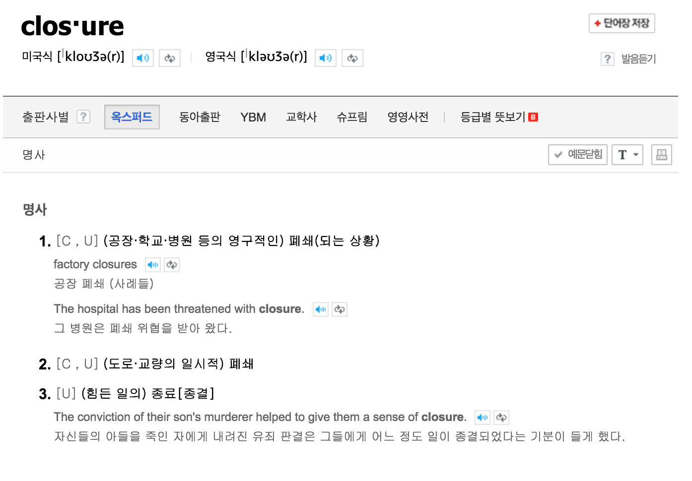
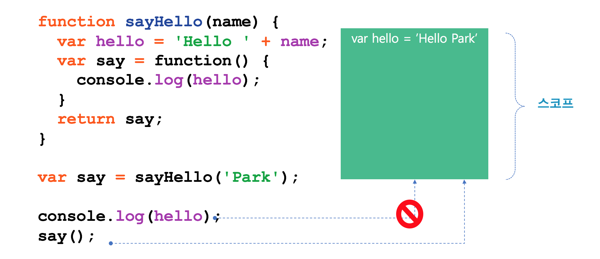
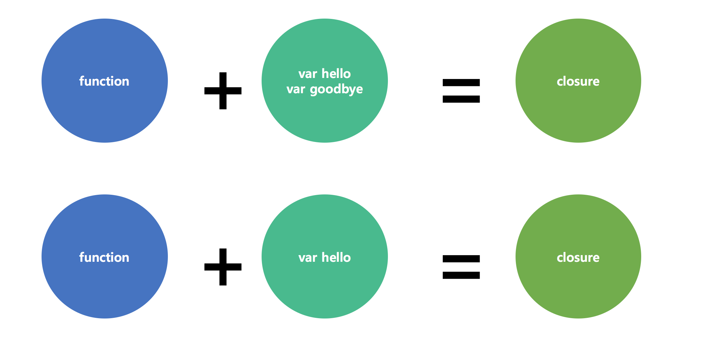
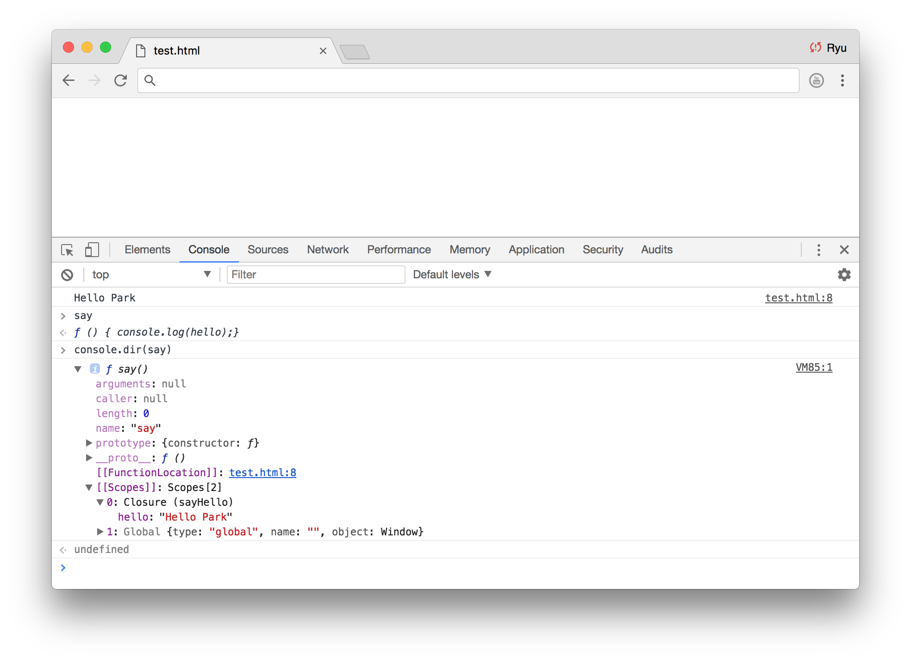
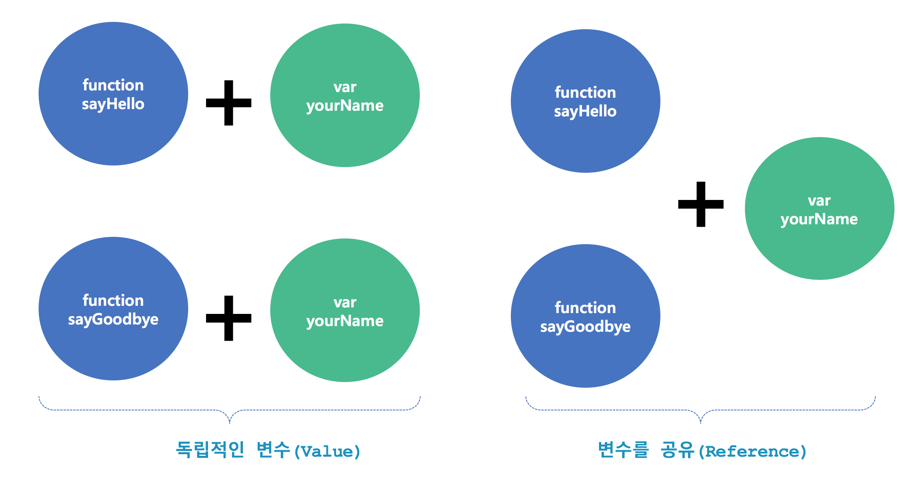
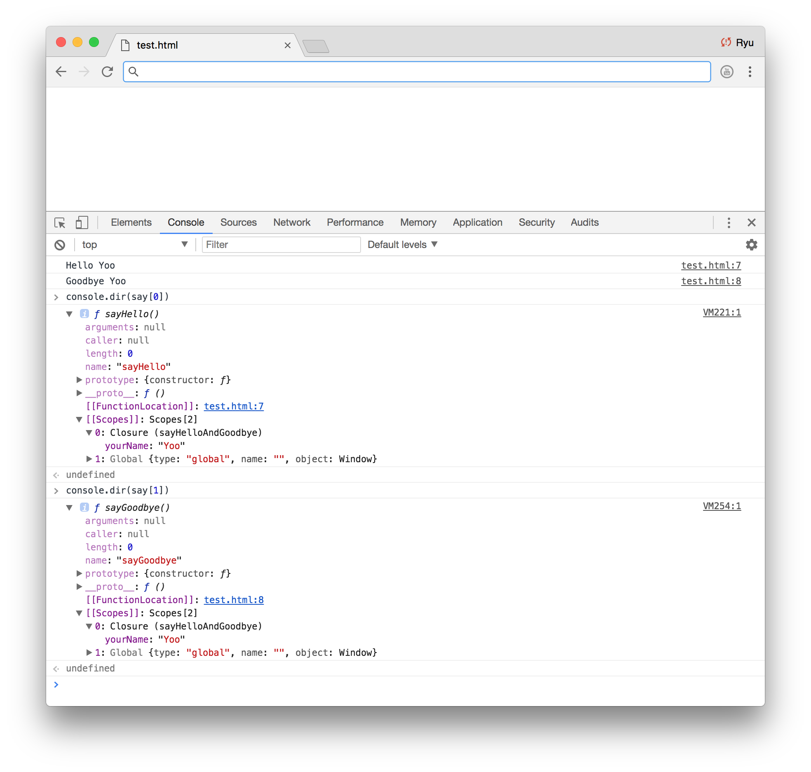
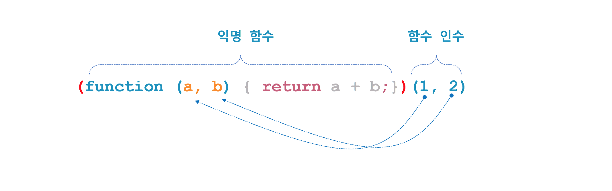

# 자바스크립트(JavaScript)

## 클로져(Closure)



자바스크립트에서 클로저(Closure)라는 매우 중요한 개념이 있다. 지난 수업 때 자바 스크립트에서 함수는 일급 객체란 걸 배웠고 그 특성 중에 함수를 인자로 받거나 리턴 값으로 사용할 수 있다는 점 또한 배웠다. 자바스크립트를 포함한 프로그래밍 언어에서 이러한 고차 함수(High order function)를 지원하기 위해 필요한 개념 중에 하나가 바로 클로저(Closure)란 개념이다. 클로저를 가장 쉽게 이해할 수 있는 방법은 코드 뿐, 코드를 살펴 보도록 하자.


### 1. 기본 개념

#### 1. 함수 안에서 내부 함수(inner function) 호출
[javascript](#)
```html
<!DOCTYPE html>
<html>
<head>
    <script type="text/javascript">
      function sayHello(name) {
        var hello = 'Hello ' + name;
        var say = function() { console.log(hello);}
        say();
      }
      sayHello('Kim'); // "Hello Kim"
    </script>
</head>
<body>
</body>
</html>
```

#### 2. 함수를 리턴하는 고차 함수(1)
[javascript](#)
```html
<!DOCTYPE html>
<html>
<head>
    <script type="text/javascript">
      function sayHello(name) {
        var hello = 'Hello ' + name;
        var say = function() { console.log(hello);}
        return say;
      }
      var say = sayHello('Park');
      say(); // "Hello Park"
    </script>
</head>
<body>
</body>
</html>
```

#### 3. 함수를 리턴하는 고차 함수(2)
[javascript](#)
```html
<!DOCTYPE html>
<html>
<head>
    <script type="text/javascript">
      function sayHello(name) {
        var hello = 'Hello ' + name;
        var say = function() { console.log(hello);}
        return say;
      }
      var say = sayHello('Park');
      console.log(text);
      var text = 'Goodbye';
      say(); // "Hello Park"
    </script>
</head>
<body>
</body>
</html>
```





- 함수 안에서 함수를 만들면 클로저가 생성된다.
- 함수만 리턴 하는 것이 아니라 함수가 실행될 수 있는 환경까지 함께 리턴된다.


### 2. 클로저가 포함하는 변수의 범위

[javascript](#)
```html
<!DOCTYPE html>
<html>
<head>
    <script type="text/javascript">
      function sayHello(name) {
        var hello = 'Hello ' + name;
        var goodbye = 'Goodbye ' + name;
        var say = function() { console.log(hello);}
        return say;
      }
      var say = sayHello('Park');
      say(); // "Hello Park"
    </script>
</head>
<body>
</body>
</html>
```
클로저가 함수가 실행할 수 있는 환경까지 함께 리턴한다는 것이 스코프 내 모든 변수를 유지하는 것인지 아니면 클로저 함수 내부에서 사용하는 변수만을 유지하는지 생각해보자.



이 질문에 대한 답을 얻기 위해 크롬 개발자 도구 console 창에서 아래처럼 입력해보자ㅣ

```javascript

console.dir(say);

```




### 3. 클로저의 변수 관리

[javascript](#)
```html
<!DOCTYPE html>
<html>
<head>
    <script type="text/javascript">
      function sayHelloAndGoodbye(name) {
        var yourName = name;
        var sayHello = function() { console.log('Hello ' + yourName);}
        var sayGoodbye = function() { console.log('Goodbye ' + yourName);}
        return [sayHello, sayGoodbye];
      }
      var say = sayHelloAndGoodbye('Yoo');
      say[0](); // "Hello Yoo"
      say[1](); // "Goodbye Yoo"
    </script>
</head>
<body>
</body>
</html>
```

한 번에 여러 함수를 리턴하는 경우를 생각해보자. 각각의 함수가 동일한 변수를 참조할 때 클로저는 변수를 어떻게 관리할지 생각해보자.




크롬 개발자 도구 console 창에서 아래처럼 입력하여 각각의 함수에 대한 클로저를 확인해보자.

```javascript

console.dir(say[0]);
console.dir(say[1]);

```



디버그로는 변수가 참조된 것인지 값인지 확인할 방법이 없다. 클로저 변수의 값을 변경하는 함수를 더 만들어 확인해보자.

[javascript](#)
```html
<!DOCTYPE html>
<html>
<head>
    <script type="text/javascript">
      function sayHelloAndGoodbye(name) {
        var yourName = name;
        var sayHello = function() { console.log('Hello ' + yourName); }
        var sayGoodbye = function() { console.log('Goodbye ' + yourName); }
        var setName = function(name) { yourName = name; }
        return [sayHello, sayGoodbye, setName];
      }
      var say = sayHelloAndGoodbye('Yoo');
      say[0](); // "Hello Yoo"
      say[1](); // "Goodbye Yoo"
      say[2]('Lee');
      say[0](); // "Hello ???"
      say[1](); // "Goodbye ???"

    </script>
</head>
<body>
</body>
</html>
```


### 3. 클로저 응용 1

지금부터 1 ~ 10까지 숫자를 차례대로 찍는 자바스크립트를 작성해보자.

[javascript](#)
```html
<!DOCTYPE html>
<html>
<head>
    <script type="text/javascript">
      // 여기에 여러분들이 코드를 작성해보세요.
    </script>
</head>
<body>
</body>
</html>
```

[result](#)
```text
1
2
3
4
5
6
7
8
9
10
```

이정도 문제는 껌이고 대부분의 학생들이 어렵지 아래와 코드를 작성할 수 있다.

[javascript](#)
```html
<!DOCTYPE html>
<html>
<head>
    <script type="text/javascript">
      for (var i = 1; i <= 10; i++) {
        console.log(i);
      }
    </script>
</head>
<body>
</body>
</html>
```

지금부터 1 ~ 10까지 숫자를 차례대로 찍는 자바스크립트를 작성하는데 한 가지 조건이 붙는다. 각 숫자를 1초 단위로 순차적으로 찍는 것이다. 즉, 1을 찍은 1초 후에 2를 찍고, 2를 찍은 후 1초 뒤에 3을 찍는 식으로 10까지 찍어야 한다.(아래 코드 보지 마세요.ㅠ.ㅠ)

[javascript](#)
```html
<!DOCTYPE html>
<html>
<head>
    <script type="text/javascript">
      // 여기에 여러분들이 코드를 작성해보세요.
    </script>
</head>
<body>
</body>
</html>
```

#### 1. sleep 함수를 만들어 사용하는 방법

[javascript](#)

```html
<!DOCTYPE html>
<html>
<head>
    <script type="text/javascript">
        function sleep(duration) {
            var now = new Date();
            var stop = now.getTime() + duration;
            while(true) {
                now = new Date();
                if(now.getTime() > stop)
                    return;
            }
        }

        for (var i = 1; i <= 10; i++) {
            console.log(i);
            sleep(1000);
        }
    </script>
</head>
<body>
</body>
</html>
```

#### 2. setTimeout 함수를 사용하는 방법

[javascript](#)

setTimeout() 함수는 지정한 시간 후에 함수를 호출한다. 시간 단위는 1/1000 초로 1000이 1초, 2000 이며 2초를 의미한다.

```html
<!DOCTYPE html>
<html>
<head>
    <script type="text/javascript">
      function sayHello() {
        console.log('Hello');
      }

      setTimeout(sayHello, 1000); // "Hello"
    </script>
</head>
<body>
</body>
</html>
```

[javascript](#)
```html
<!DOCTYPE html>
<html>
<head>
    <script type="text/javascript">
      for (var i = 1; i <= 10; i++) {
        setTimeout(function() { console.log(i); }, 1000*i);
      }
    </script>
</head>
<body>
</body>
</html>
```

[result](#)
```text
11
11
11
11
11
11
11
11
11
11
```

함수 안에서 값을 복사해 넣으면 어떻게 될까?

[javascript](#)
```html
<!DOCTYPE html>
<html>
<head>
    <script type="text/javascript">
        for (var i = 1; i <= 10; i++) {
            setTimeout(function() {
                var index = i;
                console.log(index);
            }, 1000*i);
        }
    </script>
</head>
<body>
</body>
</html>
```

#### 3. 즉시 실행 함수를 사용한 해결 방법 - 1

함수 정의와 동시에 바로 실행하는 함수를 즉시실 행 함수((IIFE, Immediately-Invoked Function Expression))라고 한다. 익명 함수를 응용한 형태로 최초 한 번만 실행되고 다시 실행할 수 없는 특성이 있다.
이러한 특성으로 주로 코드를 초기화 할 때 사용된다. 여기에서는 클로저를 생성할 목적으로 사용한다.

```javascript
(function() {

	// 함수 구현 코드

})();
```




[javascript](#)
```html
<!DOCTYPE html>
<html>
<head>
    <script type="text/javascript">
        for (var i = 1; i <= 10; i++) {
            setTimeout((function() {
                var index = i;
                return function() {
                console.log(index);
            }})() , 1000*i);
        }
    </script>
</head>
<body>
</body>
</html>
```


#### 4. 즉시실행 함수를 사용한 해결 방법 - 2

[javascript](#)
```html
<!DOCTYPE html>
<html>
<head>
    <script type="text/javascript">
        for (var i = 1; i <= 10; i++) {
            setTimeout((function(index) {
                return function() {
                console.log(index);
            }})(i) , 1000*i);
        }
    </script>
</head>
<body>
</body>
</html>
```

### 4.  클로저 응용 - 데이터 은닉

#### 1. 전연 변수를 이용한 방법

[javascript](#)
```html
<!DOCTYPE html>
<html>
<head>
    <script type="text/javascript">
      var counter = 0;
      function unique_id() {
          counter += 1;
          return counter;
      }

      console.log(unique_id()); // 1
      console.log(unique_id()); // 2
      console.log(unique_id()); // 3
    </script>
</head>
<body>
</body>
</html>
```

위 코드의 문제점은  아래 코드처럼 외부에서 count 을 변경할 수 있다는 것이다.

#### 2. 전연 변수를 이용한 방법(변경 가능)

[javascript](#)
```html
<!DOCTYPE html>
<html>
<head>
    <script type="text/javascript">
      var counter = 0;
      function unique_id() {
          counter += 1;
          return counter;
      }

      console.log(unique_id()); // 1
      console.log(unique_id()); // 2
      console.log(unique_id()); // 3
      counter = 0;
      console.log(unique_id()); // 1
    </script>
</head>
<body>
</body>
</html>
```

-  아래 코드처럼 함수 안에 넣으면 어떻게 될까...

#### 3. 함수 속성을 이용한 방법

[javascript](#)
```html
<!DOCTYPE html>
<html>
<head>
    <script type="text/javascript">

        function unique_id() {
            if(!arguments.callee.counter) {
                arguments.callee.counter = 0;
            }
            arguments.callee.counter += 1;
            return arguments.callee.counter;
        }

        console.log(unique_id()); // 1
        console.log(unique_id()); // 2
        console.log(unique_id()); // 3
    </script>
</head>
<body>
</body>
</html>
```

#### 4. 함수 속성을 이용한 방법(변경 가능)

[javascript](#)
```html
<!DOCTYPE html>
<html>
<head>
    <script type="text/javascript">

        function unique_id() {
            if(!arguments.callee.counter) {
                arguments.callee.counter = 0;
            }
            arguments.callee.counter += 1;
            return arguments.callee.counter;
        }

        console.log(unique_id()); // 1
        console.log(unique_id()); // 2
        console.log(unique_id()); // 3
        unique_id.counter = 0;
        console.log(unique_id()); // 1
    </script>
</head>
<body>
</body>
</html>
```

#### 5. 클로저를 사용하는 방법(변경 불가)

[javascript](#)
```html
<!DOCTYPE html>
<html>
<head>
    <script type="text/javascript">

        var unique_id = (function () {
           var counter = 0;
           return function() {
               counter += 1;
               return counter;
           }
        })();

        console.log(unique_id()); // 1
        console.log(unique_id()); // 2
        console.log(unique_id()); // 3
    </script>
</head>
<body>
</body>
</html>
```
