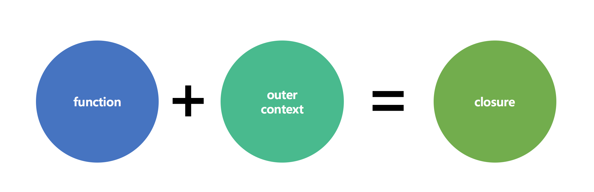

## Git


### 1. Stash


어떤 프로젝트에서 한 부분을 담당하고 있다. 그리고 여기서 뭔가 작업하던 일이 있고 다른 요청이 들어와서 잠시 브래치를 변경해야 할 일이 생겼다고 가정하자. 이런 상황에서 아직 완료하지 않은 일을 커밋한다는 것이 껄끄럽다는 것이 문제다. 커밋하지 않고 나중에 다시 돌아와서 작업을 다시 하고 싶을 것이다. 이럴 때 사용할 수 있는 명령어가 바로 'git stash' 이다.

Stash 명령을 사용하면 워킹 디렉토리에서 수정한 파일들만 저장한다. 마치 끝내지 않은 수정 사항을 스택에 잠시 저장했다가 나중에 다시 적용할 수 있다.


명령 | 설명
---|---
git stash | 현재 작업을 저장함
git stash save <message> |  git stash 와 동일하지만 메시지와 함께 현재 작업을 저장함
git stash list | stash 목록을 보여줌
git stash pop | 저장된 stash을 복원함 - 스택에서 삭제함
git stash apply  | 저장된 stash을 복원함 - 스택에서 삭제하지 않음
git stash drop stash{n} | 저장된 stash 을 삭제함
git stash clear | 전체 stash 을 삭제함


## 자바스크립트

### 1. 클로저(Closure)
바스크립트에서 클로저(Closure)라는 매우 중요한 개념이 있다. 지난 수업 때 자바 스크립트에서 함수는 일급 객체란 걸 배웠고 그 특성 중에 함수를 인자로 받거나 리턴 값으로 사용할 수 있다는 점 또한 배웠다. 자바스크립트를 포함한 프로그래밍 언어에서 이러한 고차 함수(High order function)를 지원하기 위해 필요한 개념 중에 하나가 바로 클로저(Closure)란 개념이다.


- 함수 안에서 함수를 만들면 클로저가 생성된다.
- 함수만 리턴 하는 것이 아니라 함수가 실행될 수 있는 환경까지 함께 리턴된다.




클로저가 함수가 실행할 수 있는 환경까지 함께 리턴한다는 것이 스코프 내 모든 변수를 유지하는 것인지 아니면 클로저 함수 내부에서 사용하는 변수만을 유지하는지 생각해보자.


한 번에 여러 함수를 리턴하는 경우를 생각해보자. 각각의 함수가 동일한 변수를 참조할 때 클로저는 변수를 어떻게 관리할지 생각해보자.


함수 정의와 동시에 바로 실행하는 함수를 즉시실 행 함수((IIFE, Immediately-Invoked Function Expression))라고 한다. 익명 함수를 응용한 형태로 최초 한 번만 실행되고 다시 실행할 수 없는 특성이 있다.
이러한 특성으로 주로 코드를 초기화 할 때 사용된다. 여기에서는 클로저를 생성할 목적으로 사용한다.

```javascript
(function() {

	// 함수 구현 코드

})();
```


[javascript](#)
```html
<!DOCTYPE html>
<html>
<head>
    <script type="text/javascript">
        for (var i = 1; i <= 10; i++) {
            setTimeout((function() {
                var index = i;
                return function() {
                console.log(index);
            }})() , 1000*i);
        }
    </script>
</head>
<body>
</body>
</html>
```
