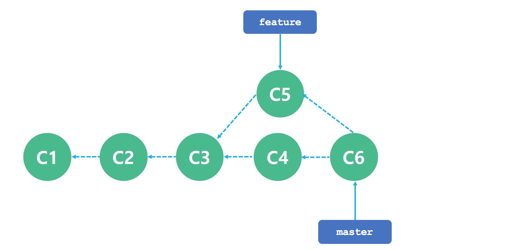
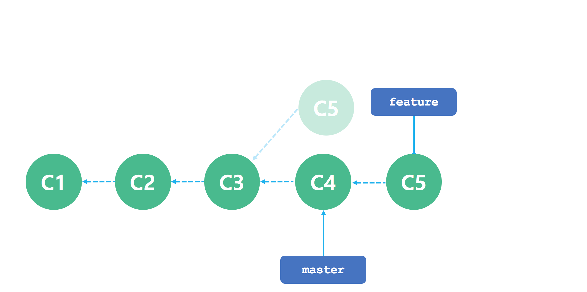
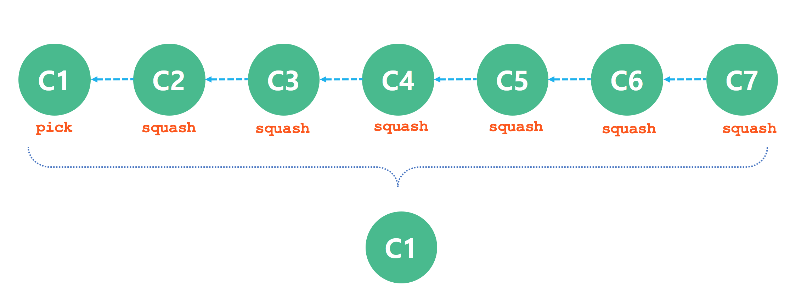
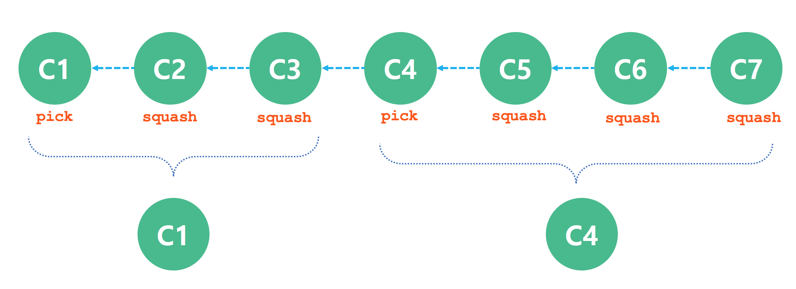

## Git

Git에서 브랜치를 합치는 명령으로 merge 이외에 rebase  명령이 있다. rebase 명령을 활용해서 브랜치를 어떻게 합칠 수 있는지 실습을 통해 알아본다.

명령 | 설명
---|---
git rebase <브랜치 이름> | 현재 브랜치의 베이스 브랜치를 변경한다.


예를 들어 커밋 히스토리가 master 브랜치와 feature 브랜치로 분리되었을 때 두 브랜치를 합치는 가장 쉬운 방법은 merge 명령을 사용하는 것이다. 두 브랜치의 마지막 커밋 두 개(C4, C5)와 공통 조상 커밋(C3)을 사용하는 3-way Merge로 새로운 커밋(C6)을 만든다.



```bash
$ git checkout feature
$ git rebase master
```

git rebase 명령을 실행하면 실제 일어나는 일을 설명하자면 일단 두 브랜치가 나뉘기 전 공통 커밋으로 이동하고 나서 그 커밋부터 지금 Checkout 한 브랜치(feature)가 가리키는 커밋까지 diff를 차례로 만들어 어딘가에 임시로 저장해 놓는다. feature 브랜치가 master 브랜치가 가리키는 커밋을 가리키게 하고 아까 저장해 놓았던 변경사항을 차례대로 적용한다.



```bash
$ git checkout master
$ git merge feature
```


merge 이든 rebase 든 둘 다 합치는 관점에서는 서로 다를 게 없다. 하지만, rebase가 좀 더 깨끗한 히스토리를 만든다. rebase 한 브랜치의 log를 살펴보면 히스토리가 선형이다. 일을 병렬로 동시에 진행해도 rebase 하고 나면 모든 작업이 차례대로 수행된 것처럼 보인다.


## Git 정보 변경
```bash
$ git config --global user.name "ryubcinhatc"
$ git config --global user.email "ryubc.inhatc@gmail.com"
```

```bash
$ git config --list
```

## 실습(1) 순서

번호 | 실습 내용
--- | ---
1 | [로컬 저장소 생성](#)
2 | [array.html 파일 작성](#)
3 | [커밋](#)
4 | [feature 브랜치 생성](#)
5 | [프로그램 수정](#)
6 | [커밋](#)
7 | [feature 브랜치 이동](#)
8 | [프로그램 수정](#)
9 | [커밋](#)
10 | [git rebase master](#)
11 | [master 브랜치 이동](#)
12 | [병합 후 로그 확인](#)
13 | [merge 명령과 비교](#)

### 1. 로컬 저장소 생성
```bash
$ git init
```

### 2. array.html 파일 작성
```html
<!DOCTYPE html>
<html>
    <head>
		<meta charset="UTF-8">
        <script type="text/javascript">

            var colors = [];

            window.onload = function() {
                // shift 버튼을 눌렀을 때 호출되는 함수
                document.getElementById("array-shift").onclick = function() {
                   // master 브랜치에서 작업
                };

                // unshift 버튼을 눌렀을 때 호출되는 함수
                document.getElementById("array-unshift").onclick = function() {
                   // master 브랜치에서 작업
                };

                // push 버튼을 눌렀을 때 호출되는 함수
                document.getElementById("array-push").onclick = function() {
                   // feature 브랜치에서 작업
                };

                // pop 버튼을 눌렀을 때 호출되는 함수
                document.getElementById("array-pop").onclick = function() {
                   // feature 브랜치에서 작업                    
                };
            }
        </script>
    </head>
<body>
    <input type="text" id="color" value="pink">
    <input type="button" id="array-shift" value="shift"/>
    <input type="button" id="array-unshift" value="unshift"/>
    <input type="button" id="array-push" value="push"/>
    <input type="button" id="array-pop" value="pop"/>
</body>
</html>
```

### 3. 커밋
```bash
$ git add --all
$ git commit -m "array.html 파일 추가"
```

### 4. feature 브랜치 생성
```bash
$ git branch feature
```

### 5. 프로그램 수정
```html
<!DOCTYPE html>
<html>
    <head>
		<meta charset="UTF-8">
        <script type="text/javascript">

            var colors = [];

            window.onload = function() {
                // shift 버튼을 눌렀을 때 호출되는 함수
                document.getElementById("array-shift").onclick = function() {
                  colors.shift();
                  alert(colors);
                };

                // unshift 버튼을 눌렀을 때 호출되는 함수
                document.getElementById("array-unshift").onclick = function() {
                  var color = document.getElementById("color").value;
                  colors.unshift(color);
                  alert(colors);
                };

                // push 버튼을 눌렀을 때 호출되는 함수
                document.getElementById("array-push").onclick = function() {
                   // feature 브랜치에서 작업
                };

                // pop 버튼을 눌렀을 때 호출되는 함수
                document.getElementById("array-pop").onclick = function() {
                   // feature 브랜치에서 작업                    
                };
            }
        </script>
    </head>
<body>
    <input type="text" id="color" value="pink">
    <input type="button" id="array-shift" value="shift"/>
    <input type="button" id="array-unshift" value="unshift"/>
    <input type="button" id="array-push" value="push"/>
    <input type="button" id="array-pop" value="pop"/>
</body>
</html>
```

### 6. 커밋
```bash
$ git add --all
$ git commit -m "shift/unshift 함수 구현 완료"
```

### 7. feature 브랜치 이동
```bash
$ git checkout feature
```

### 8. 프로그램 수정
```html
<!DOCTYPE html>
<html>
    <head>
		<meta charset="UTF-8">
        <script type="text/javascript">

            var colors = [];

            window.onload = function() {
                // shift 버튼을 눌렀을 때 호출되는 함수
                document.getElementById("array-shift").onclick = function() {
                   // master 브랜치에서 작업
                };

                // unshift 버튼을 눌렀을 때 호출되는 함수
                document.getElementById("array-unshift").onclick = function() {
                   // master 브랜치에서 작업
                };

                // push 버튼을 눌렀을 때 호출되는 함수
                document.getElementById("array-push").onclick = function() {
                  var color = document.getElementById("color").value;
                  colors.push(color);
                  alert(colors);
                };

                // pop 버튼을 눌렀을 때 호출되는 함수
                document.getElementById("array-pop").onclick = function() {
                  colors.pop();
                  alert(colors);                   
                };
            }
        </script>
    </head>
<body>
    <input type="text" id="color" value="pink">
    <input type="button" id="array-shift" value="shift"/>
    <input type="button" id="array-unshift" value="unshift"/>
    <input type="button" id="array-push" value="push"/>
    <input type="button" id="array-pop" value="pop"/>
</body>
</html>
```

### 9. 커밋
```bash
$ git add --all
$ git commit -m "push/pop 함수 구현 완료"
```

### 10. git rebase master
```bash
$ git rebase master

First, rewinding head to replay your work on top of it...
Applying: push/pop 함수 구현 완료

```
rebase 명령 실행한 뒤 array.html 파일을 에디터에서 열어보자. master 브랜치에서 작업한 내용과 합쳐져 있어야 한다.


### 11. master 브랜치 이동
```bash
$ git checkout master
```

### 12. 병합 후 로그 확인
```bash
$ git merge feature
$ git log

commit 392b402e75b3a67d848a95717de267bd51ccd55f
Author: ryubcinhatc <ryubc.inhatc@gmail.com>
Date:   Thu Nov 30 23:12:42 2017 +0900

    push/pop 함수 구현 완료

commit 3eb9b10c9bc1b74428caf1a63a5a548976fb07b0
Author: ryubcinhatc <ryubc.inhatc@gmail.com>
Date:   Thu Nov 30 23:11:55 2017 +0900

    shift/unshift 함수 구현 완료

commit f416f401db059c914e86b1b33bf8463eb9ca4a87
Author: ryubcinhatc <ryubc.inhatc@gmail.com>
Date:   Thu Nov 30 23:10:45 2017 +0900

    array.html 파일 추가


$ git log --graph
* commit 392b402e75b3a67d848a95717de267bd51ccd55f
| Author: ryubcinhatc <ryubc.inhatc@gmail.com>
| Date:   Thu Nov 30 23:12:42 2017 +0900
|
|     push/pop 함수 구현 완료
|
* commit 3eb9b10c9bc1b74428caf1a63a5a548976fb07b0
| Author: ryubcinhatc <ryubc.inhatc@gmail.com>
| Date:   Thu Nov 30 23:11:55 2017 +0900
|
|     shift/unshift 함수 구현 완료
|
* commit f416f401db059c914e86b1b33bf8463eb9ca4a87
  Author: ryubcinhatc <ryubc.inhatc@gmail.com>
  Date:   Thu Nov 30 23:10:45 2017 +0900

      array.html 파일 추가

```

### 13. merge 명령과 비교

```bash
$ git checkout master
$ git reflog

df8160b HEAD@{0}: merge feature: Fast-forward
a83cdea HEAD@{1}: checkout: moving from feature to master
df8160b HEAD@{2}: rebase finished: returning to refs/heads/feature
df8160b HEAD@{3}: rebase: push/pop 함수 구현 완료
a83cdea HEAD@{4}: rebase: checkout master
77d351f HEAD@{5}: commit: push/pop 함수 구현 완료
c28c0ce HEAD@{6}: checkout: moving from master to feature
a83cdea HEAD@{7}: commit: shift/unshift 함수 구현 완료
c28c0ce HEAD@{8}: commit (initial): array.html 파일 추가
```

```bash
$ git reset --hard HEAD@{7}

HEAD is now at a83cdea shift/unshift 함수 구현 완료

```

```bash
$ get checkout feature
$ git reflog

df8160b HEAD@{0}: checkout: moving from master to feature
a83cdea HEAD@{1}: reset: moving to HEAD@{7}
df8160b HEAD@{2}: merge feature: Fast-forward
a83cdea HEAD@{3}: checkout: moving from feature to master
df8160b HEAD@{4}: rebase finished: returning to refs/heads/feature
df8160b HEAD@{5}: rebase: push/pop 함수 구현 완료
a83cdea HEAD@{6}: rebase: checkout master
77d351f HEAD@{7}: commit: push/pop 함수 구현 완료
c28c0ce HEAD@{8}: checkout: moving from master to feature
a83cdea HEAD@{9}: commit: shift/unshift 함수 구현 완료
c28c0ce HEAD@{10}: commit (initial): array.html 파일 추가

```

```bash
$ git reset --hard HEAD@{7}
HEAD is now at 77d351f push/pop 함수 구현 완료

```

```bash
$ git checkout master
$ git merge feature

```


```bash
$ git log

commit c1ffac3f1f7e61f03e1956ca88937caac1894d26
Merge: a83cdea 77d351f
Author: ryubcinhatc <ryubc.inhatc@gmail.com>
Date:   Fri Dec 1 00:00:31 2017 +0900

    Merge branch 'feature'

commit 77d351fded385a54f619e5ed767af44400bab2f3
Author: ryubcinhatc <ryubc.inhatc@gmail.com>
Date:   Thu Nov 30 23:51:47 2017 +0900

    push/pop 함수 구현 완료

commit a83cdead6b329da7953c2ce1da23a9c5dfedbe01
Author: ryubcinhatc <ryubc.inhatc@gmail.com>
Date:   Thu Nov 30 23:50:58 2017 +0900

    shift/unshift 함수 구현 완료

commit c28c0ce7ced078975396629ea63878d20b2ef63f
Author: ryubcinhatc <ryubc.inhatc@gmail.com>
Date:   Thu Nov 30 23:50:03 2017 +0900

    array.html 파일 추가

```

```bash
$ git log --graph

*   commit c1ffac3f1f7e61f03e1956ca88937caac1894d26
|\  Merge: a83cdea 77d351f
| | Author: ryubcinhatc <ryubc.inhatc@gmail.com>
| | Date:   Fri Dec 1 00:00:31 2017 +0900
| |
| |     Merge branch 'feature'
| |
| * commit 77d351fded385a54f619e5ed767af44400bab2f3
| | Author: ryubcinhatc <ryubc.inhatc@gmail.com>
| | Date:   Thu Nov 30 23:51:47 2017 +0900
| |
| |     push/pop 함수 구현 완료
| |
* | commit a83cdead6b329da7953c2ce1da23a9c5dfedbe01
|/  Author: ryubcinhatc <ryubc.inhatc@gmail.com>
|   Date:   Thu Nov 30 23:50:58 2017 +0900
|
|       shift/unshift 함수 구현 완료
|
* commit c28c0ce7ced078975396629ea63878d20b2ef63f
  Author: ryubcinhatc <ryubc.inhatc@gmail.com>
  Date:   Thu Nov 30 23:50:03 2017 +0900

      array.html 파일 추가

```

## commit 히스토리 합치기

rebase 명령의 또 다른 활용법을 알아보는 차원에서 어느 프로젝트의 GIT 로그를 함께 감상해보자.

```bash
$ git log

commit 3be1f9557738327b4b0b92c71e71e4c5723e1572
Author: ryubcinhatc <ryubc.inhatc@gmail.com>
Date:   Sat Nov 25 20:19:54 2017 +0900

    왜 코드가 지 맘대로 돌아갈까요. 알아서 수정했습니다. 팀장님 내일 사표내겠습니다.ㅠ.ㅠ

commit be1c367d36c424fa53f9aa9ce1ab8855a1709d84
Author: ryubcinhatc <ryubc.inhatc@gmail.com>
Date:   Sat Nov 25 20:19:48 2017 +0900

    절 죽여주세요. 또 다시 이상한 코드가 발견되어 삭제함

commit 935cb73fdd5822a7f57ba2812584dfdc0e203fb3
Author: ryubcinhatc <ryubc.inhatc@gmail.com>
Date:   Sat Nov 25 20:19:47 2017 +0900

    아 미치겠네 또 누락된 파일 추가함

commit 4b641fe8b4bff4a89a014f819ea807055f26da9d
Author: ryubcinhatc <ryubc.inhatc@gmail.com>
Date:   Sat Nov 25 20:19:47 2017 +0900

    비몽사몽간에 만든 디버그 코드가 포함되어 삭제함

commit bbe262d0d53e9ba26e420b178721de343741c6d1
Author: ryubcinhatc <ryubc.inhatc@gmail.com>
Date:   Sat Nov 25 20:19:46 2017 +0900

    깜박하고 누락한 중요 코드 추가함

commit 43e3bc49f9a30443a4c4c6bb3b2208e8087e3103
Author: ryubcinhatc <ryubc.inhatc@gmail.com>
Date:   Sat Nov 25 20:19:46 2017 +0900

    깜박하고 누락한 파일 추가함

commit fc356c60979d5bfd283712cf2baf0968c9e24f19
Author: ryubcinhatc <ryubc.inhatc@gmail.com>
Date:   Sat Nov 25 20:19:45 2017 +0900

    작업 완료

commit e04ccc289c37bf434617bdb650fb50b7d652fdfd
Author: ryubcinhatc <ryubc.inhatc@gmail.com>
Date:   Sat Nov 25 20:19:45 2017 +0900

    최초 커밋
```

```bash
$ git add --all
$ git commit -m "작업 완료"
$ git add --all
$ git commit -m "깜박하고 누락한 파일 추가함"
$ git add --all
$ git commit -m "깜박하고 누락한 중요 코드 추가함"
$ git add --all
$ git commit -m "비몽사몽간에 만든 디버그 코드가 포함되어 삭제함"
$ git add --all
$ git commit -m "아 미치겠네 또 누락된 파일 추가함"
$ git add --all
$ git commit -m "절 죽여주세요. 또 다시 이상한 코드가 발견되어 삭제함"
$ git add --all
$ git commit -m "왜 코드가 지 맘대로 돌아갈까요. 알아서 수정했습니다. 팀장님 내일 사표내겠습니다.ㅠ.ㅠ"
```

커밋 로그가 재미있으면서 안타깝지만 함께 일하는 사람 입장에서 생각해보면 엉망이 된 커밋 로그 때문에 짜증 날 수도 있다. 커밋을 하기 전에 놓친 부분은 없는지 꼼꼼히 살폈더라면 지금처럼 불필요한 커밋을 할 필요가 없었을 것이다. 커밋에서 빠진 부분을 매번 새로운 커밋으로 수정할 수 밖에 없을까?

## 1. git commit --amend


운이 좋게 커밋을 하자마자 바로 잘못된 점을 찾았다면 걱정할 필요가 없다. git commit --amend 명령으로 커밋을 변경할 수 있기 때문이다. git commit --amend 명령은 새로운 커밋을 만들지 않고 마지막 커밋을 수정한다. 커밋 하기전 빠진 부분은 없는지 확인을 하더라도 놓치는 부분은 나오기 마련이다. 이럴 때 git commit --amend 명령은 놓친 부분을 채울 수 있게 해준다.


```bash
$ git add .
$ git commit -m "작업 완료"
$ git add .
$ git commit --amend -m "작업 완료"
$ git add .
$ git commit --amend -m "작업 완료"
$ git add .
$ git commit --amend -m "작업 완료"
$ git add .
$ git commit --amend -m "작업 완료"
$ git add .
$ git commit --amend -m "작업 완료"
$ git add .
$ git commit --amend -m "작업 완료"
```

```bash
$ git log

commit 38a58acc6fa7d43f6b0f64cf87a8aa76774dce6d
Author: ryubcinhatc <ryubc.inhatc@gmail.com>
Date:   Sat Nov 25 20:19:45 2017 +0900

    작업 완료

commit e04ccc289c37bf434617bdb650fb50b7d652fdfd
Author: ryubcinhatc <ryubc.inhatc@gmail.com>
Date:   Sat Nov 25 20:19:45 2017 +0900

    최초 커밋
```

git commit --amend 명령은 바로 이전 커밋만 수정이 가능하지 다른 과거 커밋은 수정할 수 없다. 그렇다면 이미 망가진 커밋 히스토리는 어쩔 수 없는 것일까?

## 2. git rebase -i
커밋 히스토리가 엉망이 되었다고 걱정할 필요는 없다. git rebase 명령으로 과거 커밋을 합치거나 분리할 수 있기 때문이다.


```bash
$ git log --oneline

3be1f95 왜 코드가 지 맘대로 돌아갈까요. 알아서 수정했습니다. 팀장님 내일 사표내겠습니다.ㅠ.ㅠ
be1c367 절 죽여주세요. 또 다시 이상한 코드가 발견되어 삭제함
935cb73 아 미치겠네 또 누락된 파일 추가함
4b641fe 비몽사몽간에 만든 디버그 코드가 포함되어 삭제함
bbe262d 깜박하고 누락한 중요 코드 추가함
43e3bc4 깜박하고 누락한 파일 추가함
fc356c6 작업 완료
e04ccc2 최초 커밋
```

```bash
$ git rebase -i HEAD~7

or

$ git rebase -interactive HEAD~7

```

[수정 전](#)
```bash
pick fc356c6 작업 완료
pick 43e3bc4 깜박하고 누락한 파일 추가함
pick bbe262d 깜박하고 누락한 중요 코드 추가함
pick 4b641fe 비몽사몽간에 만든 디버그 코드가 포함되어 삭제함
pick 935cb73 아 미치겠네 또 누락된 파일 추가함
pick be1c367 절 죽여주세요. 또 다시 이상한 코드가 발견되어 삭제함
pick 3be1f95 왜 코드가 지 맘대로 돌아갈까요. 알아서 수정했습니다. 팀장님 내일 사표내겠습니다.ㅠ.ㅠ

# Rebase e04ccc2..3be1f95 onto e04ccc2 (7 command(s))
#
# Commands:
# p, pick = use commit
# r, reword = use commit, but edit the commit message
# e, edit = use commit, but stop for amending
# s, squash = use commit, but meld into previous commit
# f, fixup = like "squash", but discard this commit's log message
# x, exec = run command (the rest of the line) using shell
#
# These lines can be re-ordered; they are executed from top to bottom.
#
# If you remove a line here THAT COMMIT WILL BE LOST.
#
# However, if you remove everything, the rebase will be aborted.
#
# Note that empty commits are commented out
```

6개의 명령어으로 과거 커밋을 변경할 수 있다.

 명령 | 약어 | 설명
--- | --- | ---
 pick | p | 커밋을 포함하기 위해 사용한다. pick 명령어 순서를 재배열하는 것으로 rebase 을 시작할 때 커밋의 순서를 변경할 수도 있다.
 reword | r | pick과 비슷한 명령으로 rebase을 진행을 일시 정지하고 커밋 메시지를 변경할 기회를 준다. 커밋 내용이 변경되지 않는다.
 edit | e | 커밋을 pick한 다음 rebase 진행을 잠시 정지한다. 커밋을 수정하는 동안 edit 에서 추가하거나 삭제할 수 있다. 또한 rebase를 재개하기 전에 더 많은 커밋을 만들 수도 있다.
 squash | s | 여러 커밋을 하나의 커밋으로 합친다. rebase을 일시 정지하고 여러 커밋 메시지를 편집할 수 있게 해준다. 커밋 메시지를 수정한 다음 에디터를 닫으면 rebase를 다시 진행한다.
fixup | f | squash와 비슷한 명령으로 이전 커밋에 병합되고 첫번째 커밋 메시지가 사용된다. 커밋 메시지를 수정하지 않는다.
exec | x | 커밋에 대한 임의의 쉘 명령어를 자동으로 실행한다.


숨기고 싶은 커밋의 "pick" 명령을 "squash" 또는 "fixup" 명령으로 변경한다.


[수정 후](#)
```bash
pick fc356c6 작업 완료
squash 43e3bc4 깜박하고 누락한 파일 추가함
squash bbe262d 깜박하고 누락한 중요 코드 추가함
squash 4b641fe 비몽사몽간에 만든 디버그 코드가 포함되어 삭제함
squash 935cb73 아 미치겠네 또 누락된 파일 추가함
squash be1c367 절 죽여주세요. 또 다시 이상한 코드가 발견되어 삭제함
squash 3be1f95 왜 코드가 지 맘대로 돌아갈까요. 알아서 수정했습니다. 팀장님 내일 사표내겠습니다.ㅠ.ㅠ

# Rebase e04ccc2..3be1f95 onto e04ccc2 (7 command(s))
#
# Commands:
# p, pick = use commit
# r, reword = use commit, but edit the commit message
# e, edit = use commit, but stop for amending
# s, squash = use commit, but meld into previous commit
# f, fixup = like "squash", but discard this commit's log message
# x, exec = run command (the rest of the line) using shell
#
# These lines can be re-ordered; they are executed from top to bottom.
#
# If you remove a line here THAT COMMIT WILL BE LOST.
#
# However, if you remove everything, the rebase will be aborted.
#
# Note that empty commits are commented out
```

커밋 메시지를 남길 수 있는 편집기가 열리고 숨기고 싶은 부끄러운 과거의 커밋 메시지를 삭제한 뒤 저장한다.

[수정 전](#)
```bash
# Please enter the commit message for your changes. Lines starting
# with '#' will be ignored, and an empty message aborts the commit.
#
# Date:      Sat Nov 25 20:19:45 2017 +0900
#
# rebase in progress; onto e04ccc2
# This is a combination of 7 commits.
# The first commit's message is:
작업 완료

# This is the 2nd commit message:

깜박하고 누락한 파일 추가함

# This is the 3rd commit message:

깜박하고 누락한 중요 코드 추가함

# This is the 4th commit message:

비몽사몽간에 만든 디버그 코드가 포함되어 삭제함

# This is the 5th commit message:

아 미치겠네 또 누락된 파일 추가함

# This is the 6th commit message:

절 죽여주세요. 또 다시 이상한 코드가 발견되어 삭제함

# This is the 7th commit message:

왜 코드가 지 맘대로 돌아갈까요. 알아서 수정했습니다. 팀장님 내일 사표내겠습니다.ㅠ.ㅠ

# Please enter the commit message for your changes. Lines starting
# with '#' will be ignored, and an empty message aborts the commit.
#
# Date:      Sat Nov 25 20:19:45 2017 +0900

```


[수정 후](#)
```bash
# This is a combination of 7 commits.
# The first commit's message is:
작업 완료
```

```bash
$ git log

commit 38a58acc6fa7d43f6b0f64cf87a8aa76774dce6d
Author: ByungChangYoo <ryu.byungchang@gmail.com>
Date:   Sat Nov 25 20:19:45 2017 +0900

    작업 완료

commit e04ccc289c37bf434617bdb650fb50b7d652fdfd
Author: ByungChangYoo <ryu.byungchang@gmail.com>
Date:   Sat Nov 25 20:19:45 2017 +0900

    최초 커밋

```



[수정 후](#)
```bash
pick fc356c6 작업 완료
squash 43e3bc4 깜박하고 누락한 파일 추가함
squash bbe262d 깜박하고 누락한 중요 코드 추가함
pick 4b641fe 비몽사몽간에 만든 디버그 코드가 포함되어 삭제함
squash 935cb73 아 미치겠네 또 누락된 파일 추가함
squash be1c367 절 죽여주세요. 또 다시 이상한 코드가 발견되어 삭제함
squash 3be1f95 왜 코드가 지 맘대로 돌아갈까요. 알아서 수정했습니다. 팀장님 내일 사표내겠습니다.ㅠ.ㅠ

# Rebase e04ccc2..3be1f95 onto e04ccc2 (7 command(s))
#
# Commands:
# p, pick = use commit
# r, reword = use commit, but edit the commit message
# e, edit = use commit, but stop for amending
# s, squash = use commit, but meld into previous commit
# f, fixup = like "squash", but discard this commit's log message
# x, exec = run command (the rest of the line) using shell
#
# These lines can be re-ordered; they are executed from top to bottom.
#
# If you remove a line here THAT COMMIT WILL BE LOST.
#
# However, if you remove everything, the rebase will be aborted.
#
# Note that empty commits are commented out
```




## 실습(2) 순서

번호 | 실습 내용
--- | ---
1 | [원격 저장소 클론](#)
2 | [더하기 함수 구현 및 커밋](#)
3 | [빼기 함수 구현 및 커밋](#)
4 | [곱하기 함수 구현 및 커밋](#)
5 | [나누기 함수 구현 및 커밋](#)
6 | [최소값 함수 구현 및 커밋](#)
7 | [최대값 함수 구현 및 커밋](#)
8 | [로그 확인](#)
9 | [rebase 명령 실행](#)
10 | [rebase 편집](#)
11 | [커밋 메시지 편집](#)
12| [로그 확인](#)

### 1. 원격 저장소 클론

```bash
$ git clone https://github.com/ryubcinhatc/calculator
$ cd calculator
```

[calculator.html](#)
```html
<!DOCTYPE html>
<html>
	<head>
		<meta charset="UTF-8">
		<script type="text/javascript">
			window.onload = function() {
				// 더하기 버튼 눌렀을 때 호출되는 함수
				document.getElementById("add").onclick = function() {
				  // TODO
				};

				// 빼기 버튼 눌렀을 때 호출되는 함수
				document.getElementById("sub").onclick = function() {
				  // TODO
				};

				// 곱하기 버튼 눌렀을 때 호출되는 함수
				document.getElementById("mul").onclick = function() {
				  // TODO
				};

				// 나누기 버튼 눌렀을 때 호출되는 함수
				document.getElementById("div").onclick = function() {
				  // TODO
				};

				// 최소값 버튼 눌렀을 때 호출되는 함수
				document.getElementById("min").onclick = function() {
				  // TODO
				};

				// 최대값 버튼 눌렀을 때 호출되는 함수
				document.getElementById("max").onclick = function() {
				  // TODO
				};
			}
		</script>
	</head>
<body>
	<input type="text" id="num1" value="10">
	<input type="text" id="num2" value="2">
	<br>
	<input type="button" id="add" value="더하기"/>
	<input type="button" id="sub" value="빼기"/>
	<input type="button" id="mul" value="곱하기"/>
	<input type="button" id="div" value="나누기"/>
	<input type="button" id="min" value="최소값"/>
	<input type="button" id="max" value="최대값"/>
</body>
</html>
```

### 2. 더하기 함수 구현 및 커밋
calculator.html 에서 더하기 부분을 구현한 다음 저장한다.

[javascript](#)
```javascript
// 더하기 버튼 눌렀을 때 호출되는 함수
document.getElementById("add").onclick = function() {
  var num1 = parseInt(document.getElementById("num1").value);
  var num2 = parseInt(document.getElementById("num2").value);
  alert(num1 + num2);
};
```

```bash
$ git add --all
$ git commit -m "작업 완료"
```

### 3. 빼기 함수 구현 및 커밋
calculator.html 에서 빼기 부분을 구현한 다음 저장한다.

[javascript](#)
```javascript
// 빼기 버튼 눌렀을 때 호출되는 함수
document.getElementById("sub").onclick = function() {
  var num1 = parseInt(document.getElementById("num1").value);
  var num2 = parseInt(document.getElementById("num2").value);
  alert(num1 - num2);
};
```

```bash
$ git add --all
$ git commit -m "빼기 함수 구현"
```

### 4. 곱하기 함수 구현 및 커밋
calculator.html 에서 곱하기 부분을 구현한 다음 저장한다.

[javascript](#)
```javascript
// 곱하기 버튼 눌렀을 때 호출되는 함수
document.getElementById("mul").onclick = function() {
  var num1 = parseInt(document.getElementById("num1").value);
  var num2 = parseInt(document.getElementById("num2").value);
  alert(num1 * num2);
};
```

```bash
$ git add --all
$ git commit -m "곱하기 함수 구현"
```

### 5. 나누기 함수 구현 및 커밋
calculator.html 에서 나누기 부분을 구현한 다음 저장한다.

[javascript](#)
```javascript
// 나누기 버튼 눌렀을 때 호출되는 함수
document.getElementById("div").onclick = function() {
  var num1 = parseInt(document.getElementById("num1").value);
  var num2 = parseInt(document.getElementById("num2").value);
  alert(num1 / num2);
};
```

```bash
$ git add --all
$ git commit -m "나누기 함수 구현"
```

### 6. 최소값 함수 구현 및 커밋
calculator.html 에서 최소값 부분을 구현한 다음 저장한다.

[javascript](#)
```javascript
// 최소값 버튼 눌렀을 때 호출되는 함수
document.getElementById("min").onclick = function() {
  var num1 = parseInt(document.getElementById("num1").value);
  var num2 = parseInt(document.getElementById("num2").value);
  if(num1 < num2)
    alert(num1);
  else
    alert(num2);
};
```

```bash
$ git add --all
$ git commit -m "최소값 함수 구현"
```

### 7. 최대값 함수 구현 및 커밋
calculator.html 에서 최대값 부분을 구현한 다음 저장한다.

[javascript](#)
```javascript
// 최대값 버튼 눌렀을 때 호출되는 함수
document.getElementById("max").onclick = function() {
  var num1 = parseInt(document.getElementById("num1").value);
  var num2 = parseInt(document.getElementById("num2").value);
  if(num1 < num2)
    alert(num2);
  else
    alert(num1);
};
```

```bash
$ git add --all
$ git commit -m "최대값 함수 구현"
```

### 8. 로그 확인 및 커밋

```bash
$ git log

commit 7db7589ff15d889227096673e4c4806edff5d6be
Author: ryubcinhatc <ryubc.inhatc@gmail.com>
Date:   Sun Nov 26 21:22:59 2017 +0900

    최대값 함수 구현

commit 461e8fb6f832e0f1e18fc73e2300a1dda1194a9e
Author: ryubcinhatc <ryubc.inhatc@gmail.com>
Date:   Sun Nov 26 21:22:40 2017 +0900

    최소값 함수 구현

commit 71f4c31bdcb7c8597814cfccf8f649c034ab1e24
Author: ryubcinhatc <ryubc.inhatc@gmail.com>
Date:   Sun Nov 26 21:22:13 2017 +0900

    나누기 함수 구현

commit abd2b2c84f87a7d8a7fc5f2be3996e7ee5e55d88
Author: ryubcinhatc <ryubc.inhatc@gmail.com>
Date:   Sun Nov 26 21:21:55 2017 +0900

    곱하기 함수 구현

commit 78d9c5aa0d2b64355a53e4f07d7b29df140070ac
Author: ryubcinhatc <ryubc.inhatc@gmail.com>
Date:   Sun Nov 26 21:21:34 2017 +0900

    빼기 함수 구현

commit 14d4ae25e7084cb84f89a8ed4115fab393028354
Author: ryubcinhatc <ryubc.inhatc@gmail.com>
Date:   Sun Nov 26 21:20:34 2017 +0900

    작업 완료

commit 8a6938fe823f5bb68ea6701e376efb942b151987
Author: ryubcinhatc <ryubc.inhatc@gmail.com>
Date:   Sun Nov 26 21:17:54 2017 +0900

    파일 추가

commit c8b57cbff04be4d977b87f08c636fce4243bc3f4
Author: ryubcinhatc <ryubc.inhatc@gmail.com>
Date:   Sun Nov 26 21:16:44 2017 +0900

    Initial commit

```

```bash
$ git log --oneline
7db7589 최대값 함수 구현
461e8fb 최소값 함수 구현
71f4c31 나누기 함수 구현
abd2b2c 곱하기 함수 구현
78d9c5a 빼기 함수 구현
14d4ae2 작업 완료
8a6938f 파일 추가
c8b57cb Initial commit
```

### 9. rebase 명령 실행

```bash
$ git rebase -i HEAD~6
```

```bash
pick 14d4ae2 작업 완료
pick 78d9c5a 빼기 함수 구현
pick abd2b2c 곱하기 함수 구현
pick 71f4c31 나누기 함수 구현
pick 461e8fb 최소값 함수 구현
pick 7db7589 최대값 함수 구현

# Rebase 8a6938f..7db7589 onto 8a6938f (6 command(s))
#
# Commands:
# p, pick = use commit
# r, reword = use commit, but edit the commit message
# e, edit = use commit, but stop for amending
# s, squash = use commit, but meld into previous commit
# f, fixup = like "squash", but discard this commit's log message
# x, exec = run command (the rest of the line) using shell
#
# These lines can be re-ordered; they are executed from top to bottom.
#
# If you remove a line here THAT COMMIT WILL BE LOST.
#
# However, if you remove everything, the rebase will be aborted.
#
# Note that empty commits are commented out
```

### 10. rebase 편집

```bash
$ git rebase -i HEAD~6
```

```bash
pick 14d4ae2 작업 완료
squash 78d9c5a 빼기 함수 구현
squash abd2b2c 곱하기 함수 구현
squash 71f4c31 나누기 함수 구현
squash 461e8fb 최소값 함수 구현
squash 7db7589 최대값 함수 구현

# Rebase 8a6938f..7db7589 onto 8a6938f (6 command(s))
#
# Commands:
# p, pick = use commit
# r, reword = use commit, but edit the commit message
# e, edit = use commit, but stop for amending
# s, squash = use commit, but meld into previous commit
# f, fixup = like "squash", but discard this commit's log message
# x, exec = run command (the rest of the line) using shell
#
# These lines can be re-ordered; they are executed from top to bottom.
#
# If you remove a line here THAT COMMIT WILL BE LOST.
#
# However, if you remove everything, the rebase will be aborted.
#
# Note that empty commits are commented out
```

```bash
# This is a combination of 6 commits.
# The first commit's message is:
작업 완료

# This is the 2nd commit message:

빼기 함수 구현

# This is the 3rd commit message:

곱하기 함수 구현

# This is the 4th commit message:

나누기 함수 구현

# This is the 5th commit message:

최소값 함수 구현

# This is the 6th commit message:

최대값 함수 구현

# Please enter the commit message for your changes. Lines starting
# with '#' will be ignored, and an empty message aborts the commit.
#
# Date:      Sun Nov 26 21:20:34 2017 +0900
#
# rebase in progress; onto 8a6938f
# You are currently editing a commit while rebasing branch 'master' on '8a6938f'.
#
# Changes to be committed:
#       modified:   calculator.html
```

### 11. 커밋 메시지 편집
```bash
# This is a combination of 6 commits.
# The first commit's message is:
작업 완료(최종)

# This is the 2nd commit message:


# This is the 3rd commit message:


# This is the 4th commit message:


# This is the 5th commit message:


# This is the 6th commit message:


# Please enter the commit message for your changes. Lines starting
# with '#' will be ignored, and an empty message aborts the commit.
#
# Date:      Sun Nov 26 21:20:34 2017 +0900
#
# rebase in progress; onto 8a6938f
# You are currently editing a commit while rebasing branch 'master' on '8a6938f'.
#
# Changes to be committed:
#       modified:   calculator.html
#
```


### 12. 로그 확인

```bash
$ git log

commit f47e225843e8eef49957b766048a17b03e36774f
Author: ryubcinhatc <ryubc.inhatc@gmail.com>
Date:   Sun Nov 26 21:20:34 2017 +0900

    작업 완료(최종)

commit 8a6938fe823f5bb68ea6701e376efb942b151987
Author: ryubcinhatc <ryubc.inhatc@gmail.com>
Date:   Sun Nov 26 21:17:54 2017 +0900

    파일 추가

commit c8b57cbff04be4d977b87f08c636fce4243bc3f4
Author: ryubcinhatc <ryubc.inhatc@gmail.com>
Date:   Sun Nov 26 21:16:44 2017 +0900

    Initial commit
```
