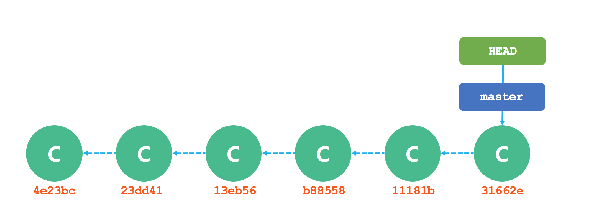

## Git

## 1. git reset
누구나 실수할 수 있다. 인생의 실수는 되돌릴 수 없다고들 하지만 프로그램 세계에서 만은 다르다. 보고서를 작성할 때 오타를 걱정하지 않는다. 되돌리기 버튼(Ctrl-Z)으로 언제든지 오타를 수정할 수 있기 때문이다. 실수가 아니더라도 되돌리기 버튼을 계속 눌러 원하던 시점으로 돌아갈 수 있다. 심지어 아무 것도 없는 초기 상태까지도 갈 수 있다.

배포를 하기 전 완벽하게 테스트를 했더라도 커밋한 코드에서 심각한 버그가 발생한다. 이런 경우에 되돌리기 버튼을 누르는 것처럼 이전 커밋으로 되돌릴 수 있는 기능이 있다. 코드를 되돌리는 일이 발생하면 안되겠지만 어쩔 수 없이 과거 버전으로 되돌아가야 할 때가 있다.

```bash
$ git log

commit 31662edbf350b93d49566769686e770b45369859
Author: ryubcinhatc <ryubc.inhatc@gmail.com>
Date:   Sat Nov 25 16:37:36 2017 +0900

    여섯번째 커밋

commit 11181bf38a68472a990582f6f1927b5237cb4756
Author: ryubcinhatc <ryubc.inhatc@gmail.com>
Date:   Sat Nov 25 16:37:22 2017 +0900

    다섯번째 커밋

commit b885583b9b5854172800f02dfc94a3af26593be6
Author: ryubcinhatc <ryubc.inhatc@gmail.com>
Date:   Sat Nov 25 16:37:09 2017 +0900

    네번째 커밋

commit 13eb569bb3488ff0e1c3b060c10e3a991c7d146f
Author: ryubcinhatc <ryubc.inhatc@gmail.com>
Date:   Sat Nov 25 16:36:54 2017 +0900

    세번째 커밋

commit 23dd4169a4cdc21f0653f09996393524f6b56e8e
Author: ryubcinhatc <ryubc.inhatc@gmail.com>
Date:   Sat Nov 25 16:36:38 2017 +0900

    두번째 커밋

commit 4e23bc33fb6494240a3c0843186b974056e55879
Author: ryubcinhatc <ryubc.inhatc@gmail.com>
Date:   Sat Nov 25 16:36:13 2017 +0900

    첫번째 커밋
```

### reflog

Git은 자동으로 브랜치와 HEAD가 지난 몇 달 동안에 가리켰었던 커밋을 모두 기록하는데 이 로그를 Reflog라고 부른다.

```bash
$ git reflog

31662ed HEAD@{0}: commit: 여섯번째 커밋
11181bf HEAD@{1}: commit: 다섯번째 커밋
b885583 HEAD@{2}: commit: 네번째 커밋
13eb569 HEAD@{3}: commit: 세번째 커밋
23dd416 HEAD@{4}: commit: 두번째 커밋
4e23bc3 HEAD@{5}: commit (initial): 첫번째 커밋
```
### 짧은 SHA-1

사람은 커밋을 나타내는 SHA-1 해시 값을 쉽게 기억할 수 없다. 사람이 기억하기 쉬운 커밋을 표현하는 방법을 몇 가지가 있다.

짧은 SHA-1
해시 값의 앞 몇 글자만으로도 어떤 커밋인지 충분히 식별할 수 있다. 중복되지 않으면 해시 값의 앞 4자만 사용해도 된다. 유일하기만 하면 짧은 SHA-1 값이라도 괜찮다.

git show 명령으로 두번째 커밋의 내용을 확인할 때 아래처럼 커밋의 40자리 SHA-1 해시값을 사용할 수도 있지만 7자리의 짧은 해시 값을 사용해도 된다.
```bash
$ git show 4e23bc33fb6494240a3c0843186b974056e55879
$ git show 4e23bc33fb6494240a3c
$ git show 4e23bc
```


### HEAD
HEAD는 현재 브랜치를 가리키는 포인터이다. 브랜치에 담긴 커밋 중 가장 마지막에 커밋을 가리킨다. HEAD가 가리키는 커밋은 바로 다음 커밋의 부모가 된다.




명령 | 작업 공간 보존 여부 | 스테이징 영역 보존 여부
---|---|---
git reset --soft | O | O
git reset --mixed | X | O
git reset --hard | X | X

[Git 공식 홈페이지에 있는 내용](https://git-scm.com/book/ko/v2/Git-%EB%8F%84%EA%B5%AC-Reset-%EB%AA%85%ED%99%95%ED%9E%88-%EC%95%8C%EA%B3%A0-%EA%B0%80%EA%B8%B0)을 기반으로 git reset 명령이 어떻게 작동하는지 알아본다.

### 1. git init
git init 명령을 실행하면 로컬 저장소가 생기고 HEAD는 아직 없는 브랜치를 가리킨다.


### 2. git add
이 시점에는 작업 공간(Working Directory)에만 데이터가 있다. git add 명령으로 작업 공간의 내용을 스테이징 영역(index)에 복사한다.


### 3. git commit
git commit 명령을 실행하면 스테이징 영역의 내용을 스냅샷으로 영구히 저장하고 스 스냅샷을 가리키는 커밋 객체를 만든다. 그리고  'master' 가 그 커밋 객체를 가리키도록 한다.


이때 git status 명령을 실행하면 아무런 변경 사항이 없다고 나온다. 세 트리 모두가 같기 때문이다.  다시 파일 내용을 바꾸고 커밋해보자. 위에서 했던 과정과 비슷하다. 먼저 작업 공간의 파일을 고친다. 이를 파일 v2라고 하자. 이건 빨간색으로 표시한다.


git status 명령을 실행하면 'Change not staged for commit' 아래에 빨간색으로 된 파일을 볼 수 있다. 스테이징(Index)와 작업 영역이 다른 내용을 담고 있기 때문이다. git add 명령으로 변경 사항을 스테이징 영역에 올려자.


이 시점에서 git status 명령을 실행하면  'Change to be committed' 아래에 파일 이름이 녹색으로 변한다. 스테이징 영역과 HEAD의 다른 파일들이 여기에 표시된다. 즉, 다음 커밋할 것과 마지막 커밋이 다르다는 뜻이다. 마지막으로 git commit 명령을 실행한다.


이제 git status 명령을 실행하면 아무것도 출력하지 않는다. 세 개의 트리의 내용이 다시 같아졌기 때문이다. 브래치를 바꾸거나 Clone 명령도 내부적으로 비슷한 절차를 밟는다. 브랜치를 Checkout 하면 HEAD가 새로운 브랜치를 가리키도록 바끼고, 새로운 커밋의 스냅샷을 스테이징 영역(Index)에 놓는다. 그리고 스테이징 영역의 내용을 작업 공간에 복산다.

## Reset의 역할

예를 들어 file.txt 파일 하나를 수정하고 커밋한다. 이것을 세 번 반복한다. 그러면 히스토리는 아래와 같이 된다.


이제 reset 명령이 정확히 어떤 일을 하는지 알아보자. reset 명령은 이 세 트리를 간단하고 예측 가능한 방법으로 조작한다. 트리를 조작하는 동작은 세 단계 이하로 이루어진다.

### 1 단계 : HEAD 이동(--soft)
reset 명령이 하는 첫 번째 일은 HEAD 브랜치를 이동시킨다. checkout 명령처럼 HEAD가 가리키는 브랜치를 바꾸지 않는다. HEAD는 계속 현재 브랜치를 가리키고 있고, 현재 브랜치가 가리키는 커밋을 바꾼다. HEAD가 master 브랜치를 가리키고 있다면 git reset 9e5e6a4 명령은 master 브랜치가 '9e5e6a4' 를 가리키게 한다.


reset 명령에 커밋을 넘기고 실행하면 언제난 이런 작업을 수행한다. reset --soft 옵션을 사용하면 딱 여기까지 진행하고 동작을 멈춘다.

reset 명령은 가장 최근의 git commit 명령을 되돌린다. git commit 명령을 실행하면 Git은 새로운 커밋을 생성하고 HEAD가 가리키는 브랜치가 새로운 커밋을 가리키도록 업데이트한다. reset 명령 뒤에 HEAD~(HEAD의 부모 커밋)를 주면 스테이징(Index) 영역이나 작업 공간은 그대로 놔두고 브랜치가 가리키는 커밋만을 이전으로 되돌린다. 스테이징을 업데이트 한 다음에 git commit 명령을 실행하면 git commit --amend 명령의 결과와 같아진다.

### 2 단계 : 스테이징 영역(Index) 업데이트(--mixed)

git status 명령을 실행하면 스테이징 영역(Index)과 reset 명령으로 이동시킨 HEAD의 다른 점이 녹색으로 출력된다.

reset 명령은 여기서 한 발짝 더 나아가 스테이징 영역(Index)을 현재 HEAD가 가리키는 스냅샷으로 업데이트할 수 있다.


--mixed 옵션을 주고 실행하면 reset 명령은 여기까지 하고 멈춘다. reset 명령을 실행할 때 아무 옵션도 주지 않으면 기본적으로 --mixed 옵션으로 동작한다(예제와 같이 git reset HEAD~ 처럼 명령을 실행하는 경우).

가리키는 대상을 가장 최근 커밋으로 되돌리는 것은 같다. 그러고 나서 스테이징 영역을 비우기까지 한다. git commit 명령도 되돌리고 git add 명령까지 되돌리는 것이다.

### 3 단계 : 작업 영역(Working Directory) 업데이트(--hard)

reset 명령은 세 번째로 작업 영역까지 업데이트한다. --hard 옵션을 사용하면 reset 명령은 이 단계까지 수행한다.


reset 명령을 통해 git add와 git commit 명령으로 생성한 마지막 커밋을 되돌린다. 그리고 작업 공간의 내용까지도 되돌린다.
