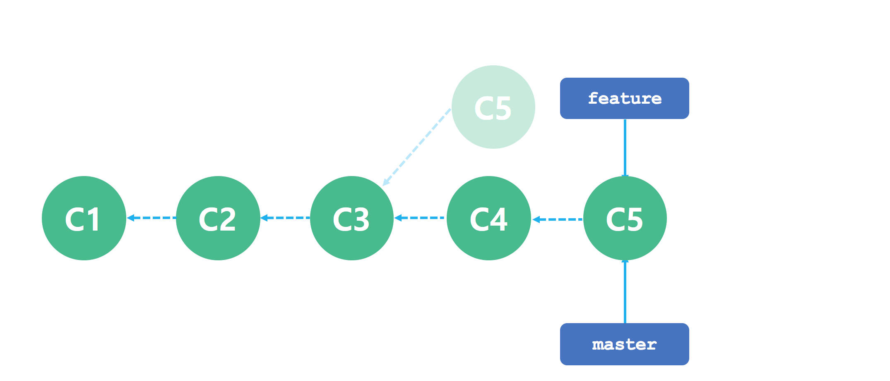
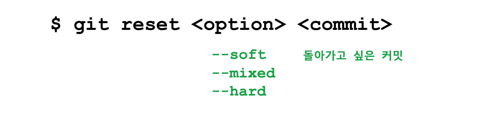

## Git


### 1. git rebase 을 이용한 브랜치 병합

명령 | 설명
---|---
git rebase <브랜치 이름> | 현재 브랜치의 베이스 브랜치를 변경한다.


```bash
$ git checkout feature
$ git rebase master
```


```bash
$ git checkout master
$ git merge feature
```



### 2. git commit --amend

운이 좋게 커밋을 하자마자 바로 잘못된 점을 찾았다면 걱정할 필요가 없다. git commit --amend 명령으로 커밋을 변경할 수 있기 때문이다. git commit --amend 명령은 새로운 커밋을 만들지 않고 마지막 커밋을 수정한다. 커밋 하기전 빠진 부분은 없는지 확인을 하더라도 놓치는 부분은 나오기 마련이다. 이럴 때 git commit --amend 명령은 놓친 부분을 채울 수 있게 해준다.


## 3. git rebase -i
커밋 히스토리가 엉망이 되었다고 걱정할 필요는 없다. git rebase 명령으로 과거 커밋을 합치거나 분리할 수 있기 때문이다.


```bash
pick fc356c6 작업 완료
pick 43e3bc4 깜박하고 누락한 파일 추가함
pick bbe262d 깜박하고 누락한 중요 코드 추가함
pick 4b641fe 비몽사몽간에 만든 디버그 코드가 포함되어 삭제함
pick 935cb73 아 미치겠네 또 누락된 파일 추가함
pick be1c367 절 죽여주세요. 또 다시 이상한 코드가 발견되어 삭제함
pick 3be1f95 왜 코드가 지 맘대로 돌아갈까요. 알아서 수정했습니다. 팀장님 내일 사표내겠습니다.ㅠ.ㅠ

# Rebase e04ccc2..3be1f95 onto e04ccc2 (7 command(s))
#
# Commands:
# p, pick = use commit
# r, reword = use commit, but edit the commit message
# e, edit = use commit, but stop for amending
# s, squash = use commit, but meld into previous commit
# f, fixup = like "squash", but discard this commit's log message
# x, exec = run command (the rest of the line) using shell
#
# These lines can be re-ordered; they are executed from top to bottom.
#
# If you remove a line here THAT COMMIT WILL BE LOST.
#
# However, if you remove everything, the rebase will be aborted.
#
# Note that empty commits are commented out
```

6개의 명령어으로 과거 커밋을 변경할 수 있다.

 명령 | 약어 | 설명
--- | --- | ---
 pick | p | 커밋을 포함하기 위해 사용한다. pick 명령어 순서를 재배열하는 것으로 rebase 을 시작할 때 커밋의 순서를 변경할 수도 있다.
 reword | r | pick과 비슷한 명령으로 rebase을 진행을 일시 정지하고 커밋 메시지를 변경할 기회를 준다. 커밋 내용이 변경되지 않는다.
 edit | e | 커밋을 pick한 다음 rebase 진행을 잠시 정지한다. 커밋을 수정하는 동안 edit 에서 추가하거나 삭제할 수 있다. 또한 rebase를 재개하기 전에 더 많은 커밋을 만들 수도 있다.
 squash | s | 여러 커밋을 하나의 커밋으로 합친다. rebase을 일시 정지하고 여러 커밋 메시지를 편집할 수 있게 해준다. 커밋 메시지를 수정한 다음 에디터를 닫으면 rebase를 다시 진행한다.
fixup | f | squash와 비슷한 명령으로 이전 커밋에 병합되고 첫번째 커밋 메시지가 사용된다. 커밋 메시지를 수정하지 않는다.
exec | x | 커밋에 대한 임의의 쉘 명령어를 자동으로 실행한다.


## 4. git reset



명령 | 헤드 이동 | 스테이징 영역 변경 | 작업 영역 변경
---|---|---|---
git reset --soft | O | X | X
git reset --mixed | O | O | X
git reset --hard | O | O | O
