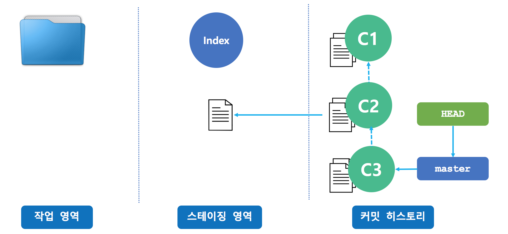
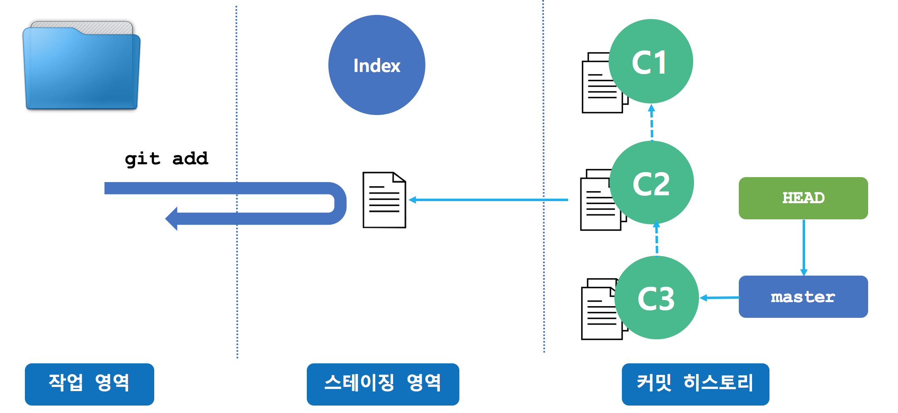
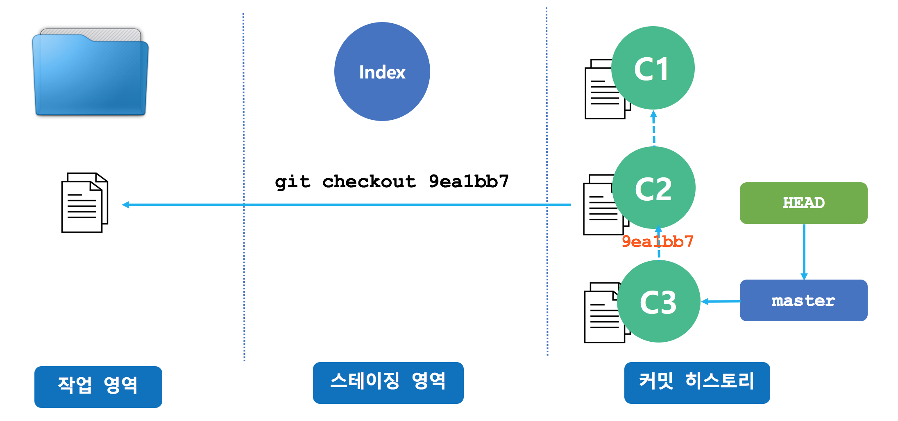
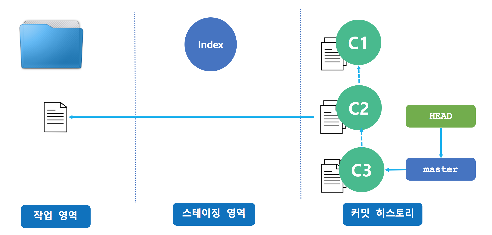
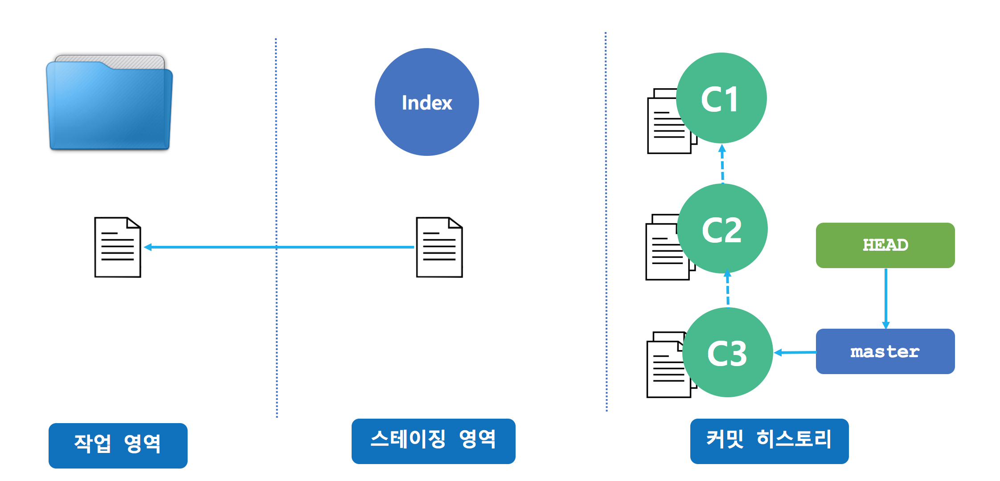
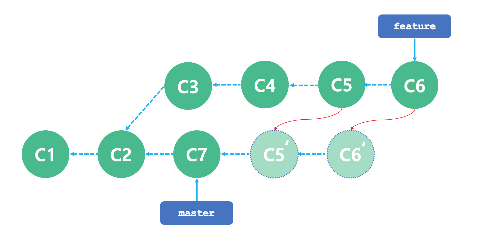
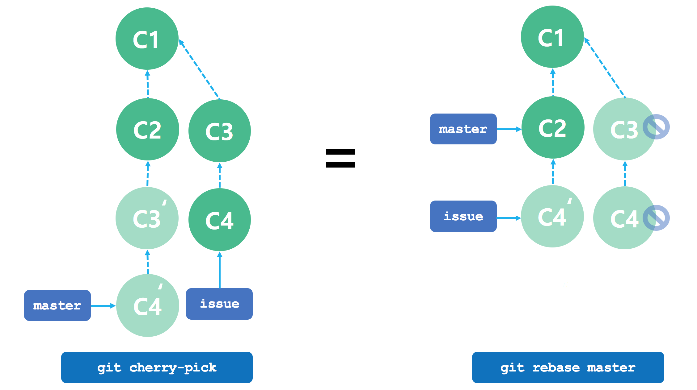

## Git

### 1. git reset
앞 수업 시간에는 git reset 명령으로 프로젝트 전체를 특정 커밋 상태로 되돌아가는 방법을 배웠다. 이번에는 git reset 명령으로 프로젝트 전체가 아니라 특정 파일만을 과거 커밋 상태로 되돌리는 방법을 알아 본다.


git reset 명령은 특정 커밋의 파일을 스테이징 영역으로 복사한다.


스테이징 영역으로 특정 커밋의 파일을 복사해 무엇 합니까라고 물어볼 법도 하다. 다른 관점에서 git reset 명령의 작동 방식을 바라보면 스테이징 영역의 파일이 커밋 상태로 되돌아갔기 때문에 git add 명령이 취소된 것으로도 볼 수 있다.




 아래처럼 git add 명령으로 5개의 파일을 스테이징 영역에 넣고 커밋을 하려는 순간 한가지 실수를 했음을 깨달았다.

```bash
$ git add main.html
$ git add main.css
$ git add core.js
$ git add util.js
$ git add rest.js

or

$ git add --all

```

이번 커밋에서 core.js 파일은 제외해야 하는데 이미 스테이징 영역에 넣었으니 어떻게 할까요? 이런 난천한 상황이 발생할 때 사용할 수 있는 명령이 바로 git reset이다.

```bash
$ git reset HEAD core.js
$ git commit -m "작업 완료"
```

### 2. git checkout

GIT에서 브랜치를 이동할 때 git checkout <branch> 명령을 사용했다. 브랜치가 바뀔 때마다 작업 영역의 파일이 매번 바뀐다는 것을 실습을 통해서 학습했다. git checkout 명령에 브랜치 이름 대신에 특정 커밋의 해시값을 넣으면 작업 영역을 특정 커밋 상태로 만들 수 있다.




git checkout 명령으로 작업 영역을 특정 커밋 상태로 되돌릴 수 있다. 언뜻 보기에는 git reset --hard <commit> 과 유사하지만 차이점이 있다. git reset 명령은 헤드(HEAD)와 헤드가 가리키는 브랜치를 함께 변경하지만 git checkout 명령은 브랜치는 그대로 두고 헤드(HEAD)만 변경한다. git checkout 명령으로 특정 커밋 상태로 되돌아 갔다고 해서 새롭게 작업을 한 후 커밋을 하면 안된다.

명령 | 브랜치 이동 | 헤드(HEAD) 이동
---|---|---
git reset | O | O
git checkout | X | O


git checkout 명령은 과거 커밋으로 되돌아가 현재 소스와의 차이점이 무엇인지 살펴보는 용도로만 주로 사용한다.




git checkout 명령에 브랜치 이름이나 커밋 해시값 대신에 파일 이름을 명시하면 스태이징 영역에 있는 파일을 작업 영역으로 복사할 수 있다.





명령 | 설명
---|---
git checkout . | 모든 수정 사항을 되돌리기
git checkout \<dir\> | 특정 폴더 아래의 모든 수정 사항 되돌리기
git checkout \<file\> | 특정 파일의 수정 사항 되돌리기


### 3. git reset / checkout 정리

 


### 4. git revert
커밋을 했더라도 git commit --amend 명령으로 마지막 커밋을 수정할 수 있었고,  git rebase -i 명령으로 커밋 히스토리를 편집할 수 있었다. 앞에서 설명하지 않았지만 두 명령을 사용할 수 있는 전제 조건이 있다. 원격 저장소에 push한 커밋에 대해서는 사용하면 안된다는 것이다. 즉, 원격 저장소에 push하지 않은 커밋에 대해서만 수정할 수 있다는 것이다. 원격 저장소의 커밋 히스토리와 로컬 저장소의 커밋 히스토리가 다르면 push할 수 없다(물론 강제로 올리는 방법도 있다. 하지만 그 명령을 수행하는 순간 여러 사람으로부터 XXXX란 소릴 듣게 될 것이며 프로젝트 히스토리는 난장판이 된다).


원격 서버에 push한 잘못된 커밋을 되돌릴 때 사용하는 명령이 git revert 이다.


### 5. git cherry-pick


특정 커밋의 변경 사항을 가져와 적용하고 싶을 때 git cherry-pick 명령을 사용한다. rebase 관점에서 보면 하나의 커밋만 rebase 하는 것과 동일하다. 특정 브랜치에서 개발된 특정 커밋만을 가져오고 싶을 때 사용할 수 있다.





### 6. git cherry-pick vs rebase



### 7. summary

명령 | 범위 | 일반적 사용
---|---|---
git reset | 커밋 레벨 | 브랜치에서 작업을 취소할 때 사용(혼자 사용하는 경우)
git reset | 파일 레벨 | git add 명령 취소
git checkout | 커밋 레벨 | 브랜치 이동 및 과거 커밋으로 이동
git checkout | 파일 레벨 | 작업 공간에서 작업 취소
git revert | 커밋 레벨 | 브랜치에서 작업을 취소할 때 사용(여러 사람과 공유한 경우)
git revert | 파일 레벨 | 지원 안함

## 실습 순서

번호 | 실습 내용
--- | ---
1 | [원격 저장소 fork](#)
2 | [원격 저장소 clone](#)
3 | [git checkout 명령으로 과거 커밋 확인하기](#)
4 | [feature 브랜치 이동](#)
5 | [git rebase 명령으로 과거 커밋 수정하기](#)
6 | [master 브랜치 이동](#)
7 | [git cherry-pick](#)
8 | [원격 저장소에 푸쉬](#)
9 | [git reset](#)
10 | [원격 저장소에 푸쉬](#)
11 | [git revert](#)
12 | [원격 저장소에 푸쉬](#)


### 1. 원격 저장소 fork

https://github.com/ryubcinhatc/calculator 저장소를 각자의 계정에 fork 한다.

### 2. 원격 저장소 clone

```bash
$ git clone https://github.com/<id>/calculator
```

### 3. git checkout 명령으로 과거 커밋 확인하기

```bash
$ git log --oneline

1f7459b js 삭제/html 재작성
6c8aa1f max.js 파일 추가 및 max 함수 호출 추가
757f378 min.js 파일 추가 및 min 함수 호출 추가
35c3afc div.js 파일 추가 및 div 함수 호출 추가
3600efb mul.js 파일 추가 및 mul 함수 호출 추가
a7dcdc5 sub.js 파일 추가 및 sub 함수 호출 추가
8e4dcf0 add.js 파일 추가 및 add 함수 호출 추가
6c5fec4 파일 추가
```

현재는 calculator.html 파일 하나인데 마지막 커밋 직전에는 어떤 상태였는지 git checkout 명령으로 확인해보자.
```bash
$ git checkout 6c8aa1f # max.js 파일 추가 및 max 함수 호출 추가

Note: checking out '6c8aa1f'.

You are in 'detached HEAD' state. You can look around, make experimental
changes and commit them, and you can discard any commits you make in this
state without impacting any branches by performing another checkout.

If you want to create a new branch to retain commits you create, you may
do so (now or later) by using -b with the checkout command again. Example:

  git checkout -b <new-branch-name>

HEAD is now at 6c8aa1f... max.js 파일 추가 및 max 함수 호출 추가

```

```bash
$ ls

calculator.html js

```

```html
<!DOCTYPE html>
<html>
	<head>
		<meta charset="UTF-8">
		<script type="text/javascript" src="js/add.js"></script>
		<script type="text/javascript">
			window.onload = function() {
				// 더하기 버튼 눌렀을 때 호출되는 함수
				add();
				// 빼기 버튼 눌렀을 때 호출되는 함수
				sub();
				// 곱하기 버튼 눌렀을 때 호출되는 함수
				mul();
				// 나누기 버튼 눌렀을 때 호출되는 함수
				div();
				// 최소값 버튼 눌렀을 때 호출되는 함수
				min();
				// 최대값 버튼 눌렀을 때 호출되는 함수
				max();																								
			}
		</script>
	</head>
<body>
	<input type="text" id="num1" value="10">
	<input type="text" id="num2" value="2">
	<br>
	<input type="button" id="add" value="더하기"/>
	<input type="button" id="sub" value="빼기"/>
	<input type="button" id="mul" value="곱하기"/>
	<input type="button" id="div" value="나누기"/>
	<input type="button" id="min" value="최소값"/>
	<input type="button" id="max" value="최대값"/>
</body>
</html>
```

다시 현재 코드로 돌아옵시다.

```bash
$ git checkout master

```

### 4. feature 브랜치 이동

```bash
$ git branch

feature
* master

$ git checkout feature
```

### 5. git rebase 명령으로 과거 커밋 수정하기

calculator.html 파일을 편집기에서 열어 본다.

```html
<!DOCTYPE html>
<html>
	<head>
		<meta charset="UTF-8">
		<script type="text/javascript">
			window.onload = function() {
				// 더하기 버튼 눌렀을 때 호출되는 함수
				document.getElementById("add").onclick = function() {
				  var num1 = parseInt(document.getElementById("num1").value);
				  var num2 = parseInt(document.getElementById("num2").value);
				  alert(num1 + num2);
				};

				// 빼기 버튼 눌렀을 때 호출되는 함수
				document.getElementById("sub").onclick = function() {
				  var num1 = parseInt(document.getElementById("num1").value);
				  var num2 = parseInt(document.getElementById("num2").value);
				  alert(num1 - num2);
				};

				// 곱하기 버튼 눌렀을 때 호출되는 함수
				document.getElementById("mul").onclick = function() {
				  var num1 = parseInt(document.getElementById("num1").value);
				  var num2 = parseInt(document.getElementById("num2").value);
				  alert(num1 * num2);
				};

				// 나누기 버튼 눌렀을 때 호출되는 함수
				document.getElementById("div").onclick = function() {
				  var num1 = parseInt(document.getElementById("num1").value);
				  var num2 = parseInt(document.getElementById("num2").value);
				  alert(num1 / num2);
				};

				// 최소값 버튼 눌렀을 때 호출되는 함수
				document.getElementById("min").onclick = function() {
				  var num1 = parseInt(document.getElementById("num1").value);
				  var num2 = parseInt(document.getElementById("num2").value);
				  if(num1 < num2)
				    alert(num1);
				  else
				    alert(num2);
				};

				// 최대값 버튼 눌렀을 때 호출되는 함수
				document.getElementById("max").onclick = function() {
				  var num1 = parseInt(document.getElementById("num1").value);
				  var num2 = parseInt(document.getElementById("num2").value);
				  if(num1 < num2)
				    alert(num2);
				  else
				    alert(num1);
				};
			}
		</script>
	</head>
<body>
	<input type="text" id="num1" value="10">
	<input type="text" id="num2" value="2">
	<br>
	<input type="button" id="add" value="더하기"/>
	<input type="button" id="sub" value="빼기"/>
	<input type="button" id="mul" value="곱하기"/>
	<input type="button" id="div" value="나누기"/>
	<input type="button" id="min" value="최소값"/>
	<input type="button" id="max" value="최대값"/>
</body>
</html>
```
최소값/최대값을 찾는데 Math.min/Math.max 함수를 사용하면 더 좋을 것 같다. 그래서 이전에 커밋한 내용을 수정하기 위해 git rebase -i 명령을 수행한다.


```bash
$ git checkout feature
$ git log --oneline

bcdd933 최대값 함수 구현
958fbb4 최소값 함수 구현
46d1410 나누기 함수 구현
d6dcefe 곱하기 함수 구현
7013b17 빼기 함수 구현
6a3147f 더하기 함수 구현
1f7459b js 삭제/html 재작성
6c8aa1f max.js 파일 추가 및 max 함수 호출 추가
757f378 min.js 파일 추가 및 min 함수 호출 추가
35c3afc div.js 파일 추가 및 div 함수 호출 추가
3600efb mul.js 파일 추가 및 mul 함수 호출 추가
a7dcdc5 sub.js 파일 추가 및 sub 함수 호출 추가
8e4dcf0 add.js 파일 추가 및 add 함수 호출 추가
6c5fec4 파일 추가
```

#### 5.1. git rebase

```bash

$ git rebase -i HEAD~2

or

$ git rebase -i HEAD~~

or

$ git rebase -i HEAD^^

or

$ git rebase -i 46d1410 # 나누기 함수

```


[수정전](#)
```bash
pick 958fbb4 최소값 함수 구현
pick bcdd933 최대값 함수 구현

# Rebase 46d1410..bcdd933 onto 46d1410 (2 command(s))
#
# Commands:
# p, pick = use commit
# r, reword = use commit, but edit the commit message
# e, edit = use commit, but stop for amending
# s, squash = use commit, but meld into previous commit
# f, fixup = like "squash", but discard this commit's log message
# x, exec = run command (the rest of the line) using shell
#
# These lines can be re-ordered; they are executed from top to bottom.
#
# If you remove a line here THAT COMMIT WILL BE LOST.
#
# However, if you remove everything, the rebase will be aborted.
#
# Note that empty commits are commented out
```


[수정후](#)
```bash
edit 958fbb4 최소값 함수 구현
edit bcdd933 최대값 함수 구현

# Rebase 46d1410..bcdd933 onto 46d1410 (2 command(s))
#
# Commands:
# p, pick = use commit
# r, reword = use commit, but edit the commit message
# e, edit = use commit, but stop for amending
# s, squash = use commit, but meld into previous commit
# f, fixup = like "squash", but discard this commit's log message
# x, exec = run command (the rest of the line) using shell
#
# These lines can be re-ordered; they are executed from top to bottom.
#
# If you remove a line here THAT COMMIT WILL BE LOST.
#
# However, if you remove everything, the rebase will be aborted.
#
# Note that empty commits are commented out
```


```bash

Stopped at 958fbb42606e7fd77d04549ca4d389b5743b2503... 최소값 함수 구현
You can amend the commit now, with

	git commit --amend

Once you are satisfied with your changes, run

	git rebase --continue

```

#### 5.2. calculator.html 파일 수정 후 저장

```html

// 최소값 버튼 눌렀을 때 호출되는 함수
document.getElementById("min").onclick = function() {
  var num1 = parseInt(document.getElementById("num1").value);
  var num2 = parseInt(document.getElementById("num2").value);
  alert(Math.min(num1, num2));
};

```

#### 5.3. git commit --amend

```bash
$ git add --all
$ git commit --amend -m "최소값 함수 구현(Math.min)"
```

#### 5.4. git rebase --continue

```bash
$ git rebase --continue

Stopped at bcdd93354f14dfa475042de3a07810162a2f8479... 최대값 함수 구현
You can amend the commit now, with

	git commit --amend

Once you are satisfied with your changes, run

	git rebase --continue

```

#### 5.5. calculator.html 파일 수정 후 저장

```html

// 최대값 버튼 눌렀을 때 호출되는 함수
document.getElementById("max").onclick = function() {
  var num1 = parseInt(document.getElementById("num1").value);
  var num2 = parseInt(document.getElementById("num2").value);
  alert(Math.max(num1, num2));
};

```

#### 5.6. git commit --amend

```bash
$ git add --all
$ git commit --amend -m "최대값 함수 구현(Math.max)"
```

#### 5.7. git rebase --continue

```bash
$ git rebase --continue

Successfully rebased and updated refs/heads/feature.

```

#### 5.8. git log 명령으로 로그 확인

```bash
$ git log --oneline

df9c873 최대값 함수 구현(Math.max)
c277dbc 최소값 함수 구현(Math.min)
46d1410 나누기 함수 구현
d6dcefe 곱하기 함수 구현
7013b17 빼기 함수 구현
6a3147f 더하기 함수 구현
1f7459b js 삭제/html 재작성
6c8aa1f max.js 파일 추가 및 max 함수 호출 추가
757f378 min.js 파일 추가 및 min 함수 호출 추가
35c3afc div.js 파일 추가 및 div 함수 호출 추가
3600efb mul.js 파일 추가 및 mul 함수 호출 추가
a7dcdc5 sub.js 파일 추가 및 sub 함수 호출 추가
8e4dcf0 add.js 파일 추가 및 add 함수 호출 추가
6c5fec4 파일 추가
```

### 7. git tag

```bash
$ git tag add 6a3147f
$ git tag sub 7013b17
$ git tag mul d6dcefe
$ git tag div 46d1410
$ git tag min c277dbc
$ git tag max df9c873

$ git tag
add
div
max
min
mul
sub

```


### 6. master 브랜치 이동

```bash
$ git checkout master
```


### 7. git cherry-pick
```bash
$ git cherry-pick add # git cherry-pick 6a3147f 더하기 함수
[master 143dd93] 더하기 함수 구현

$ git cherry-pick sub # git cherry-pick 7013b17 빼기 함수
[master f292675] 빼기 함수 구현

$ git cherry-pick mul # git cherry-pick d6dcefe 곱하기 함수
[master fe9d811] 곱하기 함수 구현

$ git cherry-pick div # git cherry-pick 46d1410 나누기 함수
[master cad407f] 나누기 함수 구현

$ git cherry-pick min # git cherry-pick c277dbc 최소값 함수
[master 1baa34d] 최소값 함수 구현(Math.min)

$ git cherry-pick max # git cherry-pick df9c873 최대값 함수
[master dde3fe8] 최대값 함수 구현(Math.max)

```

```bash
$ git log --oneline

0f44730 최대값 함수 구현(Math.max)
a262972 최소값 함수 구현(Math.min)
7c26162 나누기 함수 구현
b232db9 곱하기 함수 구현
278dfa9 빼기 함수 구현
32b88a4 더하기 함수 구현
1f7459b js 삭제/html 재작성
6c8aa1f max.js 파일 추가 및 max 함수 호출 추가
757f378 min.js 파일 추가 및 min 함수 호출 추가
35c3afc div.js 파일 추가 및 div 함수 호출 추가
3600efb mul.js 파일 추가 및 mul 함수 호출 추가
a7dcdc5 sub.js 파일 추가 및 sub 함수 호출 추가
8e4dcf0 add.js 파일 추가 및 add 함수 호출 추가
6c5fec4 파일 추가

```

calculator.html 파일을 열어서 머지됐는지 확인 해보자.


### 8. 원격 저장소에 푸쉬

```bash
$ git push
```

### 9. git reset
최소값/최대값은 서버에 올리면 안되는 코드(?)인데 올린 것으로 가정하자. 제일 쉬운 방법은 최소값/최대값 코드를 삭제한 다음 커밋을 하고 다시 git push 하면 된다. 또 다른 방법은 git reset 명령을 사용해 과거 커밋을 되돌아 가는 것이다.

```bash
$ git reset --hard cad407f # 나누기 함수 구현

or

$ git reset --hard div # 나누기 함수 구현

```

calculator.html 파일을 열어서 최소값/최대값 부분이 없는지 확인한다.

### 10. 원격 저장소에 푸쉬

```bash
$ git push

To https://github.com/ryubcinhatc/calculator.git
 ! [rejected]        master -> master (non-fast-forward)
error: failed to push some refs to 'https://github.com/ryubcinhatc/calculator.git'
hint: Updates were rejected because the tip of your current branch is behind
hint: its remote counterpart. Integrate the remote changes (e.g.
hint: 'git pull ...') before pushing again.
hint: See the 'Note about fast-forwards' in 'git push --help' for details.

```

### 11. git revert

git reset 명령을 실행할 때 삭제될 커밋을 ORIG_HEAD 에 저장한다. 이를 이용해 git reset 명령을 하기 전으로 돌아갈 수 있다.

```bash
$ git reset --hard ORIG_HEAD

or

$ git reset --hard HEAD~

or

$ git reset --hard max

```

```bash
$ git revert a262972 # 최소값 함수 구현(Math.min)
$ git revert 0f44730 # 최소값 함수 구현(Math.min)

or

$ git revert min # 최소값 함수 구현(Math.min)
$ git revert max # 최소값 함수 구현(Math.min)

or

git revert a262972..0f44730

```


```bash
Revert "최소값 함수 구현(Math.min)"

This reverts commit 54fdfe6364b40f761a474647b8de59a73ff40b74.

# Please enter the commit message for your changes. Lines starting
# with '#' will be ignored, and an empty message aborts the commit.
# On branch master
# Your branch and 'origin/master' have diverged,
# and have 6 and 6 different commits each, respectively.
#   (use "git pull" to merge the remote branch into yours)
#
# Changes to be committed:
#       modified:   calculator.html

```

```bash
Revert "최대값 함수 구현(Math.max)"

This reverts commit f2078114fd9fac6c666f0198ed2bf8c46a7c545f.

# Please enter the commit message for your changes. Lines starting
# with '#' will be ignored, and an empty message aborts the commit.
# On branch master
# Your branch and 'origin/master' have diverged,
# and have 7 and 6 different commits each, respectively.
#   (use "git pull" to merge the remote branch into yours)
#
# Changes to be committed:
#       modified:   calculator.html
#
```

```bash

$ git log --oneline

904bf9e Revert "최대값 함수 구현(Math.max)"
8b0ba2e Revert "최소값 함수 구현(Math.min)"
0f44730 최대값 함수 구현(Math.max)
a262972 최소값 함수 구현(Math.min)
7c26162 나누기 함수 구현
b232db9 곱하기 함수 구현
278dfa9 빼기 함수 구현
32b88a4 더하기 함수 구현
1f7459b js 삭제/html 재작성
6c8aa1f max.js 파일 추가 및 max 함수 호출 추가
757f378 min.js 파일 추가 및 min 함수 호출 추가
35c3afc div.js 파일 추가 및 div 함수 호출 추가
3600efb mul.js 파일 추가 및 mul 함수 호출 추가
a7dcdc5 sub.js 파일 추가 및 sub 함수 호출 추가
8e4dcf0 add.js 파일 추가 및 add 함수 호출 추가
6c5fec4 파일 추가

```

### 12. 원격 저장소에 푸쉬

```bash
$ git push
```
원격 저장소에서 최소값/최대값 부분이 빈코드로 되돌아 갔는지 확인한다.
