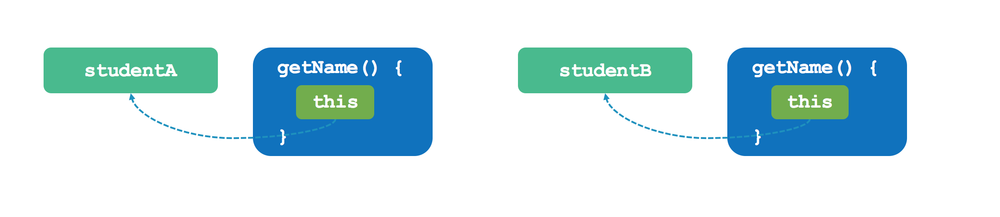
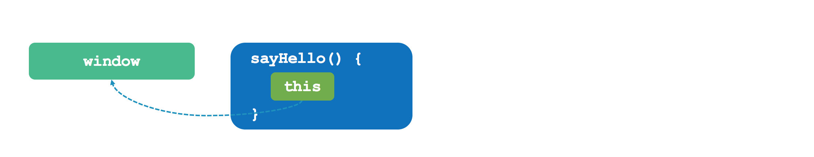
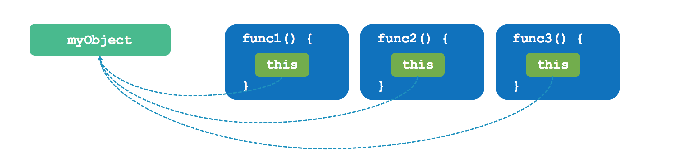
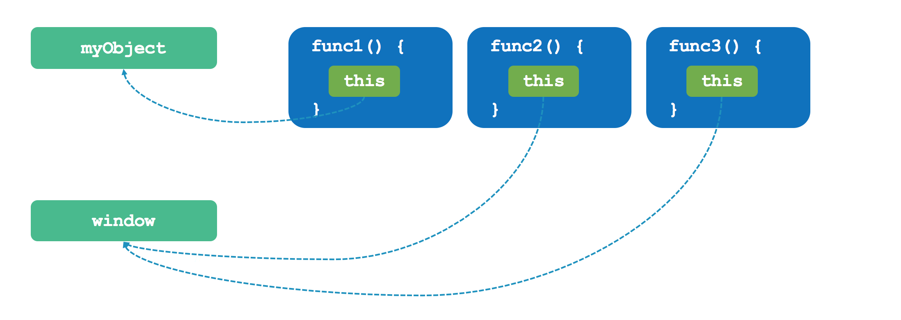
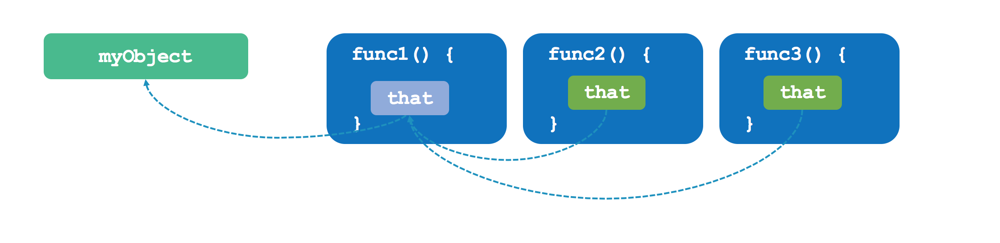
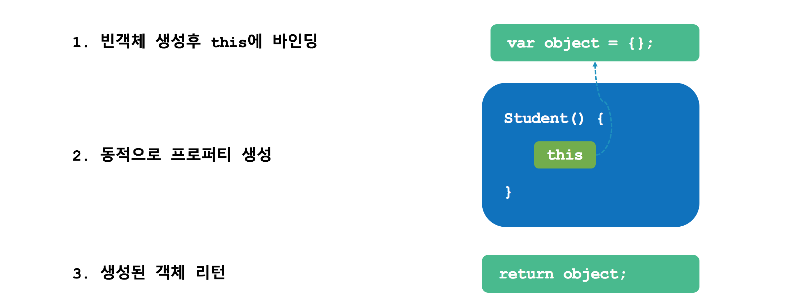
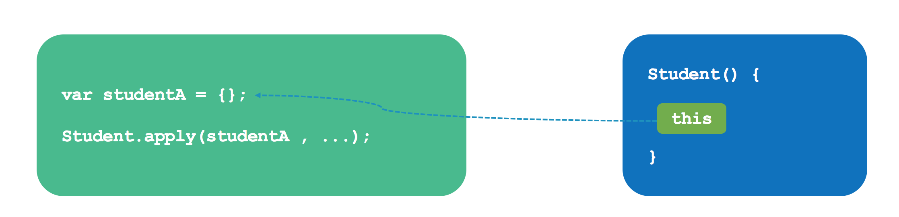

# 자바스크립트(JavaScript)

## 함수(Function) 와 this

```javascript
function sum() {
  var result = 0;
  for (var i = 0; i < arguments.length; i++) {
    result += arguments[i];
  }
  return result;
}

console.log(sum(1, 2)); // 3
console.log(sum(1, 2, 3)); // 6
```


자바스크립트에서 함수를 호출할 때 함수 인자를 ```arguments``` 라는 객체에 담아 주기 때문에 위에 구현한 sum 함수처럼 가변 인자 처리를 할 수 있다. 자바스크립트는 ```arguments``` 객체 뿐만 아니라 ```this``` 라는 변수를 함수 내부로 전달한다. 변수 이름에서 C++/Java 언어를 배운 학생은 클래스에서 자기 자신을 가리키는 포인터로 이해하여도 좋다. 자바스크립트에서 this 는 함수가 호출되는 방식에 따라서 다른 객체를 참조할 수 있어 이해가 어려울 수 있다.

### 1. 객체의 메소드 호출할 때 this 바인딩

[java](#)
```java
public class Student {
    private String id;
    private String name;
    private int grade;

    public Student(String id, String name, int grade) {
        this.id = id;
        this.name = name;
        this.grade = grade;
    }

    public String getName() {
        return this.name;
    }

}
```

[javascript](#)
```html
<!DOCTYPE html>
<html>
<head>
    <script type="text/javascript">
        var studentA = {};
        var studentB = {};
        studentA.id = "201711111";
        studentA.name = "홍길동";
        studentA.grade = 1;
        studentA.getName = function() {
            return this.name;
        }

        studentB.id = "201722222";
        studentB.name = "아무개";
        studentB.grade = 1;
        studentB.getName = function() {
            return this.name;
        }

        console.log(studentA.getName());
        console.log(studentB.getName());
    </script>
</head>
<body>
</body>
</html>
```

[javascript](#)
```html
<!DOCTYPE html>
<html>
<head>
    <script type="text/javascript">
        var studentA = {
            id : "201711111",
            name : "홍길동",
            grade : 1,
            getName : function() {
                return this.name;
            }
        };

        var studentB = {
            id : "201722222",
            name : "아무개",
            grade : 1,
            getName : function() {
                return this.name;
            }
        };

        console.log(studentA.getName());
        console.log(studentB.getName());
    </script>
</head>
<body>
</body>
</html>
```



### 2. 함수를 호출할 때 this 바인딩
자바스크립트에서는 함수를 호출하면, 해당 함수 내부에서 사용하는 this 변수는 전역 객체를 가리킨다. 브라우저에서 전역 객체는 window 객체가 된다.

```html
<!DOCTYPE html>
<html lang="en">
<head>
    <meta charset="UTF-8">
    <title>Title</title>
    <script type="text/javascript">

       var name = "Yoo";

       console.log(name); // Yoo
       console.log(window.name); // Yoo

        var sayHello = function() {
            console.log('Hello, ' + this.name);
        }

        sayHello(); // Hello Yoo

    </script>
</head>
<body>
</body>
</html>
```



### 3. 내부 함수를 호출할 때 this 바인딩
앞서 알아본 함수 호출에서의 this 바인딩 특성은 내부 함수릃 호출할 때도 그대로 적용된다. 마치 내부 함수에서는 this 변수가 외부 함수를 포함하는 객체를 가리킬 것 같지만 실제적으로는 window 객체를 가리킨다.

[javascript](#)
```html
<!DOCTYPE html>
<html lang="en">
<head>
    <meta charset="UTF-8">
    <title>Title</title>
    <script type="text/javascript">
        var value = 100;
        var myObject = {
            value : 1,
            func1 : function() {
                this.value += 1;
                console.log('func1() called. this.value :' + this.value);
                // func2() 내부 함수
                func2 = function() {
                    this.value += 1;
                    console.log('func2() called. this.value :' + this.value);

                    // func3() 내부 함수
                    func3 = function () {
                        this.value += 1;
                        console.log('func3() called. this.value :' + this.value);
                    }

                    func3();
                }
                func2();
            }
        };
        myObject.func1();
    </script>
</head>
<body>
</body>
</html>
```


```html

# 원하는 결과
func1() called. this.value :2
func2() called. this.value :3
func3() called. this.value :4


# 실제 결과
func1() called. this.value :2
func2() called. this.value :101
func3() called. this.value :102

```




예상고 다르게 출력되는 이유는 자바스크립트에서는 내부 함수 호출에 대해서 명확히 정의하지 않았기 때문이다. 내부 함수도 결국 함수이기 때문에 이를 호출할 때는 함수 호출로 취급하여 this 는 브라우저의 전역 객체인 window를 가리키게 된다.



원래 의도한 결과가 나오기 위해서는 코드를 수정해야 한다. func1() 함수 안에 this를  that이란 이름의 변수에 저장하고, 이후 내부 함수에는 this 대신에 that 변수를 참조한다.

[javascript](#)
```html
<!DOCTYPE html>
<html lang="en">
<head>
    <meta charset="UTF-8">
    <title>Title</title>
    <script type="text/javascript">
        var value = 100;
        var myObject = {
            value : 1,
            func1 : function() {
                var that = this;
                this.value += 1;
                console.log('func1() called. this.value :' + this.value);
                // func2() 내부 함수
                func2 = function() {
                    that.value += 1;
                    console.log('func2() called. this.value :' + that.value);

                    // func3() 내부 함수
                    func3 = function () {
                        that.value += 1;
                        console.log('func3() called. this.value :' + that.value);
                    }

                    func3();
                }
                func2();
            }
        };
        myObject.func1();
    </script>
</head>
<body>
</body>
</html>
```


```html
func1() called. this.value :2
func2() called. this.value :3
func3() called. this.value :4
```




### 4. 생성자 함수를 호출할 때 this 바인딩
자바스크립트의 생성자 함수는 말 그대로 객체를 생성하는 역할을 한다.  C++/Java 와 같은 객체지향 언어의 클래스 생성자란 것이 있지 않고 함수를 이용한다. 단순히 기존 함수에 new 연산자를 붙여서 호출하면 해당 함수는 생성자 함수로 작동한다.

생성자 함수는 별도의 리턴값을 지정하지 않으면 this에 바인딩된 새로운 객체가 리턴된다. 때문에 생성자 함수에서는 일반적으로 리턴값을 지정하지 않는다.

```html
<!DOCTYPE html>
<html lang="en">
<head>
    <meta charset="UTF-8">
    <title>Title</title>
    <script type="text/javascript">
       function Student(id, name, grade) {
           this.id = id;
           this.name = name;
           this.grade = grade;
       }

       var studentA = new Student('201711111', '홍길동', 1);
       var studentB = new Student('201722222', '아무개', 1);

       console.log(studentA.name);
       console.log(studentB.name);

    </script>
</head>
<body>
</body>
</html>
```



생성자 함수의 리턴값으로 넘긴 값이 객체가 아닌 블린, 숫자, 문자열의 경우는 이러한 리턴값을 무시하고 this로 바인딩된 객체가 리턴된다.

```html
<!DOCTYPE html>
<html lang="en">
<head>
    <meta charset="UTF-8">
    <title>Title</title>
    <script type="text/javascript">
       function Student(id, name, grade) {
           this.id = id;
           this.name = name;
           this.grade = grade;
           return "Student"; // 그냥 무시됨.
       }

       var studentA = new Student('201711111', '홍길동', 1);
       var studentB = new Student('201722222', '아무개', 1);

       console.log(studentA.name);
       console.log(studentB.name);

    </script>
</head>
<body>
</body>
</html>
```


```html
<!DOCTYPE html>
<html lang="en">
<head>
    <meta charset="UTF-8">
    <title>Title</title>
    <script type="text/javascript">
       function Student(id, name, grade) {
           this.id = id;
           this.name = name;
           this.grade = grade;
           return {name : '유병창'};
       }

       var studentA = new Student('201711111', '홍길동', 1);
       var studentB = new Student('201722222', '아무개', 1);

       console.log(studentA.name); // ????
       console.log(studentB.name); // ????

    </script>
</head>
<body>
</body>
</html>
```


### 5. call 과 apply 메서드를 이용한 명시적인 this 바인딩

자바스크립트에서 함수를 호출할 때 호출 방법에 따라서 this가 가리키는 객체가 자동으로 정해졌다. 자바스크립트는 이러한 내부적인 this 바인딩 외에도 this를 특정 객체를 명시적으로 바인딩할 수도 있다. 바로 자바스크립트 함수 객체의 기본 apply() 와 call() 메서드를 사용하면 가능하다.

Student() 이란 함수가 있을 때 Student.apply()을 호출하면 이것은 기본적으로 Person() 함수를 호출하는 것과 동일하다. apply() 메서드의 첫번째 인자로 객체를 넘기면 해당 객체는 this 변수에 바인딩 된다.

```html
<!DOCTYPE html>
<html lang="en">
<head>
    <meta charset="UTF-8">
    <title>Title</title>
    <script type="text/javascript">
       function Student(id, name, grade) {
           this.id = id;
           this.name = name;
           this.grade = grade;
       }

       var studentA = {};
       var studentB = {};
       Student.apply(studentA, ['201711111', '홍길동', 1]);
       Student.apply(studentB, ['201722222', '아무개', 1]);

       console.log(studentA.name);
       console.log(studentB.name);

    </script>
</head>
<body>
</body>
</html>
```



apply() 메서드와 call() 메서드는 기능이 같고 단지 넘기는 인자의 형식만 다를 뿐이다.

```html
<!DOCTYPE html>
<html lang="en">
<head>
    <meta charset="UTF-8">
    <title>Title</title>
    <script type="text/javascript">
       function Student(id, name, grade) {
           this.id = id;
           this.name = name;
           this.grade = grade;
       }

       var studentA = {};
       var studentB = {};
       Student.call(studentA, '201711111', '홍길동', 1);
       Student.call(studentB, '201722222', '아무개', 1);

       console.log(studentA.name);
       console.log(studentB.name);

    </script>
</head>
<body>
</body>
</html>
```
