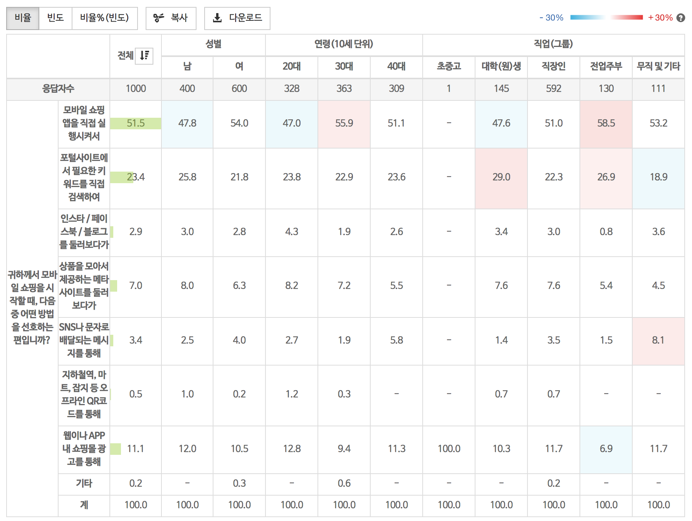

## 1. 생각해봅시다
 * 클XXXX 개발팀에 성격이 괴팍하기로 유명한 유XX 부장있다. 유XX 부장은 세상에 안 되는 일은 없다고 믿는 그런 부류의 사람이다. 개발에 관해서도 밑에 직원들이 안된다고 어렵다고 하소연해도 막무가내로 밀어 붙이면 된다고 평소 이야기 하곤 했다.

 * 여러분은 클XXXX 입사하는 행운을 얻지만, 재수없게 유XX 부장 팀에 배정받는 불행을 덤으로 받는다.

 * 최근 유XX 부장은 아래과 같은 설문 조사 결과를 분석하는 솔루션을 개발했다.

 * 

 * 제품이 잘 팔리기 시작하면서 PDF 또는 HWP 파일로 저장해 달라는 고객 요청이 쇄도하고 있어 골치가 아프다.

 * 이때, 유XX 부장 눈에 신입사원 여러분이 보인다.

 * 유XX 부장은 여러분에게 10분 안에 설문 조사 결과를 어떻게 하면 PDF 또는 HWP 파일로 저장할 수 있을지 방안을 마련해 보고하라는 임무를 주고서 홀연히 사라진다.
