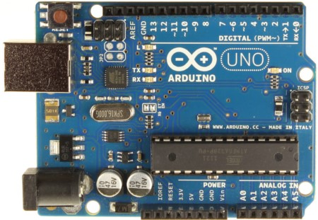
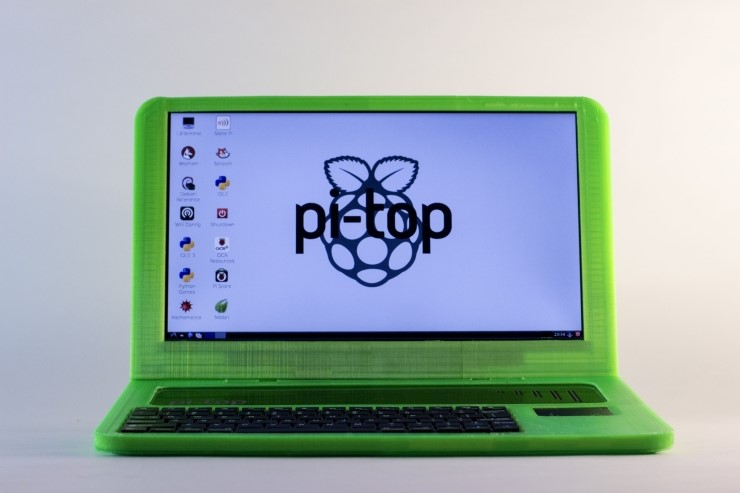
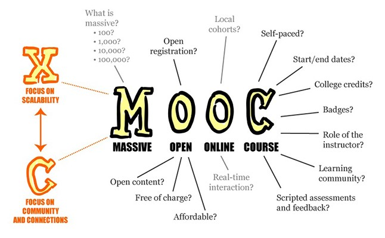
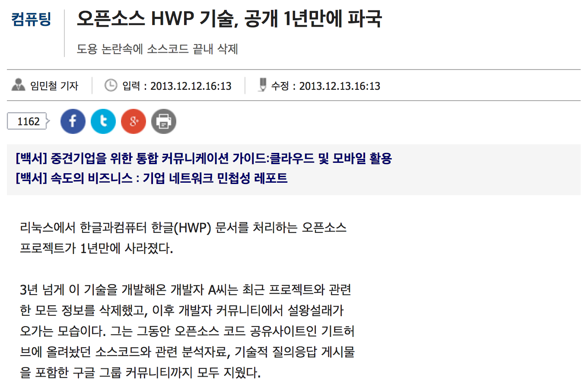
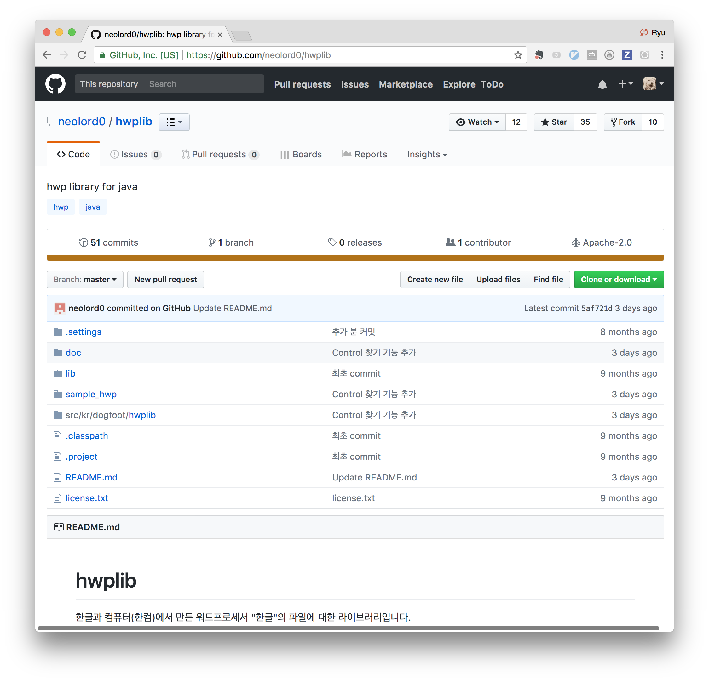

## 1. 오픈소스(Open Source)
 * 오픈소스(Open Source), 또는 공개 소프트웨어는 저작권자가 소스코드를 공개하여 누구나 특별한 제한 없이 자유롭게 사용, 복제, 배포, 수정할 수 있는 소프트웨어이다. 오픈소스는 소스를 공개한다는 면에서 Freeware, Shareware와 다르며, 오픈소스 이니셔티브(OSI)라는 단체에서 오픈소스에 대한 라이선스와 가이드를 제시하고 있다.

## 2. 오픈소스의 장점
  * 낮은 진입비용
    - 오픈소스는 무료로 다운로드 및 소스코드의 수정/재배포가 가능하므로 일반적으로 초기 개발비용이 새로 개발하는 것에 비해 1/2 정도인 것으로 알려져 있다.
  * 빠르고 유연한 개발
    -  오픈소스 커뮤니티는 보통 최신 기술 정보 및 문제점과 해결책을 공유하는 형태로 자유롭게 운영되기 때문에 독점 프로그램에 비해 기술 발전 속도가 빠르다.
  * 호환성
    - 오픈소스는 주로 오픈포맷 또는 프로토콜을 사용하기 때문에 서로 다른 소프트웨어간 상호연동성이 보장된다. 모든 기기들이 서로 다른 네트워크를 통해 하나로 연결되는 유비쿼터스 시대에 필수적인 요소이다.
  * 신뢰성과 안정성
    - 오픈소스의 개발 과정을 보면 전세계에 있는 수많은 우수한 개발자들이 직접 개발과 디버깅 과정에 참여하기 때문에 폐쇄적으로 개발되는 독점 프로그램에 비해 비교적 안정적으로 동작한다. 하지만 신뢰성과 안정성은 많은 개발자들이 적극적으로 참여할 때에만 가능하므로, 사용하고자 하는 오픈소스의 개발과정, 평판 등을 주의깊게 살펴보아야 한다. 실제로 잡다한 수많은 오픈소스들이 있기 때문에 쓸만한 오픈소스를 가려내는 것이 중요하다.

## 3. 오픈소스의 단점
 * 애플리케이션의 부족
   - 대부분의 이용자들이 MS 윈도우즈기반의 GUI에 익속한 반면, 오픈소스는 GUI가 일반적이지 않습니다. 또 오픈소스는 리눅스 기반으로 개발된 애플리케이션이 많기 때문에 윈도우즈 기반 애플리케이션과 호환되지 않는 문제점도 있다.
 * 빈약한 문서
   - 오픈소스를 수정하여 원하는 애플리케이션을 제작하고자 할 경우 문서화가 중요한데, 상용 프로그램에 비해 오픈소스는 체계적인 문서를 갖지 않은 경우가 많다. 경우에 따라서는 개발과정을 지체시키는 원인이 되기도 한다.
 * 불확실한 로드맵
   - 오픈소스는 영리를 목적으로 하는 회사에서 개발되는 것이 아니라 개인의 자발적인 참여를 통해 개발되는 경우가 많기 때문에 독점 프로그램에서 볼 수 있는 로드맵을 기대하기 어렵다. 어느날 갑자기 단종되고, 업그레이드가 중단되는 경우도 있다.
 * 지적재산권
   - 일반적으로 오픈소스를 수정한 프로그램은 사용료 없이 배포할 것을 요구하고 있다. 따라서 기업이 보유한 특허를 소스코드에 포함시켜 재배포하려는 경우 반드시 명확한 입장을 밝히고 오픈소스 저작권자의 정책을 고려해야 한다.

## 4. 오픈소스의 비용
  * 라이센스료
    - 일반적으로 오픈소스는 무료라는 편견이 있다. 오픈소스는 엄연히 라이센스를 가지고 있는 소프트웨어로 라이센스 비용이 발생할 수 있다.
  * 유지보수
    - 관리, 모니터링, 제어 등 유지보수 및 업데이트 및 업그레이드 비용, 기술지원비용.
  * 교육/훈련
    - 개발자/관리자 교육.
  * 보안
    - 보안 관련 패치의 설치/개발 비용.
하드웨어 유지보수

## 5. 오픈소스의 이익
 * 아키텍처의 효용성
   - 필요한 IT 기능을 적시에 사용 가능.
 * 유연성
   - 필요할 때 필요한 기능을 가져다 쓸 수 있다.
 * 고품질
   - IT 아키텍처와 어플리케이션에 대한 결함율 감소.
 * 문제 해결
   - 커뮤니티를 통한 빠른 문제 해결.
 * IT 담당자의 역량 강화

## 6. 오픈소스의 위험
 * 기술 지원 문제
   - 오픈소스에 대한 지원의 보장이 부족하다.
 * 필요한 기능의 부재
 * 고객의 요구에 부합하지 않는 릴리스 계획
 * 보안
   - 오픈소스의 경우 커뮤니티에서 제공하는 최신 보안 patch의 반영을 소홀히 할 경우 보안 위험이 발생할 수 있다.
 * 지적재산권
   - 개발자의 라이센스 위반의 위험성을 내포한다.
 * 출처 : http://www.ezmeta.co.kr/page/?p=1055

## 7. 오픈소스하드웨어
우리가 익히 알고 있는 오픈소스 프로젝트는 소프트웨어의 소스를 공개하는 것처름 오픈소스 하드웨어는 하드웨어를 구성하는 회로도, 파트리스트 등을 일반인에게 공개한 제품을 말한다. 오픈소스하드웨어(Open Source Hardware Association)에서는 오픈소스하드웨어에 대한 정의를 아래처럼 하고 있다.
> 오픈 소스 하드웨어는 누구나 이 디자인이나 이 디자인에 근거한 하드웨어를 배우고, 수정하고, 배포하고, 제조하고 팔 수 있는 그 디자인이 공개된 하드웨어이다. 하드웨어를 만들기 위한 디자인 소스는 그것을 수정하기에 적합한 형태로 구할 수 있어야 한다. 오픈 소스 하드웨어는 각 개인들이 하드웨어를 만들고 이 하드웨어의 사용을 극대화 하기 위하여, 쉽게 구할 수 있는 부품과 재료, 표준 가공 방법, 개방된 시설, 제약이 없는 콘텐트 그리고 오픈 소스 디자인 툴을 사용는 것이 이상적이다. 오픈 소스 하드웨어는 디자인을 자유롭게 교환함으로써 지식을 공유하고 상용화를 장려하여 사람들이 자유롭게 기술을 제어할 수 있도록 한다.

  * 마이크로 컨트롤 : 아두이노(Arduino), https://www.arduino.cc/
     - 
  * 자동차 분야 : OSVehicle, https://www.osvehicle.com/
     * 
  * 주거분야 : WikiHouse, https://wikihouse.cc/
     - 
  * 로봇분야 : Poppy, https://www.poppy-project.org/en/, 오픈 소스 로봇, 휴머노이드 타입은 85cm, 무게 3.5kg, 25개 부위를 모터로 움직일 수 있다.
     -    
  * 컴퓨터 : Pi-Top, https://pi-top.com/, Raspberry Pi를 노트북처럼 사용하기 위한 프로젝트.
    - 

## 8. MOOC(Massive Open Online Course, 온라인 공개 수업)

> MOOC는 ‘온라인 공개 수업(Massive Open Online Course)’의 약자다. 보통 ‘무크’라고 읽는다. MOOC의 사전상 의미는 ‘대규모 사용자를 대상으로 제공하는 온라인 공개 수업’이다. 일반적으로 대학 수업을 온라인으로 접속해 들으면서 동시에 무료로 들을 수 있는 강의를 MOOC라고 표현한다. 광범위하게는 테드(TED)같은 1회성 강의도 MOOC에 포함되고, 유료 강의도 역시 MOOC로 보기도 한다. MOOC는 2012년께부터 본격적인 관심을 받았으며, 최근엔 MOOC 플랫폼 수도 점점 늘어나면서 그 영향력이 확장되고 있다.
>
> -- 네이버 지식백과 --

2002년 미국 매사추세츠공대(MIT)가 정규 강의를 인터넷에 공개하면서 OCW(Open Course Ware, 오픈코스웨어) 형태로 온라인 강좌를 시작한 이래 세계적으로 수많은 대학과 기관이 온라인을 통해 강좌를 오픈하고 있다.

   * MIT 오픈 강의(https://ocw.mit.edu/index.htm)
     * MIT에서 진행되는 강의를 동영상으로 만들어 강의 자료와 함께 제공됨.
     * MIT 학생이 아니어도 강의를 들을 수 있음.

   * 칸아카데미(https://ko.khanacademy.org/)
      * 인도인 살만 칸이 운영하는 비영리 교육 사이트.
      * 한국어 칸아카데미 : https://ko.khanacademy.org/
      * 보다 자세한 이야기는 http://www.bloter.net/archives/255550

   * KOCW(http://www.kocw.net/)
     * 서울대, 연세대, 한국과학기술원 등 국내 89개 대학과 기관에서 제공하는 동영상 강의 및 강의록을 다운로드 받아 볼 수 있다.
   * SNOW(http://www.snow.or.kr/)
     * 하버드대, 버클리대, 스탠퍼드대 등 국내 10여개 대학 강의과 한글 번역문을 제공.

## 8. 오픈소스 라이선스(Open Source License)
* AL(Apache License)
   * 아파치 라이선스는 아파치소프트웨어재단에서 만든 SW에 적용하기 위해 만든 라이선스이다.
   * 소스코드 공개 의무 같은 의무사항은 없지만, 아파치 라이선스 소스코드를 수정해 배포하는 경우 아파치 라이선스 버전 2.0을 꼭 포함시켜야 하며 아파치재단에서 만든 소프트웨어임을 밝혀야 한다.
   * 적용 사례
      - 안드로이드(https://source.android.com/)
      - 하둡(http://hadoop.apache.org/)
* GPL
  * 자유소프트웨어재단에서 만든 라이선스.
  * GNU 프로젝트로 배포하는 소프트웨어(Emacs, GNU 디버거(GDB), GNU 컴파일러 모음(GCC) 등)에 적용하기 위해 리처드 스톨만이 만들었다.
  * 가장 큰 특징은 자유소프트웨어재단답게 가장 강력한 제약 조건을 포함하고 있는 카피레프트 조항이다. GPL 프로그램은 어떤 목적으로, 어떤 형태로든 사용할 수 있지만 사용하거나 변경된 프로그램을 배포하는 경우 무조건 동일한 라이선스 즉, GPL로 공개해야 한다.
  * 적용 사례
    - 모질라 파이어폭스(https://www.mozilla.org/)
    - 깃(Git)(http://hadoop.apache.org/)
    - 마리아 DB(https://mariadb.org/)
* AGPL
  * GPL을 기반으로 만든 라이선스로 버전1, 2는 아페로, 가장 최신 버전인 버전3은 자유소프트웨어재단에 의해 개발됐다.
  * 수정한 소스코드를 서버에서만 사용하는 개발자가 그 프로그램을 배포하지 않을 경우 사용자는 소스코드를 가질 수가 없는 문제를 해결하기 위해 마련됐다.
  * 서버에서 프로그램을 실행해 다른 사용자들과 통신하면, 실행되고 있는 프로그램의 소스코드를 사용자들이 다운로드할 수 있게 해야 한다는 독특한 조항을 담고 있다.
  * 적용 사례
    - 몽고DB(http://www.mongodb.org/)
* LGPL
  * 자유소프트웨어재단의 강력한 철학이 담긴 GPL의 카피레프트 조항을 보완하기 위해 만든 라이선스다.
  * GPL은 단순히 소프트웨어를 사용하기만 하더라도 해당 소스코드를 GPL로 공개해야 하는 부담감 때문에 상용 소프트웨어로 쓰기 부담스럽다는 단점이 있다.
  * 그래서 좋은 자유 소프트웨어 제품이 더 많이 쓰이고 표준이 되도록 유도하기 위해 단순한 라이브러리·모듈 링크를 허용한 라이선스이다.
  * 원래는 한정된 라이브러리에만 적용하려는 의도로 ‘Library GPL’이라는 이름을 붙였으나, 모든 라이브러리에 적용된다는 오해를 사 ‘Lesser GPL’로 변경됐다.
  * 적용 사례
    - 모질라 파이어 폭스(https://www.mozilla.org/)
* MIT License
  * MIT 라이선스는 미국 매사추세츠공과대학교(MIT)에서 해당 대학 SW 공학도들을 돕기 위해 개발한 라이선스다.
  * 라이선스와 저작권 관련 명시만 지켜주면 되는 라이선스로, 가장 느슨한 조건을 가진 라이선스 중 하나이기 때문에 인기가 많다.
  * 적용 사례
    - 부트스트랩(http://getbootstrap.com/)
    - Angular.js(https://angularjs.org/)
    - jQuery(http://jquery.com/)

* BSD(Berkeley Software Distribution) License
  * 버클리의 캘리포니아대학에서 배포하는 공개 SW 라이선스다.
  * BSD 자체가 공공기관에서 만들어낸 것이므로 공공의 몫으로 돌려주자는 의미가 강하므로, 라이선스 자체에는 아무런 제한 없이 누구나 자신의 용도로 사용할 수 있다.
  * 라이선스 및 저작권 표시 조건 외엔 제약이 없는, 굉장히 자유로운 라이선스 중 하나이다.
  * 적용 사례
    - Nginx(http://nginx.org/)

 > 카피레프트(copyleft)란 독점적인 의미의 저작권(카피라이트, copyright)에 반대되는 개념이며, 저작권에 기반을 둔 사용 제한이 아니라 저작권을 기반으로 한 정보의 공유를 위한 조치이다. 카피레프트를 주장하는 사람들은 보통, 지식과 정보는 소수에게 독점되어서는 안 되며, 모든 사람에게 열려 있어야 한다고 주장한다. 카피레프트는 정보를 사용할 권리를 2차저작물의 저작자에게 전달하며, 또 이러한 권리의 전달을 막지 않을 것을 주요 요건으로 삼고 있다. -- 위키 --

 * 출처 : http://www.bloter.net/archives/209318

## 9. 오픈소스에서 사용하는 라이선스 현황

Rank | License | %
-----|-----|-----
1 | MIT License | 32%
2 | GNU General Public License (GPL 2.0) | 18%
3 | Apache License 2.0 | 14%
4 | GNU General Public License (GNU) 3.0 | 7%
5 | BSD License 2.0 (3-clause, New or Revised) License | 6%
6 | ISC License | 5%
7 | Artistic License (Perl) | 4%
8 | GNU Lesser General Public License (LGPL) 2.1 | 4%
9 | GNU Lesser General Public License (LGPL) 3.0 | 2%
10 | Eclipse Public License (EPL) | 1%
11 | Microsoft Public License | 1%
12 | Simplified BSD License (BSD) | 1%
13 | Code Project Open License 1.02 | 1%
14 | Mozilla Public License (MPL) 1.1 | < 1%
15 | GNU Affero General Public License v3 or later | < 1%
16 | Common Development and Distribution License (CDDL) | < 1%
17 | DO WHAT THE FUCK YOU WANT TO PUBLIC LICENSE | < 1%
18 | Microsoft Reciprocal License | < 1%
19 | Sun GPL with Classpath Exception v2.0 | < 1%
20 | zlib/libpng License | < 1%
* https://www.blackducksoftware.com/top-open-source-licenses

## 10. 오픈소스 소송 사례
  * 한글과 컴퓨터
    * http://www.bloter.net/archives/279617
    * > 한글과컴퓨터(한컴)가 국제소송에 휘말리면서 오픈소스 업계 시선을 받고 있다.
      >
      > 한컴이 ‘고스트스크립트‘라는 오픈소스를 무단 도용해고스트스크립트 개발사이자 미국 소프트웨어 업체 아티펙스로부터 소송을 당했다고 5월11일 (현지시간) <쿼츠>가 보도했다.
      >
      > 고스트스크립트는 PDF 모듈 관련 오픈소스 프로그램이다. 한컴 오피스 제품군을 설치하면 ‘한컴 PDF’라는 가상 프린터가 설치된다. 고스트스크립트는 여기에 쓰이는 오픈소스 코드이다.
      >
      > 오픈소스 소프트웨어는 개발을 위해 누구나 사용할 수 있도록 코드가 공개된 소프트웨어이다. 이를 사용하기 위해서는 ‘GPL(General Public License, 일반 공중 사용 허가서)’이라는 라이선스에 따라야 한다. 라이선스에 따르면 이 오픈소스로 다른 소프트웨어를 만들었을 때 그 결과물 역시 공개해야 한다.
      >
      > 반면, 때에 따라 듀얼 라이선스가 적용되기도 한다. 이 경우 결과물을 오픈소스로 공개하고 싶지 않으면 해당 소스의 저작권자에게 라이선스 비용을 지급하면 된다. 아티펙스의 고스트스크립트가 듀얼 라이선스가 적용되는 경우이다.
  * 삼성전자
    * http://www.etnews.com/201308230436
    * > 삼성전자의 오픈소스 관리체계에 구멍이 뚫렸다. 삼성전자는 최근 오픈소스 저작권 위반 사실을 뒤늦게 알고 소스코드를 공개하는 등 수습에 나섰다. 하지만 공개된 소스코드에 마이크로소프트 특허 기술도 포함돼 있어 향후 특허 분쟁 이슈로 확대될 가능성이 있는 것으로 알려졌다.
      >
      > 25일 업계에 따르면 삼성전자는 지난 16일 `삼성 오픈소스릴리즈센터`를 통해 갤럭시탭 등 스마트기기에 활용되는 파일시스템 `exFat` 소스를 공개했다.
      >
      > 사건은 오픈소스SW 분야 유명 사이트인 `GitHut`에 유럽거주 모 여대생이 삼성전자가 제너럴퍼블릭라이선스(GPL)가 적용된 오픈소스 컴포넌트를 사용했으나 의무적으로 공개하지 않고 있다고 주장하며 관련 소스를 직접 올리면서 시작됐다. 삼성전자는 논란이 커지자 한 달 만에 소스코드를 공개하는 등 조치를 취했다. 삼성전자와 관련해 특허권이 아닌 오픈소스 라이선스가 문제로 거론된 것은 이번이 처음이다.
      >
      > 업계 한 관계자는 “삼성전자가 제 3자에 의해 소스코드 공개 의무를 지키지 않았다는 것을 알게 된 것은 그만큼 관리를 소홀히 해왔다는 것이 드러난 것”이라며 “국내 기업 가운데 가장 광범위하게 오픈소스를 활용하고 있는 삼성전자에서 오픈소스 관리 전담 인력 및 시스템이 제대로 갖춰져 있지 않았다는 게 이해가 되지 않는다”고 말했다.
      >
      > 오픈소스는 누구나 무료로 이용할 수 있고 공개된 소스코드를 기반으로 프로그램을 변형할 수도 있지만 일정한 라이선스 조건을 준수해야 한다. 오픈소스 라이선스 조건을 위반하면 저작권 위반 혹은 라이선스계약 위반에 따른 책임을 부담하게 된다.
      >
      > 삼성전자는 늦게나마 소스코드를 공개함에 따라 법적 분쟁까지는 확대되지 않을 것으로 업계 전문가들은 예상하고 있다. 하지만 공개한 `exFat` 파일시스템에 마이크로소프트의 특허 기술이 일부 포함돼 있어 앞으로 특허권 분쟁으로 번질 가능성이 높다고 지적했다.
      >
      > 관련 분야 국내 한 변호사는 “삼성이 공개한 exFat 드라이버를 제 3자가 활용하면 특허 침해로 문제가 될 수 있다”며 “exFat 드라이버 이용자를 위해 특허 침해 대응방안과 같은 오픈소스 컴플라이언스 정책을 마련해야 한다”고 말했다.
      >
      > 한편, 삼성전자 측은 이에 대해 공식적인 입장을 밝히지 않았다.
      >
      * 삼성(http://opensource.samsung.com/)
        * 삼성에서 제품에 사용된 오픈소스을 공개하는 사이트. 최근에 출시된 캘럭시는 물론이고, 예전 제품에서 사용된 소스 중 오픈소스 라이선스에 해당하는 부분들이 무료로 제공된다.

## 11. 오픈 소스의 또 따른 이야기

전문 : http://www.zdnet.co.kr/news/news_view.asp?artice_id=20131211160511

 * ### 전문 요약
   * A씨 3년 넘게 개발한 한글 문서(HWP)을 처리하는 라이브러리를 오픈 소스로 공개함.
   * 일부 몰상식한 개발자가 A씨가 공개한 기술을 마치 독자적으로 만든 것처럼 꾸며 정부 지원 사업에 참여함.
   * 이 사실을 발견한 A씨가 정부에 이의를 제기하였고 결국, A씨 기술을 도용한 프로젝트는 제재를 받음.
   * 분노한 A씨는 오픈 소스 프로젝트를 중단하고 관련 자료를 모두 삭제함.
 * ### 현실
   * 매번 기분 나쁘게 버그 리포트를 보낸 사람과 소스 코드를 공개하지 않는 것으로 추정되는 사람 때문에 심적 고통을 받고 안구 질환으로 눈에 영구적 손상(시력 저하)을 입었다 함.

## 12. 그럼에도 불구하고
https://github.com/neolord0/hwplib

 * 그냥 재미로
 * 남들로 부터 피드백을 받는 게 좋아서
 * 세상에 나아지는데 조금이나마 보탬이 되고자 재능 기부하려고
 * 자기 실력을 과시 하려고
 * 돈을 벌려고
 * 취업 하려고

그럼에도 불구하고 사람들은 무지개처럼 다양한 이유로 계속 오픈 소스 프로젝트를 계속 진행하고 있음.

## 13. 퀴즈
  * [문제]
  1. (주관식) 오픈소스 라이선스에는 GPL(General Public License), LGPL(Lesser General Public License), MPL(Mozilla Public License), BSD(Berkeley Software Distribution), AL(Apache License)이 있다. 이 중 사용에 가장 엄격한 라이선스는 ( _____ ), 가장 유연한 라이선스는 ( _____ )이다.
  2. (주관식) 오픈소스 SW는 여러 개 중복해서 써도 될까? ( _____ )
  3. (O/X문제) 오픈소스 SW는 특별한 등록절차를 거치지 않아도 만든 즉시 저작권 즉 권리가 생긴다. ( )
  4. (O/X문제) C언어, 베이직, 코볼과 같은 프로그램 언어는 저작권으로 보호받을 수 없다. (  )
  5. (O/X문제) GPL 라이선스는 외부에 배포하지 않고 내부에서 하나의 그룹웨어를 쓸 경우 저작권 위반이 아니다. ( )
  6. (주관식) 친구 3명이 오픈소스 SW를 사용해 프로그램을 만들었다. GPL과 MPL이 적용된 오픈소스 SW를 이용해 만들었다. 외부에 공개하진 않고 친구끼리 내부 블로그에 프로그램을 올렸다. 이 경우 저작권을 침해한 것일까? ( _____ )
  7. (O/X문제) 오픈소스 라이선스 문제는 개발자는 알 필요 없고, 법무팀이 주로 맡아서 해야 한다. ( )
  * [정답]
  1. GPL / BSD
      - 오픈소스 SW는 만든 단체나 성격에 따라 서로 다른 라이선스를 따른다. GPL(General Public License)은 가장 많이 사용되는 대표 오픈소스 라이선스다. 리눅스, 아파치, 위키백과, 파이어폭스도 GPL을 적용하고 있다. 또한 GPL은 그 안에서 버전이 여러 개 나뉘고 각각 적용하는 규칙이 달라 더욱 꼼꼼히 확인해야 한다. GPL이 적용돼 있는 오픈소스 SW는 복제와 개작, 배포가 자유롭게 허용된다. 사용 자체도 자유롭다. 하지만 소스를 수정한다면 이에 대한 소스코드를 공개해야 하고, 소스코드를 제공받을 수 있는 방법에 대해서도 설명해야 한다. BSD 라이선스는 미국 정부 예산으로 운영되는 것으로, 사용자에게 사용상 제한을 가하지 않는 편이다. 따라서 BSD 라이선스는 오픈소스 SW의 상업적 이용을 무제한 허용하면서 2차 저작물 개발도 제한 없이 허용한다. 즉, SW의 소스코드를 구해 수정한 뒤 소스를 공개하지 않아도 판매할 수 있다.
   2. 일부는 그렇고, 일부는 그렇지 않다
      - 오픈소스 SW는 일단 라이선스만 명시하면 바로 배포할 수 있을까. 이 부분은 국내 개발자들이 가장 많이 실수하는 부분이다. 함께 써도 되는 오픈소스 SW도 있지만, 함께 쓰면 외부에 배포할 수 없는 오픈소스 SW도 있다. 따라서 외부에 공개할 경우, 자신이 쓰고 있는 오픈소스 SW 라이선스가 서로 충돌하지 않는지 확인해야 한다. 즉, ‘라이선스 양립성(호환성)’을 확인해야 한다. 예를 들어 GPL과 MPL은 함께 사용해 배포할 수 없다. 하지만 GPL 버전3과 아페로GPL 버전3은 함께 사용할 수 있다.
   3. O
      - 이는 저작권법에 따라서 인정되는 부분이다. 따라서 ‘Copyrightⓒ’이나 ‘All Rights Reserved’라는 표시를 하지 않아도 되고, 특정 기관에 개발자가 만든 오픈소스 SW를 등록하지 않아도 저작권은 생겨난다.
   4. O
      - 프로그래밍 언어, 통신 프로토콜, 아이디어 수준의 알고리즘 등은 저작권으로 보호받을 수 없다. 이런 부분까지 제한되면, 창작물을 표현하는 데 한계가 오기 때문이다. 저작권 이론상으로 표현을 제한하는 경우 해당 창작물은 저작권으로 인정하지 않고 있다.
   5. O
      - 오픈소스 SW는 외부에 배포했을 경우 문제가 생긴다. 회사에서 오픈소스 SW 여러개를 이용해 그룹웨어 1개를 만들고, 이를 내부 서버에서 올려 사용하고 있다고 치자. 1개의 프로그램이 회사 안에서만 쓰고, 외부에 배포하지 않았기 때문에 저작권을 위반한 게 아니다.
   6. 저작권 위반
      - e메일로 단둘이 파일을 주고받는 것은 괜찮다. 하지만  블로그나 내부 카페 등에 창작물을 올릴 때는 전송권을 잘 따져봐야 한다. 아무리 게시글에 비밀번호를 걸거나 특정인만 접속할 수 있는 카페나 커뮤니티에 파일을 올려도, 저작권법이 적용된다. 그러니 친구들끼리 사용하기 위해 오픈소스 SW를 만들고 인터넷에 올리려면 라이선스도 함께 확인해야 한다. 위 경우 GPL과 MPL을 동시에 쓸 수 없으므로 저작권을 위반한 셈이다.
   7. X
      - 오픈소스 SW를 사용하면 어떤 기능에 어떤 오픈소스 SW를 썼는지 명시해 한다. 만약 여러개의 오픈소스 SW를 사용했다면 직접 개발한 당사자가 아닌 외부 사람이 일일이 해당 부분을 확인하기 힘들다. 따라서 개발자 스스로가 기능 구현과 오픈소스 SW 사용 현황을 명확히 알고 있어야 한다. 오픈소스 SW 사용에 대한 표시는 소스코드 자체에 주석 처리로 넣기도 하며 별도의 페이지를 만들어 해당 오픈소스 SW에 대한 소개와 소스코드를 볼 수 있게 지원하기도 한다. 오픈소스 SW 종류나 라이선스에 따라 명시 방법도 다르다. 기업 담당자는 이러한 정보를 개발자에게 교육시켜야 한다.

  출처 : http://www.bloter.net/archives/204916

## 14. 오픈소스 관련 사이트
  * 오픈소스SW 라이선스 종합정보시스템(https://olis.or.kr)
  * 공개SW 포털(http://www.oss.kr)
  * GNU GPL에 대한 빈번한 질문들(https://www.gnu.org/licenses/gpl-faq.ko.html)
  * 오픈소스 소프트웨어 라이센스 가이드(http://wiki.kldp.org/wiki.php/OpenSourceLicenseGuide)

