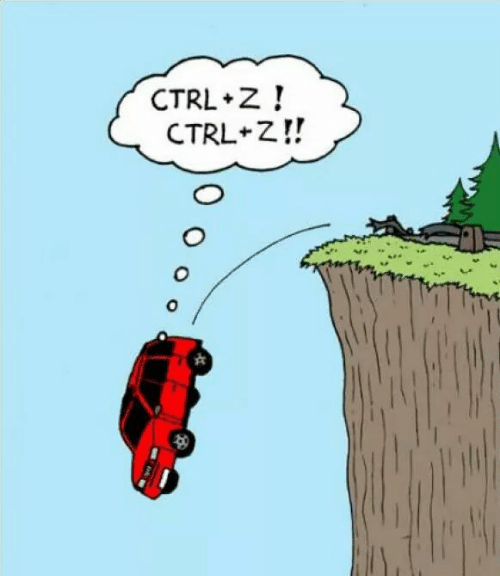
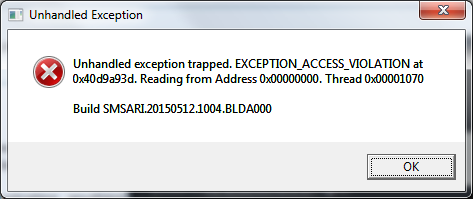
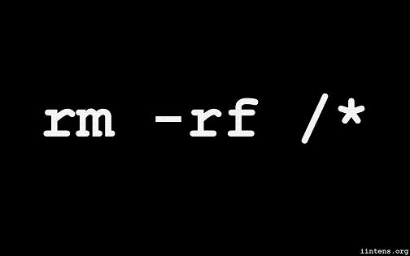
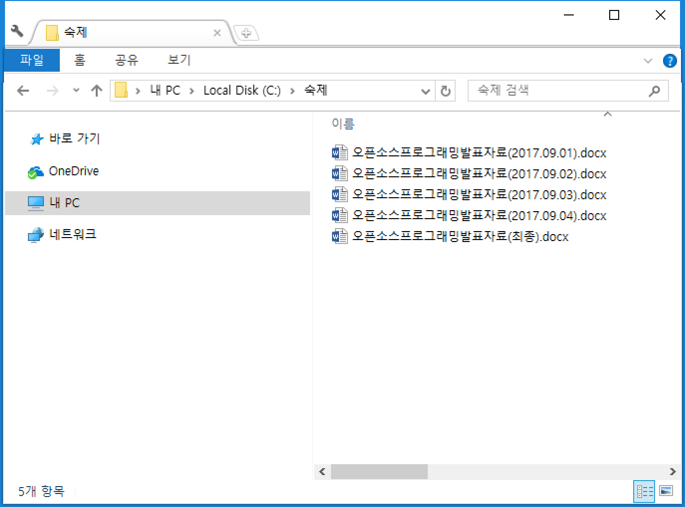
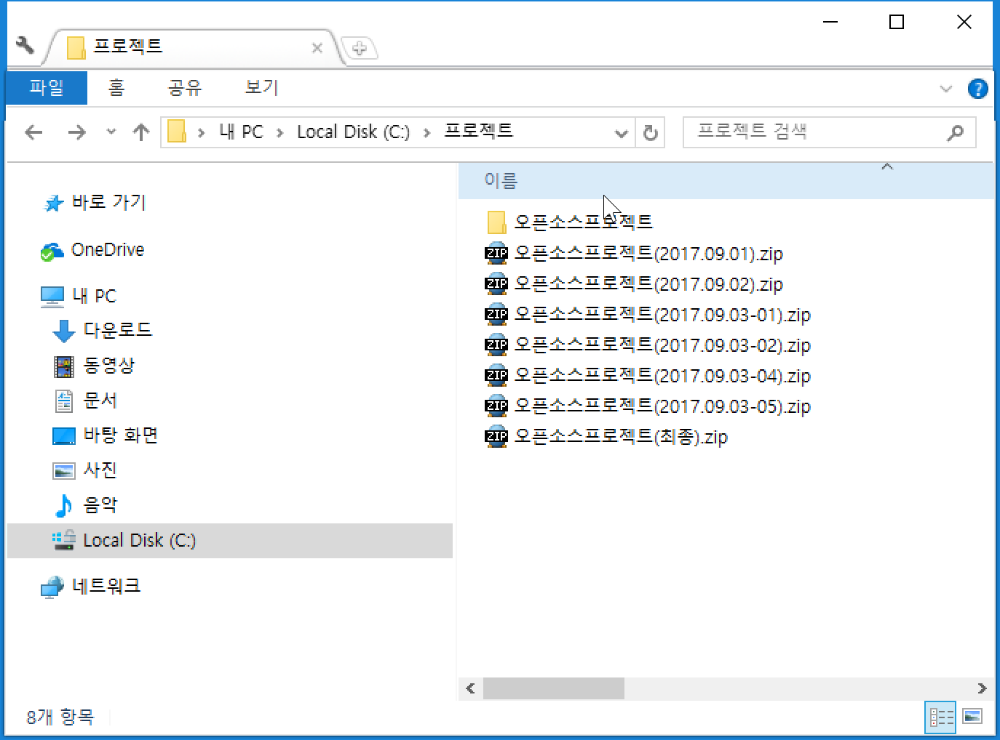
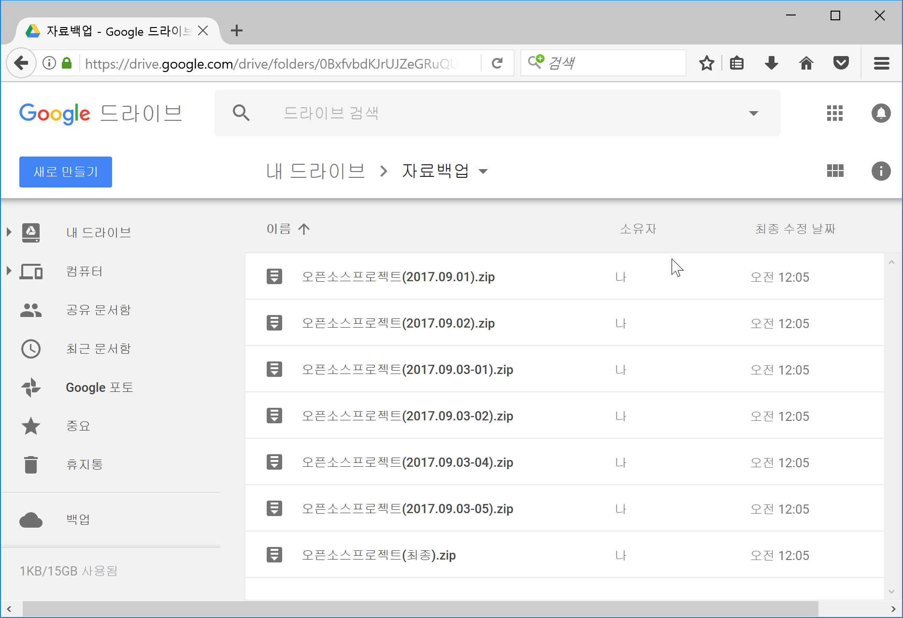
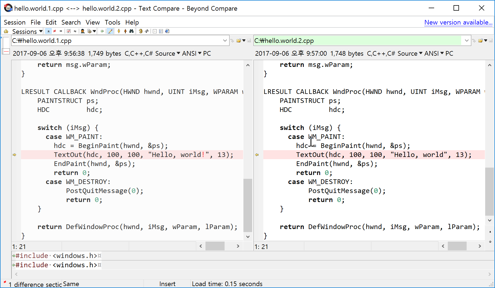
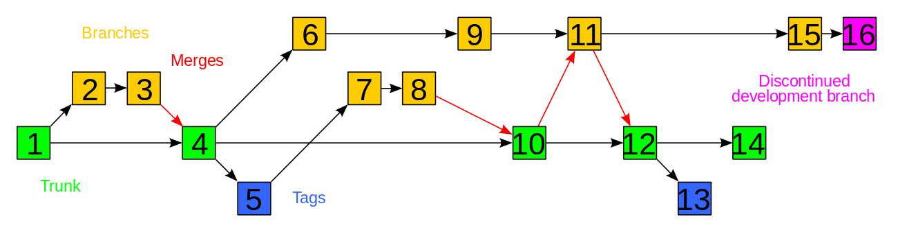
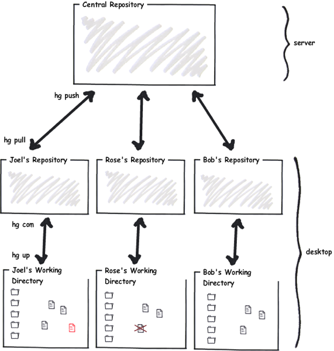
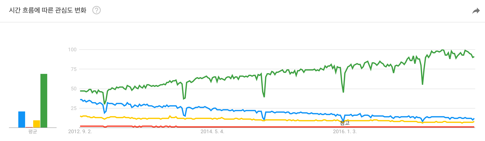

## 1. 실행취소(Undo, Ctrl-Z)
우리가 프로그램을 작성 할 때 오타와 삭제를 두려워 하지 않는 이유는 언제든지 수정할 수 있고 복원할 수 있기 때문이다. 상상하기 끔찍하지만 타자기로 개발한다고 가정해보자. 1000라인을 작성하고서 마지막 한 글자를 잘 못 친 순간 처음부터 다시 코딩해야 한다. 코딩 지옥에 빠지는 순간이다. 끔찍하지 않은가?
 * 
 * 대부분 프로그램은 실행취소(Ctrl-Z)라는 마법과도 같은 기능을 제공 하고 있어 실수를 두려워할 이유가 없다.
 * 하지만 프로그램을 닫고 나면 복구 불가능하다.

## 2. 우리를 두려움에 떨게 하는 것
   *  프로그램이 비정상 종료하여 몇 시간 동안 작업한 것이 한 순간에 사라지는 일.
     - 
   *  실수로 모든 폴더를 삭제하는 일 - 미친짓 같지만 실제로 벌어짐.
     - 
   *  실수로 복원이 불가능한 삭제를 하는 일.
     - 

## 3. 자료 백업(Backup)
백업이란 단어를 사용하지 않더라도 위에서 알아본 불의 사고로 부터 소중한 자료를 지키기 위해 "자료 보관 잘해" 라는 이야기는 한 번쯤은 들어 봤을 것이다. 여기서 자료란 매우 다양한다.
  * 여행을 좋아하는 친구들에겐 여행의 자취가 남은 사진이나 동영상이 될 수도 있고,
  * 숙제가 많은 학생들에겐 밤새 작성한 레포트가 될 수도 있고,
  * 개발자에겐 몇 년 동안 작성한 프로그램 코드일 수도 있고,
  * 글을 쓰는 작가에겐 자식같은 원고일 수도 있고,
  * 사진을 찍는 작가에겐 몇 년동안 작업한 사진일 수도 있고,
  * 제안 발표가 있는 사람에겐 사업 수주 여부가 걸린 중요한 파워포인트 자료가 될 수도 있고,
  * 너무 많아서 서술 불가능..

소 잃고 외양간 고치지 말고 "자료 보관 잘해" 라고 충고는 하지만 보관 방법을 알려주지 않는다. 그래서 각자 나름의 방법으로 자료를 백업한다. 백업의 자료는 다양하지만 백업 방법은 서로가 엇비슷하다.

  * 파일 이름에 날짜 또는 버전을 붙여서 보관한다.
    *  
  * 백업할 파일이 너무 많다. 폴더를 통째로 압축해서 보관한다.
    * 
  * 컴퓨터가 해킹을 당하거나 하드가 물리적으로 깨질까봐 겁난다. 클라우드(구글 드라이브, 네이버 N 드라이브)에 파일을 올린다.
    * 

## 4. 파일 비교(Diff)

*  hello.world.cpp.version 1.0
```c++
#include <windows.h>

LRESULT CALLBACK WndProc(HWND, UINT, WPARAM, LPARAM);

int WINAPI WinMain(HINSTANCE hInstance, HINSTANCE hPrevInstance,
		   LPSTR szCmdLine, int iCmdShow) {
    static char szAppName[] = "winhello";
    HWND        hwnd;
    MSG         msg;
    WNDCLASSEX  wndclass;

    wndclass.cbSize         = sizeof(wndclass);
    wndclass.style          = CS_HREDRAW | CS_VREDRAW;
    wndclass.lpfnWndProc    = WndProc;
    wndclass.cbClsExtra     = 0;
    wndclass.cbWndExtra     = 0;
    wndclass.hInstance      = hInstance;
    wndclass.hIcon          = LoadIcon(NULL, IDI_APPLICATION);
    wndclass.hIconSm        = LoadIcon(NULL, IDI_APPLICATION);
    wndclass.hCursor        = LoadCursor(NULL, IDC_ARROW);
    wndclass.hbrBackground  = (HBRUSH) GetStockObject(WHITE_BRUSH);
    wndclass.lpszClassName  = szAppName;
    wndclass.lpszMenuName   = NULL;

    RegisterClassEx(&wndclass);


    hwnd = CreateWindow(szAppName, "Hello, world!",
			WS_OVERLAPPEDWINDOW,
			CW_USEDEFAULT, CW_USEDEFAULT,
			CW_USEDEFAULT, CW_USEDEFAULT,
			NULL, NULL, hInstance, NULL);

    ShowWindow(hwnd, iCmdShow);
    UpdateWindow(hwnd);

  while(GetMessage(&msg, NULL, 0, 0)) {
	  TranslateMessage(&msg);
	  DispatchMessage(&msg);
  }

    return msg.wParam;
}

LRESULT CALLBACK WndProc(HWND hwnd, UINT iMsg, WPARAM wParam, LPARAM lParam) {
    PAINTSTRUCT ps;
    HDC         hdc;

    switch (iMsg) {
      case WM_PAINT:
      	hdc = BeginPaint(hwnd, &ps);
      	TextOut(hdc, 100, 100, "Hello, world!", 13);
      	EndPaint(hwnd, &ps);
      	return 0;
      case WM_DESTROY:
	       PostQuitMessage(0);
	       return 0;
    }

    return DefWindowProc(hwnd, iMsg, wParam, lParam);
}
```

* hello.world.cpp.version 2.0
```c++
#include <windows.h>

LRESULT CALLBACK WndProc(HWND, UINT, WPARAM, LPARAM);

int WINAPI WinMain(HINSTANCE hInstance, HINSTANCE hPrevInstance,
		   LPSTR szCmdLine, int iCmdShow) {
    static char szAppName[] = "winhello";
    HWND        hwnd;
    MSG         msg;
    WNDCLASSEX  wndclass;

    wndclass.cbSize         = sizeof(wndclass);
    wndclass.style          = CS_HREDRAW | CS_VREDRAW;
    wndclass.lpfnWndProc    = WndProc;
    wndclass.cbClsExtra     = 0;
    wndclass.cbWndExtra     = 0;
    wndclass.hInstance      = hInstance;
    wndclass.hIcon          = LoadIcon(NULL, IDI_APPLICATION);
    wndclass.hIconSm        = LoadIcon(NULL, IDI_APPLICATION);
    wndclass.hCursor        = LoadCursor(NULL, IDC_ARROW);
    wndclass.hbrBackground  = (HBRUSH) GetStockObject(WHITE_BRUSH);
    wndclass.lpszClassName  = szAppName;
    wndclass.lpszMenuName   = NULL;

    RegisterClassEx(&wndclass);


    hwnd = CreateWindow(szAppName, "Hello, world!",
			WS_OVERLAPPEDWINDOW,
			CW_USEDEFAULT, CW_USEDEFAULT,
			CW_USEDEFAULT, CW_USEDEFAULT,
			NULL, NULL, hInstance, NULL);

    ShowWindow(hwnd, iCmdShow);
    UpdateWindow(hwnd);

  while(GetMessage(&msg, NULL, 0, 0)) {
	  TranslateMessage(&msg);
	  DispatchMessage(&msg);
  }

    return msg.wParam;
}

LRESULT CALLBACK WndProc(HWND hwnd, UINT iMsg, WPARAM wParam, LPARAM lParam) {
    PAINTSTRUCT ps;
    HDC         hdc;

    switch (iMsg) {
      case WM_PAINT:
      	hdc = BeginPaint(hwnd, &ps);
      	TextOut(hdc, 100, 100, "Hello, world", 13);
      	EndPaint(hwnd, &ps);
      	return 0;
      case WM_DESTROY:
	       PostQuitMessage(0);
	       return 0;
    }

    return DefWindowProc(hwnd, iMsg, wParam, lParam);
}
```
 * 

## 5. 버전 관리 시스템이란?
버전 관리 시스템에서 버전(version)은 변경된 이력을 의미한다. 많은 프로그램들이 기능이 개선되었다는 의미에서 버전업이란 용어를 사용하기도 한다. 버전관리 시스템은 코드의 변화를 관리하는 시스템이다. 각각의 변화를 저장해서 현재 코드의 상태가 어떤 맥락을 거쳐서 지금의 상태가 되었는지를 파악하고, 문제가 생겼을 때 과거로 돌리는 등의 기능을 제공한다. 특히 소프트웨어를 개발하는 회사에서 프로그램 소스 코드는 매우 중요한 자산이다. 이러한 중요한 소스 코드를 안전하게 보관한다는 의미에서 백업의 기능도 한다. 또, 여러 사람이 협업을 할 때 발생할 수 있는 충돌이나 유실을 방지하는 역할도 수행한다.
 * 영어로는 Version Control System 이라고 하며, VCS 라는 용어로도 많이 부른다.
 * 버전 관리 시스템은 우리가 앞서 무식하게 손으로 했던 사본 생성, 보존, 복원을 한 번에 해줄 수 있는 도구이다.
 * 버전 관리 시스템은 프로그램 개발에서 빼놓을 수 없는 도구로 자리잡고 있다.


## 6. 버전 관리 시스템에서 사용하는 용어
 * 저장소(Repository, 레파지토리)
   - 일반적으로 프로젝트의 최상위 디렉토리.
   - 프로젝트의 모든 파일에 대한 이력이 저장되는 곳.
 * 체크아웃(Check out)
   - 서버 저장소에 보관된 소스를 로컬로 가져오는 것.
 * 커밋(Commit)
   - 마무리한 작업에 작업 이력을 기록해서 저장소로 보내는 행위.
   - 일기로 하루의 기록이 남는 것처럼 커밋을 함으로써 작업한 내용이 버전 관리 시스템에 기록이 됨.
   - 오늘 내가 하루 종일 무엇을 했는지 기록을 남기기 위해 퇴근전 데일리 커밋을 하는 개발자도 있음.
 * 브랜치(Branch) - 작업 분기 (https://opentutorials.org/course/303/2288)
    - 나무 가지라는 뜻으로 개발 과정에서 분기가 필요할 때 사용됨.
    - 
    - 브랜치의 예
      - 나는 트위터에서 일하고 있다. 팔로우/팔로잉의 숫자에 집착하는 것이 싫어서 이 수치를 안보이게 하는 기능을 개발해보고 싶다. 근데 사장님이 허락할지 모르겠다. 일단 실험적으로 만들어봐야겠다.
      - 나는 애플에서 일하고 있다. 베터리가 많이 소모되는 문제를 발견해서 고치려고 하는데, 잡스가 새로운 글꼴을 빨리 적용하고 싶다며 업데이트를 종용한다. 이번 업데이트에 베터리 문제를 반영하는 것을 시간적으로 촉박하니까 브랜치에서 작업을 하다가 다음 업데이트에 반영되도록 해야겠다.
 * 태그(Tag)
    - 프로젝트에서 중요한 시점들을 기록해두는 방법. 브랜치가 작업의 시작이라면 태그는 작업의 끝인셈.
    - 
    - 2017년 12월 25일은 월요일이자 크리스마스라는 태그가 달려있다.
 * 병합(Merge)
    - 내가 작업한 브랜치와 다른 사람이 작업한 브랜치를 병합하는 것.
    - 
    - 병합의 예
      - 나는 트위터에서 일하고 있다. 얼마전 팔로우/팔로잉의 숫자에 집착하는 것이 싫어서 이 수치를 안보이게 하는 기능을 개발해보고 싶어 브랜치를 하나 만들어 실험을 했다. 실험이 성공적으로 끝나서 욕은 커녕 사장님한테 칭찬을 받았다. 더불어 트위터의 새로운 기능으로 추가히기로 했다. 내가 작업했던 브랜치를 메인 브랜치에 병합했고 다음 릴리즈를 기다리고 있다.
      - 나는 애플에서 일하고 있다. 잡스 형님의 부재로 시간이 남아 돌고 있다. 베터리가 많이 소모되는 문제를 해결하기 위해 브랜치에서 작업하단 것이 완료 되었다. 다음 업데이트할 때 메인 브랜치와 병합해 업데이트 해야 겠다.
 * 되돌리기(Revert)
    - 작업한 코드에 버그가 있을 때 이전 상태로 돌아가 다시 개발한다.
    - 몇 개월 동안 작업 했지만 기술적인 한계로 개발을 포기하고 이전 상태로 다시 돌아감.
    - 사람은 누구나 실수할 수 있다. 이력만 남아 있다면 옛날로 돌아갈 수 있다.

## 7. 버전 관리 시스템의 종류
 버전 관리 시스템은 매우 많은 종류가 있지만 크게 '클라이언트-서버' 모델과 '분산' 모델로 나뉜다.

* 클라이언트-서버 모델
  * 
  * 하나의 중앙 저장소를 공유한 후 각각의 클라이언트(개발자)는 저장소의 일부부만을 갖는 형태.
  * 자신이 작업하는 일부분만 로컬에 저장한 후 작업하는 형태.
  * 중앙 저장소에서 프로젝트 관리의 모든 것을 처리함.
  * 서버가 고장나면 불완전한 로컬의 사본만 남게되어 복구가 어려움.
  * 서버와 통신이 지속적으로 이루어지기 때문에 네트워크가 느린 경우 작업에도 영향을 미친다.

* 분산 모델
  * 
  * 클라이언트(개발자)가 전체 저장소에 대한 개별적인 로컬 저장소를 갖고 작업하는 형태.
  * 모든 클라이언트는 온전한 전체 저장소의 사본을 로컬에 가지게 됨.
  * 북학의 핵공격으로 서버가 파괴되어도 클라이언트에 있는 사본으로 복구가 가능하다.

* 클라이언트-서버 / 분산 모델 비교
  * 
## 8. 대표적인 버전 관리 시스템
* CVS
  * 클라이언트-서버 방식의 대표적인 버전 관리 시스템
  * 1986년 딕 그룬이 개발했으며 가장 오래된 버전 관리 시스템 중에 하나임.
  * CSV는 서버의 저장소에 프로젝트의 온전한 원본이 있고, 클라이언트 각각은 서버에서 파일을 가져다가(Check out) 로컬 저장소에서 변경한 뒤 변경된 내역을 서버에 다시 보냅니다.
  * 파일 각각의 버전을 관리하고 추적할 수 있다.
  * 파일 이름이 변경되거나 이동되는 것을 자동으로 추적하지 못하는 등 생각보다 많은 한계가 있다.
  * 프로젝트의 완전한 버전은 오직 서버에만 존재하기 때문에 서버에 사고가 생기면 프로젝트를 복구하는 방법이 매우 제한적이다.
  * 공식 웹사이트 : http://www.nongnu.org/cvs/

* SVN(Subversion, 서브버전)
  * CVS의 여러 단점을 개선한 클라이언트-서버 방식의 버전 관리 시스템.
  * 2000년 콜럽넷(http://www.collab.net/)에서 개발했으며 현재는 아파치 재단에서 관리하고 있음.
  * CVS와 비교하면 파일 이름 변경, 복사, 이동, 삭제 등의 작업 내역을 유지하는 히스토리를 만든다는 장점이 있음.
  * CVS에 비해 브랜칭(Branching) 작업이 가벼워 졌다.
  * 
  * SVN 에서의 작업 흐름.
    - 
  * 공식 웹사이트 : https://subversion.apache.org/

* Mercurial(머큐리얼)
  * 2005년 매트 맥컬이 개발한 분산 모델의 버전 관리 시스템.
  * 대부분의 명령이 서브버전과 공통으로 사용하는 부분이 있어 기존 서브버전 사용자들이 쉽게 적응할 수 있다는 장점이 있음.
  * 
  * 공식 웹사이트 :  https://www.mercurial-scm.org/
  * 한국어 튜토리얼 : https://www.mercurial-scm.org/wiki/CategoryKorean

* Git(깃)
  * 2005년 리누스 토발스가 개발한 분산 모델의 버전 관리 시스템.
  * 공식 웹사이트 :  https://git-scm.com/

> 현장에서 접할 수 있는 대표적인 버전 관리 시스템은 SVN과 Git 정도임.

## 9. 구글 트렌드로 알아본 버전 관리 시스템(https://trends.google.co.kr/)
 * 시간 흐름에 따른 관심도 변화
    * 순위
       1. Git(녹색)
       2. SVN(파란색)
       3. Mercurial(노란색)
       4. CVS(빨간)
    * 

 * 지역별 관심도
    * 

## 10. Git
Git은 앞에서 소개한 것처럼 분산 관리 시스템 중 하나임. 2005년 탄생했으며 개발자는 전 세계 오픈 소스 개발자 중에서 아마 가장 유명할 것으로 자신할 수 있는 리눅스 커널 개발자인 리누스 토발스임.
> 

Git 이 개발된 일화는 굉장히 유명함. 2002년, 원래 리눅스 커널은 버전을 관리하기 위해 BitKeeper 라고 불리는 분산 버전 관리 시스템을 도입. 하지만 2005년, BitKeeper 가 무료 사용에 난색을 보이면서 리눅스 커뮤니티와 틀어지게 됨. 이에 분노한 리누스 토발스는 불과 2주 만에 리눅스 커널 버전을 관리하기 위해 Git을 만들게 됨.

## 11. Git의 목표
  * Git은 완벽한 분산 환경에서 빠르고 단순하게 수백 수천 개의 동시 다발적인 브랜치 작업을 수행하는 것을 목표로 함.
  * 리눅스 커널 같은 대형 프로젝트의 버전 관리를 가능하게 하는 것 또한 목표로 함.

## 12. Git의 장점
 * 전 세계 수많은 사용자가 사용 함(1등만 기억하는 더러운 세상)
   - 선택이 어려울 땐 점유율이 1등인 제품을 선택한다.
 * Git을 사용한 저장소를 공유 사이트인 GitHub 웹 사이트의 존재.
    - GitHub 을 통해 내가 만든 코드를 전세계에 공유할 수 있음.
    - 반대로 GitHub 에 올라온 오픈 소스를 내가 활용할 수 도 있음.
 * 사용자 수에서 나오는 어마어마한 숫자의 튜토리얼과 프로젝트가 존재.
   - 사용 중에 문제가 발생하더라도 인터넷에 참고할 만한 자료가 많음.
   - 주위에 사용하는 사람이 많기 때문에 얼마든지 도움 받을 수 있다.
 * 이러한 대중성과 검증된 안정성 때문에 수많은 기업에서 버전 관리 시스템으로 Git을 책태하고 있음.

## 13. Git의 특징
 * 로컬 및 원격 저장소 생성.
 * 로컬 저장소에 파일 생성 및 추가.
 * 수정 내역을 로컬 저장소에 제출.
 * 파일 수정 내역 추적.
 * 원격 저장소에 제출된 수정 내역을 로컬 저장소에 적용.
 * master 에 영향을 끼치지 않는 브랜치 생성.
 * 브랜치 사이의 병합.
 * 브랜치를 병합하는 도중의 충돌 감지.

## 14. Git으로 협업해야 하는 이유
대학교의 팀 프로젝트라고 해도 보통은 3~4명이 한 팀을 이루게 됨. 개인 프로젝트가 아닌 이상 최소한 2명 이상 협업한다는 뜻임. 그리고 각자 팀원이 맡은 역할에 따라 자신이 맡은 부분을 만들어 나가게 되곤 함.

하지만 협업할 때 모두가 동일한 버전의 프로젝트 리소스를 사용하기는 매우 힘듬. 누구를 기준으로 '최신' 버전을 맞출 것인지, 파일 주고받기는 어떻게 해야 할지 등이 고민됨. 어느 누군가 작업하고 있던 컴퓨터가 통째로 고장 나는 운이 나쁜 일이 발생하기라도 하면 해당 팀원이 담당하고 있던 부분이 아예 백지가 되어버릴 수도 있음.

2명 이상 같은 파일을 작업하는 상황을 생각해보자. 처음에는 각자 맡은 기능을 착실히 구현해 나가고 있지만 어느 날 공통 부분 혹은 다른 사람이 작업한 부분을 자신이 수정해야 하는 때가 생긴기 마련이다. 작업한 부분을 서로 '최신' 버전으로 맞추기 위해 대조하는 순간 모든 것이 꼬이기 시작한다.

다른 상황을 생각해보자. 겉으로 보기엔 프로젝트의 모든 것이 정상인 것처럼 보인다. 하지만 어느 순간 누가 담당했는지 모를 코드들이 하나둘 씩 생김. 누구도 자신이 이 코드를 생산했다고 이야기 하지 않음. 코드들이 어떤 역할을 하는지 정확히 파악할 수 없는 지경에 이름. 아무런 문제 없이 프로젝트의 모든 것이 순조롭게 흘러갈 수도 있다. 하지만 여전히 언제 누가 무엇을 했느냐를 기록하는 것은 숙제로 남는다.

지금까지 나열한 모든 문제점들은 Git을 이용해 협업하면 해결할 수 있다. 협업하는 데 있어 중요한 팀원 사이의 버전 맞춤, 할당된 작업의 결과물 관리, 특정 결과물이 누구의 것인지 추적하는 것이 Git을 이용함으로써 가능해짐.


## 15. 왜 버전 관리 시스템을 배워야 하는가?
학생 시절에는 딱히 버전 관리의 필요성을 느끼지 못함. 길어야 한 학기에서 두 학기 정도만 하면 끄타는 프로젝트가 대부분이고, 그 정도면 매먼 코딩할 때마다 파일의 사본을 만들어 두는 것도 그다지 큰일이 아님. 결국, 버전 관리 시스템을 도입해야 할 정도로 규모 있는 프로젝트를 겪을 일이 없다는 의미임.

버전 관리 시스템의 필요성은 사실 개발자가 가장 심하게 느낌. 어느 정도 경험이 쌓이면 버전 관리의 필요성을 절감함. 프로젝트에 관련된 리소스 중 제일 빈번하게 발생하는 생성, 삭제, 수정되는 것은 코드임. 단 한 줄의 코드로 버그가 생기느냐, 성능이 향상되느냐가 갈림. 미세한 차이가 있는 버전들이라고 해도 그냥 넘어가면 안됨.

 * 무언가 잘못되었을 때 복구를 돕기 위하여
 * 프로젝트 진행 중 과거의 어떤 시점으로 돌아갈 수 있게 하기 위하여
 * 여러사람이 같은 프로젝트에 참여할 경우, 각자가 수정한 부분을 팀원 전체가 동기화하는 과정을 자동화하기 위하여
 * 소스 코드의 변경 사항을 추적하기 위하여
 * 소스 코드에서 누가 수정했는지 추적하기 위하여
 * 대규모 수정 작업을 더욱 안전하게 진행하기 위하여
 * 브랜치로 프로젝트에 영향을 최소화 하면서 새로운 부분을 개발하기 위하여
 * 많은 오픈 소스 프로젝트에서 어떠한 형태로든 버전 관리를 사용하고 있으므로
 * 코드의 특정 부분이 왜 그렇게 쓰여 졌는지 의미를 추적하기 위하여

## 16. 마지막
 * 버전 관리 시스템이 없다고 프로그램 개발을 못하는 것은 절대 아니다.
 * 버전 관리는 습관이고 한 번 익숙해지면 빠져 나올 수 없을 만큼 매력적일 뿐만 아니라 위기에서 우리를 구해줄 수 있다.
 * 이 좋은 걸 못 배우면 몸이 고생한다, 개발할 때 반드시 버전관리하자.
