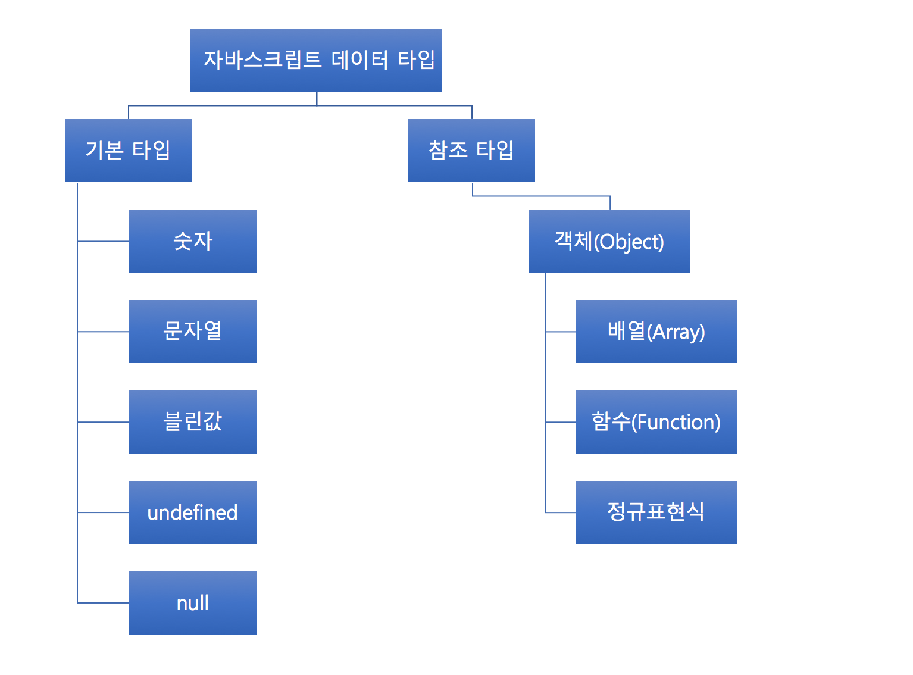

# 자바스크립트(JavaScript)
## 자바스크립트 소개
 - <u>자바스크립트</u>는 웹 브라우저에서 동작하는 스크립트 언어이다.
 - 초창기 웹 페이지 제작에 있어서 보조적인 기능을 수행하기 위한 용도로 사용됨.
 - jQuery(http://jquery.com/)의 등장으로 보다 쉽게 DOM 을 핸들링하게 되면서 많은 발전을 이룸.
 - 현재 오픈소스 개발 사이트인 github.com 의 프로젝트 중에서 가장 많이 사용하는 언어이기도 하다.

## 자바스크립트 활용 범위
현재 브라우저 기반의 자바스크립트 라이브러리 뿐만 아니라, Node.js와 같은 서버 기반의 자바스크립트 환경에서 동작할 수 있는 각종 라이브러리까지 쏟아져 나오고 있다. 이제는 자바스크립트만으로 웹 서버와 클라이언트 웹 페이지 개발을 동시에 할 수 있는 수준까지 도달했다.

 * 웹 개발
   - 현재 크롬이나 파이어폭스 등 웹 브라우저들이 나날이 발전하고 있다. 새 버즌을 내놓을 때마다 항상 강조하는 것이 자바스크립트 엔진의 성능 향상에 관한 것이다. 이는 웹 페이지를 개발하는 데 있어서 자바스크립트의 역할이 얼마나 큰지를 방증한다. 이제는 자바스크립트를 완벽하게 이해하지 못하면 좋은 웹 개발자라는 말을 들을 수 없게 되었다.
 * 서버 개발
    - Node.js의 출현으로 자바스크립트의 활용한 서버 개발도 활발히 이루어지고 있다. express, socket.io 등의 라이브러리는 보다 쉽게 자바스크립트로 서버를 개발할 수 있는 환경을 제공해준다.

## 자바스크립트와 객체지향 프로그래밍
자바스크립트는 클래스를 지원하지 않지만 객체지향 프로그래밍이 가능하다. 프로토타입 체인과 클로저로 객체지향 프로그래밍에서 제시하는  상속, 캡슐화, 정보 은닉 등의 개념을 소화할 수 있다. 실제로 GOF의 디자인 패턴을 자바스크립트로 구현한 코드들이 많이 공개되어 있고, 많은 개발자들의 관심을 받고 있다.

```javascript
// ES6(EcmaScript 6, 자바스크립트 언어 명세서)에는 객체지향언어에서 볼 수 있는 클래스와 상속의 개념을 지원한다.
// class, extents, get, set, constructor 등의 키워드가 새롭게 추가됨.
class Rectangle{
  constructor() {
    this._width = 10;
    this._height = 10;
  }

  set width(w){
    this._width = w;
  }

  get width(){
    return this._width;
  }

  set height(h){
    this._height = h;
  }

  get height(){
    return this._height;
  }
}

class Square extends Rectangle {
  set width(w){
    super.width = w;
    super.height = w;
  }

  set height(h){
    super.height = h;
    super.width = h;
  }
```

## 자바스크립트와 함수형 프로그래밍
자바스크립트는 함수형 프로그래밍이 가능하다. 함수형 프로그래밍은 높은 수준의 모듈화를 가능케 하기 때문에 매후 효울적인 프로그래밍 방식이다. 자바스크립트는 주요 특성인 일급 객체로서의 함수 특성과 클로저를 활용하여 이를 가능케 한다. 하지만 이 때문에, 가독성을 떨어뜨리기도 한다. 과도하게 클로저를 사용하거나 함수형 프로그래밍 기법으로 구현된 코드는 제 3자가 해석하기가 상당히 난해하다.

## 자바스크립트의 단점
자바스크립트는 상당히 유연한 언어이고 뛰어난 표현력을 가지고 있다. 하지만 이러한 특성때문에 종종 디버깅에 어려움 겪기도 한다. 특히, 느슨한 타입 체크는 개발자에게 타입 체크에 대한 자유를 주지만, 컴파일 타임에 잡지 못하는 오류는 고스란히 런타임 어류로 발견된다.


## 자바스크립트 개발도구
 * 노트패드
 * Notepad++
   - https://notepad-plus-plus.org/
 * Sublime3
   - https://www.sublimetext.com/3
 * Atom
   - https://atom.io/
 * WebStorm
   - https://www.jetbrains.com/webstorm/

## 자바스크립트 실행 환경
 * 인터넷 브라우저
   - 크롬(Chrome)
   - 파이어폭스(FireFox)
   - 사파리(Safari)
   - 오페라(Opera)
   - 인터넷익스플로러(Internet Explorer)
 * Node.js 또는 io.js
   - [Node.js](https://nodejs.org)
   - [io.js](https://iojs.org)
 * 클라우드
   - [JSFiddle](https://jsfiddle.net)
   - [CodePen](https://codepen.io)
   - [CSS Deck](http://cssdeck.com)
   - [JS Bin](http://jsbin.com)   

## 자바스크립트의 데이터 타입




## 기본 데이터 타입
자바스크립트는 ```느슨한 타입 체크``` 언어이다. 엄격한 타입 체크 언어인 C, Java, C# 언어는 변수를 선언할 때 변수에 저장할 데이터의 종류에 따라 char, int, float 등의 예약어를 이용해서 변수의 데이터 타입을
지정한다. 반면 자바스크립트는 변수를 선언할 때 타입을 미리 정하지 않고, ```var``` 키워드로 변수를 선언 한다(ES5 기준). 변수의 이름은 $, _, 혹은 특수 문자를 제외한 모든 문자로 시작할 수 있다. ```typeof``` 연산자로 변수의 타입을 확인할 수 있다.

> ES6에는 let과 const라는 새로운 변수 선언 방법이 생겼다.

종류 | 설명 | 사용 예
---|---|----
숫자 | 숫자를 나타내는 타입.  C 언어의 경우 정수냐 실수냐에 따라 int, long, float , double 등과 같은 다양한 숫자 타입이 존재하지만, 자바스크립트는 하나의 숫자형만 존재한다. | ``` var i = 10 ```
문자열 | 문자열은 작은 따옴표(') 또는 큰 따옴표(")로 표현한다. | ``` var s = "abcd" ```
불린값 | true(참)와 false(거짓) 두 가지 값을 갖는다. | ``` var b = true ```
undefined | 값이 정의도지 않음을 나타내기 위한 자료형. 변수를 선언하고 값을 할당하지 않으면 undefined 라는 값을 갖는다. | ``` var u ```
null | 값이 없음을 나타내기위한 자료형. | ``` var n = null ```

* java
```java
public class Main {

    public static void main(String[] args) {
        byte byteValue = 100; // 8 bit
        short shortValue = 30000; // 16 bit
        int intValue = 1000000000; // 32 bit
        long longValue = 9000000000000000000L; // 64 bit
        float floatValue = 44.77F; // 32 bit
        double doubleValue = 64.7735; // 64 bit
        boolean boolValue = true; // boolean
        char charValue = 'a'; // char

        System.out.println(byteValue);
        System.out.println(shortValue);
        System.out.println(intValue);
        System.out.println(longValue);
        System.out.println(floatValue);
        System.out.println(doubleValue);
        System.out.println(boolValue);
        System.out.println(charValue);
    }
}
```

* javascript
```html
<!DOCTYPE html>
<html>
<head>
    <script type="text/javascript">
    var byteValue = 100;
    var shortValue = 30000;
    var intValue = 1000000000;
    var longValue = 9000000000000000000;
    var floatValue = 44.77;
    var doubleValue = 64.7735;
    var boolValue = true;
    var stringValue = 'javascript';
    var nullValue = null;
    var undefinedValue;

    console.log(byteValue);
    console.log(shortValue);
    console.log(intValue);
    console.log(longValue);
    console.log(floatValue);
    console.log(doubleValue);
    console.log(boolValue);
    console.log(stringValue);
    console.log(nullValue);
    console.log(undefinedValue);    

    console.log(typeof byteValue);
    console.log(typeof shortValue);
    console.log(typeof intValue);
    console.log(typeof longValue);
    console.log(typeof floatValue);
    console.log(typeof doubleValue);
    console.log(typeof boolValue);
    console.log(typeof stringValue);
    console.log(typeof nullValue);
    console.log(typeof undefinedValue);
    </script>
</head>
<body>
</body>
</html>
```


## 문자열
```html
<!DOCTYPE html>
<html>
<head>
    <script type="text/javascript">
    var text1 = "안녕하세요.";
    var text2 = '안녕하세요.';

   // 큰 따옴표(") 인용문장 출력
   // 친구가 말했다 "수업 땡땡이 치자."
    var text3 = "친구가 말했다 \"수업 땡땡이 치자. F는 우리의 몫.\"";
    var text4 = '친구가 말했다 "수업 땡땡이 치자. F는 우리의 몫."';

    // 작은 따옴표(') 인용문장 출력
    // 친구가 말했다 '수업 땡땡이 치자.'
    var text5 = "친구가 말했다 '수업 땡땡이 치자. F는 우리의 몫.'";
    var text6 = '친구가 말했다 \'수업 땡땡이 치자. F는 우리의 몫.\'';

    console.log(text1);
    console.log(text2);
    console.log(text3);
    console.log(text4);
    console.log(text5);
    console.log(text6);

    </script>
</head>
<body>
</body>
</html>
```
문자열은 문자 배열처럼 인덱스를 이용해서 접근할 수 있다. 자바스크립트에서 주의할 점은 한 번 정의된 문자열은 변하지 않는다는 것이다. 아래 자바스크립 코드에서 배열에 값을 넣는 것처럼 앞 4글자를 변경했지만 글자는 변경되지 않는다. 그렇다고 에러가 발생하지도 않는다. 한번 생성된 문자열은 읽기만 가능하지 수정은 불가능 하다.

* javascript
```html
<!DOCTYPE html>
<html>
<head>
    <script type="text/javascript">
    var language = "javascript";
    console.log(language[0]);
    console.log(language[1]);
    console.log(language[2]);
    console.log(language[3]);

    language[0] = 'A';
    language[1] = 'B';
    language[2] = 'C';
    language[3] = 'D';
    console.log(language); // javascript
    </script>
</head>
<body>
</body>
</html>
```
* java
```java
public class Main {

    public static void main(String[] args) {
        String language = "javascript";
        System.out.println(language.charAt(0));
        System.out.println(language.charAt(1));
        System.out.println(language.charAt(2));
        System.out.println(language.charAt(3));

    }
}
```

* C++
```c++
#include <iostream>
#include <string>

using namespace std;

int main() {
  string language = "javascript";
  cout << language[0] << endl;
  cout << language[1] << endl;
  cout << language[2] << endl;
  cout << language[3] << endl;

  language[0] = 'A';
  language[1] = 'B';
  language[2] = 'C';
  language[3] = 'D';

  cout << language << endl; // ABCDscript
  return 0;
}
```

## 참조 타입
자바스크립트에서 숫자, 문자열, 불린값, null, undefined 같은 기본 타입을 제외한 모든 값은 객체다. 따라서 배열, 함수는 자바스크립트 객체로 표현된다.

자바스크립트에서 객체는 단순히 '이름(key) : 값(value)' 형태의 프로퍼티들을 저장하는 컨테이너로서, 해시(Hash)라는 자료구조와 상당히 유사하다. 자바스크립트에서 기본 타입은 하나의 값만을 가지는데 비해, 참조 타입인 개체는 여러 개의 프로퍼티들을 포함할 수 있다. 이러한 객체의 프로퍼티는 기본 타입의 값을 포함하거나, 다른 객체를 가리킬 수도 있다. 이러한 프로퍼티의 성질로 객체의 프로퍼티는 함수를 포함할 수 있다. 이러한 프로퍼티를 메서드라고 부른다.

종류 | 설명 | 사용 예
---|---|----
객체(Object) | 변수와 메소드를 한 곳에 모아주는 꾸러미 역할을 한다. | ``` var obj = new Object() ```
배열(Array) | 여러 개의 데이터를 원소로 가질 수 있는 데이터 집합. | ``` var arr = new Array() ```
함수(Function) | 실행할 구문을 미리 정의해 놓고 호출하여 사용하는 실행부 | ``` function sum(a, b) { return a + b; } ```


## 연산자
종류 | 설명 | 사용 예
---|---|----
+,-,*,/ | 숫자 | 더하기, 빼기, 곱하기, 나누기
\+ | 문자열 | 문자열을 이이서 붙여줌
% | 숫자 | 나머지
++ | 숫자 | 1씩 증가
-- | 숫자 | 1씩 감소
+=, -=, *=, %= | 숫자 | 연산과 동시에 값을 할당

```html
<!DOCTYPE html>
<html>
<head>
    <script type="text/javascript">
    var a = 40;
    var b = 30;
    var c = 20;
    var d = 5;
    var e = 10;
    var sum = (a + b - c) * d / e;
    console.log(sum);
    </script>
</head>
<body>
</body>
</html>
```

```html
<!DOCTYPE html>
<html>
<head>
    <script type="text/javascript">
    var a = "자바스크립트";
    var b = "프로그래밍";
    var sum = a + b;
    console.log(sum);
    </script>
</head>
<body>
</body>
</html>
```

```html
<!DOCTYPE html>
<html>
<head>
    <script type="text/javascript">
    var a = "현재 시간은 ";
    var b = 1;
    var c = 2;
    var d = "시입니다.";
    var sum = a + b + c + d;
    console.log(sum);
    </script>
</head>
<body>
</body>
</html>
```

연산자 | 결과
---|---
문자열 + 문자열 | 문자
문자열 + 숫자 | 문자
숫자 + 문자열 | 문자
숫자 + 숫자 | 숫자


## 비교 연산자
연산자 | 사용 예 | 설명
---|---|----
== | a == b | a와 b가 같음
!= | a != b | a와 b가 다름
\> | a > b | a가 b보다 크다
< | a < b | a가 b보다 작다
\>= | a >= b | a가 b보다 크거나 같다
<= | a <= b | a와 b가 작거나 같다
=== | a === b | a와 b가 같음(자료형까지 엄격히 비교)
!== | a !== b | a와 b가 다름(자료형까지 엄격히 비교)

자바스크립트에는 두 값이 동일한지 확인하는 데 동등(==) 연산자와 일치(===) 연산자가 있다. 두 연산자의 차이는 동등(==) 연산자는 비교하려는 피연산자의 타입이 다를 경우에 타입 변환을 거친 다음 비교한다. 반면에 일치(===) 연산자는 타입이 다를 경우에 타입을 변경하지 않고 비교한다.

```html
<!DOCTYPE html>
<html>
<head>
    <script type="text/javascript">
    var a = 10;
    var b = 10;
    var c = "10";

    console.log(a == b); // true
    console.log(a == c); // true

    console.log(a === b); // true
    console.log(a === c); // false

    console.log(a == b && typeof (a) == typeof (b));
    console.log(a == c && typeof (a) == typeof (c));

    </script>
</head>
<body>
</body>
</html>
```


## 논리 연산자
연산자 | 사용 예 | 설명
---|---|----
&& | a && b | a와 b
\|\| |  a \|\| b | a와 b가 다름
! | !a | a가 b보다 크다
!! | !!a | a가 b보다 크다

```html
<!DOCTYPE html>
<html>
<head>
    <script type="text/javascript">
      console.log(true && false); // false
      console.log(true && true); // true
      console.log("string" && true); // true
      console.log(true && ""); // ""
      console.log(true && "string"); // "string"
      console.log(false && ""); // false
      console.log(false && "string"); // false
      console.log(5 && 0); // 0
      console.log(5 && -6); // -6
      console.log(5 && false); // false
      console.log(null && 0); // null
      console.log(null && ""); // null
      console.log(null && false); // null
      console.log("yes" && "no"); // "no"
    </script>
</head>
<body>
</body>
</html>
```

```html
<!DOCTYPE html>
<html>
<head>
    <script type="text/javascript">
      console.log(true || false); // true
      console.log(true || true); // true
      console.log("string" || true); // string
      console.log(true || ""); // true
      console.log(true || "string"); // true
      console.log(false || ""); // ""
      console.log(false || "string"); // "string"
      console.log(5 || 0); // 5
      console.log(5 || -6); // 5
      console.log(5 || false); // 5
      console.log(null || 0); // 0
      console.log(null || ""); // ""
      console.log(null || false); // false
      console.log("yes" || "no"); // "yes"
    </script>
</head>
<body>
</body>
</html>
```


자바스크립트에 느낌표 두개 !! 연산자는 피연산자를 불린값으로 변환한다.
```html
<!DOCTYPE html>
<html>
<head>
    <script type="text/javascript">
      console.log(!!0); // false
      console.log(!!1); // true
      console.log(!!'string'); // true
      console.log(!!'true'); // true
      console.log(!!'false'); // true
      console.log(!!''); // false
      console.log(!!true); // true
      console.log(!!false); // false
      console.log(!!null); // false
      console.log(!!undefined); // false
      console.log(!!{}); // true
      console.log(!![]); // true
      console.log(!![1, 2, 3]); // true

      console.log(!!!0); // true
      console.log(!!!1); // false
      console.log(!!!'string'); // false
      console.log(!!!'true'); // false
      console.log(!!!'false'); // false
      console.log(!!!''); // true
      console.log(!!!true); // false
      console.log(!!!false); // true
      console.log(!!!null); // true
      console.log(!!!undefined); // true
      console.log(!!!{}); // false
      console.log(!!![]); // false
      console.log(!!![1, 2, 3]); // false

    </script>
</head>
<body>
</body>
</html>
```

http://cofs.tistory.com/136
http://sonim1.tistory.com/122


## 제어문

### if

```javascript
if (condition1) {
    // block of code to be executed if condition1 is true
} else if (condition2) {
    // block of code to be executed if the condition1 is false and condition2 is true
} else {
    // block of code to be executed if the condition1 is false and condition2 is false
}
```

```html
<!DOCTYPE html>
<html>
<head>
    <script type="text/javascript">
      var greeting;
      var time = 12;

      if (time < 10) {
          greeting = "Good morning";
      } else if (time < 20) {
          greeting = "Good day";
      } else {
          greeting = "Good evening";
      }
      console.log(greeting);
    </script>
</head>
<body>
</body>
</html>      
```

### switch

```javascript
switch(expression) {
   case n:
       // code block
       break;
   case n:
       // code block
       break;
   default:
       // code block
}
```

```html
<!DOCTYPE html>
<html>
<head>
    <script type="text/javascript">
      var day;
      switch (new Date().getDay()) {
          case 0:
              day = "Sunday";
              break;
          case 1:
              day = "Monday";
              break;
          case 2:
              day = "Tuesday";
              break;
          case 3:
              day = "Wednesday";
              break;
          case 4:
              day = "Thursday";
              break;
          case 5:
              day = "Friday";
              break;
          case 6:
              day = "Saturday";
      }
      console.log(day);
    </script>
</head>
<body>
</body>
</html>        
```


### for

```javascript
for (statement 1; statement 2; statement 3) {
    // code block to be executed
}
```

```html
<!DOCTYPE html>
<html>
<head>
    <script type="text/javascript">
      for (var i = 0; i < 5; i++) {
          console.log("The number is " + i);
      }
    </script>
</head>
<body>
</body>
</html>         
```

### while

```javascript
while (condition) {
   // code block to be executed
}
```

```html
<!DOCTYPE html>
<html>
<head>
    <script type="text/javascript">
      while (i < 10) {
          console.log("The number is " + i);
          i++;
      }
    </script>
</head>
<body>
</body>
</html>        
```

### do while

```javascript
while  {
   // code block to be executed
} do (condition)
```

```html
<!DOCTYPE html>
<html>
<head>
    <script type="text/javascript">
      while {
          console.log("The number is " + i);
          i++;
      } do (i < 10);
    </script>
</head>
<body>
</body>
</html>       
```

### break / continue
```html
<!DOCTYPE html>
<html>
<head>
    <script type="text/javascript">
      for (i = 0; i < 10; i++) {
          if (i === 3) { break; }
          console.log("The number is " + i);
      }
    </script>
</head>
<body>
</body>
</html>       
```

```html
<!DOCTYPE html>
<html>
<head>
    <script type="text/javascript">
      for (i = 0; i < 10; i++) {
          if (i === 3) { continue; }
          console.log("The number is " + i);
      }
    </script>
</head>
<body>
</body>
</html>
```
## 자료형 변환

### 숫자 -> 문자열
```html
<!DOCTYPE html>
<html>
<head>
    <script type="text/javascript">
      var x = 10;
      var a = String(x)
      var b = String(123);
      var c = String(100 + 23);
      console.log(typeof(a) + " : " + a); // string : 10
      console.log(typeof(b) + " : " + b); // string : 123
      console.log(typeof(c) + " : " + c); // string : 123
    </script>
</head>
<body>
</body>
</html>
```

```html
<!DOCTYPE html>
<html>
<head>
    <script type="text/javascript">
      var x = 10;
      var a = x.toString();
      var b = (123).toString();
      var c = (100 + 23).toString();
      console.log(typeof(a) + " : " + a); // string : 10
      console.log(typeof(b) + " : " + b); // string : 123
      console.log(typeof(c) + " : " + c); // string : 123
    </script>
</head>
<body>
</body>
</html>
```

```html
<!DOCTYPE html>
<html>
<head>
    <script type="text/javascript">
      var x = 9.656;
      var a = x.toExponential(2);
      var b = x.toExponential(4);
      var c = x.toExponential(6);
      console.log(typeof(a) + " : " + a); // string : 9.66e+0
      console.log(typeof(b) + " : " + b); // string : 9.6560e+0
      console.log(typeof(c) + " : " + c); // string : 9.656000e+0
    </script>
</head>
<body>
</body>
</html>
```

```html
<!DOCTYPE html>
<html>
<head>
    <script type="text/javascript">
      var x = 9.656;
      var a = x.toFixed(0);
      var b = x.toFixed(2);
      var c = x.toFixed(4);
      var d = x.toFixed(6);
      console.log(typeof(a) + " : " + a); // string : 10
      console.log(typeof(b) + " : " + b); // string : 9.66
      console.log(typeof(c) + " : " + c); // string : 9.6560
      console.log(typeof(d) + " : " + d); // string : 9.656000
    </script>
</head>
<body>
</body>
</html>
```

```html
<!DOCTYPE html>
<html>
<head>
    <script type="text/javascript">
      var x = 9.656;
      var a = x.toPrecision();
      var b = x.toPrecision(2);
      var c = x.toPrecision(4);
      var d = x.toPrecision(6);
      console.log(typeof(a) + " : " + a); // string : 9.656
      console.log(typeof(b) + " : " + b); // string : 9.7
      console.log(typeof(c) + " : " + c); // string : 9.656
      console.log(typeof(d) + " : " + d); // string : 9.65600
    </script>
</head>
<body>
</body>
</html>
```

### 문자열 -> 숫자
```html
<!DOCTYPE html>
<html>
<head>
    <script type="text/javascript">
      var a = Number("1000");
      var b = Number("3.14");
      var c = Number("");
      var d = Number("abcd");
      console.log(typeof(a) + " : " + a); // number : 1000
      console.log(typeof(b) + " : " + b); // number : 3.14
      console.log(typeof(c) + " : " + c); // number : 0
      console.log(typeof(d) + " : " + d); // number : NaN
    </script>
</head>
<body>
</body>
</html>
```

```html
<!DOCTYPE html>
<html>
<head>
    <script type="text/javascript">
      var a = parseInt("10");
      var b = parseInt("10.3");
      var c = parseInt("10 20 30");
      var d = parseInt("10 years");
      var e = parseInt("years 10");
      console.log(typeof(a) + " : " + a); // number : 10
      console.log(typeof(b) + " : " + b); // number : 10
      console.log(typeof(c) + " : " + c); // number : 10
      console.log(typeof(d) + " : " + d); // number : 10
      console.log(typeof(e) + " : " + e); // number : NaN          
    </script>
</head>
<body>
</body>
</html>
```

```html
<!DOCTYPE html>
<html>
<head>
    <script type="text/javascript">
      var a = parseFloat("10");
      var b = parseFloat("10.3");
      var c = parseFloat("10 20 30");
      var d = parseFloat("10 years");
      var e = parseFloat("years 10");
      console.log(typeof(a) + " : " + a); // number : 10
      console.log(typeof(b) + " : " + b); // number : 10.3
      console.log(typeof(c) + " : " + c); // number : 10
      console.log(typeof(d) + " : " + d); // number : 10
      console.log(typeof(e) + " : " + e); // number : NaN          
    </script>
</head>
<body>
</body>
</html>
```

## 변수 호이스팅(Hoisting)
자바스크립트에서 모든 변수는 호이스트 된다. 호이스트(Hoist)의 사전적 의미는 끌어올리기란 뜻이다. 무엇을 끌어 올릴까?
변수 선언을 맨 위로 끌어 올린다. 변수를 맨 위로 끝어 올리면 무슨 일이 벌어 질까? 변수 선언을 나중에 하더라도 미리 변수를 참조 할 수 있다.

```html
<!DOCTYPE html>
<html>
<head>
    <script type="text/javascript">
       console.log(age); // Uncaught ReferenceError: age is not defined
    </script>
</head>
<body>
</body>
</html>
```

```html
<!DOCTYPE html>
<html>
<head>
    <script type="text/javascript">
       console.log(age); // undefined
       var age = 10;
       console.log(age); // 10
    </script>
</head>
<body>
</body>
</html>
```

```html
<!DOCTYPE html>
<html>
<head>
    <script type="text/javascript">
       var age;
       console.log(age); // undefined
       age = 10;
       console.log(age); // 10
    </script>
</head>
<body>
</body>
</html>
```


