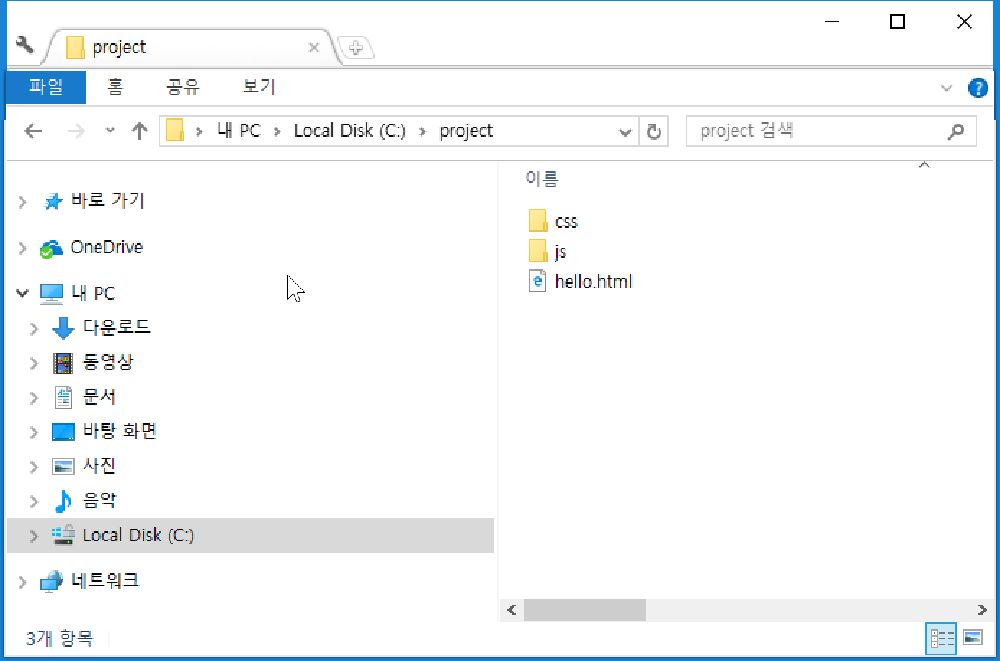
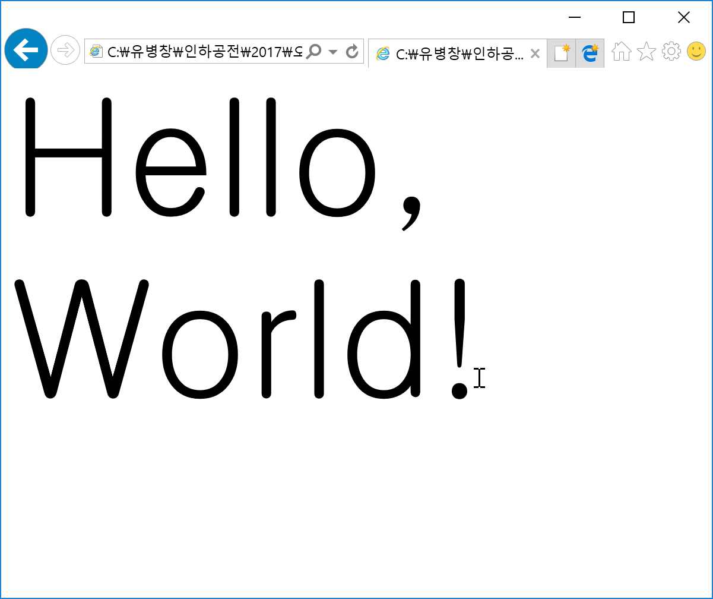

# Git 정보 변경
```bash
$ git config --global user.name "ryubcinhatc"
$ git config --global user.email "ryubc.inhatc@gmail.com"
```

```bash
$ git config --list
```

# Git 기본 작업 실습(#1)
1. 프로젝트 폴더(project)를 만든다.
2. 저장소를 만든다(git init)
3. hello.html 파일을 작성한다.
```html
<!DOCTYPE html>
<html>
	<head>
		<link rel="stylesheet" type="text/css" href="css/hello.css"/>
		<script type="text/javascript" src="js/hello.js"></script>
	</head>
<body>             
</body>
</html>
```
4. css 폴더를 만들고 hello.cs 파일을 작성한다.
```css
body {
  font-size: 100pt
}
```

5. js 폴더를 만들고 hello.js 파일을 작성한다.
```css
document.write("Hello, World!");
```


6. 브라우저에서 hello.html 파일을 확인한다.

 

7. 커밋하기 전 바로 그 "일 을 한다.
8. 작업한 내용을 저장소에 "헬로우월드 프로그램 작성" 이란 메시지로 커밋한다.
9. js 폴더를 삭제한다.
10. hello.html 파일을 아래처럼 수정한다.
```html
<!DOCTYPE html>
<html>
	<head>
		<link rel="stylesheet" type="text/css" href="css/hello.css"/>
	</head>
<body>
Hello, World!
</body>
</html>
```
11. 커밋하기 전 바로 그 "일 을 한다.
12. 작업한 내용을 저장소에 "헬로우월드 프로그램 수정" 이란 메시지로 커밋한다.
13. git log로 작업한 내용을 확인 한다.
