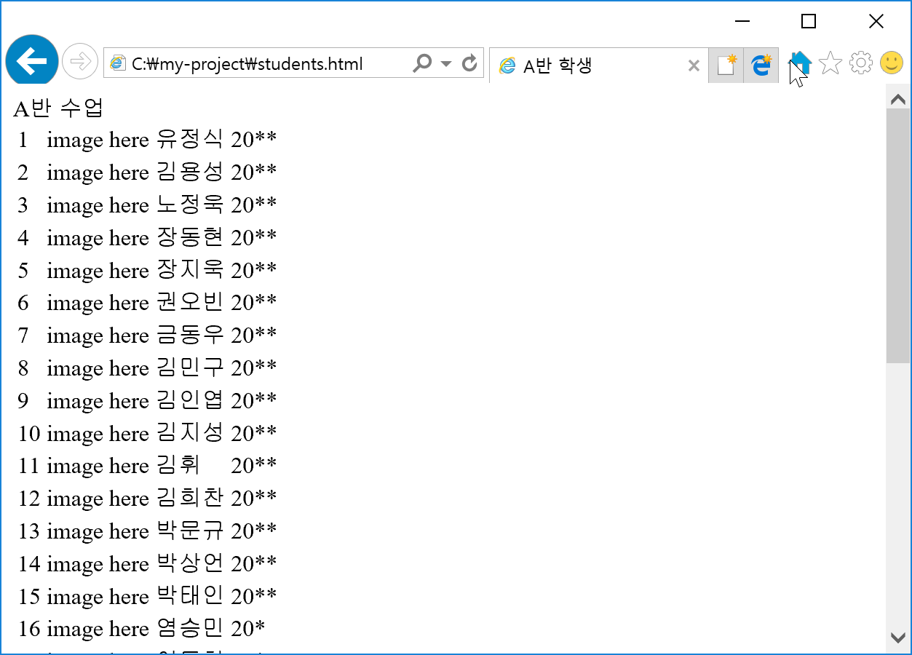
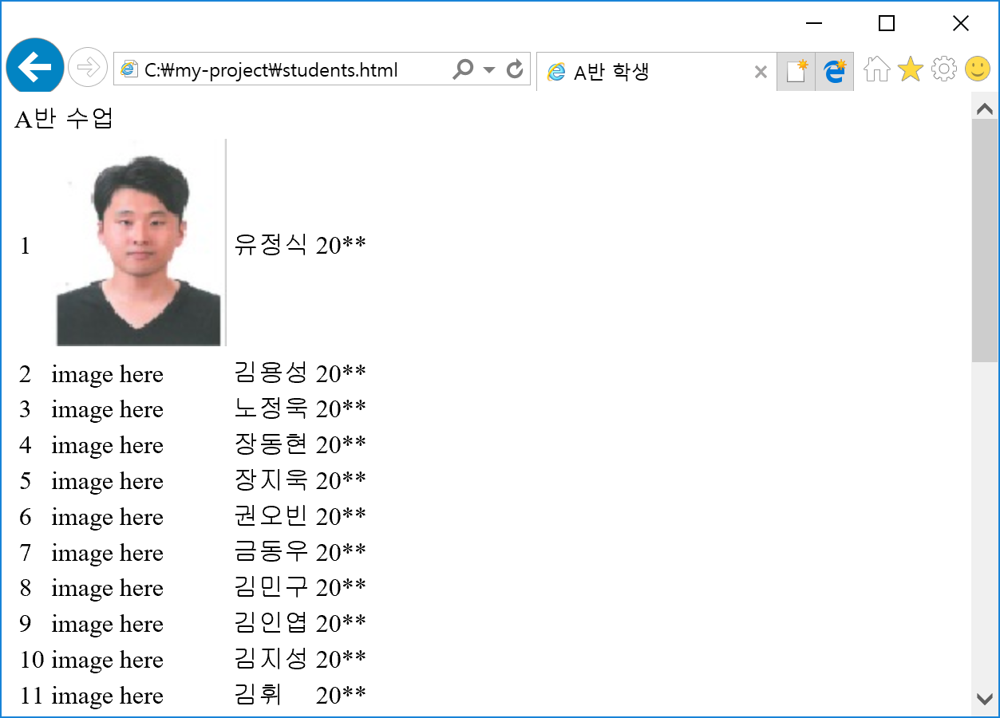
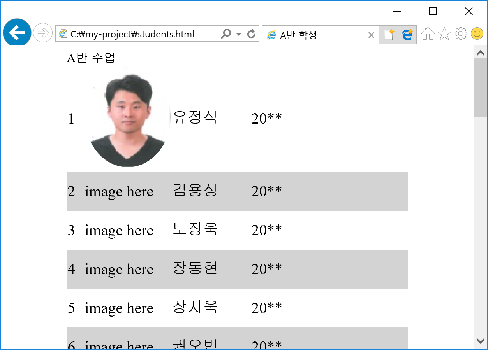
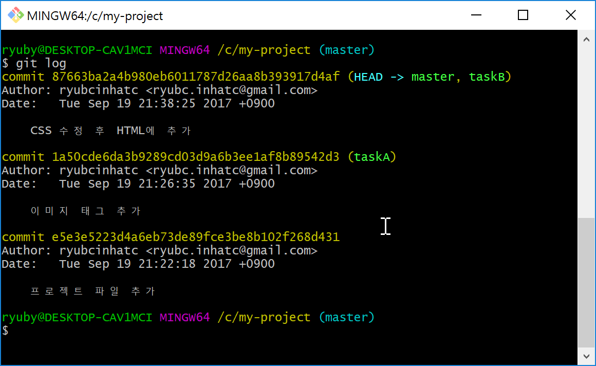

# Git 브랜치 작업 실습(#2)
1. 프로젝트 폴더(project)를 만든다.
2. 저장소를 만든다(git init)
3. 각 반에 해당하는 프로젝트를 다운로드 받는다.
  - [A반 프로젝트 파일](https://github.com/ryubcinhatc/opensource-lecture/blob/master/4-week/project/A.zip)
  - [B반 프로젝트 파일](https://github.com/ryubcinhatc/opensource-lecture/blob/master/4-week/project/B.zip)
  - [J반 프로젝트 파일](https://github.com/ryubcinhatc/opensource-lecture/blob/master/4-week/project/J.zip)  
4. 다운로드받은 프로젝트 파일을 저장소에 압축 해제한다.


5. "프로젝트 파일 추가"란 내용으로 커밋한다.
6. taskA 브랜치를 만든다.
7. taskA 브랜치로 이동한다.
8. images 폴더 안에서 자신 사진을 제외한 모든 사진을 삭제한다.  
9. 자신의 이름이 있는 테이블 행에서 "image here" 부분을 아래 이미지 태그로 변경한다.
   ```html
     
   ```
10. 브라우저에서 자신의 사진이 보이는지 확인한다.


11. "이미지 태그 추가"란 내용으로 커밋한다.
12. master 브랜치로 이동한다.  
13. taskA 브랜치에서 수정한 내용을 master 브랜치에 병합한다.
14. taskB 브랜치를 만든다.
15. taskB 브랜치로 이동한다.
16. css/students.css 파일을 수정한다.
```css
.main {
  display: table;
  margin: auto;
}

table {
	font-size:15pt;
	border-collapse:collapse;
}

img {
	border-radius:50%;
}

tr {
	height:50px;
}

tr:nth-child(even){
	background-color:lightgray;
}

td:nth-child(1){
	width:10px;
}

td:nth-child(2){
	width:100px;
}

td:nth-child(3){
	width:100px;
}

td:nth-child(4){
	width:200px;
}
```
17. students.html 파일을 수정한다.
```html
<head>
    <meta charset="UTF-8">
    <title>A/B/J반 학생</title>
	  <link rel="stylesheet" type="text/css" href="css/students.css">
</head>
```
18. 브라우저에서 변경된 내용을 확인한다.


19. "CSS 수정 후 HTML에 추가"란 내용으로 커밋한다.
20. master 브랜치로 이동한다.  
21. taskB 브랜치에서 수정한 내용을 master 브랜치에서 병합한다.
22. students.html 파일을 브라우저에서 작업한 내용을 다시 확인한다.
23. git log 로 작업 이력을 확인한다.

