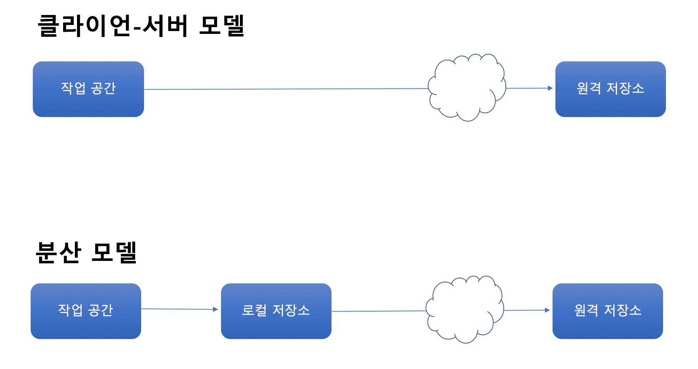
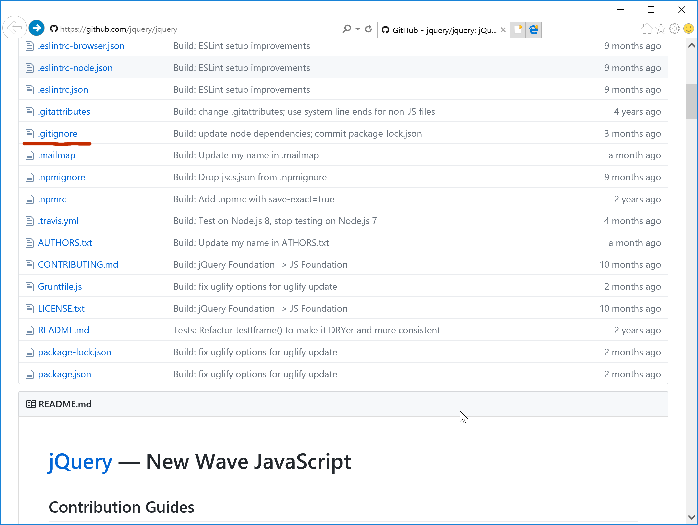
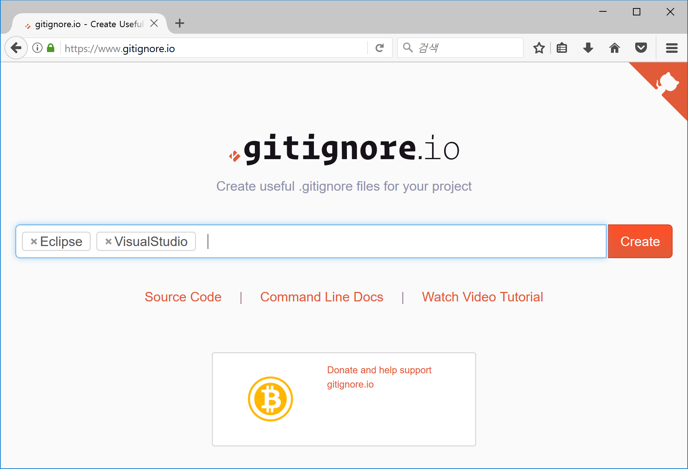
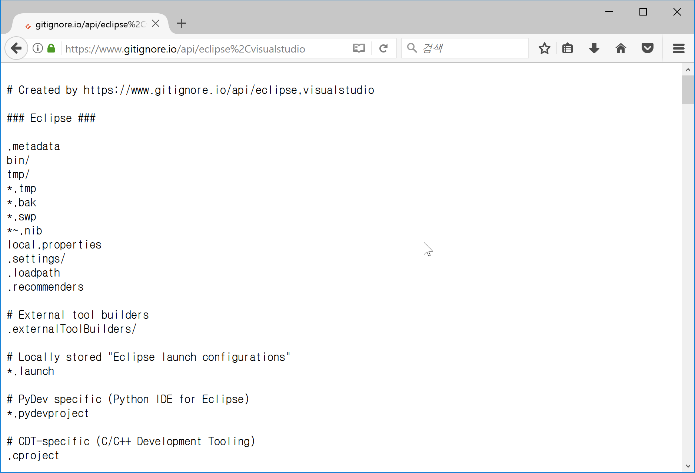

# 저장소


# 스테이징 영역
Git에는 ```스테이징(Staging)``` 이라 불리는 영역이 있다. 저장소에 커밋하기 전에 반드시 거쳐야 하는 영역이다.  다른 버전관리 시스템에는 없고 Git에 만 있는 특별한 역영이다.


>  참고로 스테이징 영역을 인덱스(index)라고 하는 경우도 있다.

실습을 하면서 커밋을 하기 바로 직전 무슨 일을 했는지 상기해보자. 파일을 새롭게 만들거나, 편집을 하거나 또는 삭제를 했을 때 ```git add <filename>``` 을 먼저 실행하고 커밋을 해 저장소에 기록을 남겼다. 정확히 이야기하면 ```git add <filename>``` 은 변경 내용을 스테이징 영역에 보내는 것이고 ```git commit```은 스테이징 영역에 있는 것을 저장소에 보내는 것이다.


```bash
$ git init
$ touch test.txt
$ git add test.txt
$ git commit -m "init commit"
$ git branch task
$ git checkout task
$ echo "opensource" >> test.txt
$ git add test.txt
$ echo "javascript" >> test.txt
$ git commit -m "task complete"
$ git status
$ git checkout master

```
겉으로 보기엔 ```작업 공간```과 ```저장소``` 사이에 스테이징 이란 영역이 하나 더 있어 불편하기도 하고 어렵게 느껴질 수 있다. 사용자 입장에서 파일 수정 후 ```git commit``` 만 하면 버전관리 시스템이 알아서 변경 사항을 파악해 저장소에 보내면 편할 것이다. 그런데 다른 버전관리 시스템과 달리 Git은 저장소에 보내기 전에 반드시 변경 사항을 스테이징 영역에 먼저 보내야 한다. 그렇다면 왜 이런 불편해 보이는 스테이징 영역을 만든 이유가 뭘까 고민해보자.

# 가상 시나리오
여러분은 어느 근사한 웹사이트의 개발을 담당하고 있으며 어느날 팀장으로부터 다음과 같은 작업 지시를 받았다고 가정해보자.
 - 로그인 페이지에 보안 기능 추가 요망
 - A 버그 패치 요망
 - B 버그 패치 요망

팀장의 작업 지시를 수행하다 보니 아래와 같이 파일을 수정하게 됐다.

파일 이름 | 수정 내역
--- | ---
login.jsp | 로그인 페이지에 보안 기능 추가
main.jsp | A 버그 수정
user.jsp | A 버그 수정
order.jsp | B 버그 수정
pay.jsp | B 버그 수정

작업을 마치고 최종 커밋을 하기 직전에 "로그인 보안 기능 추가"는 다음 빌드로 미루어졌다면 어떻게 해야할까. 스테이징 영역이 없는 경우와 있는 경우로 나누어 알아보자.
## <스테이징 영역이 없는 경우>
 - 열심히 작업한 login.jsp 파일을 어딘가에 잘 백업 받는다.
 - login.jsp 파일을 작업하기 전 상태로 되돌린다(revert).
 - 작업한 내용을 커밋한다.
 - 백업 받았던 login.jsp 원상 복구한다.

## <스테이징 영역이 있는 경우 - Git>
- login.jsp 파일을 제외한 파일들을 스테이징 영역(git add)에 넣는다.
- 작업한 내용을 커밋한다.


```
$ git commit -a -m "init commit"
```


# 다시 git add 명령으로

## Git version 1.x
명령어 | 새로운 파일 | 변경 파일 | 삭제 파일
--- | --- | --- | ---
git add -A<br>git add --all | O | O | O
git add . | O | O | X
git add -u<br> git add --update | X | O | O


## Git version 2.x
명령어 | 새로운 파일 | 변경 파일 | 삭제 파일
--- | --- | --- | ---
git add -A<br>git add --all  | O | O | O
git add . | O | O | O
git add --ingore-removal . | O | O | X
git add -u<br> git add --update | x | O | O


# .gitignore 파일 : 불필요한 파일 및 폴더 무시


```gitignore
# Compiled source #
###################
*.com
*.class
*.dll
*.exe
*.o
*.so

# Packages #
############
# it's better to unpack these files and commit the raw source
# git has its own built in compression methods
*.7z
*.dmg

# Logs and databases #
######################
*.log
*.sql
*.sqlite

# OS generated files #
######################
.DS_Store
.Trashes
ehthumbs.db
Thumbs.db
```

```.gitignore``` 파일은 버전 관리에서 제외할 파일을 정의한다.

패턴 | 설명
--- | ---
\# | 주석
*.doc | 하위 폴더를 포함해 .doc 확장자를 가진 파일 무시
/*.exe | 최상위 폴더의 *.exe 파일만 무시
temp/ | temp 폴더 전체를 무시
cache/\*.\* <br>!.htaccess | cache 폴더 안에 있는 모든 파일 무시. 단, .htaccess 파일은 제외
*.o <br>!zlib/*.o | *.o 파일 전부 무시. 단, zlib 폴더 이하 *.o 파일은 제외

```.gitignore``` 파일을 운영체제나 IDE에 맞게 생성해주는 웹사이트도 있다.
[gitignore.io(https://wwww.gitignore.io/)](https://wwww.gitignore.io/)



