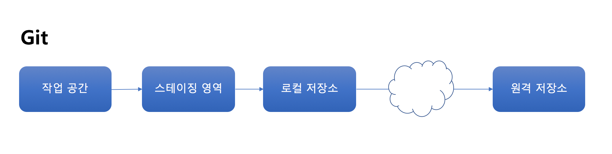

# 스테이징 영역
Git에는 ```스테이징(Staging)``` 이라 불리는 영역이 있다. 저장소에 커밋하기 전에 반드시 거쳐야 하는 영역이다.  다른 버전관리 시스템에는 없고 Git에 만 있는 특별한 역영이다.


>  참고로 스테이징 영역을 인덱스(index)라고 하는 경우도 있다.

실습을 하면서 커밋을 하기 바로 직전 무슨 일을 했는지 상기해보자. 파일을 새롭게 만들거나, 편집을 하거나 또는 삭제를 했을 때 ```git add <filename>``` 을 먼저 실행하고 커밋을 해 저장소에 기록을 남겼다. 정확히 이야기하면 ```git add <filename>``` 은 변경 내용을 스테이징 영역에 보내는 것이고 ```git commit```은 스테이징 영역에 있는 것을 저장소에 보내는 것이다.


# git add 명령(version 2.x)
명령어 | 새로운 파일 | 변경 파일 | 삭제 파일
--- | --- | --- | ---
git add -A<br>git add --all  | O | O | O
git add . | O | O | O
git add --ingore-removal . | O | O | X
git add -u<br> git add --update | x | O | O


# .gitignore 파일
```gitignore
# Compiled source #
*.com
*.class
*.dll
*.exe
*.o
*.so
Thumbs.db
```

패턴 | 설명
--- | ---
\# | 주석
*.doc | 하위 폴더를 포함해 .doc 확장자를 가진 파일 무시
/*.exe | 최상위 폴더의 *.exe 파일만 무시
temp/ | temp 폴더 전체를 무시
cache/\*.\* <br>!.htaccess | cache 폴더 안에 있는 모든 파일 무시. 단, .htaccess 파일은 제외
*.o <br>!zlib/*.o | *.o 파일 전부 무시. 단, zlib 폴더 이하 *.o 파일은 제외
