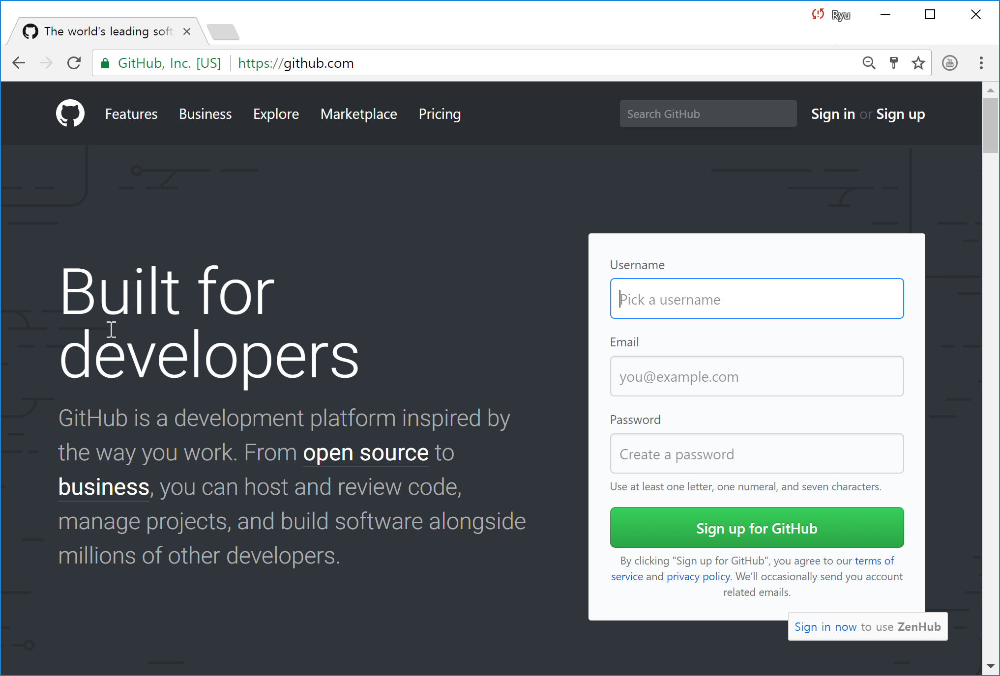
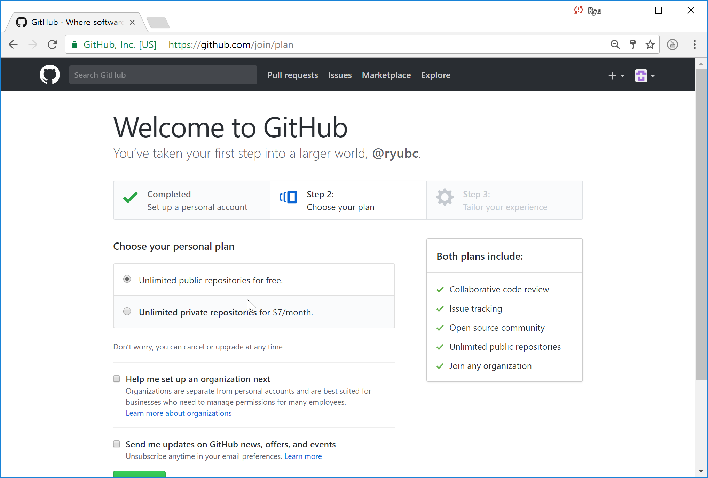
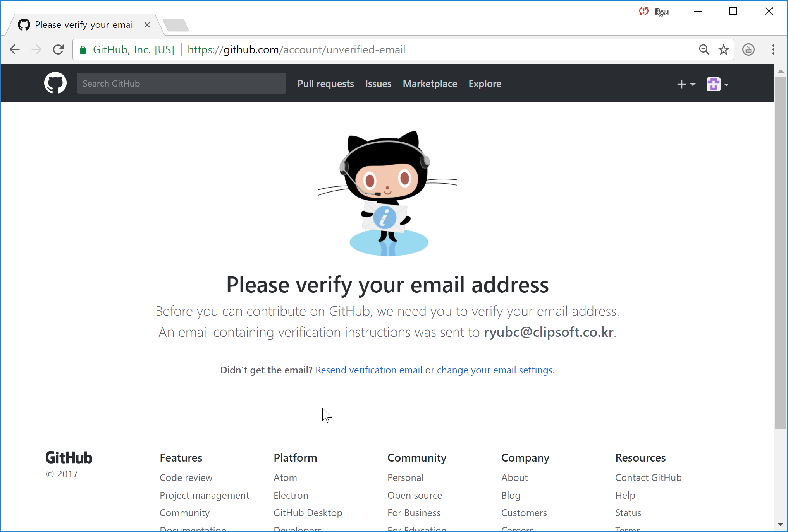
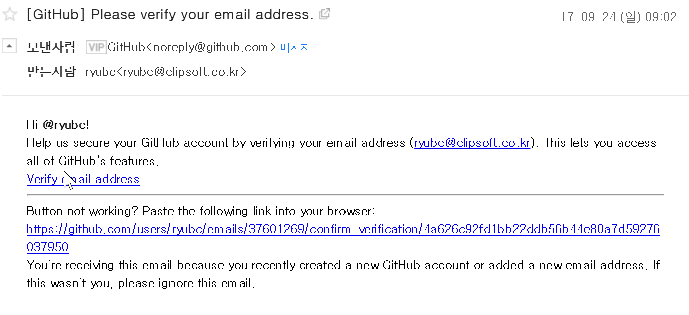
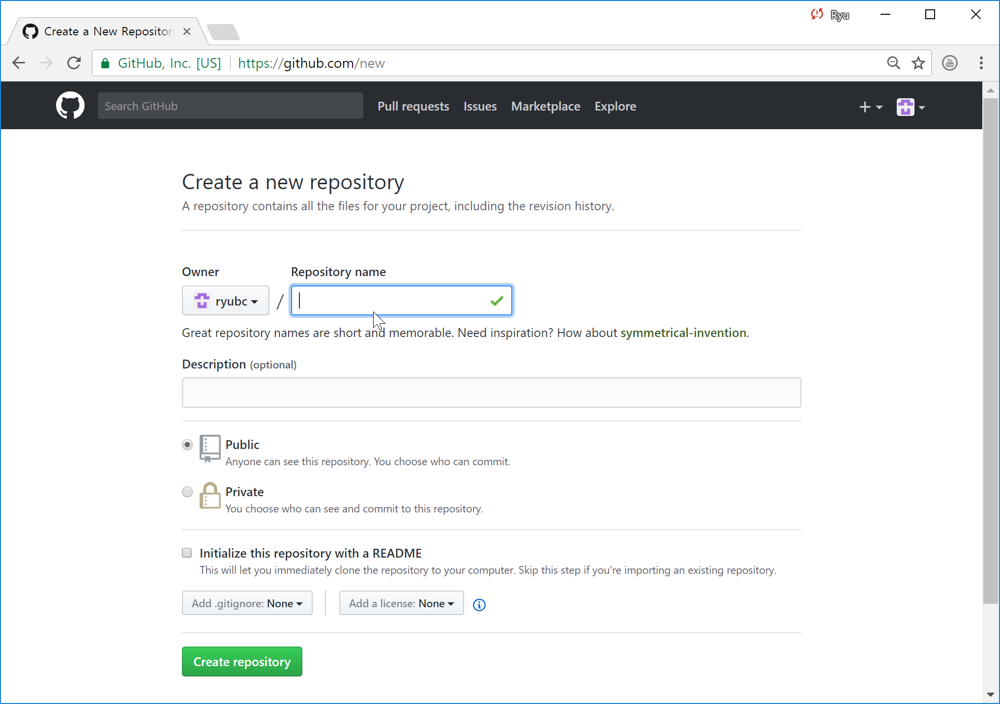
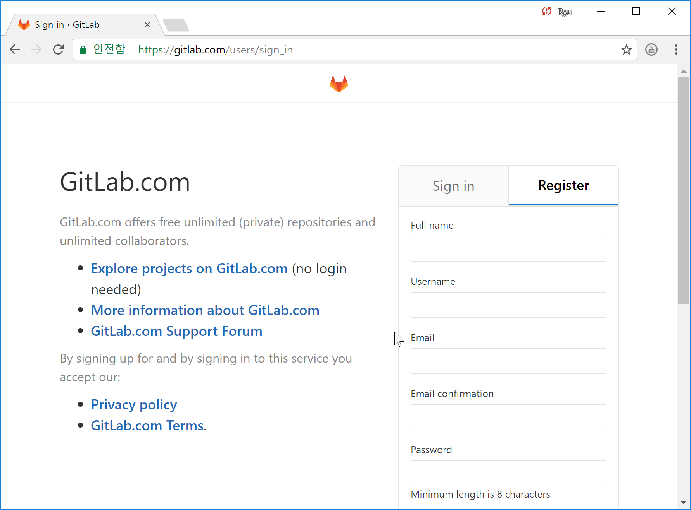

## Git 원격 저장소
협업할 때 중요한 개념이 Git의 원격 저장소 부분이다. 로컬 환경에서만 Git을 사용해 개인 프로젝트를 관리하는 것도 Git의 훌륭한 사용법이다. 하지만 Git이 무엇보다 좋은 이유는 원격 저장소 때문이다.

 * [GitHub(https://github.com)](https://github.com)
 * [GitLab(https://gitlab.com)](https://gitlab.com)
 * [Bitbucket(https://bitbucket.org)](https://bitbucket.org)

## GitHub
Git의 원격 저장소를 제공하는 대표적인 서비스 중에 하나로 GitHub 이란 사이트가 있다. GitHub는 단순히 원격 저장소만을 제공하는 것이 아니라, 여러 가지 프로젝트 진행을 원활하게 하는 도구를 함께 제공한다. 따라서 Git을 이용한 프로젝트 종합 관리 서비스에 더 가깝다고 생각하면 된다.

 * 전 세계에서 진행되는 오픈 소스가 프로젝트가 많이 모여 있어 이에 참여하고 오픈 소스에 기여할 수 있는 기회가 있다.
 * 개발자는 GitHub를 이용해서 자신이 작성했던 코드 그 자체를 곧바로 제공할 수 있다.
 * IT 개발과 관련이 많은 디자이너도 지금까지 그려왔던 작품을 포트폴리오로 준비해 이를 공개할 수 있다.
 * 기획자 역시 자신이 준비했던 기획 문서를 공개할 수 있다.

## GitHub 관련 뉴스
 * 세계적 오픈소스 사이트 '깃허브'에 서울시 공공데이터 공개(http://news1.kr/articles/?2670692)
 > 전세계 1200만명이 넘는 소프트웨어 개발자가 애용하는 오픈소스 커뮤니티 사이트 '깃허브(GitHub)'에 서울시의 공공데이터가 공개된다.
 >
 > 서울시는 25일부터 '깃허브(GitHub)'에 약 500만 건의 주요 행정정보 리스트를 공개한다.
 >
 > 국내 공공기관 중에서는 최초 시도다. 미국 백악관도 지난해 2월 '2016년 예산안'을 깃허브에 처음으로 공개하기도 했다.
 >
 > 정보 공개 대상은 서울시 정보소통광장을 통해 공개하고 있는 약 1000만 건 이상의 행정정보 가운데 2015년 1월부터 올해 5월까지 공개된 결재문서, 정책연구보고서, 사전정보공표 3개 분야다.
 > 시는 앱 개발자를 비롯해 누구나 데이터를 내려받을 수 있도록 깃허브 내에 서울시 페이지(https://github.com/seoul-opengov/opengov) 를 만들었다. 개발자가 선호하는 JSON, XML과 정책 연구자 > 와 시민이 선호하는 CSV, XLSX 등 4개 포맷으로 제공할 예정이다.
 >
 > 강태웅 서울시 행정국장은 “정보소통광장을 통해 개방 중인 서울시 공공데이터 목록을 전 세계 1200만 명이 넘는 소프트웨어 개발자들이 이용하는 깃허브에 국내 최초로 공개하면 시민들에게 유용한 정보와 서비 스 가 더 확대될 것”이라고 말했다.

 * 소프트웨어 개발의 변화, 한국은 위기다(http://weekly.khan.co.kr/khnm.html?mode=view&code=116&artid=201510261728321&pt=nv)
 > ‘소셜 코딩’이라고도 일컫는 이 창조의 문화는 전 세계 소프트웨어 엔지니어들이 활동 중인 깃허브(github)나 스택오버플로우(Stack Overflow)와 같은 놀이터에서 엿볼 수 있다. 이곳에서도 한국의 존재감은 미미하다. 비공식 조사이기는 하나, 이 두 사이트에서의 사용자 수는 물론 활동지수 어디에도 톱10 안에 한국은 없었다. 물론 비영어권과 인구라는 변명은 얼마든지 가능하다.
 >
 >영어 따위 귀찮으니 우리끼리 어딘가에서 끼리끼리 잘하고 있을지는 모른다. 그런데 오픈소스 문화의 산실인 깃허브에서 팔로어 10명 이상의 활동성 있는 개발자들은 물론 미국이 제일 많지만 중국이 3위, 일본이 5위였다. 노벨상만 부러워할 때가 아니다.
 >  
 > 우리가 그렇게 ‘눈팅’만 하는 사이, 원글의 아이디어는 댓글의 응원에 힘입어 현실이 된다. 그리고 그 글을 쓴 이들은 전설이 되고 팬이 움직여 시장이 생긴다. 소프트웨어 강국은 애플, 구글, 페이스북, MS처럼 입심 있는 기업을 배출하는 나라, 혹은 이 토론에 활발히 참여하는 논객이 있는 곳이다. 우리는 아직 어느 쪽도 아님을 지금이라도 깨닫는 편이 좋다.

## GitHub 가입하기
[GitHub(https://github.com)](https://github.com) 사이트에서 사용자 등록을 한다.

## GitLab 가입하기
[GitLab(https://gitlab.com)](https://gitlab.com) 사이트에서 사용자 등록을 한다.

## GitHub/GitLab 계정 이메일 전달
메일 제목과 내용을 아래 포맷에 맞춰 메일(ryubc.inhatc@gmail.com)을 보내주세요.

제목 : [A반][홍길동][1234567]GitHub/GitLab 계정 
내용 :  
github : https://github.com/ryubcinhatc  
gitlab : https://gitlab.com/ryubcinhatc  
