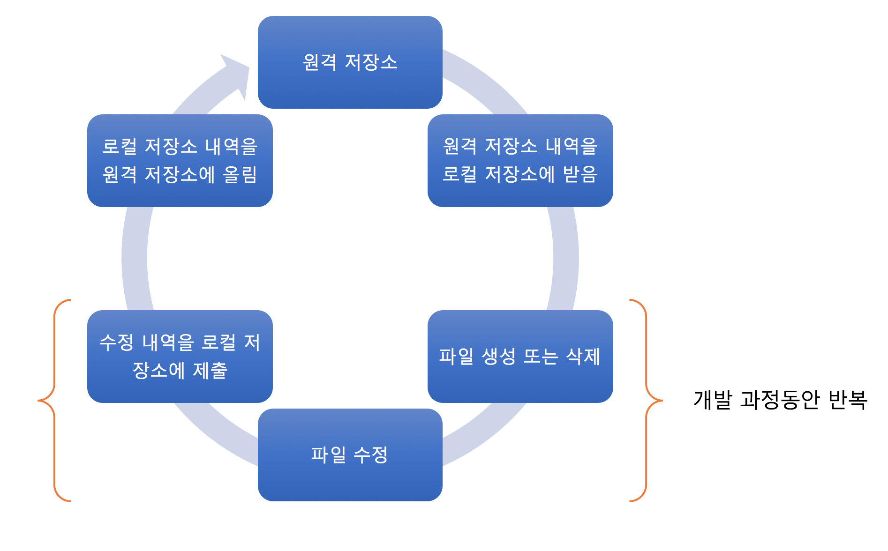
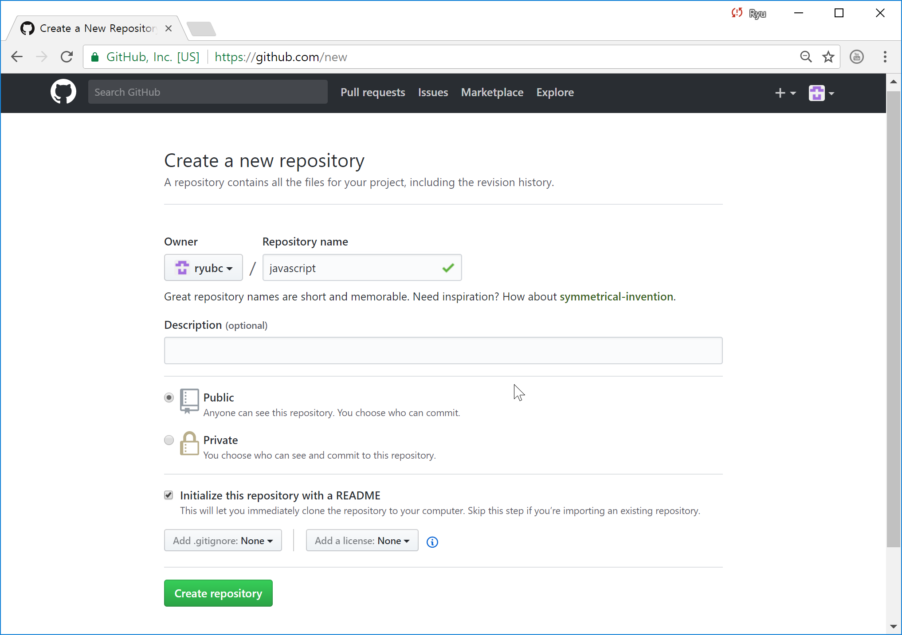
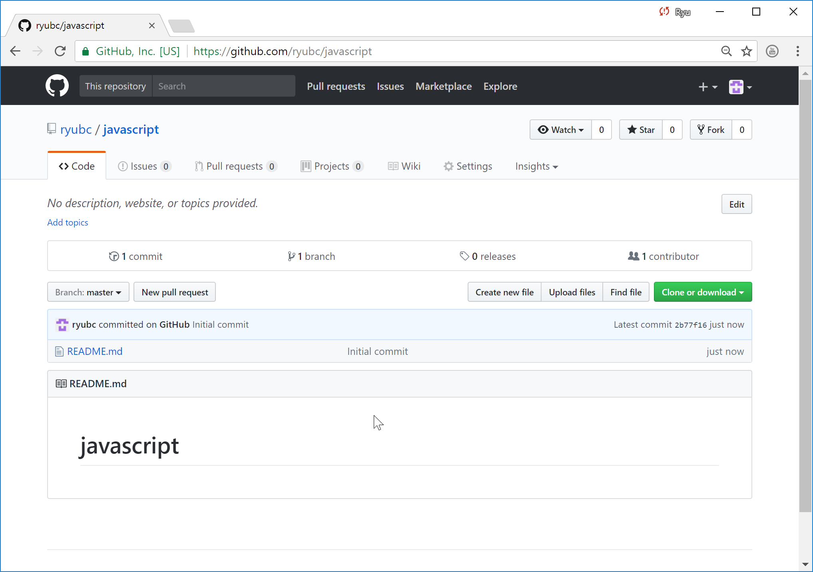
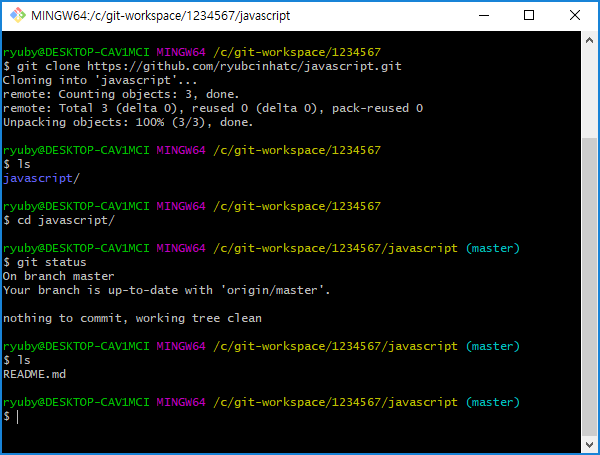

## Git 정보 변경
```bash
$ git config --global user.name "ryubcinhatc"
$ git config --global user.email "ryubc.inhatc@gmail.com"
```

```bash
$ git config --list
```

## Git 명령어
명령어 | 설명
--- | ---
git clone | 원격 저장소의 모든 내용을 로컬 저장소로 복사한다.
git remote | 로컬 저장소를 특정 원격 저장소와 연결한다.
git push | 로컬 저장소의 내용을 보내거나 로컬 저장소의 변경 사항을 원격 저장소로 보낸다.
git fetch | 원격 저장소의 변경 사항을 가져온다. 하지만 병합(Merge)을 하지 않는다.
git pull | 원격 저장소의 변경 사항을 가져오면서 병합(Merge)을 한다(git fetch + git merge). git push의 반대 성격의 명령어이다.


### git fetch / git pull 의 차이

```
$ git fetch origin master
$ git checkout master
$ git diff master origin/master
$ git merge origin/master
```

```
$ git pull origin master
```


### 작업 흐름


## 실습 순서
번호 | 실습 내용
--- | ---
1 | [원격 저장소 생성](https://github.com/ryubcinhatc/opensource-lecture/blob/master/5-week/3.lecture-remote.md#1-원격-저장소-생성)
2 | [원격 저장소의 내용을 로컬 저장소로 가져오기](https://github.com/ryubcinhatc/opensource-lecture/blob/master/5-week/3.lecture-remote.md#2-원격-저장소의-내용을-로컬-저장소로-가져오기)
3 | [프로그램 작성](https://github.com/ryubcinhatc/opensource-lecture/blob/master/5-week/3.lecture-remote.md#3-프로그램-작성)
4 | [커밋](https://github.com/ryubcinhatc/opensource-lecture/blob/master/5-week/3.lecture-remote.md#4-커밋)
5 | [로컬 자정소 작업 내역을 원격 저장소에 올리기](https://github.com/ryubcinhatc/opensource-lecture/blob/master/5-week/3.lecture-remote.md#5-로컬-자정소-작업-내역을-원격-저장소에-올리기)


### 1. 원격 저장소 생성







## 2. 원격 저장소의 내용을 로컬 저장소로 가져오기  
 * 원격 저장소의 내용을 받기위해 폴더를 생성한다.
 * git-workspace/1234567(학번)으로 폴더를 만들고 해당 위치에서 Git Bash 띄운다.


```
$ git clone https://github.com/<id>/javascript.git
$ ls
$ cd javascript
$ git status
$ ls

```


### 3. 프로그램 작성
[자바스크립트 페이지로 이동](https://github.com/ryubcinhatc/opensource-lecture/blob/master/5-week/4.lecture-javascript.md)

### 4. 커밋
```
$ git commit -m "write a javascript program"
```

### 5. 로컬 자정소 작업 내역을 원격 저장소에 올리기
```
$ git push
```
