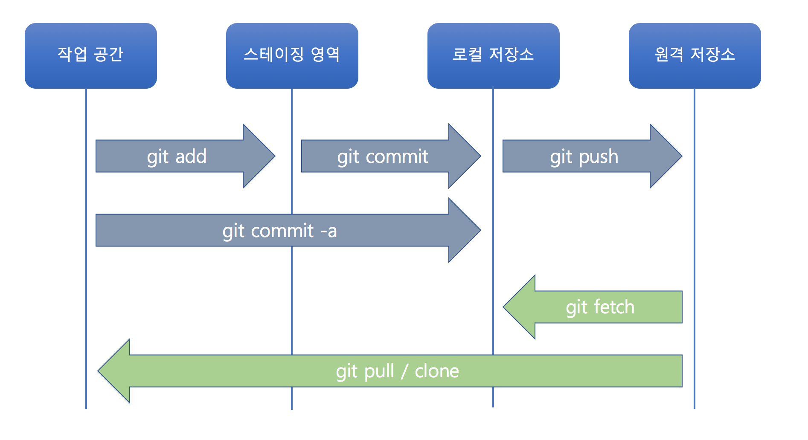
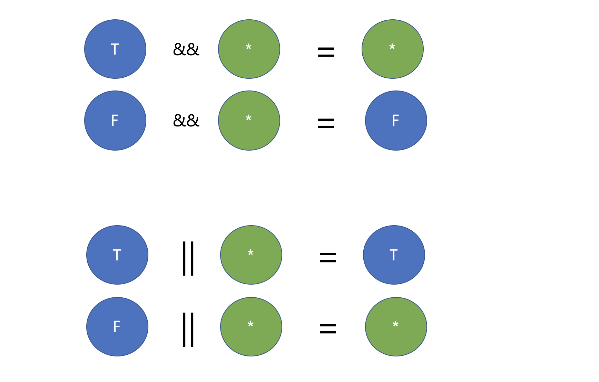

## Git 명령어
명령어 | 설명
--- | ---
git clone(*) | 원격 저장소의 모든 내용을 로컬 저장소로 복사한다.
git remote | 로컬 저장소를 특정 원격 저장소와 연결한다.
git push(*) | 로컬 저장소의 내용을 보내거나 로컬 저장소의 변경 사항을 원격 저장소로 보낸다.
git fetch | 원격 저장소의 변경 사항을 가져온다. 하지만 병합(Merge)을 하지 않는다.
git pull | 원격 저장소의 변경 사항을 가져오면서 병합(Merge)을 한다(git fetch + git merge). git push의 반대 성격의 명령어이다.





### git fetch / git pull 의 차이

```
$ git fetch origin master
$ git checkout master
$ git diff master origin/master
$ git merge origin/master
```

```
$ git pull origin master
```


### 작업 흐름


## 자바스크립트


### 기본 데이터 타입
자바스크립트는 ```느슨한 타입 체크``` 언어이다. 엄격한 타입 체크 언어인 C, Java, C# 언어는 변수를 선언할 때 변수에 저장할 데이터의 종류에 따라 char, int, float 등의 예약어를 이용해서 변수의 데이터 타입을
지정한다. 반면 자바스크립트는 변수를 선언할 때 타입을 미리 정하지 않고, ```var``` 키워드로 변수를 선언 한다(ES5 기준). 변수의 이름은 $, _, 혹은 특수 문자를 제외한 모든 문자로 시작할 수 있다. ```typeof``` 연산자로 변수의 타입을 확인할 수 있다.

> ES6에는 let과 const라는 새로운 변수 선언 방법이 생겼다.

종류 | 설명 | 사용 예
---|---|----
숫자 | 숫자를 나타내는 타입.  C 언어의 경우 정수냐 실수냐에 따라 int, long, float , double 등과 같은 다양한 숫자 타입이 존재하지만, 자바스크립트는 하나의 숫자형만 존재한다. | ``` var i = 10 ```
문자열 | 문자열은 작은 따옴표(') 또는 큰 따옴표(")로 표현한다. | ``` var s = "abcd" ```
불린값 | true(참)와 false(거짓) 두 가지 값을 갖는다. | ``` var b = true ```
undefined | 값이 정의도지 않음을 나타내기 위한 자료형. 변수를 선언하고 값을 할당하지 않으면 undefined 라는 값을 갖는다. | ``` var u ```
null | 값이 없음을 나타내기위한 자료형. | ``` var n = null ```

### 비교 연산자
연산자 | 사용 예 | 설명
---|---|----
== | a == b | a와 b가 같음
!= | a != b | a와 b가 다름
\> | a > b | a가 b보다 크다
< | a < b | a가 b보다 작다
\>= | a >= b | a가 b보다 크거나 같다
<= | a <= b | a와 b가 작거나 같다
=== | a === b | a와 b가 같음(자료형까지 엄격히 비교)
!== | a !== b | a와 b가 다름(자료형까지 엄격히 비교)


### 논리 연산자
연산자 | 사용 예 | 설명
---|---|----
&& | a && b | a와 b가 모두 참인 경우에만 참
\|\| |  a \|\| b | a와 b 둘 중에 하나라도 참이면 참

* javascript
```html
<!DOCTYPE html>
<html>
<head>
    <script type="text/javascript">
      console.log(true || false); // true
      console.log(true || true); // true
      console.log("string" || true); // string
      console.log(true || ""); // true
      console.log(true || "string"); // true
      console.log(false || ""); // ""
      console.log(false || "string"); // "string"
      console.log(5 || 0); // 5
      console.log(5 || -6); // 5
      console.log(5 || false); // 5
      console.log(null || 0); // 0
      console.log(null || ""); // ""
      console.log(null || false); // false
      console.log("yes" || "no"); // "yes"
    </script>
</head>
<body>
</body>
</html>
```




### 변수 호이스팅(Hoisting)
자바스크립트에서 모든 변수는 호이스트 된다. 호이스트(Hoist)의 사전적 의미는 끌어올리기란 뜻이다. 무엇을 끌어 올릴까?
변수 선언을 맨 위로 끌어 올린다. 변수를 맨 위로 끝어 올리면 무슨 일이 벌어 질까? 변수 선언을 나중에 하더라도 미리 변수를 참조 할 수 있다.


* javascript
```html
<!DOCTYPE html>
<html>
<head>
    <script type="text/javascript">
       console.log(age); // Uncaught ReferenceError: age is not defined
    </script>
</head>
<body>
</body>
</html>
```

* javascript
```html
<!DOCTYPE html>
<html>
<head>
    <script type="text/javascript">
       console.log(age); // undefined
       var age = 10;
       console.log(age); // 10
    </script>
</head>
<body>
</body>
</html>
```


