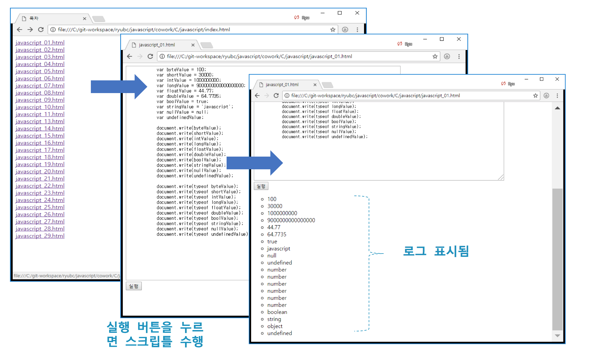
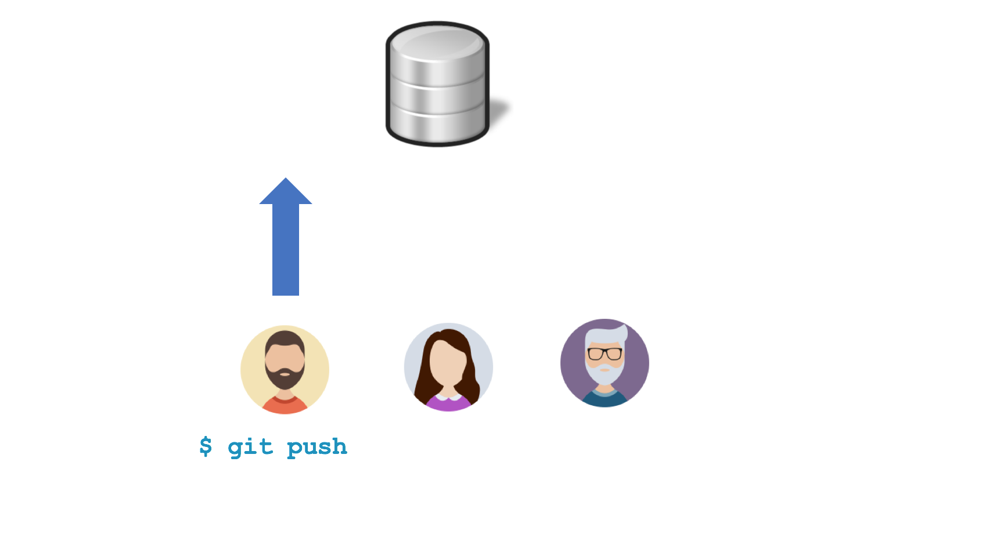
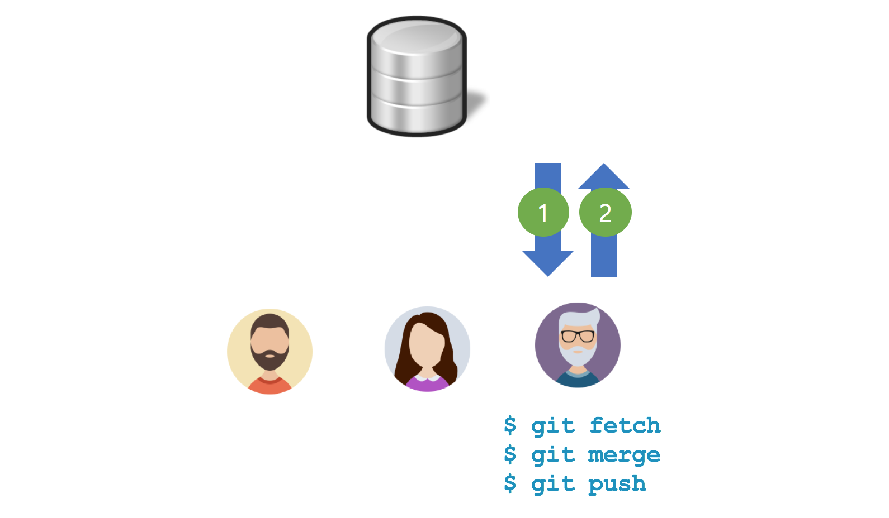
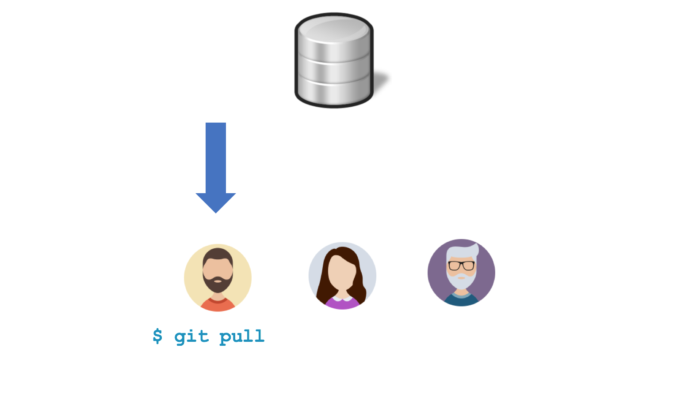
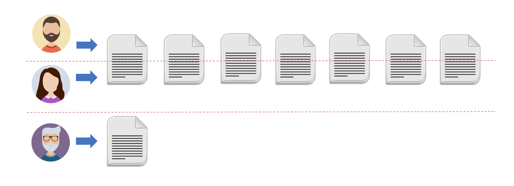
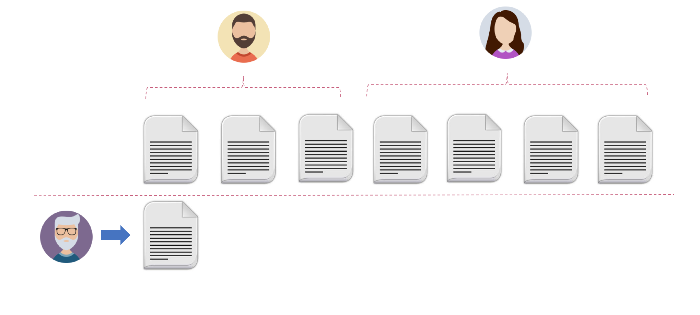

## Git 정보 변경
```bash
$ git config --global user.name "ryubcinhatc"
$ git config --global user.email "ryubc.inhatc@gmail.com"
```

```bash
$ git config --list
```

## 실습 계획
어떤 학생이 HTML 파일로 자바스크립트를 작성하고 매번 브라우저 개발자 도구로 결과를 확인하는 과정이 매우 짜증스럽고 번거롭다고 불만을 토로함. 불만도 해소하면서 교육적인 효과를 높이기 위해 기존에 작성한 HTML 파일을 대대적으로 손보기로 함. 막상 작업을 시작하는데 시간은 촉박하고 일의 양이 많아 혼자서 할 수 없다고 판단함. 백지장도 맞들면 낫다는 심정으로 학생 3명에게 도움을 요청함.



> 누가 나를 쳐다보면 나는 먼저 나를 두 개의 나로 분리시킨다. 하나의 나는 내 안에 그대로 있고 진짜 나에게서 갈라져나간 다른 나로 하여금 내 몸 밖으로 나가 내 역할을하게 한다. - 은희경 <새의 선물>


개발자 | 미션
--- | ---
A 개발자 | 자바스크립트 수정
B 개발자 | HTML 수정
C 개발자 | HTML 페이지 추가

## 실습 순서
번호 | 실습 내용
--- | ---
1 | [A 개발자 원격 저장소 내용을 로컬 저장소로 가져오기]()
2 | [B 개발자 원격 저장소 내용을 로컬 저장소로 가져오기]()
3 | [C 개발자 원격 저장소 내용을 로컬 저장소로 가져오기]()
4 | [A 개발자 자바스크립트 수정]()
5 | [A 개발자 로컬 저장소 커밋]()
6 | [A 개발자 원격 저장소에 푸시]()
7 | [B 개발자 HTML 수정]()
8 | [B 개발자 로컬 저장소 커밋]()
9 | [B 개발자 원격 저장소에 푸시]()
10 | [C 개발자 HTML 페이지 추가]()
11 | [C 개발자 로컬 저장소 커밋]()
12 | [C 개발자 원격 저장소에 푸시]()
13 | [A 개발자 원격 저장소와 동기화]()
14 | [B 개발자 원격 저장소와 동기화]()
15 | [A/B/C 개발자 모두 동일한 소스인지 확인]()

### 1. A 개발자 원격 저장소 내용을 로컬 저장소로 가져오기
A 폴더에서 Git Bash Shell을 띄운다.
```bash
$ git clone https://github.com/<id>/javascript
$ cd javascript
```

### 2. B 개발자 원격 저장소 내용을 로컬 저장소로 가져오기
B 폴더에서 Git Bash Shell을 띄운다.
```bash
$ git clone https://github.com/<id>/javascript
$ cd javascript
```

### 3. C 개발자 원격 저장소 내용을 로컬 저장소로 가져오기
C 폴더에서 Git Bash Shell을 띄운다.
```bash
$ git clone https://github.com/<id>/javascript
$ cd javascript
```


### 4. A 개발자 자바스크립트 수정
```html
<!DOCTYPE html>
<html>
<head>
    <script type="text/javascript">
    console.log = function(msg) {
        var ul = document.getElementById("log");
        var li = document.createElement("li");
        li.appendChild(document.createTextNode(msg));
        ul.appendChild(li);
    }

    window.onload = function() {
        document.getElementById("run").onclick = function() {
            //
            // 기존 자바스크립트 코드를 이쪽으로 옮김.
            //
        }
    }
    </script>
</head>
<body>
</body>
</html>
```

javascript_01.html 파일을 예로 들면 아래처럼 자바스클비트가 아래처럼 변경됨.

```html
<!DOCTYPE html>
<html>
<head>
    <script type="text/javascript">
    console.log = function(msg) {
        var ul = document.getElementById("log");
        var li = document.createElement("li");
        li.appendChild(document.createTextNode(msg));
        ul.appendChild(li);
    }

    window.onload = function() {
        document.getElementById("run").onclick = function() {

            //
            // 자바스크립트 코드를 이쪽으로 옮김.
            //
            var byteValue = 100;
            var shortValue = 30000;
            var intValue = 1000000000;
            var longValue = 9000000000000000000;
            var floatValue = 44.77;
            var doubleValue = 64.7735;
            var boolValue = true;
            var stringValue = 'javascript';
            var nullValue = null;
            var undefinedValue;

            console.log(byteValue);
            console.log(shortValue);
            console.log(intValue);
            console.log(longValue);
            console.log(floatValue);
            console.log(doubleValue);
            console.log(boolValue);
            console.log(stringValue);
            console.log(nullValue);
            console.log(undefinedValue);    

            console.log(typeof byteValue);
            console.log(typeof shortValue);
            console.log(typeof intValue);
            console.log(typeof longValue);
            console.log(typeof floatValue);
            console.log(typeof doubleValue);
            console.log(typeof boolValue);
            console.log(typeof stringValue);
            console.log(typeof nullValue);
            console.log(typeof undefinedValue);

        }
    }
    </script>
</head>
<body>
</body>
</html>
```


### 5. A 개발자 로컬 저장소 커밋
```bash
$ git commit -m "자바스크립트 변경"
```

### 6. A 개발자 원격 저장소에 푸시
```bash
$ git push origin master
```



### 7. B 개발자 HTML 수정
```html
<!DOCTYPE html>
<html>
<head>
    <script type="text/javascript">
    var byteValue = 100;
    var shortValue = 30000;
    var intValue = 1000000000;
    var longValue = 9000000000000000000;
    var floatValue = 44.77;
    var doubleValue = 64.7735;
    var boolValue = true;
    var stringValue = 'javascript';
    var nullValue = null;
    var undefinedValue;

    console.log(byteValue);
    console.log(shortValue);
    console.log(intValue);
    console.log(longValue);
    console.log(floatValue);
    console.log(doubleValue);
    console.log(boolValue);
    console.log(stringValue);
    console.log(nullValue);
    console.log(undefinedValue);    

    console.log(typeof byteValue);
    console.log(typeof shortValue);
    console.log(typeof intValue);
    console.log(typeof longValue);
    console.log(typeof floatValue);
    console.log(typeof doubleValue);
    console.log(typeof boolValue);
    console.log(typeof stringValue);
    console.log(typeof nullValue);
    console.log(typeof undefinedValue);
    </script>
</head>
<body>
    <div>
        <textarea cols = "100" rows="40">
            var byteValue = 100;
            var shortValue = 30000;
            var intValue = 1000000000;
            var longValue = 9000000000000000000;
            var floatValue = 44.77;
            var doubleValue = 64.7735;
            var boolValue = true;
            var stringValue = 'javascript';
            var nullValue = null;
            var undefinedValue;

            document.write(byteValue);
            document.write(shortValue);
            document.write(intValue);
            document.write(longValue);
            document.write(floatValue);
            document.write(doubleValue);
            document.write(boolValue);
            document.write(stringValue);
            document.write(nullValue);
            document.write(undefinedValue);    

            document.write(typeof byteValue);
            document.write(typeof shortValue);
            document.write(typeof intValue);
            document.write(typeof longValue);
            document.write(typeof floatValue);
            document.write(typeof doubleValue);
            document.write(typeof boolValue);
            document.write(typeof stringValue);
            document.write(typeof nullValue);
            document.write(typeof undefinedValue);       
        </textarea>
    </div>
    <div>
        <input type="button" id="run" value="실행"/>
    </div>
    <div>
        <ul id="log" style="list-style-type:circle"></ul>
    </div>    
</body>
</html>
```

### 8. B 개발자 로컬 저장소 커밋
```bash
$ git commit -m "HTML 파일 수정"
```

### 9. B 개발자 원격 저장소에 푸시
```bash
$ git push origin master
```


```bash
$ git pull origin master
$ git push origin master
```


### 10. C 개발자 HTML 페이지 추가
javascript 폴더에 index.html 파일을 만든다.
```html
<!DOCTYPE html>
<html>
<head>
    <title>목차</title>
    <style type="text/css">
        a {
            display: block
        }
    </style>
</head>
<body>
    <a href ="javascript_01.html">javascript_01.html</a>
    <a href ="javascript_02.html">javascript_02.html</a>
    <a href ="javascript_03.html">javascript_03.html</a>
    <a href ="javascript_04.html">javascript_04.html</a>
    <a href ="javascript_05.html">javascript_05.html</a>
    <a href ="javascript_06.html">javascript_06.html</a>
    <a href ="javascript_07.html">javascript_07.html</a>
    <a href ="javascript_08.html">javascript_08.html</a>
    <a href ="javascript_09.html">javascript_09.html</a>
    <a href ="javascript_10.html">javascript_10.html</a>
    .. 나머지는 여러분이 추가 ..
</body>
</html>
```

### 11. C 개발자 로컬 저장소 커밋
```bash
$ git commit -m "index.html 파일 추가"
```

### 12. C 개발자 원격 저장소에 푸시
```bash
$ git push origin master
```


```bash
$ git fetch origin
$ git branch -a
$ git diff master origin/master
$ git merge origin/master
$ git push origin master
```



### 13. A 개발자 원격 저장소와 동기화
```bash
$ git pull origin master
```



### 14. B 개발자 원격 저장소와 동기화
```bash
$ git pull origin master
```


### 15. A/B/C 개발자 모두 동일한 소스인지 확인
14 단계까지 수행하고 나면 A,B,C 개발자는 모두 동일한 소스를 갖고 있어야 한다.

## 작업 분배
### 버전 관리 시스템을 사용하는 경우
버전 관리 시스템을 사용하면 앞서 실습했던 것과 같이 여러 명이 동시에 같은 파일을 수정하는 작업이 가능하다.


### 버전 관리 시스템을 사용하지 않는 경우
버전 관리 시스템이 없다면 파일 단위의 작업 분배가 이루어 질 수 밖에 없다.

