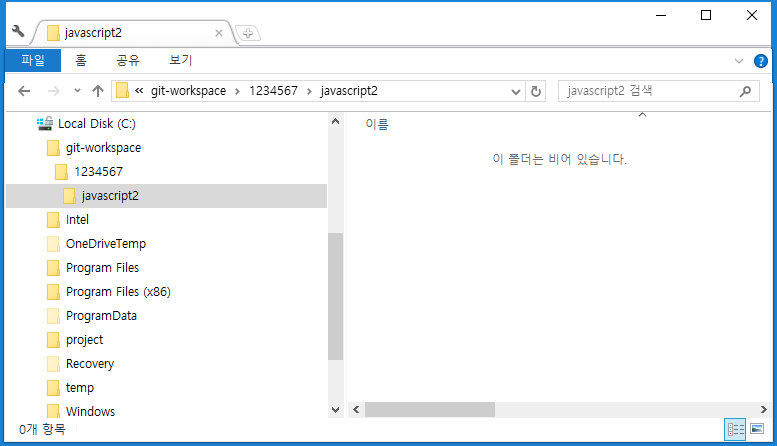
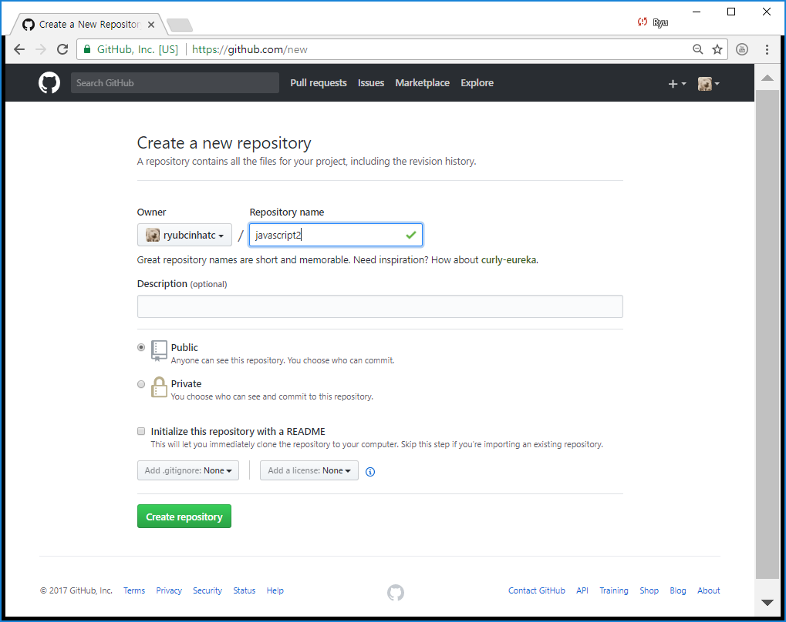
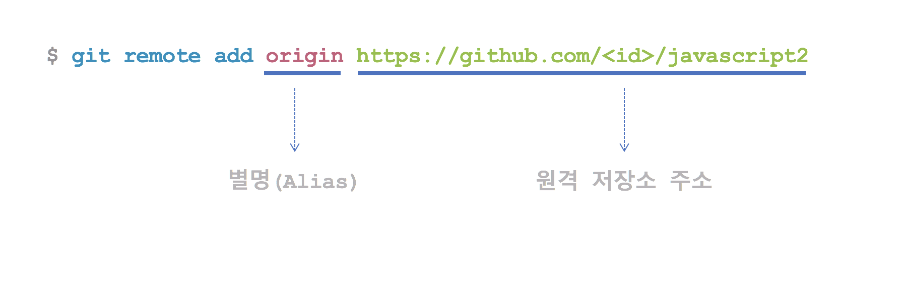
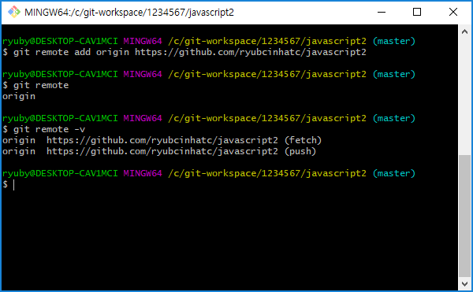
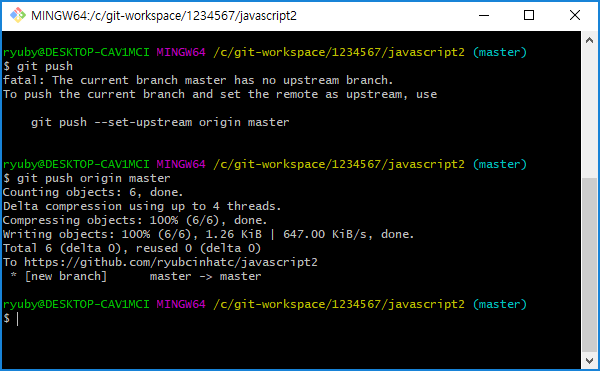
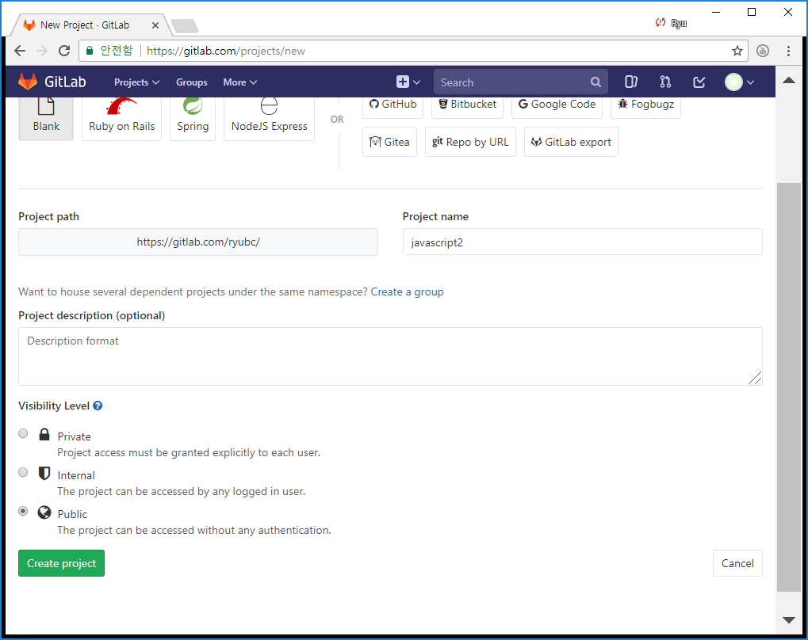
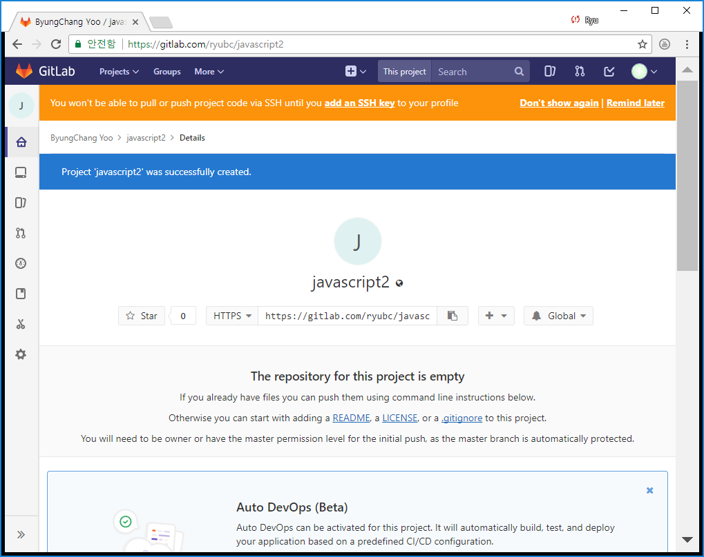
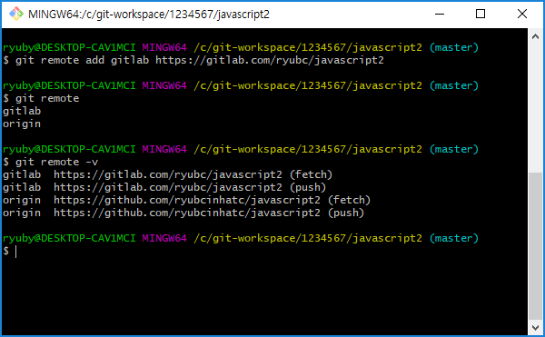

## 실습 순서
번호 | 실습 내용
--- | ---
1 | [로컬 저장소 초기화]()
2 | [프로그램작성]()
3 | [커밋]()
4 | [GitHub 원격 저장소 생성]()
5 | [원격 저장소 연결]()
6 | [원격 저장소 푸시]()
7 | [GitLab 원격 저장소 생성]()
8 | [원격 저장소 연결]()
9 | [원격 저장소 푸시]()


### 1. 로컬 저장소 초기화
```/git-workspace/학번/javascript2``` 프로젝트 폴더를 생성한다.



```bash
$ git init
```

### 2. 프로그램 작성
[자바스크립트 페이지로 이동](https://github.com/ryubcinhatc/opensource-lecture/blob/master/6-week/5.lecture-javascript.md)

### 3. 커밋
```bash
$ git commit -m "프로그램 작성 완료"
```

### 4. GitHub 원격 저장소 생성



### 5. 원격 저장소 연결


```bash
$ git remote add origin https://github.com/<id>/javascript2
$ git remote
$ git remote -v
```


### 6. 원격 저장소 푸시
```bash
$ git push origin master
```



### 7. GitLab 원격 저장소 생성




### 8. 원격 저장소 연결
```bash
$ git remote add gitlab https://gitlab.com/<id>/javascript2
$ git remote
$ git remote -v
```



### 9. 원격 저장소 푸시
```bash
$ git push gitlab master
```


## 정리


