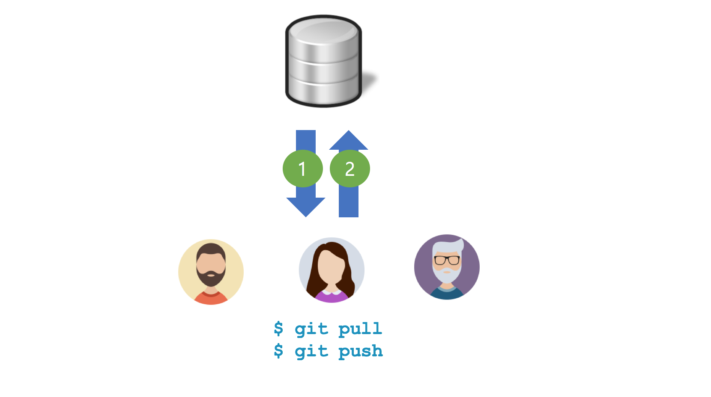
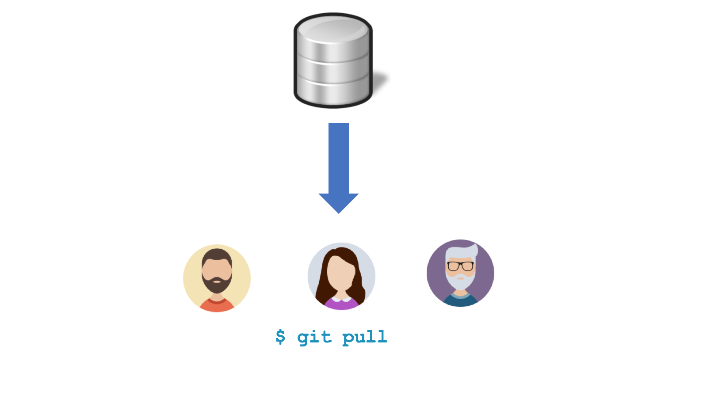

## Git 명령어
명령어 | 설명
--- | ---
git clone(*) | 원격 저장소의 모든 내용을 로컬 저장소로 복사한다.
git remote | 로컬 저장소를 특정 원격 저장소와 연결한다.
git push(*) | 로컬 저장소의 내용을 보내거나 로컬 저장소의 변경 사항을 원격 저장소로 보낸다.
git fetch(*) | 원격 저장소의 변경 사항을 가져온다. 하지만 병합(Merge)을 하지 않는다.
git pull(*) | 원격 저장소의 변경 사항을 가져오면서 병합(Merge)을 한다(git fetch + git merge). git push의 반대 성격의 명령어이다.

## 협업

### 1. A 개발자 원격 저장소에 푸시
```bash
$ git push origin master
```


### 2. B 개발자 원격 저장소에 푸시
```bash
$ git push origin master
```


```bash
$ git pull origin master
$ git push origin master
```




### 3. C 개발자 원격 저장소에 푸시
```bash
$ git push origin master
```


```bash
$ git fetch origin
$ git merge origin/master
$ git push origin master
```


### 4. A 개발자 원격 저장소와 동기화
```bash
$ git pull origin master
```


### 5. B 개발자 원격 저장소와 동기화
```bash
$ git pull origin master
```

