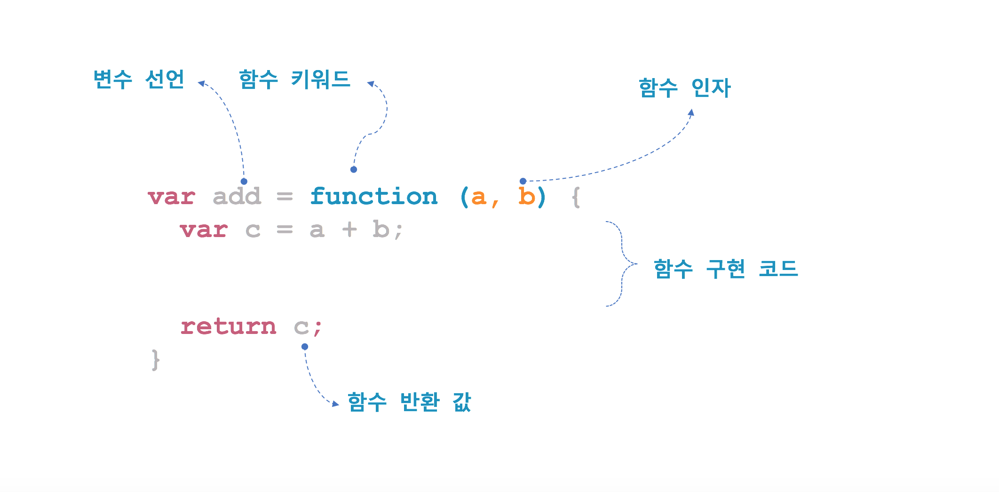
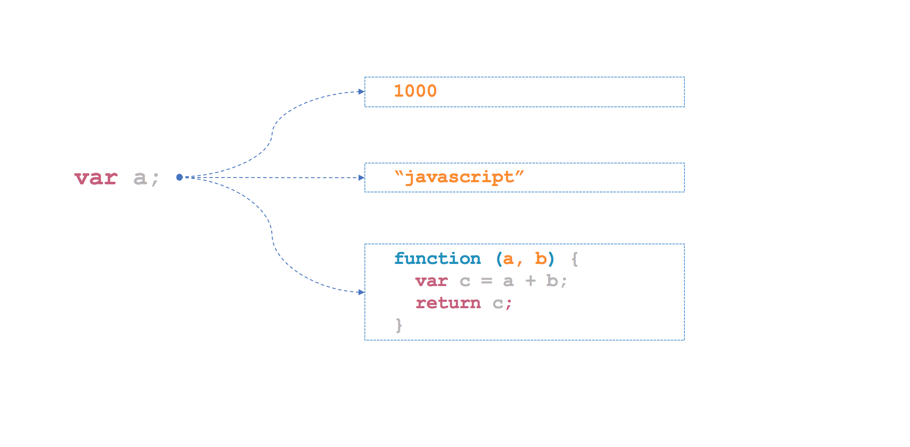
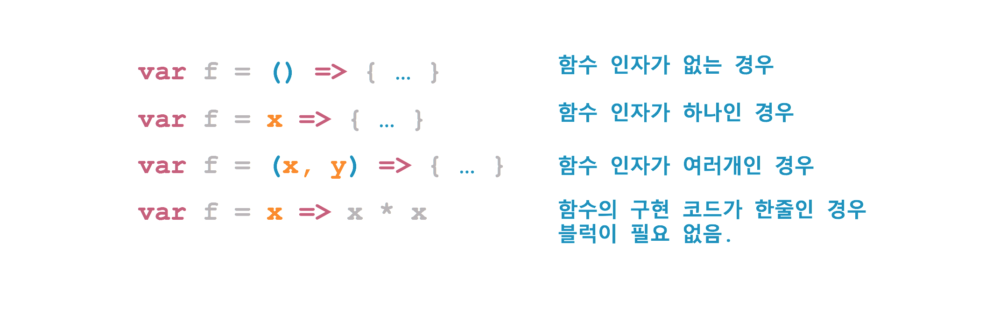
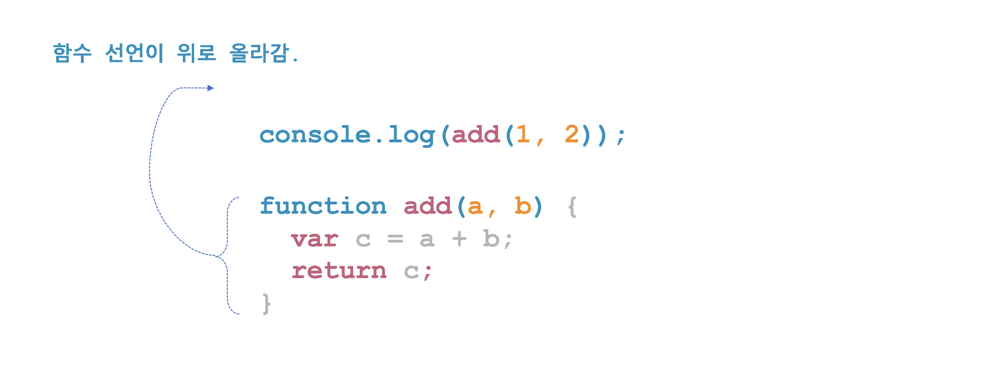

# 자바스크립트(JavaScript)
## 함수(Function)
자바스크립트에서 중요한 개념 중에 하나가 바로 함수다. 함수를 제대로 이해하고 활용할 수 있어야 자바스크립트가 갖고 있는 매력을 알 수 있다. 자바스크립트의 함수는 기본적으로 다른 언어의 함수와 비슷한 역할을 한다. 특정 기능을 수행하는 코드를 함수로 만들고, 필요할 때 이 함수를 호출해 결과 값을 받아서 처리하는 것처럼 말이다.


자바스크립트에서 함수를 생성하는 방법은 3가지가 있다. 3가지 방법 모두 함수를 생성한다는 점에서 같으나 함수의 동작에 미묘한 차이가 있다. 차이점은 나중에 알아보고 함수를 생성하는 방법부터 알아보자.

  - 함수 선언문(Function statement)
  - 함수 표현식(Function expression)
  - Function() 생성자 함수

### 1. 함수 선언문 방식으로 함수 생성
함수 선언문 방식은 함수를 정의하는 가장 일반적인 방법이다. 자바스크립트 뿐만 아니라 자바나 C++ 같은 언어에서도 문법만 약간 다를 뿐이지 비슷한 방법으로 함수를 정의하기 때문에 많은 학생에게 익숙한 함수 생성 방식이다.


자바스크립트에서 함수를 선언할 때 다른 언어와 구별되는 점이 몇 가지 있다.
- function 이란 키워드를 사용한다.
- 함수 인자에 자료 타입을 기술하지 않는다.
- 리턴 타입을 기술하지 않는다.

[java](#)
```java
int add (int a, int b) {
    int c = a + b;
    return c;
}

System.out.println(add(1, 2)); // 3
```

[javascript](#)
```html
<!DOCTYPE html>
<html>
<head>
    <script type="text/javascript">
  	function add(a, b) {
  	  var c = a + b;
  	  return c;
  	}
  	console.log(add(1, 2)); // 3
    </script>
</head>
<body>
</body>
</html>
```


### 2. 함수 표현식으로 함수 생성
자바스크립트에서는 함수도 하나의 값으로 취급한다. 따라서 함수도 숫자나 문자열처럼 변수에 할당하는 것이 가능하다. 자바나 C++ 처럼 객체지향 언어에만 익숙한 학생에겐 함수를 변수에 할당하는 것이 매우 생소한 개념이다. 자바스크립트나 파이썬 같은 함수형 언어에서는 흔하게 사용하는 방법이니 익숙해지자.





#### 2.1 익명 함수(Anonymous function) 표현식
[javascript](#)
```html
<!DOCTYPE html>
<html>
<head>
    <script type="text/javascript">
  	var  add = function (a, b) {
  	  var c = a + b;
  	  return c;
  	}

  	var sum = add;
  	console.log(add(1, 2)); // 3
  	console.log(sum(3, 4)); // 7
    </script>
</head>
<body>
</body>
</html>
```

함수 표현식에서 function 키워드 다음에 함수 이름이 없는 점에 주목하자. 이렇게 이름이 없는 함수를 자바스크립트에서는 ```익명 함수(Anonymous function)```라고 한다.

#### 2.2 기명 함수(Named function) 표현식
익명 함수와 달리 이름이 있는 함수를 ```기명 함수(Named function)```라고 하고 이 또한 함수 표현식에서 사용할 수 있다.

[javascript](#)
```html
<!DOCTYPE html>
<html>
<head>
    <script type="text/javascript">
  	var  add = function sum(a, b) {
  	  var c = a + b;
  	  return c;
  	}

  	console.log(add(1, 2)); // 3
    </script>
</head>
<body>
</body>
</html>
```
함수 표현식에서 기명 함수 sum 이 있으면 마치 sum 이란 이름으로 함수 호출이 될 것처럼 보인다. 하지만 아래처럼 코드를 실행하면 에러가 발생한다. 함수 표현식에서 사용한 함수 이름은 외부 코드에서 접근이 불가능하기 때문이다.

[javascript](#)
```html
<!DOCTYPE html>
<html>
<head>
    <script type="text/javascript">
  	var  add = function sum(a, b) {
  	  var c = a + b;
  	  return c;
  	}

  	console.log(add(1, 2)); // 3
  	console.log(sum(1, 2)); // ReferenceError: sum is not defined
    </script>
</head>
<body>
</body>
</html>
```
외부 코드에서 접근 할수 없으면 함수 이름을 넣을 필요가 전혀 없을 것 같다. 하지만 함수 안에서 자기 자신을 재호출하는 재귀 호출을 생각해보면 함수 표현식에서도 함수 이름이 필요할 때가 있다. 재귀 호출의 대표적인 예로 팩토리얼(Factorial)을 계산하는 함수가 될 수 있다.


[javascript](#)
```html
<!DOCTYPE html>
<html>
<head>
    <script type="text/javascript">
  	var fact = function factorial(n) {
  	  if (n <= 0) {
  	    return 1;
  	  }
  	  return (n * factorial(n - 1));
  	};
  	console.log(fact(6)); // 1*2*3*4*5*6 = 720
    </script>
</head>
<body>
</body>
</html>
```

### 3. Function() 생성자로 함수 생성
자바스크립트의 함수는 Function() 이라는 기본 내장 생성자 함수로부터 생성된 객체로 볼 수 있다. 앞서 알아본 함수 선언문이나 함수 표현식 방식도 내부적으로는 Function() 생성자 함수로 함수가 생성된다고 볼 수 있다.


[javascript](#)
```html
<!DOCTYPE html>
<html>
<head>
    <script type="text/javascript">
  	var  add = new Function('a', 'b', 'var c = a + b; return c');
  	console.log(add(1, 2)); // 3
    </script>
</head>
<body>
</body>
</html>
```

다행히 Function() 생성자 함수를 사용한 함수 생성 방법은 거의 사용되지 않는다. 일반적으로 선언문 또는 표현식 방식으로 함수를 생성하고 호출하기 때문에 학생들은 이런 방식으로도 함수 생성이 가능하구나 정도 수준으로 이해하고 넘어가면 된다.

## 4.화살표(=>) 함수로 함수 생성
자바스크립트로 개발하다보면 익명 함수를 많이 사용한다. 특히, 이벤트 받아 처리하는 비동기 처리를 할 때는 콜백 함수로 익명 함수를 많이 사용한다.  ECMAScript 6에서는 이러한 익명 함수를 좀 더 간단히 생성할 수 있는 방법으로 화살표 함수(Arrow Function)를 제공한다. 화살표 함수를 사용하면 function 이라는 키워드를 사용하지 않아도 되고 때에 따라서 return 키워드를 생략할 수 있기 때문에 코드가 간결해지는 장점이 있다.


[javascript](#)
```html
<!DOCTYPE html>
<html>
<head>
    <script type="text/javascript">
    	var add = (a, b) => {
    	  var c = a + b;
    	  return c;
    	};
    	console.log(add(1, 2)); // 3
    </script>
</head>
<body>
</body>
</html>
```



[javascript](#)
```html
<!DOCTYPE html>
<html>
<head>
    <script type="text/javascript">
    	var f = () => {
    	    return "javascript";
    	};

    	console.log(f()); // javascript

    	var f = x => {
    	    return x * x;
    	}

    	console.log(f(10)); // 100

    	var f = (x, y) => {
    	    return x * y;
    	}

    	console.log(f(5, 100)); // 500

    	var f = (x , y) => x + y ;

    	console.log(f(100, 100)); // 200
    </script>
</head>
<body>
</body>
</html>
```

## 함수 호이스팅(Function hoisting)
자바스크립트에서 모든 함수는 변수와 마찬가지로 호이스팅 된다. 함수 호출을 먼저하고 함수 선언을 나중에 하더라도 에러 없이 호출이 가능하다. 자바스크립트 엔진이 내부적으로 함수 선언을 맨 위로 끌어 올리기 때문이다. 정리하면 자바스크립트에서는 함수 선언의 위치와 무관하게 언제든지 함수 호출을 할 수 있다.


### 1. 함수 선언문 - 호이스팅 가능
[javascript](#)
```html
<!DOCTYPE html>
<html>
<head>
    <script type="text/javascript">
    	console.log(add(1, 2)); // 3

    	function add(a, b) {
    	  var c = a + b;
    	  return c;
    	}
    </script>
</head>
<body>
</body>
</html>
```

### 2. 함수 표현식 - 호이스팅 불가
[javascript](#)
```html
<!DOCTYPE html>
<html>
<head>
    <script type="text/javascript">
    	console.log(add(1, 2)); // Uncaught TypeError: add is not a function
    	var  add = function (a, b) {
    	  var c = a + b;
    	  return c;
      }
    </script>
</head>
<body>
</body>
</html>

```
선언문으로 생성된 함수만 호이스팅 된다. 표현식으로 생성된 함수는 호이스팅 돼지 않는다. 함수가 호이스팅 되길 원한다면 반드시 선언문으로 함수를 생성해야 한다.


## 함수 인자
자바스크립트에서는 함수를 호출할 인자 값을 넘기지 않아도 호출할 수 있다. 자바나 C++ 같은 언어에서는 함수를 호출 할때 정의한 함수 인자의 개수와 타입이 맞지 않으면 컴파일 단계에서 에러가 발생한다.

[java](#)
```java
public class Main {

    public static int add (int a, int b) {
        int c = a + b;
        return c;
    }

    public static void main(String[] args) {
        System.out.println(add()); //  Error:(21, 28) java: method add in class Main cannot be applied to given types;
                                   // required: int,int
                                   // found: no arguments
                                   // reason: actual and formal argument lists differ in length
        System.out.println(add(1)); // Error:(22, 28) java: method add in class Main cannot be applied to given types;
                                    // required: int,int
                                    // found: int
                                    // reason: actual and formal argument lists differ in length

        System.out.println(add(1, 2)); // 3

        System.out.println(add(1, 2, 4)); // Error:(24, 28) java: method add in class Main cannot be applied to given types;
                                          // required: int,int
                                          // found: int,int,int
                                          // reason: actual and formal argument lists differ in length
    }
}
```

[javascript](#)
```html
<!DOCTYPE html>
<html>
<head>
    <script type="text/javascript">
        function add(a, b) {
            var c = a + b;
            return c;
        }
        console.log(add()); // NaN
        console.log(add(1)); // NaN
        console.log(add(1, 2)); // 3
        console.log(add(1, 2, 3)); // 3
    </script>
</head>
<body>
</body>
</html>
```

함수에 정의한 인자 값을 넘기지 않으면 자바스크립트는 인자 값을 undefined 으로 설정한다. 함수를 작성할 때는 인자 값이 undefined 인지를 반드시 확인하여 오류 처리 또는 별도의 처리를 하여 문제가 없도록 해야 한다.
[javascript](#)
```html
<!DOCTYPE html>
<html>
<head>
    <script type="text/javascript">
        function add(a, b) {
            if (typeof(a) == 'undefined')
                a = 0;

            if (typeof(b) == 'undefined')
                b = 0;

            var c = a + b;
            return c;
        }
        console.log(add()); // 0
        console.log(add(1)); // 1
        console.log(add(1, 2)); // 3
        console.log(add(1, 2, 3)); // 3
    </script>
</head>
<body>
</body>
</html>
```

[javascript](#)
```html
<!DOCTYPE html>
<html>
<head>
    <script type="text/javascript">
        function add(a, b) {
            a = a || 0;
            b = b || 0;

            var c = a + b;
            return c;
        }
        console.log(add()); // 0
        console.log(add(1)); // 1
        console.log(add(1, 2)); // 3
        console.log(add(1, 2, 3)); // 3
    </script>
</head>
<body>
</body>
</html>
```
