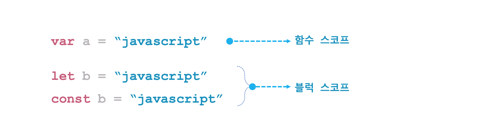
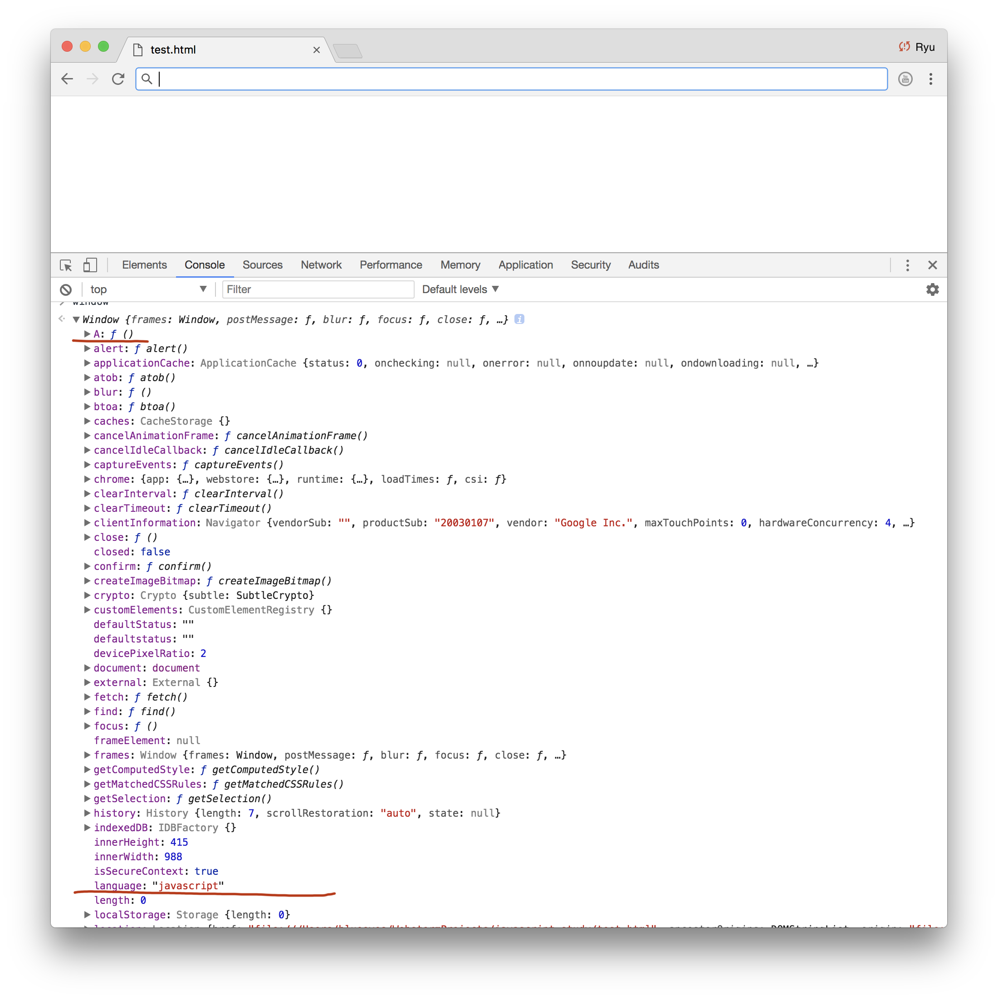

# 자바스크립트(JavaScript)

##  스코프(Scope)


우선 스코프에 대해 알아보자. 스코프를 직역하면 영역, 범위라는 뜻으로 프로그램 언어에서는 [유효 범위](#) 라고도 한다. 일반적으로 스코프는 변수를 사용할 수 있는 범위 또는 변수의 수명을 의미한다. 변수는 스코프와 운명을 같이 한다. 변수를 선언하는 시점에 현재 스코프에 포함되었다가 스코프가 끝나면 동시에 사라진다. 스코프가 끝나면 더이상 변수를 참조 할 수 없다. 스코프의 종류에는 아래처럼 크게 두 가지가 있다.

 * 글로벌 스코프(Global scope, 전역 스코프)
 * 로컬 스코프(Local scope, 지역 스코프)

### 1. 글로벌 스코프
자바스크립트를 실행하면 무조건 기본 스코프가 하나 생긴다. 이 스코프는 자바스크립트 내에 어디서든 참조할 수 있어 [글로벌 스코프(Global scope)](#)라고 한다. 이러한 글로벌 스코프에서 선언된 변수와 함수를 각각 [글로벌 변수(전역 변수)](#), [글로벌 함수(전역 함수)](#)라고 한다. 자바스크립트에서는 함수 밖에서 변수를 선언하면 글로벌 변수가 된다.

[javascript](#)
```html
<!DOCTYPE html>
<html>
<head>
    <script type="text/javascript">
        var language = "javascript";
        function A() {
            console.log(language); // "javascript"
            function B() {
                console.log(language); // "javascript"
            }
            B();
        }

        function C() {
            console.log(language); // javascript
        }
        A();
        C();
        console.log(language); // javascript
    </script>
</head>
<body>
</body>
</html>
```
위 코드에서 변수 language는 함수 밖에서 선언했기 때문에 글로벌 변수이다. 따라서 함수 A(), B(), C() 에서 변수 language을 참조할 수 있다. 자바스크립트 블럭 안에서는 변수 language을 자유롭게 참조할 수 있다.

```html
<!DOCTYPE html>
<html>
<head>
    <script type="text/javascript">
        var language = "javascript";
        function A() {
            console.log(language); // "javascript"
            function B() {
                console.log(language); // "javascript"
            }
            B();
        }

        function C() {
            language = "c++";
            console.log(language); // c++
        }
        A();
        C();
        console.log(language); // c++
    </script>
</head>
<body>
</body>
</html>
```

### 2. 로컬 스코프
자바스크립트에서는 함수 안에서 변수를 선언하면 로컬 변수가 된다. 로컬 변수는 함수가 실행되는 동안 내부에서는 마음대로 참조가 가능하지만 함수가 끝나면 변수의 생명도 함께 끝난다. 함수 밖에서는 로컬 변수가 보이지 않기 때문에 참조가 불가능하다. 참조하려 해도 자바스크립트 엔진에서 에러를 발생 시킨다. ```함수 안에서 선언한 변수가 로컬 변수가 된다는 것은 자바스크립트의 함수가 로컬 스코프를 만든다는 뜻이다```.

[javascript](#)
```html
<!DOCTYPE html>
<html>
<head>
    <script type="text/javascript">
      function A() {
          var language = "javascript";
          console.log(language); // "javascript"
          function B() {
              console.log(language); // "javascript"
          }
          B();
      }

      function C() {
          console.log(language); // Uncaught ReferenceError: language is not defined
      }
      A();
      C();
      console.log(language); // Uncaught ReferenceError: language is not defined
    </script>
</head>
<body>
</body>
</html>
```

### 3. 블럭 스코프
앞서 함수가 로컬 스코프를 만든다는 것을 확인했다. 로컬 스코프를 만드는 방법이 함수밖에 없는 것은 아니다. 자바나 C++ 같은 언어에서는 중괄호({})로 [블럭 스코프(Block scope)](#)를 생성할 수 있다.

[java](#)
```java
public class Main {

    public static void main(String[] args) {
        String language = "javascript";
        System.out.println(language); // javascript
    }

}
```

변수 앞 뒤로 중괄호만 했을 뿐인데 바로 아래 코드에서 참조가 불가능하다. 중괄호가 블럭 스코프를 만들기 때문이다. 변수 language 는 중괄호가 닫히면 더 이상 참조할 수 없다.

[java](#)
```java
public class Main {

    public static void main(String[] args) {
        {
            String language = "javascript";
        }

        System.out.println(language); // Error:(44, 28) java: cannot find symbol
                                      // symbol:   variable language
                                      // location: class Main
    }

}
```

자바스크립트에서도 중괄호가 블럭 스코프를 생성하는지 테스트 해보자. 결과는 놀랍게도 language 변수를 참조할 수 있다. 즉, 자바스크립트에서는 중괄호가 블럭 스코프를 생성하지 않는다.

[javascript](#)
```html
<!DOCTYPE html>
<html>
<head>
    <script type="text/javascript">
        {
            var language = "javascript";
        }
        console.log(language); // javascript
    </script>
</head>
<body>
</body>
</html>
```

조금 더 구체적인 예로 for 구문을 사용해서 자바와 자바스크립트 사이에 어떤 차이가 있는지 다시 확인해보자.

[java](#)
```java
public class Main {

    public static void main(String[] args) {
        for (int i = 0; i < 10; i++) {
            int power = i * i;
        }

        System.out.println(power); // Error:(44, 28) java: cannot find symbol
                                   // symbol: variable power
                                   // location: class Main
    }

}
```

[javascript](#)
```html
<!DOCTYPE html>
<html>
<head>
    <script type="text/javascript">
        for (var i = 0; i < 10; i++) {
            var power = i * i;
        }
        console.log(power); // 81
    </script>
</head>
<body>
</body>
</html>
```

이것으로 자바스크립트는 함수 스코프만 있고 블럭 스코프는 없다고 결론을 내리면 안된다. ES6 에서는 변수 선언 키워드로 var 이외에 let, const 라는 키워드가 새롭게 추가됐다. 새롭게 추가된 키워드로 변수 선언을 하면 해당 변수는 블럭 스코프를 갖게 된다.



최근 ES6 코드 대부분은 var 키워드를 사용하지 않는다. let 과 const 로 모두 대체가 가능하다. var 로 선언된 변수는 함수 스코프를 갖기 때문에 블럭 스코프에 익숙한 개발자에게 많은 혼란을 야기한다. 이러한 이유로 자바스크립트에서 var 사용이 줄어들고 있는 추세이다.

[javascript](#)
```html
<!DOCTYPE html>
<html>
<head>
    <script type="text/javascript">
        for (var i = 0; i < 10; i++) {
            let power = i * i;
        }
        console.log(power); // Uncaught ReferenceError: power is not defined
    </script>
</head>
<body>
</body>
</html>
```

## 자바스크립트만의 특징
 - 변수명 중복 허용
 - var 키워드  생략
 - 렉시컬 스코프(Lexical scope)

### 1. 변수명 중복 허용

[java](#)
```java
public class Main {
    public static void main(String[] args) {
        String language = "javascript";
        if (true) {
            String language = "c++"; // Error:(41, 20) java: variable language is already defined in method main(java.lang.String[])
            System.println(language);
        }
        System.out.println(language);
    }
}
```

[javascript](#)
```javascript
<!DOCTYPE html>
<html>
<head>
    <script type="text/javascript">
        function A() {
            var language = "javascript";
            if (true) {
                var language = "c++";
                console.log(language); // c++
            }
            console.log(language); // c++
        }
        A();
    </script>
</head>
<body>
</body>
</html>
```

### 2. var 키워드 생략
자바스크립트에서 변수 선언은 var 키워드를 사용한다. var 키워드를 생략하고 변수에 값을 할당하면 어떤 일이 벌어질까? 물론, 에러가 발생하지는 않는다.

[javascript](#)
```javascript
<!DOCTYPE html>
<html>
<head>
    <script type="text/javascript">
        function A() {
            language = "javascript";
            console.log(language); // javascript
        }
        A();
        console.log(language); // javascript
        console.log(window.language); // javascript
    </script>
</head>
<body>
</body>
</html>
```
함수 안에서 var 없이 사용한 변수는 글로벌 변수가 된다. 그래서 함수 밖에서 참조가 가능하다. 자바스크립트의 모든 글로벌 변수 및 함수는 window 객체에 포함된다. 크롬 개발자 도구에서 window 객체를 확인해보면 명확히 알 수 있다.



[javascript](#)
```javascript
<!DOCTYPE html>
<html>
<head>
    <script type="text/javascript">
        function A() {
            window.language = "javascript";
            console.log(language); // javascript
        }
        A();
        console.log(language); // javascript
        console.log(window.language); // javascript
    </script>
</head>
<body>
</body>
</html>
```

[javascript](#)
```javascript
<!DOCTYPE html>
<html>
<head>
    <script type="text/javascript">
        window.A = function () {
            window.language = "javascript";
            console.log(language); // javascript
        }
        A();
        window.A();
        console.log(language); // javascript
        console.log(window.language); // javascript
    </script>
</head>
<body>
</body>
</html>
```
### 3. 렉시컬 스코프(Lexical scope)
아래 자바스크립트에서 A(), B() 함수를 호출하면 콘솔에 어떤 문자가 출력될지 생각해보자.
 [javascript](#)
 ```javascript
 <!DOCTYPE html>
 <html>
 <head>
     <script type="text/javascript">
         var language = "javascript";
         function A() {
             var language = "C++";
             B();
         }
         function B() {
             console.log(language);
         }
         A(); // ?
         B(); // ?
     </script>
 </head>
 <body>
 </body>
 </html>
 ```
똑같은 코드를 Perl 로 작성했을 때는 반대의 결과가 나온다.

 [perl](#)
 ```perl
$language = "perl";
sub A {
    local $language = "C++";
    B();
}

sub B {
   print "$language\n";
}
A(); # ?
B(); # ?

 ```

언어에 따라서 이런 차이가 발생하는 이유는 스코프를 결정하는 정책이 언어마다 다르기 때문이다. 자바스크립트처럼 소스코드에 작성된 문맥에 의해 스코프가 결정되는 것을  [렉시컬 스코프(Lexical scope)](#)라고 하며, 런타임에 결정되는 스코프를 [다이나믹 스코프(Dynamic scope)](#)라고 한다. 자바스크립를 비록한 현대 대부분의 프로그래밍 언어가 렉시컬 스코프를 따르고 있다.


