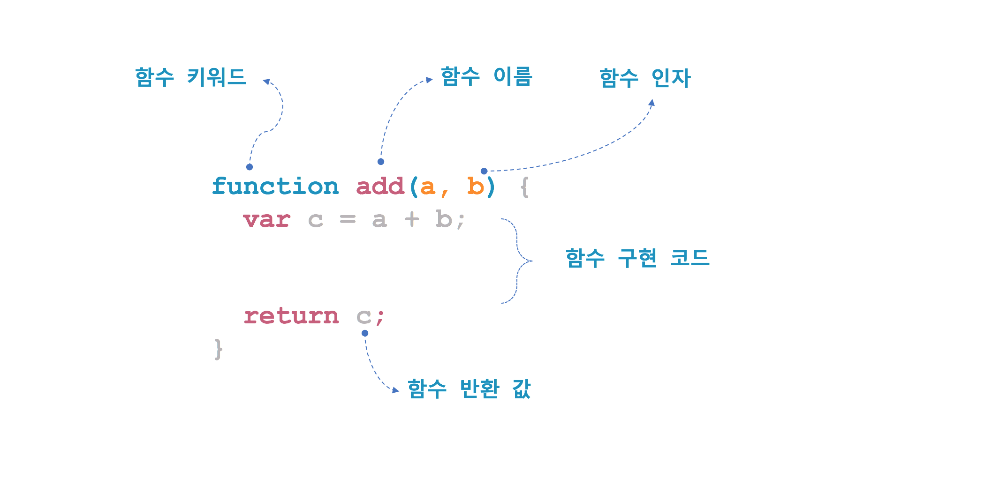
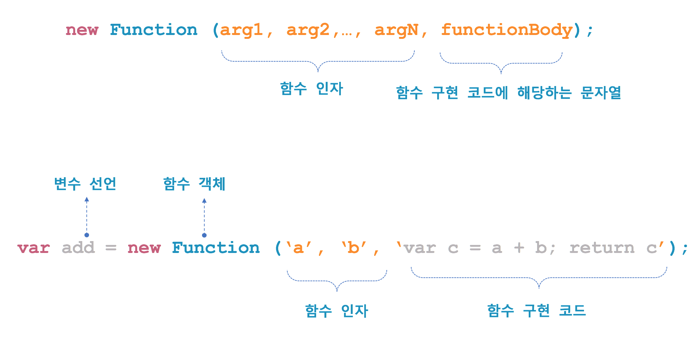
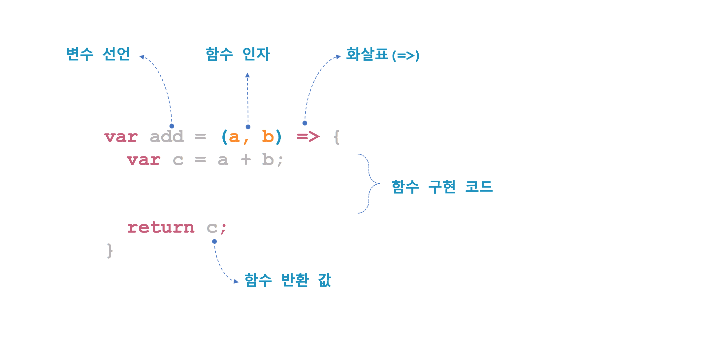

## Git 명령어
명령어 | 설명
--- | ---
git remote | 로컬 저장소와 연결된 원격 저장소의 별칭 목록을 보여준다.
git remote -v | 로컬 저장소와 연결된 원격 저장소의 별칭과 주소를 보여준다.
git remote add <별칭> <원격 저장소 주소> | 로컬 저장소를 특정 원격 저장소와 연결한다.

## 자바스크립트

자바스크립트에서 함수를 생성하는 방법은 4가지가 있다.

  - 함수 선언문(Function statement)
  - 함수 표현식(Function expression)
  - Function() 생성자 함수
  - 화살표(=>) 함수

### 1. 함수 선언문

### 2. 함수 표현식
 - 자바스크립트에서 함수는 객체이다.
 - 함수를 변수에 할당할 수 있다는 점이 매우 매우 중요함.

### 3. Function() 생성자
 - Function() 생성자 함수를 사용한 함수 생성 방법은 거의 사용되지 않는다.

## 4.화살표(=>) 함수
 - ECMAScript 6에서는 이러한 익명 함수를 좀 더 간단히 생성할 수 있는 방법으로 화살표 함수(Arrow Function)를 제공한다.

