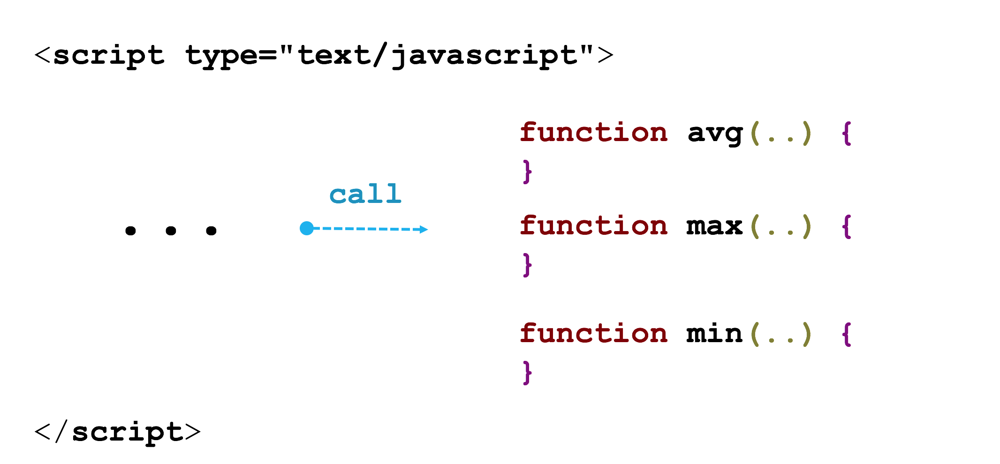
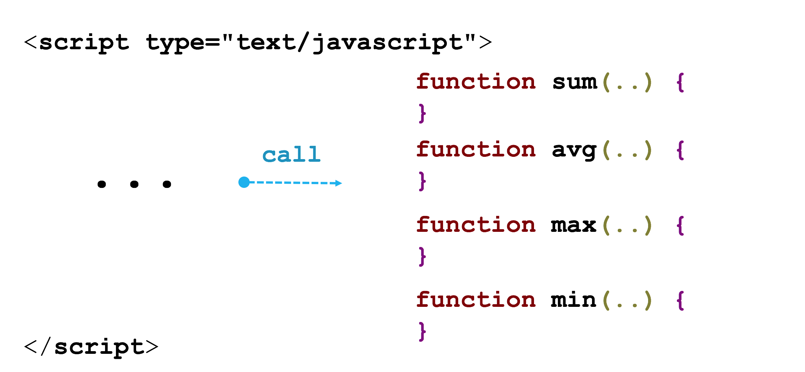
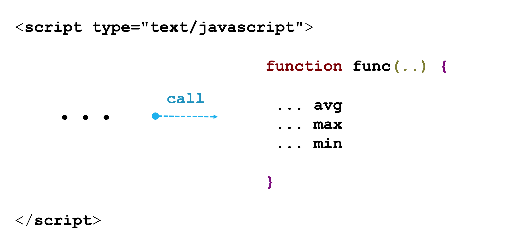
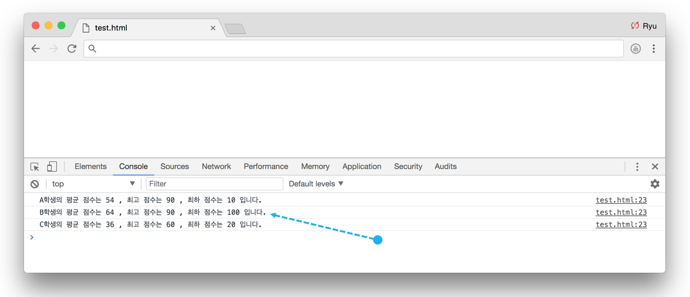

## 문제 01
학생 | javascript | python | java | ruby | swift
--- | --- | --- | --- | --- | ---
A | 90 | 80 | 50 | 40 | 10
B | 90 | 30 | 100 | 50 | 50
C | 20 | 30 | 60 | 50 | 20

위 표는 학생 A, B, C 의 성적표이다. 어떤 학생이 위 3명 학생의 평균, 최고 점수, 최하 점수를 출력하는 자바스크립트 프로그램을 작성했다. 프로그램을 작성한 학생이 자바스크립트를 배운지 얼마 안돼 아직 함수를 모른다. 함수를 몰라서 그랬는지 소스 코드가 매우 길다. 함수가 어떤 역할을 하는지 초짜 학생에게 알려주는 의미에서 여러분들이 아래 프로그램을 함수를 사용해 재작성해주세요.(혹시, 배열이나 객체를 아는 학생은 배열과 객체를 사용해도 좋습니다)

결과만 콘솔 화면에 아래처럼 나오면 됩니다.
```txt
A 학생의 평균 점수는 54 , 최고 점수는 90 , 최하 점수는 10 입니다.
B 학생의 평균 점수는 64 , 최고 점수는 100 , 최하 점수는 30 입니다.
C 학생의 평균 점수는 36 , 최고 점수는 60 , 최하 점수는 20 입니다.
```

```javascript_function_problem_01.html```
```html
<!DOCTYPE html>
<html>
<head>
    <script type="text/javascript">

       var A_javascript = 90;
       var A_python= 80;
       var A_java = 50;
       var A_ruby = 40;
       var A_swift = 10;

       var B_javascript = 90;
       var B_python= 30;
       var B_java = 100;
       var B_ruby = 50;
       var B_swift = 50;


       var C_javascript = 20;
       var C_python= 30;
       var C_java = 60;
       var C_ruby = 50;
       var C_swift = 20;

       var A_average = (A_javascript + A_python + A_java + A_ruby + A_swift) / 5;
       var B_average = (B_javascript + B_python + B_java + B_ruby + B_swift) / 5;
       var C_average = (C_javascript + C_python + C_java + C_ruby + C_swift) / 5;

       var A_max = 0;
       A_max = (A_max > A_javascript) ? A_max : A_javascript;
       A_max = (A_max > A_python) ? A_max : A_python;
       A_max = (A_max > A_java) ? A_max : A_java;
       A_max = (A_max > A_ruby) ? A_max : A_ruby;
       A_max = (A_max > A_swift) ? A_max : A_swift;

       var B_max = 0;
       B_max = (B_max > B_javascript) ? B_max : A_javascript;
       B_max = (B_max > B_python) ? B_max : B_python;
       B_max = (B_max > B_java) ? B_max : B_java;
       B_max = (B_max > B_ruby) ? B_max : B_ruby;
       B_max = (B_max > B_swift) ? B_max : B_swift;

       var C_max = 0;
       C_max = (C_max > C_javascript) ? C_max : A_javascript;
       C_max = (C_max > C_python) ? C_max : C_python;
       C_max = (C_max > C_java) ? C_max : C_java;
       C_max = (C_max > C_ruby) ? C_max : C_ruby;
       C_max = (C_max > C_swift) ? C_max : C_swift;


       var A_min = 100;
       A_min = (A_min < A_javascript) ? A_min : A_javascript;
       A_min = (A_min < A_python) ? A_min : A_python;
       A_min = (A_min < A_java) ? A_min : A_java;
       A_min = (A_min < A_ruby) ? A_min : A_ruby;
       A_min = (A_min < A_swift) ? A_min : A_swift;

       var B_min = 100;
       B_min = (B_min < B_javascript) ? B_min : A_javascript;
       B_min = (B_min < B_python) ? B_min : B_python;
       B_min = (B_min < B_java) ? B_min : B_java;
       B_min = (B_min < B_ruby) ? B_min : B_ruby;
       B_min = (B_min < B_swift) ? B_min : B_swift;

       var C_min = 100;
       C_min = (C_min < C_javascript) ? C_min : A_javascript;
       C_min = (C_min < C_python) ? C_min : C_python;
       C_min = (C_min < C_java) ? C_min : C_java;
       C_min = (C_min < C_ruby) ? C_min : C_ruby;
       C_min = (C_min < C_swift) ? C_min : C_swift;


       console.log('A 학생의 평균 점수는 ' + A_average + ' , 최고 점수는 ' + A_max + ' , 최하 점수는 ' + A_min + ' 입니다.');
       console.log('B 학생의 평균 점수는 ' + B_average + ' , 최고 점수는 ' + B_max + ' , 최하 점수는 ' + B_min + ' 입니다.');
       console.log('C 학생의 평균 점수는 ' + C_average + ' , 최고 점수는 ' + C_max + ' , 최하 점수는 ' + C_min + ' 입니다.');

    </script>
</head>
<body>
</body>
</html>
```

## 문제 01 - 과제 수행 요약

### 유형 01



[code](#)
```html
<!DOCTYPE html>
<html>
<head>
    <script type="text/javascript">
        function Avg(a,b,c,d,e){
            var avg =0;
            avg = (a+b+c+d+e)/5;
            return avg;
        }
        function Max(a,b,c,d,e){
            var max =0;
            max = (max>a) ? max :a;
            max = (max>b) ? max :b;
            max = (max>c) ? max :c;
            max = (max>d) ? max :d;
            max = (max>e) ? max :e;
            return max;
        }

        function Min(a,b,c,d,e){
            var min =100;
            min = (min<a) ? min :a;
            min = (min<b) ? min :b;
            min = (min<c) ? min :c;
            min = (min<d) ? min :d;
            min = (min<e) ? min :e;
            return min;
        }
        var A_javascript = 90;
        var A_python= 80;
        var A_java = 50;
        var A_ruby = 40;
        var A_swift = 10;
        var B_javascript = 90;
        var B_python= 30;
        var B_java = 100;
        var B_ruby = 50;
        var B_swift = 50;
        var C_javascript = 20;
        var C_python= 30;
        var C_java = 60;
        var C_ruby = 50;
        var C_swift = 20;
        var A_average= Avg(90,80,50,40,10);
        var B_average= Avg(90,30,100,50,50);
        var C_average= Avg(20,30,60,50,20);
        var A_max = Max(90,80,50,40,10);
        var B_max = Max(90,30,100,50,50);
        var C_max = Max(20,30,60,50,20);

        var A_min = Min(90,80,50,40,10);
        var B_min = Min(90,30,100,50,50);
        var C_min = Min(20,30,60,50,20);

        console.log('A 학생의 평균 점수는 ' + A_average + ' , 최고 점수는 ' + A_max + ' , 최하 점수는 ' + A_min + ' 입니다.');
        console.log('B 학생의 평균 점수는 ' + B_average + ' , 최고 점수는 ' + B_max + ' , 최하 점수는 ' + B_min + ' 입니다.');
        console.log('C 학생의 평균 점수는 ' + C_average + ' , 최고 점수는 ' + C_max + ' , 최하 점수는 ' + C_min + ' 입니다.');
    </script>
</head>
<body>
</body>
</html>
```

[code](#)
```html
<!DOCTYPE html>
<html>
<head>
    <script type="text/javascript">
        var A_javascript = 90;
        var A_python= 80;
        var A_java = 50;
        var A_ruby = 40;
        var A_swift = 10;
        var B_javascript = 90;
        var B_python= 30;
        var B_java = 100;
        var B_ruby = 50;
        var B_swift = 50;
        var C_javascript = 20;
        var C_python= 30;
        var C_java = 60;
        var C_ruby = 50;
        var C_swift = 20;
        var Avg = (javascript, pyth, java, ruby, swift) => {
            var avg_grade = (javascript + pyth + java + ruby + swift) / 5;
            return avg_grade;
        }

        var Max = (javascript, pyth, java, ruby, swift) => {
            var max = new Array(javascript, pyth, java, ruby, swift);
            var max_grade = 0;
            for (i=0; i<=max.length; i++) {
                if(max[i] > max_grade) max_grade = max[i];
            }
            return max_grade;
        }
        var Min = (javascript, pyth, java, ruby, swift) => {
            var min = new Array(javascript, pyth, java, ruby, swift);
            var min_grade = 100;
            for (i=0; i<=min.length-1; i++) {
                if(min[i] < min_grade) min_grade = min[i];
            }
            return min_grade;
        }
        var A_average = Avg(A_javascript, A_python, A_java, A_ruby, A_swift);
        var B_average = Avg(B_javascript, B_python, B_java, B_ruby, B_swift);
        var C_average = Avg(C_javascript, C_python, C_java, C_ruby, C_swift);
        var A_max = Max(A_javascript, A_python, A_java, A_ruby, A_swift);
        var B_max = Max(B_javascript, B_python, B_java, B_ruby, B_swift);
        var C_max = Max(C_javascript, C_python, C_java, C_ruby, C_swift);
        var A_min = Min(A_javascript, A_python, A_java, A_ruby, A_swift);
        var B_min = Min(B_javascript, B_python, B_java, B_ruby, B_swift);
        var C_min = Min(C_javascript, C_python, C_java, C_ruby, C_swift);
        console.log('A 학생의 평균 점수는 ' + A_average + ' , 최고 점수는 ' + A_max + ' , 최하 점수는 ' + A_min + ' 입니다.');
        console.log('B 학생의 평균 점수는 ' + B_average + ' , 최고 점수는 ' + B_max + ' , 최하 점수는 ' + B_min + ' 입니다.');
        console.log('C 학생의 평균 점수는 ' + C_average + ' , 최고 점수는 ' + C_max + ' , 최하 점수는 ' + C_min + ' 입니다.');
    </script>
</head>
<body>
</body>
</html>
```
 - 가독성 있는 함수 인자.
 - 화살표 함수를 사용함.
 - 배열을 함수 인자로 넘길 수 있는 데 못 한 점.

### 유형 02



```html
<!DOCTYPE html>
<html>
<head>
    <script type="text/javascript">
        var A_grade = new Array(90,80,50,40,10);
        var B_grade = new Array(90,30,100,50,50);
        var C_grade = new Array(20,30,60,50,20);
        function sum(val) {
            var sum = 0;
            for(var i=0; i<5; i++)
                sum += val[i];
            return sum;
        }
        function avg(val) {
            var avg = 0;
            avg = sum(val) / 5;
            return avg;
        }
        function max(val) {
            var max = 0;
            for(var i=0; i<5; i++)
                max = (max >= val[i]) ? max : val[i];
            return max;
        }
        function min(val) {
            var min = 100;
            for(var i=0; i<5; i++)
                min = (min >= val[i]) ? val[i] : min;
            return min;
        }
        console.log('A 학생의 평균 점수는 ' + avg(A_grade) + ' , 최고점수는 ' + max(A_grade) + ' , 최하 점수는 ' + min(A_grade) + ' 입니다.');
        console.log('B 학생의 평균 점수는 ' + avg(B_grade) + ' , 최고점수는 ' + max(B_grade) + ' , 최하 점수는 ' + min(B_grade) + ' 입니다.');
        console.log('C 학생의 평균 점수는 ' + avg(C_grade) + ' , 최고점수는 ' + max(C_grade) + ' , 최하 점수는 ' + min(C_grade) + ' 입니다.');
    </script>
</head>
<body>
</body>
</html>
```
 - 배열을 함수 인자로 넘기는 방법으로 코드 양이 줄어듬.
 - for 구문에서 범위를 5로 하드 코딩하는 것보다 val.length 을 사용하면 더 좋음.

### 유형 03



[code](#)
 ```html
 <html>
 <head>
     <script>
         var stu_a=[90,80,50,40,10];
         var stu_b=[90,30,100,50,50];
         var stu_c=[20,30,60,50,20];
         function exam_score(stu) {
             var sum=0;
             var max=0;
             var min=stu[0];
             for(i=0; i<stu.length; i++){
                 if(max < stu[i]) max=stu[i];
                 if(min > stu[i]) min=stu[i];
                 sum+=stu[i];
             }
             if(stu==stu_a) console.log('A:'+sum/5+' highscore:'+max+' lowscore:'+min);
             else if(stu==stu_b) console.log('B:'+sum/5+' highscore:'+max+' lowscore:'+min);
             else if(stu==stu_c) console.log('C:'+sum/5+' highscore:'+max+' lowscore:'+min);
         }
         exam_score(stu_a);
         exam_score(stu_b);
         exam_score(stu_c);
     </script>
 <body>
 </body>
 </html>
 ```
 - 아래처럼 학생 이름을 함수 인자로 넘겼으면 어땠을까?
 ```html
 <html>
<head>
    <script>
        var stu_a=[90,80,50,40,10];
        var stu_b=[90,30,100,50,50];
        var stu_c=[20,30,60,50,20];
        function exam_score(name, stu) {
            var sum=0;
            var max=0;
            var min=stu[0];
            for(i=0; i<stu.length; i++){
                if(max < stu[i]) max=stu[i];
                if(min > stu[i]) min=stu[i];
                sum+=stu[i];
            }
            console.log(name + ':'+sum/5+' highscore:'+max+' lowscore:'+min);
        }
        exam_score('A', stu_a);
        exam_score('B', stu_b);
        exam_score('C', stu_c);
    </script>
<body>
</body>
</html>
 ```
[code](#)
 ```html
 <!DOCTYPE html>
 <html>
 <head>
     <script type="text/javascript">
         function cal(stu, javascript, python, java, ruby, swift)
         {
             var score = new Array(javascript, python, java, ruby, swift);

             var average = (javascript+python+java+ruby+swift)/5;

             var max = score[0];
             var min = score[0];

             for(var i=0; i<score.length; i++)
             {
                 if(score[i]>max)
                     max = score[i];
             }

             for(var i=0; i<score.length; i++)
             {
                 if(score[i]<min)
                     min = score[i];
             }

             return stu+"의 평균 점수는 "+average+", 최고 점수는 "+max+", 최하 점수는 "+min+" 입니다."+'<br>';
         }
         document.write(cal('A', 30, 50, 80, 40, 70));
         document.write(cal('B', 100, 70, 60, 20, 80));
         document.write(cal('C', 90, 90, 90, 70, 65));
     </script>
 </head>
 <body>
 </body>
 </html>
 ```

[code](#)
  ```html
  <!DOCTYPE html>
  <html>
  <head>
  	<script type="text/javascript">
  		function calCul(a, b, c, d, e, f){
  			var score = new Array();
  			score = [b,c,d,e,f];
  			var max=0;
  			var min=100;
  			var avg = (b+c+d+e+f)/5;
  			for(var i=0;i<score.length;i++){
  				if(max<score[i]){
  					max=score[i];
  				}
  				if(min>score[i]){
  					min=score[i];
  				}
  			}
  			return a+" 학생의 평균 점수는 "+avg+" , 최고 점수는 "+max+" , 최하 점수는 "+min+" 입니다.";
  		}
  		console.log(calCul("A",90,80,50,40,10));
  		console.log(calCul("B",90,30,100,50,50));
  		console.log(calCul("C",20,30,60,50,20));
  	</script>
  </head>
  <body>
  </body>
  </html>
  ```
 - var score = [b,c,d,e,f]; 로 하면 됨.


[code](#)
```html
 <!DOCTYPE html>
 <html>
 <head>
     <script type="text/javascript">
     var problem1  = function(name, javascript, python, java, ruby, swift){
       var average = (javascript + python + java + ruby + swift) / 5;
       var max = 0;
       max = (max > javascript) ? max : javascript;
       max = (max > python) ? max : python;
       max = (max > java) ? max : java;
       max = (max > ruby) ? max : ruby;
       max = (max > swift) ? max : swift;
       var min = 100;
       min = (min < javascript) ? min : javascript;
       min = (min < python) ? min : python;
       min = (min < java) ? min : java;
       min = (min < ruby) ? min : ruby;
       min = (min < swift) ? min : swift;
       console.log(name + '학생의 평균 점수는 ' + average + ' , 최고 점수는 ' + max + ' , 최하 점수는 ' + min + ' 입니다.');
     }
     //여기까지가 함수다

     problem1("A",90,80,50,40,10);
     problem1("B",90,30,100,50,50);
     problem1("C",20,30,60,50,20);
     </script>
 </head>
 <body>
 </body>
 </html>
 ```
 - Math.max(), Math.min() 함수 사용하면 좋음.

 [code - 수정](#)
 ```html
 <!DOCTYPE html>
 <html>
 <head>
     <script type="text/javascript">
         var problem1  = function(name, javascript, python, java, ruby, swift){
             var average = (javascript + python + java + ruby + swift) / 5;
             var max = Math.max(javascript, python, java, ruby, swift);
             var min = Math.min(javascript, python, java, ruby, swift);
             console.log(name + '학생의 평균 점수는 ' + average + ' , 최고 점수는 ' + max + ' , 최하 점수는 ' + min + ' 입니다.');
         }
         //여기까지가 함수다

         problem1("A",90,80,50,40,10);
         problem1("B",90,30,100,50,50);
         problem1("C",20,30,60,50,20);
     </script>
 </head>
 <body>
 </body>
 </html>
  ```


### 유형 04


[code](#)
```html
<!DOCTYPE html>
<html>
<head>
    <script type="text/javascript">
       var student = function(name,javascript,python,java,ruby,swift) {
         this.name = name;
         this.javascript = javascript;
         this.python = python;
         this.java = java;
         this.ruby =ruby;
         this.swift = swift;
         this.average = function(){
              return (javascript + python + java + ruby + swift) / 5;
         }
         this.minmaxFun = function(checkValue){
              var Ary =[javascript,python,java,ruby,swift];
              Ary.sort();
              if(checkValue==1) return Ary[4];
              else if(checkValue==2) return Ary[0];
              else return "잘못된 값입니다.";
         }
         this.print = function(){
             console.log(name +'학생의 평균 점수는 ' + this.average() + ' , 최고 점수는 ' + this.minmaxFun(1) + ' , 최하 점수는 ' + this.minmaxFun(2) + ' 입니다.');
       }

       }
       var stu1 = new student('A',90,80,50,40,10);
       var stu2 = new student('B',90,30,100,50,50);
       var stu3 = new student('C',20,30,60,50,20);
       stu1.print();
       stu2.print();
       stu3.print();

    </script>
</head>
<body>
</body>
</html>
```
- 학생을 객체로 만들어 사용함.
- 소트를 이용한 최대 최소 구하는 아이디어
- 관례적으로 함수를 객체로 사용하는 경우 함수 이름을 대문자로 시작함.



[code - 수정](#)
```html
<!DOCTYPE html>
<html>
<head>
    <script type="text/javascript">
        var Student = function(name, scores) {
            this.name = name;
            // this.scores = scores.sort(function(a, b) { return a - b;});
            this.scores = scores.sort((a, b) => a - b);
            this.length = this.scores.length;
            this.average = function(){
                //
                // var sum = this.scores.reduce(function(a, b) { return a + b; });
                // return sum / this.length;
                //
                return this.scores.reduce((a, b) => a + b) / this.length;
            }

            this.min = function() {
                return this.scores[0];
            }

            this.max = function() {
                return this.scores[this.length - 1];
            }

            this.print = function(){
                console.log(name +'학생의 평균 점수는 ' + this.average() + ' , 최고 점수는 ' + this.max() + ' , 최하 점수는 ' + this.min() + ' 입니다.');
            }

        }
        var stu1 = new Student('A',[90,80,50,40,10]);
        var stu2 = new Student('B',[90,30,100,50,50]);
        var stu3 = new Student('C',[20,30,60,50,20]);
        stu1.print();
        stu2.print();
        stu3.print();
    </script>
</head>
<body>
</body>
</html>
```

### 기타 유형

[code](#)
```html
  <!DOCTYPE html>
  <html>
  <head>
      <script type="text/javascript">
          var A =[90,80,50,40,10];
          var B = [90,30,100,50,50];
          var C = [20,30,60,50,20];
          var A_sum=0, B_sum=0, C_sum=0;
          var A_max = 0, B_max=0, C_max=0;
          var A_min = A[0], B_min = B[0], C_min = C[0];
          A.forEach(function(value){A_sum+=value;});
          B.forEach(function(value){B_sum+=value;});
          C.forEach(function(value){C_sum+=value;});

          var A_average = A_sum/5;
          var B_average = B_sum/5;
          var C_average = C_sum/5;
          for(var i=0;i < 5;i++){
              if(A_max < A[i])
                  A_max = A[i];
          }
          for(var i=0;i < 5;i++){
              if(B_max < B[i])
                  B_max = B[i];
          }
          for(var i=0;i < 5;i++){
              if(C_max < C[i])
                  C_max = C[i];
          }

          for(var i=0;i < 5;i++){
              if(A_min > A[i])
                  A_min = A[i];
          }
          for(var i=0;i < 5;i++){
              if(B_min > B[i])
                  B_min = B[i];
          }
          for(var i=0;i < 5;i++){
              if(C_min > C[i])
                  C_min = C[i];
          }

          console.log('A 학생의 평균 점수는 ' + A_average + ' , 최고 점수는 ' + A_max + ' , 최하 점수는 ' + A_min + ' 입니다.');
          console.log('B 학생의 평균 점수는 ' + B_average + ' , 최고 점수는 ' + B_max + ' , 최하 점수는 ' + B_min + ' 입니다.');
          console.log('C 학생의 평균 점수는 ' + C_average + ' , 최고 점수는 ' + C_max + ' , 최하 점수는 ' + C_min + ' 입니다.');
      </script>
  </head>
  <body>
  </body>
  </html>
```
 - 배열의 forEach 함수를 사용해 합계를 구함.
 - 최대/최소값도 forEach 을 이용했더라면 더 좋았을 텐데.

[code - 수정](#)
```html
 <!DOCTYPE html>
<html>
<head>
    <script type="text/javascript">
        var A =[90,80,50,40,10];
        var B = [90,30,100,50,50];
        var C = [20,30,60,50,20];
        var A_sum=0, B_sum=0, C_sum=0;
        var A_max = 0, B_max=0, C_max=0;
        var A_min = A[0], B_min = B[0], C_min = C[0];
        A.forEach(function(value){A_sum+=value;});
        B.forEach(function(value){B_sum+=value;});
        C.forEach(function(value){C_sum+=value;});

        var A_average = A_sum/5;
        var B_average = B_sum/5;
        var C_average = C_sum/5;
        A.forEach(function(value){A_max = Math.max(A_max, value);});
        B.forEach(function(value){B_max = Math.max(B_max, value);});
        C.forEach(function(value){C_max = Math.max(C_max, value);});

        A.forEach(function(value){A_min = Math.min(A_min, value);});
        B.forEach(function(value){B_min = Math.min(B_min, value);});
        C.forEach(function(value){C_min = Math.min(C_min, value);});

        console.log('A 학생의 평균 점수는 ' + A_average + ' , 최고 점수는 ' + A_max + ' , 최하 점수는 ' + A_min + ' 입니다.');
        console.log('B 학생의 평균 점수는 ' + B_average + ' , 최고 점수는 ' + B_max + ' , 최하 점수는 ' + B_min + ' 입니다.');
        console.log('C 학생의 평균 점수는 ' + C_average + ' , 최고 점수는 ' + C_max + ' , 최하 점수는 ' + C_min + ' 입니다.');
    </script>
</head>
<body>
</body>
</html>
```

[code](#)
```html
 <!DOCTYPE html>
 <html>
 <head>
     <script type="text/javascript">
         var A = [90,80,50,40,10];
         var B = [90,30,100,50,50];
         var C = [20,30,60,50,20];
         function scoreA(a)
         {
             sumA = 0;
             tA1 = 0;
             tA2 = 0;
             maxA = A[0];
             minA = A[0];
             avgA = 0;
             for(iA=0; iA<5; iA++)
             {
                 sumA = sumA + A[iA];
                 if(A[iA]>maxA) maxA = A[iA];
                 else tA1 = A[iA];
                 if(A[iA]<minA) minA = A[iA];
                 else tA2 = A[iA];
             }
             avgA = sumA / 5;
             return [avgA, maxA, minA];
         }
         scoreA();
         function scoreB(b)
         {
             sumB = 0;
             tB1 = 0;
             tB2 = 0;
             maxB = B[0];
             minB = B[0];
             avgB = 0;
             for(iB=0; iB<5; iB++)
             {
                 sumB = sumB + B[iB];
                 if(B[iB]>maxB) maxB = B[iB];
                 else tB1 = B[iB];
                 if(B[iB]<minB) minB = B[iB];
                 else tB2 = B[iB];
             }
             avgB = sumB / 5;
             return [avgB, maxB, minB];

         }
         scoreB();
         function scoreC(c)
         {
             sumC = 0;
             tC1 = 0;
             tC2 = 0;
             maxC = C[0];
             minC = C[0];
             avgC = 0;
             for(iC=0; iC<5; iC++)
             {
                 sumC = sumC + C[iC];
                 if(C[iC]>maxC) maxC = C[iC];
                 else tC1 = C[iC];
                 if(C[iC]<minC) minC = C[iC];
                 else tC2 = C[iC];
             }
             avgC = sumC / 5;
             return [avgC, maxC, minC];

         }
         scoreC();
         console.log('A 학생의 평균 점수는 ' + avgA + ', 최고 점수는 ' + maxA + ', 최하 점수는' + minA + ' 입니다.');
         console.log('B 학생의 평균 점수는 ' + avgB + ', 최고 점수는 ' + maxB + ', 최하 점수는' + minB + ' 입니다.');
         console.log('C 학생의 평균 점수는 ' + avgC + ', 최고 점수는 ' + maxC + ', 최하 점수는' + minC + ' 입니다.');
     </script>
 </head>
 <body>
 </body>
 </html>
```
 - 스코프를 배울 수 있는 좋은 샘플

[code](#)
```html
 <!DOCTYPE html>
 <html>
 <head>
     <script type="text/javascript">
    var A = [90,80,50,40,10];
    var B = [90,30,100,50,50];
    var C = [20,30,60,50,20];
    function avg(e){
       var total = 0;         
    if(e==1){for(var i=0; i<5; i++){total += A[i]}};
    if(e==2){for(var i=0; i<5; i++){total += B[i]}};
    if(e==3){for(var i=0; i<5; i++){total += C[i]}};
    var avg = total/5;
    return avg;
    }

    function max(k){
    var max=0;
    if(k==1){for(var i=0; i<5; i++){if(max<=A[i])max=A[i]}};
    if(k==2){for(var i=0; i<5; i++){if(max<=B[i])max=B[i]}};
    if(k==3){for(var i=0; i<5; i++){if(max<=C[i])max=C[i]}};
     return max;
    }

    function min(j){
    var min=100;
    if(j==1){for(var i=0; i<5; i++){if(min>=A[i])min=A[i]}};
    if(j==2){for(var i=0; i<5; i++){if(min>=B[i])min=B[i]}};
    if(j==3){for(var i=0; i<5; i++){if(min>=C[i])min=C[i]}};
    return min;
    }


    for(var s=1;s<4;s++){
    var str = ' 학생의 평균 점수는 ' + avg(s) + ' , 최고 점수는 '+ max(s)+' , 최하 점수는 ' + min(s) + ' 입니다.';
    if(s==1)  console.log('A'+ str);
    if(s==2)  console.log('B'+ str);
    if(s==3)  console.log('C'+ str);
    };
     </script>
 </head>
 <body>
 </body>
 </html>
 ```

[code](#)
```html
<html>
    <head>
        <script>
            function score(a,b,c,d,e,f){
                var name = a;
                var avg = b+c+d+e+f;

                var score = [b,c,d,e,f];

                var result = maxmin(score);

               document.write(name + '학생의 평균 점수는 ' + avg/5 + ' , 최고 점수는 ' + result[0] + ' , 최하 점수는 ' + result[1] + '입니다.<br>');

            }

            function maxmin(score){
                var max = score[0];
                var min = score[0];
                var cnt = score.length;

                for(var i = 0; i < cnt; i++){
                    if(score[i] > max) {
                        max = score[i];
                    }
                    if(score[i] < min){
                        min = score[i];
                    }
                }
                var result = [max,min];

                return result;
            }
        </script>
    </head>
    <body>
        <script>
            score('A',90,80,50,40,10);
            score('B',90,30,100,50,50);
            score('C',20,30,60,50,50);
        </script>
    </body>
</html>
```
 - 최대/최소값을 배열로 리턴함.

[code](#)
```html
 <!DOCTYPE html>
 <html>
 <head>
     <script type="text/javascript">
         function average(array){
 	var a = 0 ;
   for(var i = 0; i < array.length; i++)
   {
     	a = a + array[i];
   }
   return (a / array.length);

 				}

 var testArray1 = [90,80,50,40,10];
 var testArray2 = [90,30,100,50,50];
 var testArray3 = [20,30,60,50,20];
 var max1 = Math.max.apply(null,testArray1);
 var max2 = Math.max.apply(null,testArray2);
 var max3 = Math.max.apply(null,testArray3);
 var min1 = Math.min.apply(null,testArray1);
 var min2 = Math.min.apply(null,testArray2);
 var min3 = Math.min.apply(null,testArray3);

 console.log("A 학생의 평균 점수는" + average(testArray1) + ", 최고 점수는" + max1 + ", 최하 점수는" + min1 + "입니다." );
 console.log("B 학생의 평균 점수는" + average(testArray2) + ", 최고 점수는" + max2 + ", 최하 점수는" + min2 + "입니다." );
 console.log("C 학생의 평균 점수는" + average(testArray3) + ", 최고 점수는" + max3 + ", 최하 점수는" + min3 + "입니다." );

     </script>
 </head>
 <body>
 </body>
 </html>
```
 - Math.max.apply() 라는 고급진 함수를 사용해 배열의 최대값을 구함.
