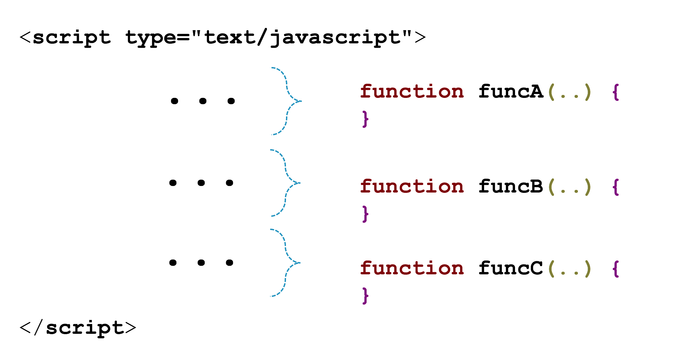
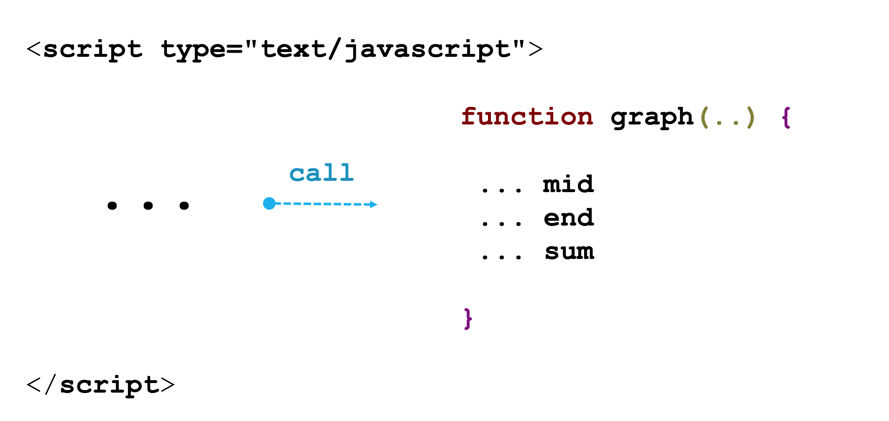
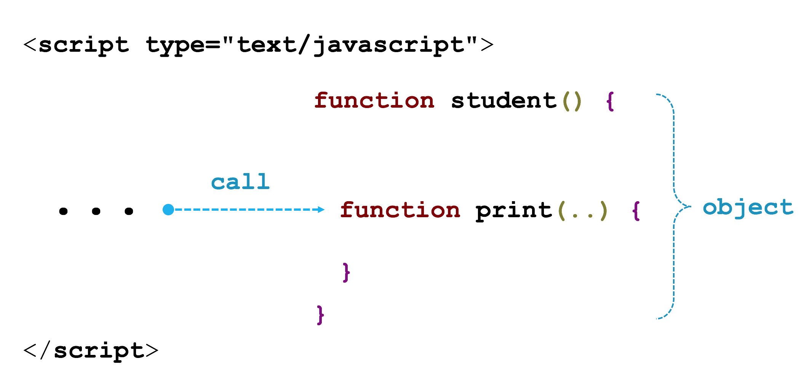

## 문제 02

학생 |  중간평가 | 기말평가 | 합계
--- | --- | --- | ---
A | 10 | 8 | 18
B | 1 | 2 | 3
C | 9 | 5 | 14

위 표는 학생 A, B, C 의 중간평가와 기말평가이다(10점 만점). 위 3명 학생의 평가 점수를 아래 그래프로 출력하는 자바스크립트 프로그램을 작성했다.

```txt
A : ********** + ********__ = ******************__
B : *_________ + **________ = ***_________________
C : *********_ + *****_____ = **************______
```

이 프로그램을 작성한 학생 또한 자바스크립트를 배운지 얼마 안돼 아직 함수를 모른다. 아래 프로그램을 함수를 사용해 재작성해주세요.(혹시, 배열이나 객체를 아는 학생은 배열과 객체를 사용해도 좋습니다)

결과만 콘솔 화면에 아래처럼 나오면 됩니다.
```txt
A : ********** + ********__ = ******************__
B : *_________ + **________ = ***_________________
C : *********_ + *****_____ = **************______
```

```javascript_function_problem_02.html```
```html
<!DOCTYPE html>
<html>
<head>
    <script type="text/javascript">
        var A_mid = 10;
        var A_end = 8;
        var B_mid = 1;
        var B_end = 2;
        var C_mid = 9;
        var C_end = 5;

        // A 학생 출력
        var result = "";
        for (var i = 0; i < A_mid; ++i) {
            result += "*";
        }

        for (var i = 0; i < 10 - A_mid; ++i) {
            result += "_";
        }

        result += " + ";

        for (var i = 0; i < A_end; ++i) {
            result += "*";
        }

        for (var i = 0; i < 10 - A_end; ++i) {
            result += "_";
        }

        result += " = ";

        for (var i = 0; i < A_mid + A_end; ++i) {
            result += "*";
        }

        for (var i = 0; i < 20 - (A_mid + A_end); ++i) {
            result += "_";
        }

        console.log("A : " + result);

        // B  학생 출력
        result = "";
        for (var i = 0; i < B_mid; ++i) {
            result += "*";
        }

        for (var i = 0; i < 10 - B_mid; ++i) {
            result += "_";
        }

        result += " + ";

        for (var i = 0; i < B_end; ++i) {
            result += "*";
        }

        for (var i = 0; i < 10 - B_end; ++i) {
            result += "_";
        }

        result += " = ";

        for (var i = 0; i < B_mid + B_end; ++i) {
            result += "*";
        }

        for (var i = 0; i < 20 - (B_mid + B_end); ++i) {
            result += "_";
        }

        console.log("B : " + result);

        // C 학생 출력
        result = "";
        for (var i = 0; i < C_mid; ++i) {
            result += "*";
        }

        for (var i = 0; i < 10 -C_mid; ++i) {
            result += "_";
        }

        result += " + ";

        for (var i = 0; i < C_end; ++i) {
            result += "*";
        }

        for (var i = 0; i < 10 - C_end; ++i) {
            result += "_";
        }

        result += " = ";

        for (var i = 0; i < C_mid + C_end; ++i) {
            result += "*";
        }

        for (var i = 0; i < 20 - (C_mid + C_end); ++i) {
            result += "_";
        }

        console.log("C : " + result);
    </script>
</head>
<body>
</body>
</html>
```

## 문제 02 - 과제 수행 요약

### 유형 01



[code](#)
```html
<!DOCTYPE html>
<html>
<head>
    <script type="text/javascript">
        var A_mid = 10;
        var A_end = 8;
        var B_mid = 1;
        var B_end = 2;
        var C_mid = 9;
        var C_end = 5;
        // A 학생 출력
        var A_Score = function score(){
          result= "";
          for(var i = 0;i<A_mid;++i){
            result += "*";
          }
          for (var i = 0; i < 10 - A_mid; ++i) {
            result += "_";
          }
          result += " + ";
          for (var i = 0; i < A_end; ++i) {
              result += "*";
          }
          for (var i = 0; i < 10 - A_end; ++i) {
              result += "_";
          }
          result += " = ";
          for (var i = 0; i < A_mid + A_end; ++i) {
              result += "*";
          }
          for (var i = 0; i < 20 - (A_mid + A_end); ++i) {
              result += "_";
          }
          return result;
        }
        console.log("A :" + A_Score());

        // B  학생 출력
        var B_Score = function score(){
          result= "";
          for(var i = 0;i<B_mid;++i){
            result += "*";
          }
          for (var i = 0; i < 10 - B_mid; ++i) {
            result += "_";
          }
          result += " + ";
          for (var i = 0; i < B_end; ++i) {
              result += "*";
          }
          for (var i = 0; i < 10 - B_end; ++i) {
              result += "_";
          }
          result += " = ";
          for (var i = 0; i < B_mid + B_end; ++i) {
              result += "*";
          }
          for (var i = 0; i < 20 - (B_mid + B_end); ++i) {
              result += "_";
          }
          return result;
        }
        console.log("B :" + B_Score());

        // C 학생 출력
        var C_Score = function score(){
          result= "";
          for(var i = 0;i<C_mid;++i){
            result += "*";
          }
          for (var i = 0; i < 10 - C_mid; ++i) {
            result += "_";
          }
          result += " + ";
          for (var i = 0; i < C_end; ++i) {
              result += "*";
          }
          for (var i = 0; i < 10 - C_end; ++i) {
              result += "_";
          }
          result += " = ";
          for (var i = 0; i < C_mid + C_end; ++i) {
              result += "*";
          }
          for (var i = 0; i < 20 - (C_mid + C_end); ++i) {
              result += "_";
          }
          return result;
        }
        console.log("C :" + C_Score());
    </script>
</head>
<body>
</body>
</html>
```

### 유형 02



[code](#)
```html
<html>
    <head>
        <script>
            function graph(a,b,c){

                var result = "";
                var sum = b+c;
                for(var i=0; i<b; ++i){
                    result += "*";
                }
                for(var i=0; i<10-b; ++i){
                    result += "_";
                }
                result += " + ";
                for(var i=0; i<c; ++i){
                    result += "*";
                }
                for(var i=0; i<10-c; ++i){
                    result += "_";
                }
                result += " = ";
                for(var i=0; i<sum; ++i){
                    result += "*";
                }
                for(var i=0; i<20-sum; ++i){
                    result += "_";
                }
                document.write(a + " : " + result + "<br>");
            }

        </script>
    </head>
    <body>
        <script>
            graph('A',10,8);
            graph('B',1,2);
            graph('C',9,5,);
        </script>
    </body>
</html>
```

[code](#)
```html
<html>
  <head>
    <title>2번 문제</title>
    <script type="text/javascript">
    console.log = function(msg){
      document.write(msg+'<br>');
    }

    function showGraph(mid, end){
      var result = "";
      for(var i=0; i<mid; i++){
        result += "*";
      }
      for(var i=0; i<(10-mid); i++){
        result += "_";
      }
      result += " + ";
      for(var i=0; i<end; i++){
        result += "*";
      }
      for(var i=0; i<(10-end); i++){
        result += "_";
      }
      result += " = ";
      for (var i = 0; i < (mid + end); i++) {
          result += "*";
      }
      for (var i = 0; i < 20 - (mid + end); i++) {
          result += "_";
      }
      return result;
    }
    /* 점수 */
    var A_mid = 10;
    var A_end = 8;
    var B_mid = 1;
    var B_end = 2;
    var C_mid = 9;
    var C_end = 5;
    console.log("A : " + showGraph(A_mid, A_end));
    console.log("B : " + showGraph(B_mid, B_end));
    console.log("C : " + showGraph(C_mid, C_end));
    </script>
  </head>
  <body>

  </body>
</html>
```
[code](#)
```html
<!DOCTYPE html>
<html>
    <head>
        <script>
        function a(mid,end) {
        var result = "";
        for (var i = 0; i < mid; ++i) {
            result += "*";
        }
        for (var i = 0; i < 10 - mid; ++i) {
            result += "_";
        }
        result += " + ";
        for (var i = 0; i < end; ++i) {
            result += "*";
        }
        for (var i = 0; i < 10 - end; ++i) {
            result += "_";
        }
        result += " = ";
        for (var i = 0; i < mid + end; ++i) {
            result += "*";
        }
        for (var i = 0; i < 20 - (mid + end); ++i) {
            result += "_";
        }
        return result;
        }

        console.log(`A : ${a(10,8)}`);
        console.log(`B : ${a(1,2)}`);
        console.log(`C : ${a(9,5)}`);
        </script>
    </head>
</html>
```
- ES6 Template Literals, Template substitution, 백틱 문자 사용(`, 1 왼쪽 버튼)
```javascript
var name = 'Yoo';
var age = 20;
var a = 'My name is ' + name + '. ' + 'I am ' + age + ' years old';
var b = `My name is ${name}. I am ${age} years old `;
var c = `My name is ${name}. I am ${age + 10} years old `;
console.log(a);
console.log(b);
console.log(c);
```

### 유형 03



[code](#)
```html
<!DOCTYPE html>
<html>
<head>
    <script type="text/javascript">
         var student = function(name,mid,end) {
         this.name = name;
         this.mid = mid;
         this.end = end;
         this.sum = mid+end;
         this.starpick = function(checkValue){
            var star="";
            var underbar=0;
            if(checkValue==1) {
             underbar=10-mid;
             for(i=0;i<mid;i++) star= star+'*';
            }
            else if(checkValue==2) {
                underbar=10-end;
                for(i=0;i<end;i++) star= star+'*';
            }
            else if(checkValue==3) {
                underbar=20-this.sum;            
                 for(i=0;i<this.sum;i++) star= star+'*';
            }
            else return "잘못된 값";

            for(i=0;i<underbar;i++) star= star+'_';
            return star;
         }
         this.print = function(){
            console.log(name +":"+this.starpick(1)+"+"+this.starpick(2)+"="+this.starpick(3));
       }

       }
       var stu1 = new student('A',10,8);
       var stu2 = new student('B',1,2);
       var stu3 = new student('C',9,5);
       stu1.print();
       stu2.print();
       stu3.print();

    </script>
</head>
<body>
</body>
</html>
```


### 유형 04

[code](#)
```html
<!DOCTYPE html>
 <html>
 	<script type="text/javascript">
 var A_grade = new Array(10,8);
 var B_grade = new Array(1,2);
 var C_grade = new Array(9,5);

 function sumGrade(Grade){
 	var result = ""
 	for(var i=0; i<Grade[0]+Grade[1]; i++)
 		result += "*";
 	for(i=0; i<20-Grade[0]-Grade[1]; i++)
 		result += "_";
 	return result;
 }
 function midGrade(mid){
 	var result = "";
 	for(var i=0; i<mid; i++)
 		result += "*";
 	for(i=0; i<10-mid; i++)
 		result += "_";
 	return result;
 }
 function endGrade(end){
 	var result = "";
 	for(var i=0; i<end; i++)
 		result += "*";
 	for(i=0; i<10-end; i++)
 		result += "_";
 	return result;
 }

 console.log(midGrade(A_grade[0]) + " + " + endGrade(A_grade[1]) + " = " + sumGrade(A_grade));
 console.log(midGrade(B_grade[0]) + " + " + endGrade(B_grade[1]) + " = " + sumGrade(B_grade));
 console.log(midGrade(C_grade[0]) + " + " + endGrade(C_grade[1]) + " = " + sumGrade(C_grade));
 	</script>
 		</head>
 	<body>
 	</body>
</html>
```

[code](#)
```html
<!DOCTYPE html>
<html>
<head>
<meta charset="UTF-8">
    <script type="text/javascript">
        var A_mid = 10;
        var A_end = 8;
        var B_mid = 1;
        var B_end = 2;
        var C_mid = 9;
        var C_end = 5;
		function fnc_1(a,b){
			var result = "",tmp=10;
			if(b>0){
			tmp=20;
			a=a+b;
			}
			for(var i = tmp-a;i < tmp;i++){
				result += "*";
			}
			for(var i = 0;i < tmp-a;i++){
				result += "_";
			}
			return result;
		}
		console.log("A : " + fnc_1(A_mid) + " + " + fnc_1(A_end)+" = "+fnc_1(A_mid,A_end));
		console.log("B : " + fnc_1(B_mid) + " + " + fnc_1(B_end)+" = "+fnc_1(B_mid,B_end));
		console.log("C : " + fnc_1(C_mid) + " + " + fnc_1(C_end)+" = "+fnc_1(C_mid,C_end));
    </script>
</head>
<body>
</body>
</html>
```

### 기타 유형

[code](#)
```html
<!DOCTYPE html>
<html>
<head>
    <script type="text/javascript">
   var A = [10,8];
   var B = [1,2];
   var C = [9,5];
   function mr(q){
      if(q==1){ console.log('A : ');
           for(var i=1;i<=A[0];i++) { console.log('*'); }
           for(var i=1;i<=10-A[0];i++) { console.log('_');}
                       console.log('+');
           for(var i=1;i<=A[1];i++) { console.log('*'); }
           for(var i=1;i<=10-A[1];i++) {console.log('_');}
         		console.log('=');
           for(var i=1;i<=A[0]+A[1];i++) { console.log('*'); }
           for(var i=1;i<=20-(A[0]+A[1]);i++) { console.log('_');}

         };
      if(q==2){ console.log('B : ');
           for(var i=1;i<=B[0];i++) { console.log('*'); }
           for(var i=1;i<=10-B[0];i++) { console.log('_');}
                      console.log('+');
           for(var i=1;i<=B[1];i++) { console.log('*'); }
           for(var i=1;i<=10-B[1];i++) { console.log('_');}
		console.log('=');
           for(var i=1;i<=B[0]+B[1];i++) { console.log('*'); }
           for(var i=1;i<=20-(B[0]+B[1]);i++) { console.log('_');}

         };
      if(q==3){ console.log('C : ');
           for(var i=1;i<=C[0];i++) { console.log('*'); }
           for(var i=1;i<=10-C[0];i++) { console.log('_');}
                       console.log('+');
           for(var i=1;i<=C[1];i++) { console.log('*'); }
           for(var i=1;i<=10-C[1];i++) {console.log('_');}
		console.log('=');
           for(var i=1;i<=C[0]+C[1];i++) { console.log('*'); }
           for(var i=1;i<=20-(C[0]+C[1]);i++) { console.log('_');}

         };
      }
   for(var j=1; j<=3; j++) mr(j);

    </script>
</head>
<body>
</body>
</html>
```


[code](#)
```html
<!DOCTYPE html>
<html>
<head>
    <script type="text/javascript">
var m = [10, 1, 9];
var e = [8, 2, 5];
var s = [18, 3, 14];
var i = 0;
var j = 0;
function mid(a){
	midA = "";
	midB = "";
	midC = "";
	for(i=0; i<3; i++)
	{
		for(j=0; j<m[i]; j++)
		{
			if(i==0) midA += "*";
			else if(i==1) midB += "*";
			else if(i==2) midC += "*";
		}
		for(j=0; j<10-m[i]; j++)
		{
			if(i==0) midA += "_";
			else if(i==1) midB += "_";
			else if(i==2) midC += "_";
		}
	}
	return [midA, midB, midC];
}
mid();
function end(b){
	endA = "";
	endB = "";
	endC = "";
	for(i=0; i<3; i++)
	{
		for(j=0; j<e[i]; j++)
		{
			if(i==0) endA += "*";
			else if(i==1) endB += "*";
			else if(i==2) endC += "*";
		}
		for(j=0; j<10-e[i]; j++)
		{
			if(i==0) endA += "_";
			else if(i==1) endB += "_";
			else if(i==2) endC += "_";
		}
	}
	return [endA, endB, endC];
}
end();
function sum(c){
	sumA = "";
	sumB = "";
	sumC = "";
	for(i=0; i<3; i++)
	{
		for(j=0; j<s[i]; j++)
		{
			if(i==0) sumA += "*";
			else if(i==1) sumB += "*";
			else if(i==2)sumC += "*";
		}
		for(j=0; j<20-s[i]; j++)
		{
			if(i==0) sumA += "_";
			else if(i==1) sumB += "_";
			else if(i==2) sumC += "_";
		}
	}
	return [sumA, sumB, sumC];
}
sum();
console.log("A : " + midA + " + " + endA + " = " + sumA);
console.log("B : " + midB + " + " + endB + " = " + sumB);
console.log("C : " + midC + " + " + endC + " = " + sumC);
</script>
</head>
<body>
</body>
</html>
```

## 또 다른 방법

[code](#)
```html
<!DOCTYPE html>
<html>
<head>
    <meta charset="UTF-8">
    <script type="text/javascript">
         function graph(mid, end) {
             var record = Array.from('__________ + __________ = ____________________\n');
             function fill(i, n) {
                 while(n--)
                     record[i + n] = '*';
             }
             fill(0, mid);
             fill(13, end);
             fill(26, mid + end);
             return record.join('');
         }
         console.log("A : " + graph(10, 8));
         console.log("B : " + graph(1, 2));
         console.log("C : " + graph(9, 5));
    </script>
</head>
<body>
</body>
</html>
```

[code](#)
```html
<!DOCTYPE html>
<html>
<head>
    <meta charset="UTF-8">
    <script type="text/javascript">
       function graph(mid, end) {
           var record = Array.from('__________ + __________ = ____________________\n');
           function fill(i, n) {
               while(n--)
                   record[i + n] = '*';
               return fill;
           }
           fill(0, mid)(13, end)(26, mid + end);
           return record.join('');
       }
       console.log("A : " + graph(10, 8));
       console.log("B : " + graph(1, 2));
       console.log("C : " + graph(9, 5));
    </script>
</head>
<body>
</body>
</html>
```

[code](#)
```html
<!DOCTYPE html>
<html>
<head>
    <meta charset="UTF-8">
    <script type="text/javascript">
         function graph(mid, end) {
             var record = Array.from('__________ + __________ = ____________________\n');
             record.fill('*', 0, mid);
             record.fill('*', 13, 13 + end);
             record.fill('*', 26, 26 + mid + end);
             return record.join('');
         }
         console.log("A : " + graph(10, 8));
         console.log("B : " + graph(1, 2));
         console.log("C : " + graph(9, 5));
    </script>
</head>
<body>
</body>
</html>
```


[code](#)
```html
<!DOCTYPE html>
<html>
<head>
    <meta charset="UTF-8">
    <script type="text/javascript">
        function graph(mid, end) {
            var record = '';
            function fill(c, n) {
                var cs = '';
                while(n--)
                    cs += c;
                return cs;
            }
            record += fill('*', mid);
            record += fill('_', 10 - mid);
            record += ' + ';
            record += fill('*', end);
            record += fill('_', 10 - end);
            record += ' = ';
            record += fill('*', mid + end);
            record += fill('_', 20 - (mid + end));

            return record;
        }
        console.log("A : " + graph(10, 8));
        console.log("B : " + graph(1, 2));
        console.log("C : " + graph(9, 5));
    </script>
</head>
<body>
</body>
</html>
```

[code](#)
```html
<!DOCTYPE html>
<html>
<head>
    <meta charset="UTF-8">
    <script type="text/javascript">
        function graph(mid, end) {
            var record = '';
            String.prototype.fill = function(n) {
                var c = this.slice(0);
                var cs = '';
                while(n--)
                    cs += c;
                return cs;
            }
            record += '*'.fill(mid);
            record += '_'.fill(10 - mid);
            record += ' + ';
            record += '*'.fill(end);
            record += '_'.fill(10 - end);
            record += ' = ';
            record += '*'.fill(mid + end);
            record += '_'.fill(20 - (mid + end));

            return record;
        }
        console.log("A : " + graph(10, 8));
        console.log("B : " + graph(1, 2));
        console.log("C : " + graph(9, 5));
    </script>
</head>
<body>
</body>
</html>
```

[code](#)
```html
<!DOCTYPE html>
<html>
<head>
    <meta charset="UTF-8">
    <script type="text/javascript">
        function graph(mid, end) {
            var record = '';
            String.prototype.fill = function(n) {
                var c = this.slice(0);
                var cs = '';
                while(n--)
                    cs += c;
                return cs;
            }
            return `${'*'.fill(mid)}${'_'.fill(10 - mid)} + ${'*'.fill(end)}${'_'.fill(10 - end)} = ${'*'.fill(mid + end)}${'_'.fill(20 - (mid + end))}`;
        }
        console.log("A : " + graph(10, 8));
        console.log("B : " + graph(1, 2));
        console.log("C : " + graph(9, 5));
    </script>
</head>
<body>
</body>
</html>
```
