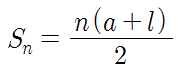

### 문제 03
sum(a, b) 함수는 두 개의 숫자를 입력으로 받아서 그 사이에 있는 모든 수를 더한 값을 반환한다. 여러분들이 함수를 직접 구현해주세요.

```javascript_function_problem_03.html```
```html
<!DOCTYPE html>
<html>
<head>
    <script type="text/javascript">
       //
       // 함수 인자 lo ~ hi 까지 숫자를 모두 더한 값을 리턴 합니다.
       // 주의 사항 : lo >= hi 일 수도 있음.
       //
       function sum(lo, hi) {
         var result = 0;
         // TODO : 여기에 여러분이 직접 코딩을 해주세요.
         return result;
       }

       exepect(sum(1, 2), 3);
       exepect(sum(1, 1), 1);
       exepect(sum(1, 100), 5050);
       exepect(sum(10, 200), 20055);
       exepect(sum(200, 1000), 480600);
       exepect(sum(100, 1), 5050);
       exepect(sum(1000, 200), 480600);

       function exepect(l, r) {
         if (l === r)
          console.log('pass');
         else
          console.log('fail');
       }
    </script>
</head>
<body>
</body>
</html>

```

## 문제 03 - 과제 수행 요약

### 유형 01

[code](#)
```html
<!DOCTYPE html>
<html>
<head>
    <script type="text/javascript">
       function sum(lo, hi) {
          var result = 0;
          if(lo <= hi){
           for(var i=lo; i<=hi; i++)
	    {
	     result = result+i;
	    }
	   } else {
           for(var i=hi; i<=lo; i++)
	   {
	     result = result+i;
	   }
	 }
	 return result;          
       }
       exepect(sum(1, 2), 3);
       exepect(sum(1, 1), 1);
       exepect(sum(1, 100), 5050);
       exepect(sum(10, 200), 20055);
       exepect(sum(200, 1000), 480600);
       exepect(sum(100, 1), 5050);
       exepect(sum(1000, 200), 480600);
       function exepect(l, r) {
         if (l === r)
          console.log('pass');
         else
          console.log('fail');
       }
    </script>
</head>
<body>
</body>
</html>
```


### 유형 02

[code](#)
```html
<!DOCTYPE html>
<html>
<head>
    <script type="text/javascript">
         function sum(lo, hi) {
         var result = 0;
         var temp = 0;
         if(lo > hi){
             temp = lo;
             lo = hi;
             hi = temp;
         }
         for(var i =lo; i <=hi; i++){
            result= result + i;
         }
         return result;
       }
       exepect(sum(1, 2), 3);
       exepect(sum(1, 1), 1);
       exepect(sum(1, 100), 5050);
       exepect(sum(10, 200), 20055);
       exepect(sum(200, 1000), 480600);
       exepect(sum(100, 1), 5050);
       exepect(sum(1000, 200), 480600);
       function exepect(l, r) {
         if (l === r)
          console.log('pass');
         else
          console.log('fail');
       }
    </script>
</head>
<body>
</body>
</html>
```

## 또 다른 방법 없을까?



[code](#)
```html
<!DOCTYPE html>
<html>
<head>
    <script type="text/javascript">
        function sum(lo, hi) {
            var a = Math.min(lo, hi);
            var b = Math.max(lo, hi);
            return ((b - a + 1) * (a + b)) / 2;
        }
        exepect(sum(1, 2), 3);
        exepect(sum(1, 1), 1);
        exepect(sum(1, 100), 5050);
        exepect(sum(10, 200), 20055);
        exepect(sum(200, 1000), 480600);
        exepect(sum(100, 1), 5050);
        exepect(sum(1000, 200), 480600);
        function exepect(l, r) {
            if (l === r)
                console.log('pass');
            else
                console.log('fail');
        }
    </script>
</head>
<body>
</body>
</html>
```
